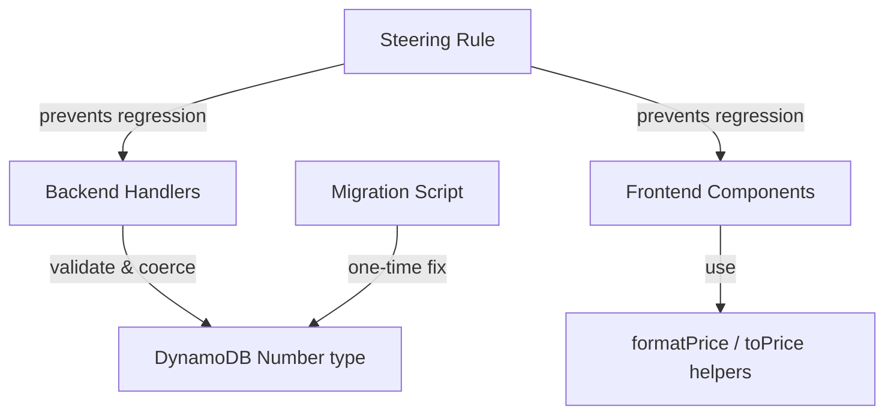

# Design Document: Financial Field Standardization

## Overview

Financial fields (`prijs`, `price`, `unit_price`, `line_total`) are inconsistently stored as strings or numbers in DynamoDB and formatted with scattered inline `Number(x).toFixed(2)` patterns across the frontend. This causes runtime crashes (`toFixed is not a function`) and inconsistent price display.

The helpers (`formatPrice`, `formatPriceEuro`, `toPrice`) already exist at `frontend/src/utils/formatPrice.ts`. This spec completes the standardization by: (1) replacing remaining inline patterns with helpers, (2) adding backend validation that coerces/rejects non-numeric prices, (3) adding a steering rule for future enforcement, and (4) migrating existing string prices to DynamoDB Number type.

## Architecture



## Components and Interfaces

### Component 1: Frontend Price Formatting (TypeScript)

**Purpose**: Replace remaining inline `Number(x).toFixed(2)` patterns with safe helpers.

**Existing Interface** (`frontend/src/utils/formatPrice.ts`):

```typescript
function formatPrice(
  value: string | number | null | undefined,
  fallback?: number,
): string;
function toPrice(
  value: string | number | null | undefined,
  fallback?: number,
): number;
```

**Files to update**:

- `frontend/src/modules/webshop/WebshopPage.tsx` — replace `Number(item.price || 0).toFixed(2)` with `formatPrice(item.price)`
- `frontend/src/modules/webshop/CheckoutModal.tsx` — replace `(Number(item.price || 0) * item.quantity).toFixed(2)` with `formatPrice(toPrice(item.price) * item.quantity)`
- `frontend/src/modules/webshop/OrderConfirmation.tsx` — replace `Number(item.price || 0).toFixed(2)` with `formatPrice(item.price)`
- `frontend/src/modules/advanced-exports/AdvancedExportsPage.tsx` — replace `productStats.gemiddeldePrijs.toFixed(2)` with `formatPrice(productStats.gemiddeldePrijs)`

### Component 2: Backend Price Validation (Python)

**Purpose**: Validate that price fields are numeric before writing to DynamoDB. Coerce string representations to `Decimal`, reject non-numeric values with HTTP 400.

**Interface** — shared validation helper:

```python
from decimal import Decimal, InvalidOperation

def validate_price_field(value, field_name: str = 'price') -> tuple[Decimal | None, str | None]:
    """
    Validate and coerce a price value to Decimal.

    Returns (decimal_value, None) on success, or (None, error_message) on failure.
    Accepts: int, float, str representation of a number, Decimal.
    Rejects: non-numeric strings, lists, dicts, empty strings.
    None input returns (None, None) — field is optional.
    """
```

**Handlers to update**:

- `admin_update_product/app.py` — validate `prijs` field before update
- `admin_create_variant/app.py` — validate `prijs` field if provided
- `admin_create_product/app.py` — already coerces `price` to Decimal, add rejection of non-numeric
- `create_order/app.py` — already validates via `_validate_and_price_items`, add explicit check

### Component 3: Steering Rule Addition

**Purpose**: Document the DynamoDB Number type enforcement rule in `schema-driven.md` to prevent future regressions.

**Content to add** (section 6):

```markdown
### 6. Financial fields must be stored as DynamoDB Number type

Financial fields (prijs, price, unit_price, line_total, total_amount, total_paid, purchase_price_per_unit)
MUST be stored as DynamoDB Number type, not String. Backend handlers must:

- Coerce string prices to Decimal before writing: `Decimal(str(value))`
- Reject non-numeric values with 400 error
- Never store prices as bare strings like "25"
```

### Component 4: DynamoDB Migration Script (Python)

**Purpose**: One-time migration to convert existing string-type prices to Number type in DynamoDB.

**Interface**:

```python
# scripts/migrate_price_fields_to_number.py
# Usage: python scripts/migrate_price_fields_to_number.py --dry-run --profile nonprofit-deploy

def migrate_producten_table(table, dry_run: bool) -> dict:
    """Scan Producten table, find records where prijs is stored as string, convert to Number."""

def migrate_orders_table(table, dry_run: bool) -> dict:
    """Scan Orders table, find records where items[].price or items[].unit_price is string, convert."""
```

**Flags**:

- `--dry-run` — log changes without writing
- `--profile` — AWS profile to use (default: `nonprofit-deploy`)
- Handles pagination (DynamoDB 1MB scan limit)
- Logs counts: scanned, converted, skipped, errors

## Data Models

### Price Field Type Contract

```typescript
// Frontend: price values from API may arrive as string or number
type PriceValue = string | number | null | undefined;

// After toPrice(): always a number
type SafePrice = number;

// After formatPrice(): always "€X.XX"
type FormattedPrice = string;
```

```python
# Backend: prices stored in DynamoDB as Decimal (maps to Number type)
from decimal import Decimal

# Valid price values accepted by handlers:
#   int: 25
#   float: 25.50
#   str: "25.50" (coerced to Decimal)
#   Decimal: Decimal("25.50")
#
# Invalid (rejected with 400):
#   str: "abc", "", "N/A"
#   list, dict, bool
```

## Key Functions with Formal Specifications

### Function 1: validate_price_field (Python)

```python
def validate_price_field(value, field_name: str = 'price') -> tuple[Decimal | None, str | None]:
    """Validate and coerce a price value to Decimal."""
    if value is None:
        return None, None

    if isinstance(value, bool):
        return None, f'{field_name} must be a numeric value'

    if isinstance(value, (int, float, Decimal)):
        return Decimal(str(value)), None

    if isinstance(value, str):
        value = value.strip()
        if not value:
            return None, f'{field_name} must be a numeric value'
        try:
            return Decimal(value), None
        except InvalidOperation:
            return None, f'{field_name} must be a numeric value'

    return None, f'{field_name} must be a numeric value'
```

**Preconditions:**

- `value` can be any type (comes from JSON request body)
- `field_name` is a non-empty string

**Postconditions:**

- If value is None → returns (None, None)
- If value is numeric or numeric string → returns (Decimal, None)
- If value is non-numeric → returns (None, error_message)
- Returned Decimal is always a valid finite number

### Function 2: formatPrice (TypeScript — already exists)

```typescript
export function formatPrice(
  value: string | number | null | undefined,
  fallback: number = 0,
): string;
```

**Preconditions:**

- `value` is any type that might come from DynamoDB (string, number, null, undefined)
- `fallback` is a finite number

**Postconditions:**

- Always returns a string matching pattern `€X.XX`
- Never throws (handles NaN gracefully)
- If value is null/undefined, uses fallback

### Function 3: toPrice (TypeScript — already exists)

```typescript
export function toPrice(
  value: string | number | null | undefined,
  fallback: number = 0,
): number;
```

**Preconditions:**

- `value` is any type from DynamoDB
- `fallback` is a finite number

**Postconditions:**

- Always returns a finite number
- Never returns NaN
- If value is null/undefined/NaN, returns fallback

## Example Usage

### Frontend replacement (before/after)

```typescript
// BEFORE (WebshopPage.tsx):
<Text>€{Number(item.price || 0).toFixed(2)}</Text>

// AFTER:
import { formatPrice } from '../../utils/formatPrice';
<Text>{formatPrice(item.price)}</Text>

// BEFORE (CheckoutModal.tsx):
<Text>€{(Number(item.price || 0) * item.quantity).toFixed(2)}</Text>

// AFTER:
import { formatPrice, toPrice } from '../../utils/formatPrice';
<Text>{formatPrice(toPrice(item.price) * item.quantity)}</Text>
```

### Backend validation (admin_update_product)

```python
# In admin_update_product/app.py, before building update expression:
if 'prijs' in body:
    price_val, price_err = validate_price_field(body['prijs'], 'prijs')
    if price_err:
        return create_error_response(400, price_err)
    body['prijs'] = price_val  # Now a Decimal, stored as Number in DynamoDB
```

### Migration script usage

```bash
# Dry run first
python scripts/migrate_price_fields_to_number.py --dry-run --profile nonprofit-deploy

# Execute
python scripts/migrate_price_fields_to_number.py --profile nonprofit-deploy
```

## Error Handling

### Frontend

| Scenario                    | Handling                                                        |
| --------------------------- | --------------------------------------------------------------- |
| Price is null/undefined     | `formatPrice` returns `€0.00`                                   |
| Price is non-numeric string | `formatPrice` returns `€0.00` (fallback)                        |
| Price is negative           | Displayed as-is (e.g., `€-5.00`) — no business rule blocks this |

### Backend

| Scenario                            | Handling                                        |
| ----------------------------------- | ----------------------------------------------- |
| Price is non-numeric string ("abc") | 400 response: `"prijs must be a numeric value"` |
| Price is empty string               | 400 response: `"prijs must be a numeric value"` |
| Price is null (optional field)      | Accepted — field not stored                     |
| Price is boolean                    | 400 response: `"prijs must be a numeric value"` |
| Price is valid string ("25.50")     | Coerced to `Decimal("25.50")`, stored as Number |

### Migration

| Scenario                         | Handling                          |
| -------------------------------- | --------------------------------- |
| Record has numeric price already | Skipped                           |
| Record has string price ("25")   | Converted to Number               |
| Record has non-parseable string  | Logged as error, skipped          |
| DynamoDB pagination              | Handles via LastEvaluatedKey loop |

## Correctness Properties

_A property is a characteristic or behavior that should hold true across all valid executions of a system — essentially, a formal statement about what the system should do. Properties serve as the bridge between human-readable specifications and machine-verifiable correctness guarantees._

### Property 1: Numeric inputs produce equivalent Decimal

_For any_ valid numeric input (int, float, Decimal, or numeric string), `validate_price_field` SHALL return a Decimal value that is numerically equal to the input.

**Validates: Requirements 2.1, 6.1**

### Property 2: Non-numeric inputs are always rejected

_For any_ non-numeric input (random non-numeric string, boolean, list, dict, empty string), `validate_price_field` SHALL return an error message and no Decimal value.

**Validates: Requirements 2.2, 6.2**

### Property 3: String-Decimal round-trip consistency

_For any_ valid numeric value x, `validate_price_field(str(Decimal(str(x))))` SHALL produce the same Decimal as `validate_price_field(x)` — i.e., serializing to string and re-validating preserves the value.

**Validates: Requirements 2.4, 6.3**

### Property 4: Successful validation never returns NaN or Infinity

_For any_ input where `validate_price_field` returns success (first element is not None), the returned Decimal SHALL be a finite number (not NaN, not Infinity, not -Infinity).

**Validates: Requirements 2.5**

## Testing Strategy

### Unit Testing (Backend)

- Test `validate_price_field` with: int, float, Decimal, valid string, invalid string, None, bool, empty string
- Test each handler rejects non-numeric price with 400
- Test each handler stores valid price as Decimal

### Unit Testing (Frontend)

- Existing tests for `formatPrice` and `toPrice` cover the helper logic
- Verify updated components render correctly with various price types

### Property-Based Testing

**Property Test Library**: hypothesis (Python backend)

- Property 1: Numeric inputs produce equivalent Decimal (100+ examples)
- Property 2: Non-numeric inputs are always rejected (100+ examples)
- Property 3: String-Decimal round-trip consistency (100+ examples)
- Property 4: Successful validation never returns NaN or Infinity (100+ examples)

## Performance Considerations

- Migration script processes records in batches respecting DynamoDB scan pagination
- No performance impact on frontend — `formatPrice` is a simple Number conversion
- Backend validation adds one `Decimal()` conversion per price field per request (negligible)

## Security Considerations

- No security impact — validation is defensive (reject bad input)
- Migration script requires `--profile nonprofit-deploy` (no default credentials)
- No new API endpoints or permission changes

## Dependencies

- No new dependencies required
- Backend uses standard library `decimal` module
- Frontend uses existing `formatPrice.ts` utility
- Migration script uses `boto3` (already in backend requirements)
