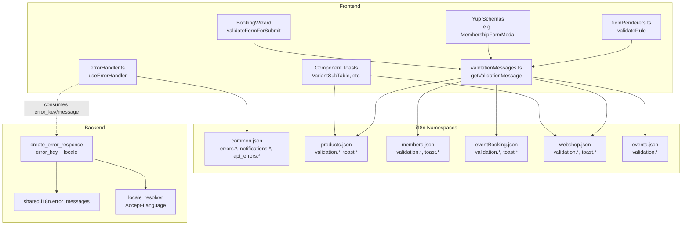
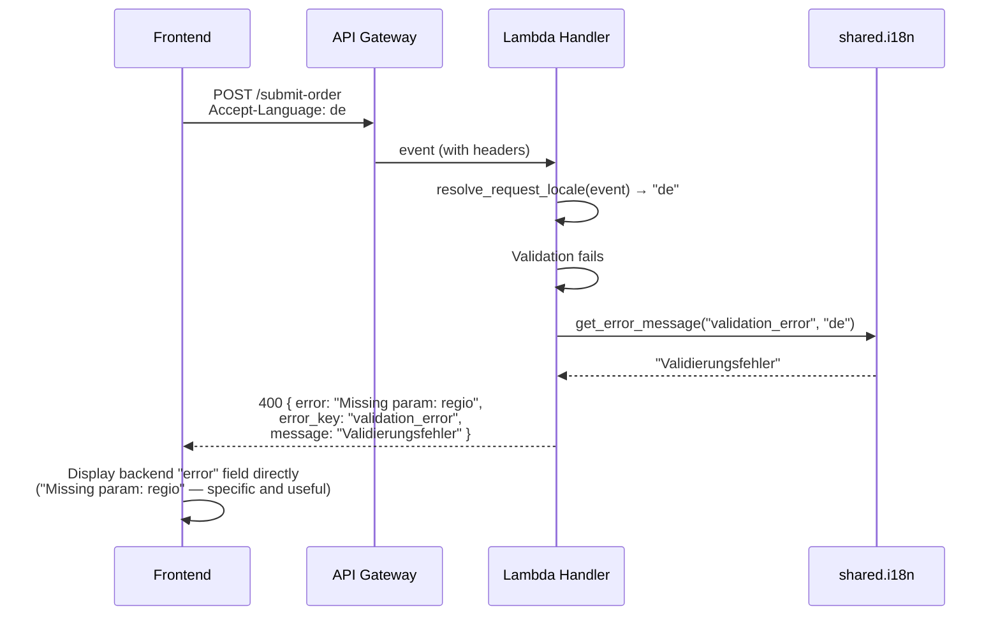

# Design Document: i18n Error Messages

## Overview

This design replaces all hardcoded Dutch error/validation strings across the frontend with `react-i18next` `t()` calls, and connects the frontend to the backend's existing `error_key`-based localized error system. The approach uses a shared **Validation_Helper** utility (`getValidationMessage`) that accepts a domain-bound `t` function, so each module owns its own `validation.*` translations. Cross-cutting concerns (network errors, auth failures, API errors) live exclusively in the `common` namespace.

**Key design decisions:**

1. **Domain-owned validation keys** — Each module (`products`, `members`, `eventBooking`, `webshop`, `events`) owns its own `validation.*` and `toast.*` keys. No shared "validation namespace" — the caller's `t` function determines resolution.
2. **Backend specific `error` field preferred** — When the backend sends a specific error string (e.g., "Product ID and Variant ID are required"), display it directly — it tells the user exactly what went wrong. The generic localized `message` (from the 15-key dictionary) is only a fallback when no specific error is available.
3. **Gradual migration** — The helper uses `defaultValue` fallback, so modules can migrate independently without breaking.
4. **No new dependencies** — Uses existing `react-i18next`, `i18next-http-backend`, and the established namespace loading pattern.

## Architecture



## Components and Interfaces

### 1. Validation_Helper (`src/utils/validationMessages.ts`)

```typescript
import { TFunction } from "react-i18next";

/** Supported validation rule types matching the Field Registry */
export type ValidationRuleType =
  | "required"
  | "email"
  | "phone"
  | "iban"
  | "min_length"
  | "max_length"
  | "min"
  | "max"
  | "pattern"
  | "invalid_number"
  | "invalid_option";

/** Parameters for interpolation per rule type */
export interface ValidationParams {
  field?: string;
  count?: number;
  value?: number;
}

/**
 * Returns a translated validation message using the caller's domain-bound t function.
 *
 * The t function determines namespace resolution — if the caller uses
 * useTranslation('products'), keys resolve from products:validation.*.
 *
 * Falls back to the original Dutch string via defaultValue for backward
 * compatibility during incremental migration.
 */
export function getValidationMessage(
  t: TFunction,
  ruleType: ValidationRuleType,
  params?: ValidationParams,
): string {
  const key = `validation.${ruleType}`;

  // Fallback Dutch strings match the current hardcoded messages
  const fallbacks: Record<ValidationRuleType, string> = {
    required: `${params?.field || "Veld"} is verplicht`,
    email: "Voer een geldig emailadres in",
    phone: "Voer een geldig telefoonnummer in",
    iban: "Voer een geldig IBAN nummer in",
    min_length: `Minimaal ${params?.count || 0} karakters vereist`,
    max_length: `Maximaal ${params?.count || 0} karakters toegestaan`,
    min: `Waarde moet minimaal ${params?.value || 0} zijn`,
    max: `Waarde mag maximaal ${params?.value || 0} zijn`,
    pattern: "Ongeldige invoer",
    invalid_number: "Voer een geldig nummer in",
    invalid_option: "Selecteer een geldige optie",
  };

  return t(key, { ...params, defaultValue: fallbacks[ruleType] });
}
```

**Design rationale:**

- The function is pure — no hooks, no side effects. It can be called from Yup schema functions, `validateRule`, or manual validation.
- `defaultValue` ensures the existing Dutch text appears if the key is missing (backward compatibility during migration).
- No hardcoded namespace — the caller's `t` determines resolution.

### 2. Migrated `fieldRenderers.ts` validateRule

```typescript
// New signature: accepts optional t function
export function validateRule(
  rule: any,
  value: any,
  field: FieldDefinition,
  t?: TFunction,
): string | null {
  switch (rule.type) {
    case "required":
      if (!value || (typeof value === "string" && value.trim() === "")) {
        // rule.message override (Field Registry can specify a custom message or key)
        if (rule.message) {
          return rule.message.includes(":")
            ? t?.(rule.message) || rule.message
            : rule.message;
        }
        return t
          ? getValidationMessage(t, "required", { field: field.label })
          : `${field.label} is verplicht`;
      }
      break;
    // ... similar for other cases
  }
  return null;
}
```

**Design rationale:**

- `t` is optional — callers that haven't migrated yet still get Dutch strings (Requirement 11.2).
- If `rule.message` contains a namespace prefix (e.g., `products:validation.custom_rule`), it's treated as a translation key.
- The Field Registry `rule.message` override takes precedence over the generic message (Requirement 3.3).

### 3. Migrated `errorHandler.ts`

```typescript
import { useTranslation } from "react-i18next";

// Replaces the static ERROR_MESSAGES object
function getErrorMessages(t: TFunction) {
  return {
    NETWORK: t("errors.network"),
    UNAUTHORIZED: t("errors.unauthorized"),
    FORBIDDEN: t("errors.forbidden"),
    NOT_FOUND: t("errors.not_found"),
    SERVER_ERROR: t("errors.server_error"),
    MAINTENANCE: t("errors.maintenance"),
    TIMEOUT: t("errors.timeout"),
    UNKNOWN: t("errors.unknown"),
  };
}

// New: map API error_key to frontend translation
export function getApiErrorMessage(t: TFunction, errorKey: string): string {
  return t(`api_errors.${errorKey}`, { defaultValue: "" });
}

export const useErrorHandler = () => {
  const { t } = useTranslation("common");
  const toast = useToast();

  const handleError = (error: ApiError, context?: string) => {
    if (error.status === 503 || error.isMaintenanceMode) {
      showMaintenanceScreen(error);
      return;
    }

    const title = context
      ? t("notifications.action_error", { action: context })
      : t("labels.error");

    // Priority: specific backend error > localized message > error_key lookup > status mapping
    let description = error.details || error.message;
    if (!description || description === getErrorMessages(t).UNKNOWN) {
      if (error.errorKey) {
        description = getApiErrorMessage(t, error.errorKey) || description;
      }
    }

    toast({
      title,
      description,
      status: "error",
      duration: 5000,
      isClosable: true,
    });
  };

  const handleSuccess = (message: string, context?: string) => {
    const title = context
      ? t("notifications.action_success", { action: context })
      : t("labels.success");
    toast({
      title,
      description: message,
      status: "success",
      duration: 3000,
      isClosable: true,
    });
  };

  return { handleError, handleSuccess };
};
```

**Design rationale:**

- The `useErrorHandler` hook now uses `useTranslation('common')` internally — callers don't need to pass `t`.
- `parseApiError` is extended to extract `error_key` from the JSON body and store it on the `ApiError` interface.
- Priority chain for error display: backend `error` field (most specific) > backend `message` field (localized generic) > `error_key` frontend lookup > HTTP status code mapping.

### 4. Backend Error_Key Consumption Flow



**Resolution priority in `parseApiError`:**

1. If response body has `error` field with specific detail (e.g., "Product ID and Variant ID are required") → display it directly (most informative — tells the user exactly what went wrong)
2. If response body has `message` field (localized generic from backend i18n dictionary) → use as fallback when `error` is absent
3. If response body has `error_key` → look up `t('api_errors.{error_key}')` as fallback
4. Last resort: map HTTP status code to generic `errors.*` key

### 5. Yup Schema Migration Pattern

```typescript
// Before (hardcoded Dutch):
const schema = Yup.object({
  email: Yup.string()
    .required("E-mailadres is verplicht")
    .email("Voer een geldig emailadres in"),
});

// After (i18n-aware):
const useSchema = () => {
  const { t } = useTranslation("members");
  return Yup.object({
    email: Yup.string()
      .required(() =>
        getValidationMessage(t, "required", { field: t("form.email") }),
      )
      .email(() => getValidationMessage(t, "email")),
  });
};
```

**Design rationale:**

- Yup messages accept a function — this ensures the translation is resolved at validation time (when the user's locale is known), not at schema creation time.
- Each component uses its own domain namespace for `t`.
- The field label itself is also translated via `t('form.email')`.

## Data Models

### Extended `ApiError` Interface

```typescript
export interface ApiError {
  status: number;
  message: string;
  details?: string;
  isMaintenanceMode?: boolean;
  errorKey?: string; // NEW: stable backend error identifier
}
```

### Domain Namespace Validation Section Structure

Each domain namespace JSON gains a `validation` section:

```json
{
  "validation": {
    "required": "{{field}} is verplicht",
    "email": "Voer een geldig emailadres in",
    "phone": "Voer een geldig telefoonnummer in",
    "iban": "Voer een geldig IBAN nummer in",
    "min_length": "Minimaal {{count}} karakters vereist",
    "max_length": "Maximaal {{count}} karakters toegestaan",
    "min": "Waarde moet minimaal {{value}} zijn",
    "max": "Waarde mag maximaal {{value}} zijn",
    "pattern": "Ongeldige invoer",
    "invalid_number": "Voer een geldig nummer in",
    "invalid_option": "Selecteer een geldige optie"
  }
}
```

### Common Namespace Extensions

```json
{
  "errors": {
    "network": "Netwerkfout - controleer je internetverbinding",
    "unauthorized": "Je bent niet geautoriseerd voor deze actie",
    "forbidden": "Toegang geweigerd - onvoldoende rechten",
    "not_found": "Gevraagde gegevens niet gevonden",
    "server_error": "Serverfout - probeer het later opnieuw",
    "maintenance": "Het systeem is tijdelijk niet beschikbaar voor onderhoud",
    "timeout": "Verzoek duurde te lang - probeer opnieuw",
    "unknown": "Er is een onbekende fout opgetreden"
  },
  "notifications": {
    "action_success": "{{action}} succesvol",
    "action_error": "Fout bij {{action}}"
  },
  "api_errors": {
    "authorization_required": "Autorisatie vereist",
    "forbidden": "Toegang geweigerd",
    "not_found": "Niet gevonden",
    "validation_error": "Validatiefout",
    "internal_error": "Interne serverfout",
    "member_not_found": "Lid niet gevonden",
    "member_already_exists": "Lid bestaat al",
    "invalid_input": "Ongeldige invoer",
    "payment_failed": "Betaling mislukt",
    "order_not_found": "Bestelling niet gevonden",
    "product_not_found": "Product niet gevonden",
    "cart_empty": "Winkelwagen is leeg",
    "insufficient_stock": "Onvoldoende voorraad",
    "email_already_exists": "E-mailadres is al in gebruik",
    "invalid_membership": "Ongeldig lidmaatschap"
  }
}
```

## Correctness Properties

_A property is a characteristic or behavior that should hold true across all valid executions of a system — essentially, a formal statement about what the system should do. Properties serve as the bridge between human-readable specifications and machine-verifiable correctness guarantees._

### Property 1: getValidationMessage always returns a non-empty string

_For any_ valid `ruleType` from the supported set (required, email, phone, iban, min*length, max_length, min, max, pattern, invalid_number, invalid_option) and \_for any* `t` function (whether it resolves keys successfully or simulates missing keys), `getValidationMessage(t, ruleType, params)` SHALL return a non-empty string — either the translated value or the Dutch fallback.

**Validates: Requirements 1.2, 11.1**

### Property 2: Namespace delegation — t function determines output

_For any_ valid `ruleType` and _for any_ two distinct mock `t` functions that return different strings for the same key, `getValidationMessage(t1, ruleType)` and `getValidationMessage(t2, ruleType)` SHALL produce different results, proving the helper delegates to the caller's `t` without hardcoding a namespace.

**Validates: Requirements 1.8**

### Property 3: validateRule delegates to Validation_Helper when t is provided

_For any_ validation rule type and _for any_ value that triggers a validation failure, calling `validateRule(rule, value, field, t)` with a `t` function SHALL produce the same output as `getValidationMessage(t, rule.type, expectedParams)` — proving full delegation to the Validation_Helper.

**Validates: Requirements 3.1**

### Property 4: rule.message override takes priority

_For any_ validation rule that includes a `rule.message` field (non-empty, without namespace prefix), `validateRule` SHALL return that exact `rule.message` string regardless of what `t` function is provided. Conversely, _for any_ `rule.message` containing a `:` (namespace prefix), `validateRule` SHALL pass it through `t()` for resolution.

**Validates: Requirements 3.3, 3.4**

### Property 5: Translation completeness across all domain namespaces and locales

_For any_ domain namespace (`products`, `members`, `eventBooking`, `webshop`, `events`) and _for any_ supported locale (`nl`, `en`, `de`, `fr`, `es`, `it`, `da`, `sv`), the namespace JSON file SHALL contain a `validation` section with all required keys, each having a non-empty string value, and keys requiring interpolation SHALL contain `{{variable}}` placeholders.

**Validates: Requirements 2.1, 2.2, 2.3, 2.4**

### Property 6: Backend error_key coverage in frontend common namespace

_For any_ `error_key` in the backend `ERROR_MESSAGES` dictionary (`authorization_required`, `forbidden`, `not_found`, `validation_error`, `internal_error`, `member_not_found`, `member_already_exists`, `invalid_input`, `payment_failed`, `order_not_found`, `product_not_found`, `cart_empty`, `insufficient_stock`, `email_already_exists`, `invalid_membership`), the `common` namespace SHALL contain a matching `api_errors.{error_key}` entry with non-empty translations in all 8 locales.

**Validates: Requirements 6a.1, 6a.4**

### Property 7: Error message priority — specific error preferred over generic message

_For any_ API error response containing both an `error` field (specific detail) and a `message` field (generic localized), the error handler SHALL display the `error` field directly. Only when `error` is absent or empty SHALL it fall back to `message`, then to `t('api_errors.{error_key}')`.

**Validates: Requirements 6a.2, 6a.3, 6a.5**

### Property 8: Locale file synchronization between src/ and public/

_For any_ namespace file that exists in `src/locales/{lang}/{ns}.json`, an identical file SHALL exist at `public/locales/{lang}/{ns}.json` with the same keys and values — ensuring runtime HttpBackend loading matches the source-of-truth files.

**Validates: Requirements 10.6**

## Error Handling

### Frontend Error Handling Strategy

| Error Scenario                                    | Handling                                                                                                   |
| ------------------------------------------------- | ---------------------------------------------------------------------------------------------------------- |
| Missing translation key                           | `parseMissingKeyHandler` returns the key path; `getValidationMessage` uses `defaultValue` (Dutch fallback) |
| Namespace JSON fails to load                      | i18n HttpBackend falls back to Dutch locale file (existing behavior)                                       |
| Backend returns `error_key` not in `api_errors.*` | `t()` returns empty string via `defaultValue: ''`; falls back to HTTP status mapping                       |
| Backend returns `error` field (specific detail)   | Displayed directly — most informative, tells user exactly what went wrong                                  |
| Backend returns `message` field (generic i18n)    | Used as fallback when no specific `error` field is present                                                 |
| Backend returns only status code                  | Falls back to `errors.*` key mapping from HTTP status                                                      |
| `t` function not passed to validateRule           | Returns existing hardcoded Dutch strings (backward compat)                                                 |
| Unknown `ruleType` passed to Validation_Helper    | Returns `t('validation.{ruleType}')` — if missing, falls back to Dutch via `defaultValue`                  |

### Backend Error Response Shape

```json
{
  "error": "Missing required parameter: regio",
  "error_key": "validation_error",
  "message": "Validierungsfehler"
}
```

- `error`: Always present, detailed English/Dutch message for debugging
- `error_key`: Present when handler adopts i18n pattern — stable identifier for programmatic use
- `message`: Present when `error_key` + `locale` provided — localized by backend i18n system

## Testing Strategy

### Unit Tests (Jest + React Testing Library)

- **validationMessages.ts**: Test each ruleType returns expected string, verify defaultValue fallback, verify interpolation variables are passed through
- **errorHandler.ts**: Test `parseApiError` extracts `error_key`, test priority chain (message > error_key > status), test `useErrorHandler` toast behavior
- **fieldRenderers.ts**: Test `validateRule` with and without `t` function, test `rule.message` override, test namespace-prefixed messages
- **Locale files**: Structural tests verifying all domain namespaces have matching keys across all 8 locales

### Property-Based Tests (fast-check)

Property-based testing is appropriate here because:

- `getValidationMessage` is a pure function with clear input/output
- The input space (ruleType × params combinations) benefits from randomized exploration
- The locale file structural properties must hold universally across all namespaces/locales

**Library:** `fast-check` (already used in this project)
**Minimum iterations:** 100 per property test
**Test location:** `frontend/src/__tests__/i18n/validationMessages.property.test.ts`

Each property test will be tagged:

```typescript
// Feature: i18n-error-messages, Property 1: getValidationMessage always returns non-empty string
```

### Integration Tests

- Backend handlers (`submit_order`, `update_product`, etc.): verify `error_key` + `locale` in error responses
- End-to-end: verify frontend displays translated messages for each locale

### Test Boundaries

| Layer                    | What is tested    | Tool                                      |
| ------------------------ | ----------------- | ----------------------------------------- |
| Validation_Helper (pure) | Properties 1-4    | fast-check property tests                 |
| Locale file structure    | Properties 5-6, 8 | fast-check (iterate namespaces × locales) |
| Error handler behavior   | Property 7        | Jest unit tests (mock responses)          |
| Backend i18n adoption    | Req 12.\*         | pytest + moto                             |
| Component integration    | Req 4-9           | React Testing Library                     |
