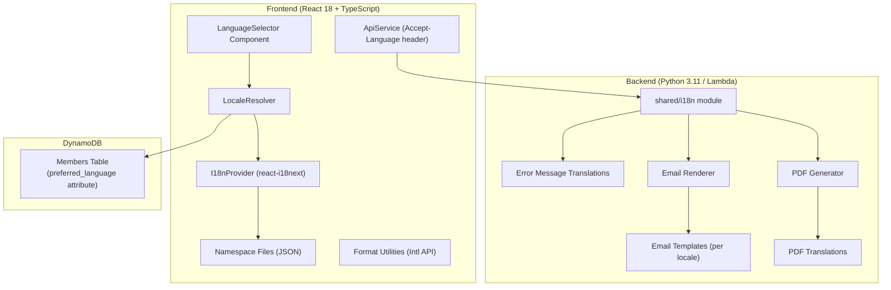
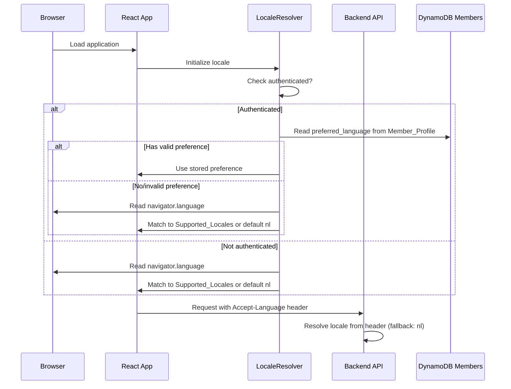

# Design Document: Multi-Language Support

## Overview

This design describes the internationalization (i18n) architecture for the H-DCN member portal and webshop. The system introduces support for eight European languages (nl, en, fr, de, sv, da, it, es) across the React frontend, Python Lambda backend, email templates, and PDF generation, while keeping the admin panel exclusively in Dutch.

The architecture follows a layered approach:

- **Frontend**: react-i18next with lazy-loaded namespace files per feature module
- **Backend**: A shared i18n module in the Lambda layer providing locale resolution and translation lookups for API errors, emails, and PDFs
- **Storage**: User language preference persisted in the DynamoDB Members table (`preferred_language` attribute)
- **Resolution**: A priority-based locale resolver (stored preference → browser locale → Dutch default)

### Key Design Decisions

1. **react-i18next over react-intl**: react-i18next provides namespace-based lazy loading out of the box, supports JSON translation files, and has simpler interpolation/pluralization syntax. It also has better TypeScript support for key autocompletion.

2. **JSON translation files in the frontend repo**: Keeps translations version-controlled and deployed with the app. No external translation management service needed at this scale (8 locales × ~7 namespaces).

3. **Backend translations as Python dicts**: Simple key-value dictionaries in the shared layer, avoiding external file I/O in Lambda cold starts. PDF and email translations live alongside the code that uses them.

4. **Intl API for formatting**: Browser-native `Intl.DateTimeFormat` and `Intl.NumberFormat` handle locale-specific date/number/currency formatting without additional libraries.

5. **Admin panel exclusion via namespace isolation**: Admin pages use a Dutch-only namespace and the i18n system overrides locale to `nl` on admin routes, avoiding the need to translate admin-specific content.

## Architecture



### Request Flow for Locale Resolution



## Components and Interfaces

### Frontend Components

#### 1. i18n Configuration Module (`frontend/src/i18n/`)

```
frontend/src/i18n/
├── index.ts              # i18next initialization and configuration
├── localeResolver.ts     # Priority-based locale resolution logic
└── constants.ts          # Supported locales, namespace definitions
```

**index.ts** — Initializes react-i18next with:

- `HttpBackend` plugin for lazy-loading namespace JSON files
- Fallback language: `nl`
- Load path: `/locales/{{lng}}/{{ns}}.json`
- Namespaces: `common`, `dashboard`, `webshop`, `members`, `events`, `products`, `auth`
- Default namespace: `common`
- React Suspense integration enabled
- `parseMissingKeyHandler`: returns key as visible text (requirement 1.6)

**localeResolver.ts** — Exports:

```typescript
interface LocaleResolverConfig {
  supportedLocales: string[];
  defaultLocale: string;
}

// Determines locale priority: stored pref → browser → default
function resolveLocale(memberProfile: MemberProfile | null): string;

// Extracts primary language subtag from browser locale
function parseBrowserLocale(navigatorLanguage: string): string | null;

// Validates a locale against supported list
function isValidLocale(locale: string): boolean;
```

#### 2. LanguageSelector Component (`frontend/src/components/common/LanguageSelector.tsx`)

A Chakra UI `Menu` component placed in the navigation header. Renders:

- Collapsed: active language flag + native name
- Expanded: all 8 locales with flag icons and native names
- Active locale visually highlighted (bold + checkmark)
- Hidden when route matches admin panel paths

Props:

```typescript
interface LanguageSelectorProps {
  // No external props needed — reads locale from i18n context
  // and member profile from AuthProvider context
}
```

Behavior:

- On selection: calls `i18n.changeLanguage(locale)` for immediate UI update
- Persists to backend via `PUT /members/{id}` with `{ preferred_language: locale }`
- On persist failure: shows toast notification, keeps local locale active

#### 3. Format Utilities (`frontend/src/utils/formatLocale.ts`)

```typescript
// Formats date using Intl.DateTimeFormat with active locale
function formatDate(
  date: Date | string | null,
  style: "short" | "long",
  locale: string,
): string;

// Formats currency (EUR) with locale-appropriate separators
function formatCurrency(amount: number | null, locale: string): string;

// Formats numbers with locale-appropriate separators
function formatNumber(value: number | null, locale: string): string;
```

All functions return empty string for null/undefined/unparseable values.

#### 4. Admin Locale Override Hook (`frontend/src/hooks/useAdminLocale.ts`)

```typescript
// Returns true if current route is an admin panel page
function useIsAdminRoute(): boolean;

// Hook that switches i18n locale to 'nl' on admin routes
// and restores user preference on member-facing routes
function useAdminLocaleOverride(): void;
```

Admin routes: `/members`, `/products`, `/events`, `/memberships`, `/advanced-exports`

#### 5. Accept-Language Header Integration

The existing `getAuthHeaders()` in `frontend/src/utils/authHeaders.ts` will be extended to include:

```typescript
headers["Accept-Language"] = i18n.language; // Active locale from react-i18next
```

### Backend Components

#### 6. Shared i18n Module (`backend/layers/auth-layer/python/shared/i18n/`)

```
backend/layers/auth-layer/python/shared/i18n/
├── __init__.py           # Module exports
├── locale_resolver.py    # Parse Accept-Language, validate locale
├── error_messages.py     # Localized API error messages (all locales)
├── pdf_translations.py   # PDF static text translations (all locales)
└── email_utils.py        # Email locale resolution helpers
```

**locale_resolver.py**:

```python
SUPPORTED_LOCALES = {'nl', 'en', 'fr', 'de', 'sv', 'da', 'it', 'es'}
DEFAULT_LOCALE = 'nl'

def resolve_request_locale(event: dict) -> str:
    """Extract and validate locale from Accept-Language header."""

def resolve_member_locale(preferred_language: str | None) -> str:
    """Resolve member locale from stored preference with fallback."""

def is_valid_locale(locale: str) -> bool:
    """Check if locale is in SUPPORTED_LOCALES."""
```

**error_messages.py**:

```python
# Structure: { error_key: { locale: message } }
ERROR_MESSAGES: dict[str, dict[str, str]] = {
    "authorization_required": {
        "nl": "Autorisatie vereist",
        "en": "Authorization required",
        "fr": "Autorisation requise",
        ...
    },
    ...
}

def get_error_message(error_key: str, locale: str) -> str:
    """Get localized error message with nl fallback."""
```

**pdf_translations.py**:

```python
# Structure: { locale: { key: translated_value } }
PDF_TRANSLATIONS: dict[str, dict[str, str]] = {
    "nl": {
        "document_title": "Orderbevestiging",
        "order_number": "Ordernummer",
        ...
    },
    "en": {
        "document_title": "Order Confirmation",
        "order_number": "Order Number",
        ...
    },
    ...
}

def get_pdf_text(key: str, locale: str) -> str:
    """Get PDF translation with nl fallback."""

def format_date_for_locale(date: datetime, locale: str) -> str:
    """Format date according to locale convention."""

def format_currency_for_locale(amount: float, locale: str) -> str:
    """Format EUR amount with locale-appropriate formatting."""
```

#### 7. Email Templates (per locale)

```
backend/email-templates/templates/
├── nl/
│   ├── membership-application-confirmation.html
│   ├── welcome-user.html
│   ├── passwordless-recovery.html
│   └── resend-code.html
├── en/
│   ├── membership-application-confirmation.html
│   ├── welcome-user.html
│   ├── passwordless-recovery.html
│   └── resend-code.html
├── fr/
│   └── ...
├── de/
│   └── ...
├── sv/
│   └── ...
├── da/
│   └── ...
├── it/
│   └── ...
└── es/
    └── ...
```

The existing templates (currently flat in `templates/`) become the `nl/` subfolder. Each locale gets its own set of translated templates. Template rendering loads from `templates/{locale}/` with fallback to `templates/nl/`.

#### 8. Cognito Custom Message Lambda

The `cognito_custom_message` handler will read `clientMetadata.locale` from the event to determine the email language for verification codes and welcome messages. Falls back to `nl` if absent or invalid.

### Frontend Translation File Structure

```
frontend/src/locales/
├── nl/
│   ├── common.json       # Shared UI (nav, footer, buttons, generic labels)
│   ├── dashboard.json    # Dashboard page
│   ├── webshop.json      # Webshop module
│   ├── members.json      # Member self-service
│   ├── events.json       # Events display
│   ├── products.json     # Product display (member-facing)
│   └── auth.json         # Login/signup flow
├── en/
│   ├── common.json
│   ├── dashboard.json
│   └── ...
├── fr/
│   └── ...
└── ... (de, sv, da, it, es)
```

Admin pages use keys from `common.json` (Dutch-only) and do not have dedicated translated namespaces.

## Data Models

### Members Table — Extended Attribute

| Attribute            | Type       | Description                                                                                 |
| -------------------- | ---------- | ------------------------------------------------------------------------------------------- |
| `preferred_language` | String (S) | Supported locale code (nl, en, fr, de, sv, da, it, es). Nullable — absence means "not set". |

No new table or GSI is needed. The attribute is added to the existing Members table item via the existing `update_member` handler.

### Translation File Schema (Frontend JSON)

```json
{
  "namespace.key": "Translated value",
  "form": {
    "submitLabel": "Opslaan",
    "cancelLabel": "Annuleren"
  },
  "items": {
    "count_one": "{{count}} item",
    "count_other": "{{count}} items"
  }
}
```

- Max 2 levels of nesting (groupKey → translationKey)
- Keys: lowercase, dot-notation, alphanumeric + underscores
- Values: UTF-8 strings, support `{{variable}}` interpolation and `_one`/`_other` plural suffixes
- Dutch (`nl`) is the reference: all keys must exist in the nl file

### Backend Error Response Format (Extended)

```json
{
  "error_key": "authorization_required",
  "message": "Authorization required",
  "details": {}
}
```

The `error_key` is stable and language-independent (for programmatic use). The `message` is localized based on the `Accept-Language` header.

### API Contract: Accept-Language Header

All frontend API requests include:

```
Accept-Language: en
```

Backend reads this header and uses it for:

- Error message localization in responses
- Email language selection (when sending emails triggered by API actions)

If missing or invalid, defaults to `nl`.

## Correctness Properties

_A property is a characteristic or behavior that should hold true across all valid executions of a system — essentially, a formal statement about what the system should do. Properties serve as the bridge between human-readable specifications and machine-verifiable correctness guarantees._

### Property 1: Locale resolution priority

_For any_ combination of stored `preferred_language` value (valid, invalid, null) and browser `navigator.language` value (supported, unsupported, malformed), the locale resolver SHALL return:

- The stored preference if it is a valid Supported_Locale, otherwise
- The browser language's primary subtag if it matches a Supported_Locale, otherwise
- Dutch (`nl`) as the default

**Validates: Requirements 2.1, 2.3, 2.4, 2.5, 7.2, 8.4, 11.1, 11.2, 11.5**

### Property 2: Translation fallback chain

_For any_ translation key and any non-Dutch Supported_Locale, if the key is absent or has an empty string value in that locale's translation file, the system SHALL return the Dutch (`nl`) translation for that key. If the key is also absent in Dutch, the system SHALL return the key string itself.

**Validates: Requirements 1.5, 6.4, 10.6**

### Property 3: Interpolation preserves dynamic values

_For any_ translated string containing `{{variable}}` placeholders and any set of interpolation values, the rendered output SHALL contain all provided interpolation values as substrings (not the placeholder syntax).

**Validates: Requirements 4.3**

### Property 4: Plural form selection follows CLDR rules

_For any_ Supported_Locale and any non-negative integer count value, the i18n system SHALL select the correct plural form suffix (`_zero`, `_one`, `_two`, `_few`, `_many`, `_other`) according to that locale's CLDR plural rules.

**Validates: Requirements 4.4**

### Property 5: Locale-aware formatting produces valid output

_For any_ valid Date value, any valid numeric value, and any Supported_Locale, the format utility functions SHALL produce output identical to the native `Intl.DateTimeFormat` (with the specified style) and `Intl.NumberFormat` (with EUR currency / 2 decimals) APIs called with that locale.

**Validates: Requirements 5.1, 5.2, 5.3, 5.4**

### Property 6: Invalid format input returns empty string

_For any_ input value that is null, undefined, NaN, or not parseable as a date/number, all format utility functions (formatDate, formatCurrency, formatNumber) SHALL return an empty string.

**Validates: Requirements 5.5**

### Property 7: Backend error message localization with fallback

_For any_ error key present in the error messages dictionary and any locale value (valid, invalid, or empty), `get_error_message` SHALL return a non-empty localized message for valid locales, and the Dutch message for invalid/empty locales. The response SHALL always contain both the stable `error_key` and the localized `message` field.

**Validates: Requirements 6.2, 6.3, 6.4**

### Property 8: PDF translation completeness

_For any_ Supported_Locale and any PDF text key defined in the Dutch reference set, `get_pdf_text` SHALL return a non-empty translated string (either from the locale's translations or from the Dutch fallback).

**Validates: Requirements 8.2, 8.5**

### Property 9: Backend locale-aware date and currency formatting

_For any_ valid datetime value and any Supported_Locale, `format_date_for_locale` SHALL produce a date string following that locale's convention. _For any_ numeric EUR amount and any Supported_Locale, `format_currency_for_locale` SHALL produce a string containing the Euro symbol, exactly 2 decimal places, and locale-appropriate separators.

**Validates: Requirements 7.6, 8.3**

### Property 10: Admin locale override round-trip

_For any_ user with a non-Dutch preferred language, navigating to an Admin_Panel route SHALL cause the i18n system to switch to Dutch (`nl`), and navigating back to a member-facing route SHALL restore the user's original preferred language. The Language_Selector SHALL be hidden while on admin routes and visible on member-facing routes.

**Validates: Requirements 9.1, 9.3, 9.4, 9.5, 9.6, 3.1**

### Property 11: Translation file key naming convention

_For any_ key in any translation JSON file, the key string SHALL match the pattern `^[a-z][a-z0-9_.]*[a-z0-9]$` (lowercase alphanumeric, dots, underscores only; starts with letter, ends with letter or digit).

**Validates: Requirements 10.3**

### Property 12: Translation file maximum nesting depth

_For any_ translation JSON file, the object nesting depth SHALL not exceed two levels (one grouping key containing an object of string values).

**Validates: Requirements 10.2**

## Error Handling

### Frontend Error Handling

| Scenario                                  | Behavior                                                                                                                           |
| ----------------------------------------- | ---------------------------------------------------------------------------------------------------------------------------------- |
| Translation namespace fails to load       | Fall back to Dutch namespace for that module. Content displays in Dutch. No error shown to user.                                   |
| Language preference API save fails        | Apply locale change locally (session-only). Show non-blocking toast: "Voorkeur kon niet worden opgeslagen" / localized equivalent. |
| Invalid `preferred_language` from backend | Treat as absent; fall through to browser locale detection.                                                                         |
| `Intl` API formatting error               | Return empty string. No error rendered to user.                                                                                    |
| Translation key missing in all locales    | Display the raw key string (e.g., `common.unknownKey`).                                                                            |

### Backend Error Handling

| Scenario                                        | Behavior                                                      |
| ----------------------------------------------- | ------------------------------------------------------------- |
| Invalid/missing `Accept-Language` header        | Default to `nl` for error messages.                           |
| Email template missing for locale               | Use Dutch (`nl`) template directory as fallback. Log warning. |
| PDF translation key missing for locale          | Use Dutch translation. Log warning.                           |
| `preferred_language` invalid on member record   | Treat as `nl`. Do not fail the request.                       |
| Cognito `clientMetadata.locale` invalid/missing | Generate email in Dutch.                                      |

### CORS Headers Extension

The existing `cors_headers()` in `auth_utils.py` must be updated to include `Accept-Language` in `Access-Control-Allow-Headers`:

```python
"Access-Control-Allow-Headers": "Content-Type,X-Amz-Date,Authorization,X-Api-Key,X-Amz-Security-Token,X-Enhanced-Groups,X-User-Email,x-requested-with,Accept-Language"
```

## Testing Strategy

### Property-Based Tests (Backend — Hypothesis)

The backend already uses Hypothesis (evidenced by `.hypothesis/` directory). Property-based tests will validate:

- **Locale resolution logic** (`resolve_request_locale`, `resolve_member_locale`, `parseBrowserLocale`)
- **Error message lookup** (`get_error_message` with random keys and locales)
- **PDF translation lookup** (`get_pdf_text` completeness)
- **Backend formatting functions** (`format_date_for_locale`, `format_currency_for_locale`)

Configuration:

- Library: `hypothesis` (Python)
- Minimum 100 examples per test (`@settings(max_examples=100)`)
- Each test tagged with property reference comment

### Property-Based Tests (Frontend — fast-check)

Frontend properties will use `fast-check` with Jest:

- **Locale resolver** (priority logic, browser locale parsing, fallback)
- **Format utilities** (date/number/currency formatting, invalid input handling)
- **Translation fallback chain** (missing keys, empty values)
- **Interpolation** (placeholder substitution)
- **Translation file validation** (key naming, nesting depth)

Configuration:

- Library: `fast-check`
- Minimum 100 runs per property (`{ numRuns: 100 }`)
- Each test tagged with property reference comment

### Unit Tests (Example-Based)

| Area                       | Tests                                                                   |
| -------------------------- | ----------------------------------------------------------------------- |
| LanguageSelector rendering | All 8 locales displayed, active locale highlighted, keyboard navigation |
| Admin route detection      | Specific routes correctly identified as admin/member                    |
| Namespace lazy loading     | Correct namespace loaded per route                                      |
| Cognito custom message     | Client metadata locale extraction                                       |
| Email template selection   | Correct template path resolved per locale                               |

### Integration Tests

| Area                               | Tests                                                          |
| ---------------------------------- | -------------------------------------------------------------- |
| Accept-Language header propagation | Verify header reaches backend on API calls                     |
| Language preference persistence    | Save/read preferred_language via Members API                   |
| Full locale switch flow            | Change language → UI updates → persists → survives page reload |
| Admin panel locale isolation       | Navigate admin → member → admin flow                           |

### Test File Locations

- Backend: `backend/tests/unit/test_i18n_locale_resolver.py`, `backend/tests/unit/test_i18n_error_messages.py`, `backend/tests/unit/test_i18n_pdf_translations.py`
- Frontend: `frontend/src/__tests__/i18n/`, `frontend/src/__tests__/utils/formatLocale.test.ts`
