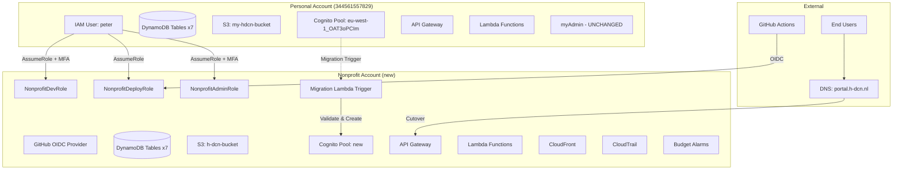
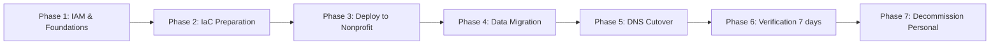
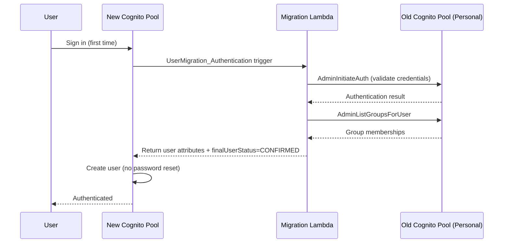
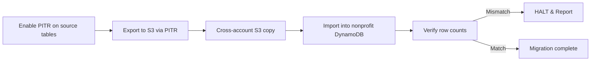

# Design Document: Nonprofit Account Migration

## Overview

This design describes the migration of the h-dcn application from a personal AWS account (344561557829) to a nonprofit AWS account with $1K/year in credits. The migration follows a phased approach: first establishing secure cross-account access and management foundations, then migrating infrastructure and data, and finally cutting over DNS with rollback capability.

The personal account retains myAdmin unchanged. The nonprofit account becomes the sole host for h-dcn, leveraging nonprofit credits for cost-bearing services (Lambda, DynamoDB, API Gateway, CloudFront, S3, Cognito).

### Key Design Decisions

1. **Single IAM user in personal account as identity source** — Avoids creating IAM users in the nonprofit account. The personal account "peter" user assumes roles cross-account. This simplifies credential management and provides a single audit trail.

2. **Three-role model (Dev/Deploy/Admin)** — Follows least-privilege principle. Daily development uses DevRole (read/write data), CI/CD uses DeployRole (infrastructure changes), and AdminRole is reserved for emergencies.

3. **Cognito Migration Lambda Trigger over bulk export** — Users migrate transparently on first sign-in. No password resets required. This is the AWS-recommended approach for cross-account Cognito migration.

4. **PITR export for DynamoDB** — Zero impact on source table capacity. Exports go to S3 in DynamoDB JSON format, then import into the new account. More reliable than scan-based approaches for large tables.

5. **Parallel operation with DNS cutover** — Both environments run simultaneously during migration. DNS switch is the final step, with 5-minute rollback capability via low-TTL records.

6. **GitHub Actions OIDC** — Eliminates long-lived AWS credentials in GitHub secrets. The workflow assumes NonprofitDeployRole directly via web identity federation.

## Architecture

### High-Level Migration Architecture



### Migration Phases



## Components and Interfaces

### 1. IAM Cross-Account Access

**Personal Account Components:**

- IAM User `peter` with MFA enforced
- IAM Group `Developers` with AssumeRole policies for all three nonprofit roles

**Nonprofit Account Components:**

- `NonprofitDevRole` — Daily development (DynamoDB, S3, Lambda, CloudWatch, API Gateway read, Cognito read)
- `NonprofitDeployRole` — CI/CD deployments (CloudFormation, SAM, IAM, all service management)
- `NonprofitAdminRole` — Emergency access (AdministratorAccess)
- GitHub OIDC Provider for `token.actions.githubusercontent.com`

**Trust Policy Pattern:**

```json
{
  "Version": "2012-10-17",
  "Statement": [
    {
      "Effect": "Allow",
      "Principal": { "AWS": "arn:aws:iam::344561557829:root" },

      "Action": "sts:AssumeRole",
      "Condition": { "Bool": { "aws:MultiFactorAuthPresent": "true" } }
    }
  ]
}
```

For DeployRole, an additional statement allows GitHub OIDC:

```json
{
  "Effect": "Allow",
  "Principal": {
    "Federated": "arn:aws:iam::506221081911:oidc-provider/token.actions.githubusercontent.com"
  },
  "Action": "sts:AssumeRoleWithWebIdentity",
  "Condition": {
    "StringEquals": {
      "token.actions.githubusercontent.com:aud": "sts.amazonaws.com"
    },
    "StringLike": {
      "token.actions.githubusercontent.com:sub": "repo:PeterGeers/h-dcn:*"
    }
  }
}
```

### 2. AWS CLI Profile Configuration

```ini
# ~/.aws/config
[profile personal]
region = eu-west-1
output = json

[profile nonprofit-dev]
region = eu-west-1
role_arn = arn:aws:iam::506221081911:role/NonprofitDevRole
source_profile = personal
mfa_serial = arn:aws:iam::344561557829:mfa/webmaster

[profile nonprofit-deploy]
region = eu-west-1
role_arn = arn:aws:iam::506221081911:role/NonprofitDeployRole
source_profile = personal

[profile nonprofit-admin]
region = eu-west-1
role_arn = arn:aws:iam::506221081911:role/NonprofitAdminRole
source_profile = personal
mfa_serial = arn:aws:iam::344561557829:mfa/webmaster
```

### 3. SAM Template Modifications

**Tagging (Globals section addition):**

```yaml
Globals:
  Function:
    Tags:
      Project: h-dcn
      Environment: !Ref Environment
      ManagedBy: sam
      Owner: peter
```

**Parameterization of hardcoded values:**

- Replace `my-hdcn-bucket` with `!Ref S3BucketName` parameter
- Replace hardcoded Cognito domain with `!Sub` using `${AWS::AccountId}`
- Replace all `arn:aws:s3:::my-hdcn-bucket` with dynamic references
- Add `CognitoUserPoolDomain` as a parameter instead of hardcoded output

**New resources to add:**

- DynamoDB table definitions (currently tables exist but aren't in template)
- Cognito User Pool and Client (currently referenced as existing)
- S3 bucket `my-hdcn-bucket` (currently referenced as existing)
- PITR enabled on all DynamoDB tables
- S3 versioning and lifecycle rules

### 4. Cognito Migration Lambda Trigger



**Migration Lambda responsibilities:**

- Validate credentials against old pool via `AdminInitiateAuth`
- Retrieve user attributes (email, name, custom attributes)
- Retrieve group memberships (hdcnLeden, admin, etc.)
- Return user data with `finalUserStatus: "CONFIRMED"` to skip verification
- After user creation, add user to appropriate groups via post-confirmation trigger

### 5. DynamoDB Data Migration Pipeline



**Tables to migrate:** Producten, Members, Payments, Events, Memberships, Carts, Orders

**Export format:** DynamoDB JSON (native PITR export format)

**Verification:** Row count comparison per table with exact match requirement.

### 6. Frontend CI/CD Update

The current workflow deploys to GitHub Pages. The migration updates it to deploy to S3 + CloudFront in the nonprofit account:

```yaml
# Updated deploy-frontend.yml
permissions:
  id-token: write
  contents: read

jobs:
  deploy:
    steps:
      - name: Configure AWS credentials
        uses: aws-actions/configure-aws-credentials@v4
        with:
          role-to-assume: arn:aws:iam::506221081911:role/NonprofitDeployRole
          aws-region: eu-west-1

      - name: Deploy to S3
        run: aws s3 sync frontend/build/ s3://<frontend-bucket>/ --delete

      - name: Invalidate CloudFront
        run: aws cloudfront create-invalidation --distribution-id <dist-id> --paths "/*"
```

### 7. DNS Cutover Strategy

DNS is managed in Squarespace and remains there. The cutover only changes where records point — no DNS provider migration is needed.

1. Lower TTL to 60 seconds in Squarespace (24h before cutover)
2. Verify nonprofit deployment end-to-end
3. Update CNAME/A records in Squarespace to point to nonprofit CloudFront/API Gateway endpoints
4. Monitor for 5 minutes
5. If failures detected: revert records in Squarespace to personal account endpoints
6. If stable: maintain parallel operation for 7 days

### 8. Budget and Cost Controls

- Monthly budget: €80 (≈ $83/month × 12 = ~$1000/year)
- Alert thresholds: 50% (€40), 80% (€64), 100% (€80)
- Zero-spend alarm for unexpected service charges
- Notifications via SNS to administrator email

### 9. Monitoring and Observability

- X-Ray tracing on all Lambda functions (already in Globals)
- LOG_LEVEL=INFO, POWERTOOLS_SERVICE_NAME=h-dcn
- CloudWatch Alarms for Lambda errors → SNS notification
- CloudWatch Dashboard: Lambda invocations/errors, DynamoDB capacity, API Gateway 4xx/5xx
- CloudTrail for all management events

## Data Models

### Resource Tagging Schema

| Tag Key     | Value      | Purpose                                     |
| ----------- | ---------- | ------------------------------------------- |
| Project     | h-dcn      | Cost allocation and resource identification |
| Environment | dev / prod | Environment separation                      |
| ManagedBy   | sam        | Identifies IaC-managed resources            |
| Owner       | peter      | Resource ownership                          |

### SSM Parameter Store Convention

```
/h-dcn/{environment}/mollie/api-key          → SecureString
/h-dcn/{environment}/cognito/user-pool-id    → String
/h-dcn/{environment}/cognito/client-id       → String
/h-dcn/{environment}/google/client-id        → SecureString
/h-dcn/{environment}/google/client-secret    → SecureString
```

### Secrets Manager Convention

```
h-dcn/{environment}/google-credentials       → JSON (Google Workspace OAuth)
h-dcn/{environment}/database-credentials     → JSON (if applicable)
```

### DynamoDB Table Definitions (to be added to SAM template)

All 7 tables with PITR enabled:

| Table       | Partition Key  | Sort Key | GSIs              |
| ----------- | -------------- | -------- | ----------------- |
| Producten   | id (S)         | —        | —                 |
| Members     | id (S)         | —        | email-index       |
| Payments    | payment_id (S) | —        | member_id-index   |
| Events      | event_id (S)   | —        | date-index        |
| Memberships | id (S)         | —        | —                 |
| Carts       | cart_id (S)    | —        | user_id-index     |
| Orders      | order_id (S)   | —        | customer_id-index |

### Hardcoded References to Remove

| File                                                  | Current Value                         | Replacement                               |
| ----------------------------------------------------- | ------------------------------------- | ----------------------------------------- |
| `backend/template.yaml` (Output)                      | `h-dcn-auth-new-344561557829.auth...` | `!Sub` with `${AWS::AccountId}`           |
| `backend/template.yaml` (DynamoDBRole)                | `userpool/eu-west-1_OAT3oPCIm`        | `!Sub .../userpool/${ExistingUserPoolId}` |
| `frontend/src/components/auth/GoogleSignInButton.tsx` | `h-dcn-auth-344561557829...`          | Environment variable                      |
| `frontend/src/components/auth/OAuthCallback.tsx`      | `h-dcn-auth-344561557829...`          | Environment variable                      |
| `frontend/src/services/googleAuthService.ts`          | `h-dcn-auth-344561557829...`          | Environment variable                      |
| `scripts/config.sh`                                   | `AWS_ACCOUNT_ID="344561557829"`       | Dynamic via `aws sts get-caller-identity` |
| `backend/samconfig.toml`                              | Google secrets in plaintext           | SSM Parameter Store references            |

## Error Handling

### Migration Failure Scenarios

| Scenario                        | Detection                       | Response                                                     |
| ------------------------------- | ------------------------------- | ------------------------------------------------------------ |
| DynamoDB row count mismatch     | Verification script             | Halt migration, report discrepancy, re-export affected table |
| S3 sync incomplete              | Object count comparison         | Re-run `aws s3 sync` (idempotent)                            |
| Cognito migration trigger fails | CloudWatch Logs + user reports  | Fall back to old pool (DNS revert), fix trigger, retry       |
| DNS cutover causes errors       | Health check monitoring         | Revert DNS within 5 minutes (low TTL)                        |
| SAM deploy fails in nonprofit   | CloudFormation rollback         | Automatic rollback, investigate, fix template, redeploy      |
| OIDC authentication fails       | GitHub Actions workflow failure | Fall back to manual deploy via CLI profile                   |
| Budget exceeded                 | SNS alert                       | Investigate cost source, scale down if needed                |

### Rollback Strategy

1. **Pre-cutover:** Personal account remains fully operational. No rollback needed.
2. **During cutover:** DNS revert to personal account (< 5 min with 60s TTL).
3. **Post-cutover (< 7 days):** DNS revert + stop nonprofit services.
4. **Post-decommission:** Restore from 90-day backup in S3.

### Personal Account Decommissioning Procedure

**Gate:** Only begin after nonprofit account has been running successfully for 7+ days with DNS pointing to it.

**Step 1: Final backup (safety net)**

```bash
# Export all DynamoDB tables one last time
aws dynamodb export-table-to-point-in-time \
  --table-arn arn:aws:dynamodb:eu-west-1:344561557829:table/<TableName> \
  --s3-bucket h-dcn-decommission-backup \
  --export-format DYNAMODB_JSON \
  --profile personal

# Sync S3 bucket to backup location
aws s3 sync s3://my-hdcn-bucket s3://h-dcn-decommission-backup/s3-data/ --profile personal
```

Retain this backup bucket for 90 days, then delete.

**Step 2: Delete the h-dcn CloudFormation stack**

```bash
aws cloudformation delete-stack --stack-name h-dcn --profile personal
aws cloudformation wait stack-delete-complete --stack-name h-dcn --profile personal
```

This removes stack-managed resources: Lambda functions, API Gateway, IAM roles created by the stack, CloudFront distribution, etc.

**Step 3: Delete DynamoDB tables (if created outside the stack)**

Tables that were created manually or exist as "existing resources" in the template won't be deleted by the stack deletion:

```bash
# Delete each table individually
aws dynamodb delete-table --table-name Producten --profile personal
aws dynamodb delete-table --table-name Members --profile personal
aws dynamodb delete-table --table-name Payments --profile personal
aws dynamodb delete-table --table-name Events --profile personal
aws dynamodb delete-table --table-name Memberships --profile personal
aws dynamodb delete-table --table-name Carts --profile personal
aws dynamodb delete-table --table-name Orders --profile personal
```

**Step 4: Delete the S3 bucket**

```bash
# Must empty bucket first (versioned objects too)
aws s3api delete-objects --bucket my-hdcn-bucket \
  --delete "$(aws s3api list-object-versions --bucket my-hdcn-bucket --query '{Objects: Versions[].{Key:Key,VersionId:VersionId}}' --output json)" \
  --profile personal

aws s3 rb s3://my-hdcn-bucket --profile personal
```

**Step 5: Delete the Cognito User Pool**

```bash
# Only after confirming all users have migrated via the Migration Lambda Trigger
aws cognito-idp delete-user-pool --user-pool-id eu-west-1_OAT3oPCIm --profile personal
```

**Step 6: Clean up orphaned resources**

Check for resources not managed by the CloudFormation stack:

| Resource Type           | How to find                                                              | Cleanup command                               |
| ----------------------- | ------------------------------------------------------------------------ | --------------------------------------------- |
| CloudWatch Log Groups   | `aws logs describe-log-groups --log-group-name-prefix /aws/lambda/h-dcn` | `aws logs delete-log-group`                   |
| SSM Parameters (if any) | `aws ssm get-parameters-by-path --path /h-dcn/`                          | `aws ssm delete-parameter`                    |
| IAM roles (manual)      | Check for h-dcn prefixed roles                                           | `aws iam delete-role` (detach policies first) |
| CloudWatch Alarms       | `aws cloudwatch describe-alarms --alarm-name-prefix h-dcn`               | `aws cloudwatch delete-alarms`                |

**What stays untouched in the personal account:**

- All myAdmin resources (Lambda, DynamoDB, API Gateway, etc.)
- IAM user "peter" and "Developers" group (still needed for cross-account access to nonprofit)
- Any shared infrastructure (VPC, Route53 hosted zones if applicable)
- The decommission backup bucket (for 90 days)

## Testing Strategy

### Why Property-Based Testing Does Not Apply

This feature is an **Infrastructure as Code migration** involving:

- AWS resource configuration (IAM roles, policies, OIDC providers)
- Operational procedures (data export/import, DNS cutover)
- CI/CD pipeline configuration (GitHub Actions YAML)
- SAM/CloudFormation template modifications

PBT is not appropriate because:

- IaC is declarative configuration, not functions with input/output behavior
- Migration steps are procedural and sequential, not universally quantifiable
- Testing involves verifying infrastructure state, not algorithmic correctness
- The "inputs" are fixed (specific account IDs, table names, bucket names)

### Testing Approach

**1. Smoke Tests (single execution verification):**

- `aws sts get-caller-identity --profile nonprofit-dev` returns correct account/role
- `aws sts get-caller-identity --profile nonprofit-deploy` returns correct account/role
- `aws sts get-caller-identity --profile nonprofit-admin` returns correct account/role
- SAM deploy succeeds: `sam deploy --config-env nonprofit`
- CloudTrail is enabled and logging
- Budget alarms are configured

**2. Integration Tests (end-to-end verification):**

- API Gateway responds to health check from nonprofit deployment
- Lambda functions can read/write DynamoDB tables in nonprofit account
- Cognito authentication flow works with new pool
- Migration Lambda Trigger successfully migrates a test user
- Frontend deploys via GitHub Actions OIDC without errors
- CloudFront serves frontend assets correctly

**3. Data Verification Scripts:**

- Row count comparison for all 7 DynamoDB tables (source vs destination)
- S3 object count comparison (source vs destination)
- Cognito user count after migration period
- Tag compliance check on all deployed resources

**4. Cutover Verification:**

- DNS resolution points to nonprofit endpoints
- End-to-end user flow: login → view data → perform action
- Rollback test: revert DNS and verify personal account still serves traffic

**5. Security Verification:**

- MFA is required for DevRole and AdminRole assumption
- DeployRole is only assumable from specific GitHub repo
- No hardcoded account IDs remain in codebase (`grep -r "344561557829"` returns zero results in source files)
- SSM parameters exist for all secrets previously in `.secrets` file
- GitGuardian pre-commit hook blocks secret commits

**6. SAM Template Validation:**

- `sam validate` passes
- `cfn-lint` passes with no errors
- All resources have required tags (Project, Environment, ManagedBy, Owner)
- PITR enabled on all DynamoDB tables
- S3 versioning enabled with 30-day lifecycle

### Test Execution Order

1. IAM/OIDC smoke tests (Phase 1 gate)
2. SAM template validation (Phase 2 gate)
3. Deployment integration tests (Phase 3 gate)
4. Data verification scripts (Phase 4 gate)
5. Cutover + rollback verification (Phase 5 gate)
6. 7-day monitoring period (Phase 6 gate)
7. Decommission verification (Phase 7)
