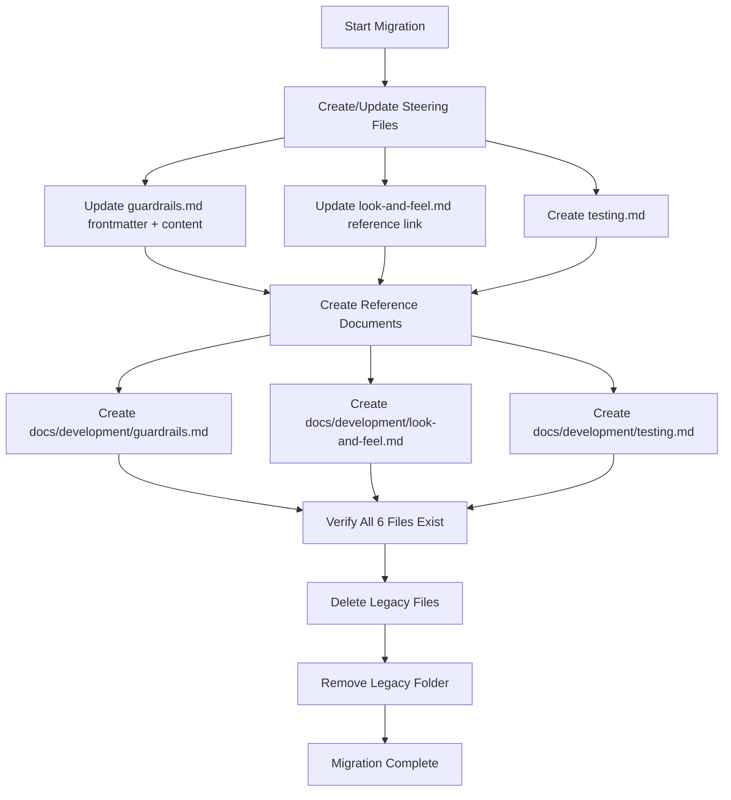

# Design Document: Steering File Migration

## Overview

This feature migrates three unique steering files from the legacy location (`.kiro/specs/steering/`) to the official location (`.kiro/steering/`), creates detailed reference documents in `docs/development/`, and removes the legacy folder. The migration is a content transformation and file management operation — no runtime code is involved.

### Goals

1. Create concise, actionable steering files (≤80 lines) in `.kiro/steering/`
2. Create detailed reference documents in `docs/development/`
3. Replace all outdated infrastructure values with current actuals
4. Remove the legacy `.kiro/specs/steering/` folder entirely

### Constraints

- `guardrails.md` already exists in the official location but needs frontmatter changed from `inclusion: manual` to `inclusion: auto`
- `look-and-feel.md` already exists in the official location with correct frontmatter — content may need minor updates (reference link)
- `testing.md` must be created fresh
- Reference documents must not duplicate content from existing official steering files (authentication.md, aws-dynamodb.md, product.md, structure.md, tech.md)

## Architecture

The migration follows a sequential file-operation pipeline:



### Design Decisions

1. **Update-in-place for existing files**: `guardrails.md` and `look-and-feel.md` already exist. Rather than delete-and-recreate, we update them to preserve git history.
2. **Reference link convention**: All steering files use relative markdown links (`../../docs/development/<name>.md`) to point to their reference documents.
3. **Value replacement strategy**: A fixed mapping of old→new values is applied during content creation. No dynamic lookup needed since all values are known constants.
4. **Verification before deletion**: The legacy folder is only removed after confirming all 6 target files exist on disk.
5. **No content duplication**: Reference documents cross-reference existing steering files (authentication.md, aws-dynamodb.md, etc.) rather than repeating their content.

## Components and Interfaces

This migration has no runtime components or interfaces. It consists of file operations organized into three logical groups:

### 1. Steering Files (`.kiro/steering/`)

| File               | Action          | Frontmatter         | Max Lines |
| ------------------ | --------------- | ------------------- | --------- |
| `guardrails.md`    | Update (exists) | `inclusion: auto`   | 80        |
| `look-and-feel.md` | Update (exists) | `inclusion: manual` | 80        |
| `testing.md`       | Create (new)    | `inclusion: manual` | 80        |

### 2. Reference Documents (`docs/development/`)

| File               | Action | Source Content                                                                              |
| ------------------ | ------ | ------------------------------------------------------------------------------------------- |
| `guardrails.md`    | Create | Legacy `guardrail.md` with value replacements, emergency procedures, checklists, compliance |
| `look-and-feel.md` | Create | Legacy `look-and-feel.md` with full design system patterns, examples, accessibility         |
| `testing.md`       | Create | Legacy `testing.md` with test organization, examples, CI pipeline, debugging                |

### 3. Legacy Cleanup (`.kiro/specs/steering/`)

| File                             | Action |
| -------------------------------- | ------ |
| `deployment.md`                  | Delete |
| `guardrail.md`                   | Delete |
| `look-and-feel.md`               | Delete |
| `product.md`                     | Delete |
| `structure.md`                   | Delete |
| `tech.md`                        | Delete |
| `testing.md`                     | Delete |
| `.kiro/specs/steering/` (folder) | Remove |

### Value Replacement Map

| Old Value                    | New Value                     | Context            |
| ---------------------------- | ----------------------------- | ------------------ |
| `testportal-h-dcn-frontend`  | `h-dcn-frontend-506221081911` | Frontend S3 bucket |
| `my-hdcn-bucket`             | `h-dcn-data-506221081911`     | Data S3 bucket     |
| `i3if973sp5`                 | `44sw408alh`                  | API Gateway ID     |
| `eu-west-1_VtKQHhXGN`        | `eu-west-1_fcUkvwjH5`         | Cognito User Pool  |
| `77blkk6a3rpablme00m2die68g` | `6jhvk853b0lfg9q1m861qs0cug`  | Cognito Client ID  |

## Data Models

Not applicable — this feature operates on static markdown files with no data persistence or runtime state.

## Error Handling

Since this is a file-operation task executed by the developer (or AI assistant), error handling is procedural:

1. **File write failures**: If a file cannot be written (permissions, disk space), the task stops and reports the error. No partial cleanup is performed.
2. **Verification failure**: If any of the 6 target files cannot be confirmed after creation, the legacy folder deletion is blocked.
3. **Legacy deletion failure**: If individual legacy files cannot be deleted, report which files remain and allow manual cleanup.
4. **Idempotency**: Each task step is idempotent — re-running a step that already completed produces the same result without side effects.

## Testing Strategy

### Why Property-Based Testing Does NOT Apply

This feature is a **file migration** — it creates/updates static markdown files and deletes a folder. There are:

- No pure functions with input/output behavior
- No algorithms or data transformations that vary with input
- No universal properties that hold across a range of inputs
- No runtime code to test

The appropriate testing approach is **manual verification** and **example-based checks**.

### Verification Approach

1. **File existence checks**: Confirm all 6 target files exist after migration
2. **Content validation**: Spot-check that:
   - Steering files are ≤80 lines
   - Frontmatter is correct (`auto` for guardrails, `manual` for others)
   - No outdated values remain (grep for old bucket names, API IDs, Cognito values)
   - Reference links resolve to existing files
3. **Legacy cleanup verification**: Confirm `.kiro/specs/steering/` no longer exists
4. **Cross-reference check**: Confirm reference documents don't duplicate content from existing official steering files

### Verification Commands

```bash
# Check no outdated values remain in new files
grep -r "testportal-h-dcn-frontend" .kiro/steering/ docs/development/
grep -r "my-hdcn-bucket" .kiro/steering/ docs/development/
grep -r "i3if973sp5" .kiro/steering/ docs/development/
grep -r "eu-west-1_VtKQHhXGN" .kiro/steering/ docs/development/
grep -r "77blkk6a3rpablme00m2die68g" .kiro/steering/ docs/development/

# Check line counts
wc -l .kiro/steering/guardrails.md .kiro/steering/look-and-feel.md .kiro/steering/testing.md

# Confirm legacy folder is gone
test -d .kiro/specs/steering && echo "FAIL: legacy folder still exists" || echo "OK: legacy folder removed"
```
