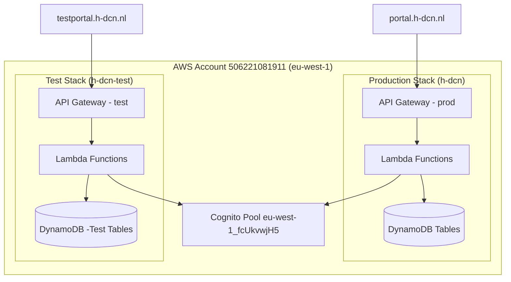
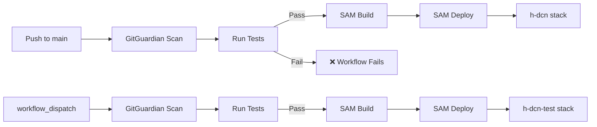

# Design Document: Test Staging Environment

## Overview

This design establishes a complete test/staging environment for the H-DCN member portal. The solution enables isolated backend testing by parameterizing the existing SAM template with a `Stage` parameter, deploying a separate `h-dcn-test` CloudFormation stack, adding CI test gates, providing a local test runner, configuring stage-aware CORS, provisioning test users, and seeding test data.

The approach reuses the existing shared Cognito pool (test users distinguished by `test-` prefix) and references externally-managed DynamoDB tables suffixed with `-Test`. This avoids any CloudFormation-managed table creation (preventing the historical production data loss risk).

### Key Design Decisions

1. **Single SAM template, multiple stacks** — The same `template.yaml` supports both `prod` and `test` via parameter overrides. No template forking or duplication.
2. **CORS origin via environment variable** — The `cors_headers()` function reads `CORS_ALLOWED_ORIGIN` from the Lambda environment rather than hardcoding `*`. The SAM template sets this per-stage using a `Conditions` or `Mappings` block.
3. **Shared Cognito pool** — Test and production share `eu-west-1_fcUkvwjH5`. Test users are isolated by prefix and have data only in `-Test` tables.
4. **External table management** — Test DynamoDB tables (`Members-Test`, etc.) are created manually, matching the production convention. The SAM template never creates DynamoDB tables.
5. **CI gates before deploy** — Both backend (pytest) and frontend (Jest) must pass before SAM build/deploy proceeds.

## Architecture



### Deployment Flow



## Components and Interfaces

### 1. SAM Template Parameterization (`backend/template.yaml`)

**Changes:**

- Add `Stage` parameter (allowed: `prod`, `test`; default: `prod`)
- Add `Mappings` section for stage-dependent values (CORS origin, table name defaults)
- Update `Globals.Api.Cors.AllowOrigin` to use stage-based mapping
- Add `CORS_ALLOWED_ORIGIN` environment variable to all Lambda functions via `Globals.Function.Environment`
- Conditionally default table name parameters to `-Test` variants when `Stage=test`
- Add CloudFormation output `ApiUrl` exposing the API Gateway invoke URL

**Mapping structure:**

```yaml
Mappings:
  StageConfig:
    prod:
      CorsOrigin: "https://portal.h-dcn.nl"
      OrganizationWebsite: "https://portal.h-dcn.nl"
    test:
      CorsOrigin: "https://testportal.h-dcn.nl"
      OrganizationWebsite: "https://testportal.h-dcn.nl"
```

**Condition-based table defaults approach:**
Since CloudFormation parameters don't support conditional defaults natively, the `Stage=test` deploy command passes all table names explicitly via `--parameter-overrides`. The mapping provides the CORS and website values; table names are passed at deploy time.

### 2. CORS Configuration (`auth_utils.py`)

**Current state:** `cors_headers()` returns hardcoded `"Access-Control-Allow-Origin": "*"`

**New behavior:**

```python
import os

def cors_headers():
    allowed_origin = os.environ.get('CORS_ALLOWED_ORIGIN', '*')
    return {
        "Access-Control-Allow-Origin": allowed_origin,
        "Access-Control-Allow-Methods": "OPTIONS,GET,POST,PUT,DELETE,PATCH",
        "Access-Control-Allow-Headers": "Content-Type,X-Amz-Date,Authorization,X-Api-Key,X-Amz-Security-Token,X-Enhanced-Groups,X-User-Email,x-requested-with,Accept-Language",
        "Access-Control-Allow-Credentials": "false"
    }
```

The SAM template sets `CORS_ALLOWED_ORIGIN` in `Globals.Function.Environment.Variables` using `!FindInMap [StageConfig, !Ref Stage, CorsOrigin]`.

### 3. CI Pipeline Updates (`.github/workflows/`)

**Backend workflow (`deploy-backend.yml`) additions:**

- After Python setup, install test dependencies: `pip install -r requirements.txt -r tests/requirements.txt`
- Run `pytest tests/ --tb=short --junitxml=test-results.xml` with 10-minute timeout
- On failure: workflow terminates before SAM build
- Output test summary to `$GITHUB_STEP_SUMMARY`

**Frontend workflow (`deploy-frontend.yml`) additions:**

- After `npm install`, run `npm test -- --watchAll=false --ci` with 10-minute timeout
- On failure: workflow terminates before build step
- Output test summary to `$GITHUB_STEP_SUMMARY`

### 4. Local Test Runner (`run-tests.ps1`)

A PowerShell script at project root that:

1. Runs `pytest tests/ --tb=short` from `backend/`
2. Runs `npm test -- --watchAll=false` from `frontend/`
3. Always runs both suites (captures exit codes, doesn't short-circuit)
4. Prints a summary table with suite name, result, and exit code
5. Exits 0 only if both pass
6. Supports `-Coverage` switch for coverage reporting

### 5. Test Data Seeding (`scripts/seed-test-data.py`)

**Responsibilities:**

- Creates test users in Cognito (with skip-if-exists logic)
- Seeds all `-Test` DynamoDB tables with deterministic data
- Supports `--clear` flag to wipe before seeding
- Uses `nonprofit-deploy` AWS profile

**Script structure:**

```
scripts/seed-test-data.py
├── Configuration (user definitions, table schemas, seed data)
├── CognitoSeeder class (create users, set passwords, assign groups)
├── DynamoDBSeeder class (put items, clear tables)
└── CLI entry point (argparse, orchestration, summary output)
```

### 6. Test Stack Deployment Documentation

Documented deploy command:

```bash
sam deploy \
  --stack-name h-dcn-test \
  --region eu-west-1 \
  --profile nonprofit-deploy \
  --capabilities CAPABILITY_IAM CAPABILITY_NAMED_IAM \
  --resolve-s3 \
  --no-confirm-changeset \
  --no-fail-on-empty-changeset \
  --parameter-overrides \
    Stage=test \
    Table=Producten-Test \
    MembersTable=Members-Test \
    PaymentsTable=Payments-Test \
    EventsTable=Events-Test \
    MembershipsTable=Memberships-Test \
    CartsTable=Carts-Test \
    OrdersTable=Orders-Test \
    CountersTable=Counters-Test \
    StockMovementsTableName=StockMovements-Test
```

## Data Models

### Test User Configuration

| Username       | Email                           | Groups                                                                                                                                                                                                                                                                                                                                     |
| -------------- | ------------------------------- | ------------------------------------------------------------------------------------------------------------------------------------------------------------------------------------------------------------------------------------------------------------------------------------------------------------------------------------------ |
| test-admin     | webmaster+testadmin@h-dcn.nl    | Products_CRUD, Products_Export, Products_Read, Webshop_Management, Members_Read, Members_CRUD, Members_Export, Members_Status_Approve, System_CRUD, System_Logs_Read, System_User_Management, Communication_CRUD, Communication_Read, Communication_Export, Events_CRUD, Events_Read, Events_Export, Regio_All, Regio_Pressmeet, hdcnLeden |
| test-lid       | peter+testlid@pgeers.nl         | hdcnLeden, Regio_Pressmeet, club_test_presmeet                                                                                                                                                                                                                                                                                             |
| test-treasurer | peter+testtreasurer@jabaki.nl   | National_Treasurer, hdcnLeden                                                                                                                                                                                                                                                                                                              |
| test-presmeet  | pjageers+testpresmeet@gmail.com | Regio_Pressmeet, hdcnLeden                                                                                                                                                                                                                                                                                                                 |
| test-readonly  | pjageers+testreadonly@gmail.com | Products_Read, hdcnLeden                                                                                                                                                                                                                                                                                                                   |

### Test DynamoDB Tables

| Production Table | Test Table          | Partition Key     | Seed Items |
| ---------------- | ------------------- | ----------------- | ---------- |
| Members          | Members-Test        | member_id (S)     | ≥5 items   |
| Producten        | Producten-Test      | product_id (S)    | ≥5 items   |
| Orders           | Orders-Test         | order_id (S)      | ≥5 items   |
| Payments         | Payments-Test       | payment_id (S)    | ≥5 items   |
| Events           | Events-Test         | event_id (S)      | ≥5 items   |
| Memberships      | Memberships-Test    | membership_id (S) | ≥5 items   |
| Carts            | Carts-Test          | cart_id (S)       | ≥5 items   |
| Counters         | Counters-Test       | counter_id (S)    | ≥2 items   |
| StockMovements   | StockMovements-Test | movement_id (S)   | ≥5 items   |

### Seed Data Conventions

- Partition keys use deterministic format: `SEED-{table}-{index}` (e.g., `SEED-members-001`)
- All synthetic names contain `test-` or `SEED-` prefix
- Status fields use at least 2 distinct values per table (e.g., `active`/`inactive` for members)
- Email addresses use `test-` or `+test` patterns

## Correctness Properties

_A property is a characteristic or behavior that should hold true across all valid executions of a system — essentially, a formal statement about what the system should do. Properties serve as the bridge between human-readable specifications and machine-verifiable correctness guarantees._

### Property 1: CORS origin from environment variable

_For any_ string value set in the `CORS_ALLOWED_ORIGIN` environment variable, the `cors_headers()` function SHALL return that exact value as the `Access-Control-Allow-Origin` header, without reading or echoing any request-provided `Origin` header.

**Validates: Requirements 1.3, 1.4, 5.1, 5.5**

### Property 2: Seed data determinism (idempotency)

_For any_ table's seed data configuration, calling the data generation function multiple times SHALL produce identical item sets (same keys, same attribute values) on every invocation, ensuring that repeated script runs overwrite rather than duplicate.

**Validates: Requirements 6.3**

### Property 3: Local test runner exit code correctness

_For any_ pair of (backend_exit_code, frontend_exit_code) integers, the local test runner's final exit code SHALL be 0 if and only if both exit codes are 0.

**Validates: Requirements 4.5, 4.6**

### Property 4: Seed data validity

_For any_ item produced by the seed data generation function, the item SHALL contain all mandatory attributes defined for its table schema, all identifier fields SHALL contain a `test-` or `SEED-` prefix, and each table's seed set SHALL contain at least 5 items with at least 2 distinct status values (where the table has a status field).

**Validates: Requirements 6.1, 6.4**

### Property 5: Test user group configuration correctness

_For any_ test user defined in the seed script configuration, the configured group list SHALL match exactly the groups specified in the requirements (no extra groups, no missing groups).

**Validates: Requirements 7.1**

## Error Handling

### SAM Template Deployment Errors

| Scenario                         | Handling                                                                                           |
| -------------------------------- | -------------------------------------------------------------------------------------------------- |
| Missing `-Test` table at runtime | Lambda returns 500 with DynamoDB ResourceNotFoundException; table must be created externally first |
| Invalid `Stage` parameter value  | CloudFormation rejects deploy with validation error (AllowedValues enforced)                       |
| Stack name collision             | CloudFormation updates existing stack; separate stack names prevent collision                      |

### CI Pipeline Errors

| Scenario                        | Handling                                                               |
| ------------------------------- | ---------------------------------------------------------------------- |
| Test timeout (>10 min)          | GitHub Actions cancels step, marks job as failed                       |
| Test dependency install failure | Workflow step fails before tests run, job marked failed                |
| Flaky tests                     | No retry mechanism; developers must fix or mark as `@pytest.mark.skip` |

### Seed Script Errors

| Scenario                        | Handling                                                           |
| ------------------------------- | ------------------------------------------------------------------ |
| Test table doesn't exist        | Print error to stderr with table name, skip table, continue        |
| User already exists in Cognito  | Skip creation, log "already exists" message                        |
| AWS credentials invalid/expired | boto3 raises `NoCredentialsError`; script exits with error message |
| `--clear` on non-existent table | Log warning, skip, continue                                        |

### Local Test Runner Errors

| Scenario               | Handling                                                       |
| ---------------------- | -------------------------------------------------------------- |
| `pytest` not installed | PowerShell shows error from subprocess, exit code non-zero     |
| `npm` not installed    | PowerShell shows error from subprocess, exit code non-zero     |
| One suite fails        | Both suites still execute; combined exit code reflects failure |

## Testing Strategy

### Approach

This feature is primarily Infrastructure-as-Code, CI configuration, and operational scripting. **Property-based testing is applicable only to the pure logic components** (CORS header function, seed data generation logic, test runner exit code logic). The majority of testing uses example-based unit tests, integration tests, and manual verification.

### Unit Tests (pytest)

| Test                                    | Target                                                              | Type     |
| --------------------------------------- | ------------------------------------------------------------------- | -------- |
| `test_cors_headers_test_stage`          | `cors_headers()` returns testportal origin when env var set         | Example  |
| `test_cors_headers_prod_stage`          | `cors_headers()` returns portal origin when env var set             | Example  |
| `test_cors_headers_default_wildcard`    | `cors_headers()` returns `*` when env var not set (backward compat) | Example  |
| `test_cors_never_echoes_request_origin` | `cors_headers()` ignores any request-provided origin                | Property |
| `test_seed_data_deterministic_ids`      | Seed items have consistent IDs across multiple invocations          | Property |
| `test_seed_data_schema_compliance`      | All seed items contain required attributes                          | Property |
| `test_seed_user_group_assignment`       | Each user config maps to exactly the specified groups               | Example  |

### Property-Based Tests (Hypothesis)

**Library:** Hypothesis (already in use — `.hypothesis/` directory exists in project root)  
**Minimum iterations:** 100 per property

| Property   | Test Description                                                                                                        | Tag                                                                                              |
| ---------- | ----------------------------------------------------------------------------------------------------------------------- | ------------------------------------------------------------------------------------------------ |
| Property 1 | For any `CORS_ALLOWED_ORIGIN` env value, `cors_headers()` returns that exact value in the header                        | `Feature: test-staging-environment, Property 1: CORS origin from environment variable`           |
| Property 2 | For any seed config, calling generation multiple times produces identical output                                         | `Feature: test-staging-environment, Property 2: Seed data determinism`                           |
| Property 3 | For any (backend_exit, frontend_exit) code pair, runner returns 0 iff both are 0                                        | `Feature: test-staging-environment, Property 3: Local test runner exit code correctness`         |
| Property 4 | For any generated seed item, all mandatory attrs present, IDs have SEED-/test- prefix, ≥2 statuses per table            | `Feature: test-staging-environment, Property 4: Seed data validity`                              |
| Property 5 | For any test user config, group list matches requirements exactly                                                        | `Feature: test-staging-environment, Property 5: Test user group configuration correctness`       |

### Integration / Manual Tests

| Test                                  | Verification Method                                                             |
| ------------------------------------- | ------------------------------------------------------------------------------- |
| Test stack deploys successfully       | `sam deploy --stack-name h-dcn-test --parameter-overrides Stage=test` completes |
| Test API Gateway returns correct CORS | `curl -I` the test API with `Origin: https://testportal.h-dcn.nl`               |
| testportal.h-dcn.nl can call test API | Browser devtools check — no CORS errors                                         |
| Test users can authenticate           | Sign in to testportal with `test-admin` credentials                             |
| Seed script populates tables          | `aws dynamodb scan --table-name Members-Test` returns seeded items              |
| CI blocks on test failure             | Push a failing test, verify deploy step is skipped                              |

### What is NOT property-tested (and why)

- **SAM template parameterization** — IaC/declarative config; verified by deployment success
- **GitHub Actions workflow** — CI config; verified by pipeline execution
- **Cognito user creation** — external service; integration test with 1-2 examples
- **DynamoDB seed writes** — external service; integration test verifies items exist
