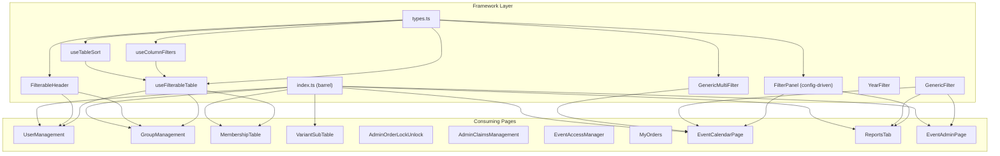
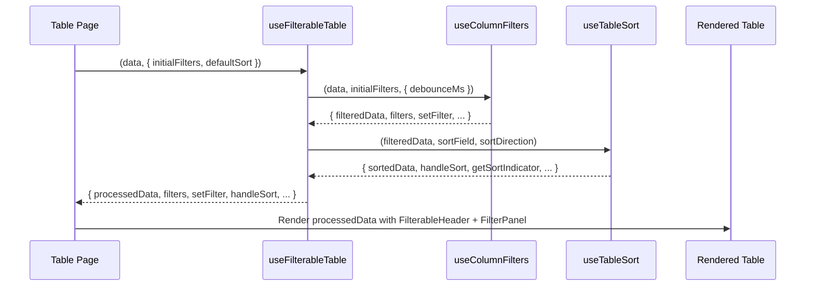

# Design Document: UI Framework Consolidation

## Overview

This design consolidates the partial filter/sort table framework in `frontend/src/components/filters/` and `frontend/src/hooks/` with the complete, production-ready implementation from `filter-table-framework/`. It adds a new `GenericMultiFilter` component and migrates all non-compliant tables to use the consolidated framework.

**Key changes:**

1. Replace H-DCN's hook implementations with the framework's API signature (data-first pattern where hooks receive data as first argument) — all three hooks (`useColumnFilters`, `useTableSort`, `useFilterableTable`) are adopted from `filter-table-framework/`
2. Replace `FilterableHeader` with the framework's version (adds `SearchIcon`, `aria-sort`, `w`/`maxW` props)
3. Replace `FilterPanel` with the framework's config-driven API (`FilterConfig<T>[]` instead of child nodes)
4. Create a canonical `types.ts` for all shared type definitions
5. Add `GenericMultiFilter` — a checkbox-based multi-select dropdown
6. Migrate 8 tables from inline action buttons to row-click → modal pattern
7. Migrate 4 pages from ad-hoc filters to framework components

**Design rationale:** The framework's "data-first" hook API (`useColumnFilters(data, initialFilters, options)`) is preferred over the current H-DCN pattern (`useColumnFilters(options)` + `filterData(data)`) because it encapsulates the filtering pipeline internally, eliminating the need for consumers to manually call `filterData`. The config-driven `FilterPanel` eliminates boilerplate by declaring filters as data rather than JSX children.

### Source File Mapping (filter-table-framework → H-DCN)

The following files are copied from `filter-table-framework/` into the H-DCN project. "Copy" means the file content is adopted as-is (import paths may need minor adjustment for project structure).

| #   | Source (`filter-table-framework/frontend/src/`)                   | Target (`frontend/src/`)                                          | Action                               |
| --- | ----------------------------------------------------------------- | ----------------------------------------------------------------- | ------------------------------------ |
| 1   | `hooks/useColumnFilters.ts`                                       | `hooks/useColumnFilters.ts`                                       | **Replace** existing file            |
| 2   | `hooks/useTableSort.ts`                                           | `hooks/useTableSort.ts`                                           | **Replace** existing file            |
| 3   | `hooks/useFilterableTable.ts`                                     | `hooks/useFilterableTable.ts`                                     | **Replace** existing file            |
| 4   | `components/filters/types.ts`                                     | `components/filters/types.ts`                                     | **Create** (does not exist in H-DCN) |
| 5   | `components/filters/FilterableHeader.tsx`                         | `components/filters/FilterableHeader.tsx`                         | **Replace** existing file            |
| 6   | `components/filters/FilterPanel.tsx`                              | `components/filters/FilterPanel.tsx`                              | **Replace** existing file            |
| 7   | `hooks/__tests__/useColumnFilters.test.ts`                        | `hooks/__tests__/useColumnFilters.test.ts`                        | **Replace** existing test            |
| 8   | `hooks/__tests__/useColumnFilters.property.test.ts`               | `hooks/__tests__/useColumnFilters.property.test.ts`               | **Replace** or create                |
| 9   | `hooks/__tests__/useFilterableTable.test.ts`                      | `hooks/__tests__/useFilterableTable.test.ts`                      | **Replace** or create                |
| 10  | `hooks/__tests__/useFilterableTable.property.test.ts`             | `hooks/__tests__/useFilterableTable.property.test.ts`             | **Replace** or create                |
| 11  | `components/filters/__tests__/FilterableHeader.test.tsx`          | `components/filters/__tests__/FilterableHeader.test.tsx`          | **Replace** or create                |
| 12  | `components/filters/__tests__/FilterableHeader.property.test.tsx` | `components/filters/__tests__/FilterableHeader.property.test.tsx` | **Replace** or create                |
| 13  | `components/filters/FilterPanel.test.tsx`                         | `components/filters/__tests__/FilterPanel.test.tsx`               | **Move** into `__tests__/` dir       |

**NOT copied** (irrelevant for H-DCN):

- `hooks/useTableConfig.ts` — parameter-driven config for a different project
- `hooks/__tests__/useTableConfig.*.ts` — tests for the above

**Created fresh** (not in framework):

- `components/filters/GenericMultiFilter.tsx` — new component
- `hooks/__tests__/useTableSort.test.ts` — no test existed in framework
- `hooks/__tests__/useTableSort.property.test.ts` — no property test existed
- `components/filters/__tests__/GenericMultiFilter.test.tsx` — new component test
- `components/filters/__tests__/GenericMultiFilter.property.test.tsx` — new property test
- `components/filters/__tests__/FilterPanel.property.test.tsx` — property test for config-driven API

---

## Architecture



### Data Flow



---

## Migration Scope

This section explicitly enumerates every component that needs migration, grouped by change type. Each entry includes its file path, current state, and target state to ensure nothing is omitted during task generation.

### Part 1A: Hook API Migration (call-site updates)

These components already use `useFilterableTable` with the **old** API signature. They need their hook call updated to the new data-first API.

| #   | Component             | File Path                                               | Current Pattern                                             | Target Pattern                                             |
| --- | --------------------- | ------------------------------------------------------- | ----------------------------------------------------------- | ---------------------------------------------------------- |
| 1   | UserManagement        | `modules/members/components/UserManagement.tsx`         | `useFilterableTable(data, { initialFilters, defaultSort })` | Same signature (compatible) — verify `processedData` usage |
| 2   | MemberAdminTable      | `components/MemberAdminTable.tsx`                       | `useFilterableTable(data, { initialFilters, defaultSort })` | Same signature — verify `processedData` usage              |
| 3   | ProductManagementPage | `modules/products/ProductManagementPage.tsx`            | `useFilterableTable(data, { initialFilters, defaultSort })` | Same signature — verify `processedData` usage              |
| 4   | OrdersTab             | `modules/webshop-management/components/OrdersTab.tsx`   | `useFilterableTable(data, { initialFilters, defaultSort })` | Same signature — verify `processedData` usage              |
| 5   | PaymentsTab           | `modules/webshop-management/components/PaymentsTab.tsx` | `useFilterableTable(data, { initialFilters, defaultSort })` | Same signature — verify `processedData` usage              |
| 6   | FinanceModule         | `modules/events/components/FinanceModule.tsx`           | `useFilterableTable(data, { initialFilters, defaultSort })` | Same signature — verify `processedData` usage              |
| 7   | EventList             | `modules/events/components/EventList.tsx`               | `useFilterableTable(data, { initialFilters, defaultSort })` | Same signature — verify `processedData` usage              |

**Note:** The current H-DCN `useFilterableTable` already takes `(data, options)` — the framework version changes the options shape to `UseFilterableTableConfig` and adds `getSortIndicator` to the return. All 7 call sites must be verified/updated for type compatibility.

### Part 1B: FilterPanel API Migration (child-node → config-driven)

These components use the **old** `<FilterPanel hasActiveFilters={} onReset={}>` child-node API. They need migration to the config-driven `<FilterPanel filters={[...]} layout="horizontal">` API.

| #   | Component             | File Path                                               | Current Pattern                                                  | Target Pattern                                      |
| --- | --------------------- | ------------------------------------------------------- | ---------------------------------------------------------------- | --------------------------------------------------- |
| 1   | OrdersTab             | `modules/webshop-management/components/OrdersTab.tsx`   | `<FilterPanel hasActiveFilters onReset>` + child `GenericFilter` | `<FilterPanel filters={[...]} layout="horizontal">` |
| 2   | PaymentsTab           | `modules/webshop-management/components/PaymentsTab.tsx` | `<FilterPanel hasActiveFilters onReset>` + child `GenericFilter` | `<FilterPanel filters={[...]} layout="horizontal">` |
| 3   | ProductManagementPage | `modules/products/ProductManagementPage.tsx`            | `<FilterPanel hasActiveFilters onReset>` + child `GenericFilter` | `<FilterPanel filters={[...]} layout="horizontal">` |
| 4   | Dashboard (products)  | `modules/products/pages/Dashboard.tsx`                  | `<FilterPanel hasActiveFilters onReset>` + child `GenericFilter` | `<FilterPanel filters={[...]} layout="vertical">`   |
| 5   | WebshopPage           | `modules/webshop/WebshopPage.tsx`                       | `<FilterPanel hasActiveFilters onReset>` + child `GenericFilter` | `<FilterPanel filters={[...]} layout="vertical">`   |
| 6   | OrdersAdmin           | `modules/webshop/components/OrdersAdmin.tsx`            | `<FilterPanel hasActiveFilters onReset>` + child `GenericFilter` | `<FilterPanel filters={[...]} layout="horizontal">` |
| 7   | FinanceModule         | `modules/events/components/FinanceModule.tsx`           | `<FilterPanel hasActiveFilters onReset>` + child `GenericFilter` | `<FilterPanel filters={[...]} layout="horizontal">` |
| 8   | AdminOrderLockUnlock  | `modules/eventBooking/admin/AdminOrderLockUnlock.tsx`   | `<FilterPanel hasActiveFilters onReset>` + child `GenericFilter` | `<FilterPanel filters={[...]} layout="horizontal">` |
| 9   | MemberAdminTable      | `components/MemberAdminTable.tsx`                       | `<FilterPanel hasActiveFilters onReset>` + child `GenericFilter` | `<FilterPanel filters={[...]} layout="horizontal">` |

### Part 2A: Row-Click → Modal Migration

These tables have inline action buttons that must be replaced with the row-click → modal pattern.

| #   | Component             | File Path                                                   | Current Inline Buttons                     | Target                                                      | Exception                                                            |
| --- | --------------------- | ----------------------------------------------------------- | ------------------------------------------ | ----------------------------------------------------------- | -------------------------------------------------------------------- |
| 1   | UserManagement        | `modules/members/components/UserManagement.tsx`             | Edit, Add-to-Group, Enable/Disable, Delete | Row click → edit/detail modal, destructive actions in modal | —                                                                    |
| 2   | GroupManagement       | `modules/members/components/GroupManagement.tsx`            | View, Edit, Delete                         | Row click → detail/edit modal, Delete in modal footer       | —                                                                    |
| 3   | MembershipTable       | `modules/members/components/MembershipTable.tsx`            | Edit, Delete                               | Row click → edit modal, Delete in modal footer              | —                                                                    |
| 4   | VariantSubTable       | `modules/webshop-management/components/VariantSubTable.tsx` | Add-stock, Deactivate, Delete              | Row click → variant detail/edit modal                       | —                                                                    |
| 5   | AdminOrderLockUnlock  | `modules/eventBooking/admin/AdminOrderLockUnlock.tsx`       | Unlock button                              | Row click → modal with Unlock action                        | Retain checkbox column for bulk ops                                  |
| 6   | AdminClaimsManagement | `modules/eventBooking/admin/AdminClaimsManagement.tsx`      | Menu, Assign button                        | Row click → claim detail/action modal                       | —                                                                    |
| 7   | EventAccessManager    | `modules/events/components/EventAccessManager.tsx`          | Revoke button                              | Row click → access detail modal with Revoke                 | Retain checkbox column for bulk ops                                  |
| 8   | MyOrders              | `modules/webshop/components/MyOrders.tsx`                   | PDF download button                        | Row click → order detail modal                              | **Exception**: Retain PDF download IconButton with `stopPropagation` |

### Part 2B: Ad-hoc Filter → Framework Filter Migration

These pages use custom `<Select>` or tag-button implementations that must be replaced with framework components.

| #   | Component         | File Path                                              | Current Pattern                                                                         | Target Pattern                                                                                  | Req |
| --- | ----------------- | ------------------------------------------------------ | --------------------------------------------------------------------------------------- | ----------------------------------------------------------------------------------------------- | --- |
| 1   | EventCalendarPage | `pages/EventCalendarPage.tsx`                          | Custom `<Select>` + `<HStack>` tag-buttons for event type; custom `<Select>` for region | `<GenericMultiFilter>` for event type, `<GenericFilter>` for region, wrapped in `<FilterPanel>` | R11 |
| 2   | ReportsTab        | `modules/webshop-management/components/ReportsTab.tsx` | 3 custom `<Select>` elements (report type, order status, payment status)                | 3× `<GenericFilter>` in `<FilterPanel layout="horizontal">`                                     | R12 |
| 3   | EventAdminPage    | `modules/events/EventAdminPage.tsx`                    | Custom `<Select>` for event picker                                                      | `<GenericFilter>`                                                                               | R13 |

### Summary of Migration Scope

| Category                               | Component Count |   Requirement   |
| -------------------------------------- | :-------------: | :-------------: |
| Hook API call-site updates             |        7        |     R1, R4      |
| FilterPanel child-node → config-driven |        9        |      R3.7       |
| Row-click → modal migration            |        8        | R7, R8, R9, R10 |
| Ad-hoc filter → framework filter       |        3        |  R11, R12, R13  |
| **Total unique components affected**   |     **~19**     |        —        |

_(Some components appear in multiple categories, e.g., AdminOrderLockUnlock needs both FilterPanel migration and row-click migration.)_

---

## Components and Interfaces

### Hook API Changes

| Hook                 | Current H-DCN API                                                                 | New (Framework) API                                                                                                                                            |
| -------------------- | --------------------------------------------------------------------------------- | -------------------------------------------------------------------------------------------------------------------------------------------------------------- |
| `useColumnFilters`   | `(options: { initialFilters, debounceMs })` → returns `filterData(data)` callback | `(data: T[], initialFilters: Record<string, string>, options?: { debounceMs })` → returns `filteredData: T[]`                                                  |
| `useTableSort`       | `(options?: { defaultSort })` → returns `sortData(data)` callback                 | `(data: T[], defaultField?: string, defaultDirection?: SortDirection)` → returns `sortedData: T[]`, `getSortIndicator(field): string` (adopted from framework) |
| `useFilterableTable` | `(data, { initialFilters, defaultSort, debounceMs })` → returns `processedData`   | `(data: T[], config: UseFilterableTableConfig)` → returns `processedData: T[]`, `getSortIndicator(field): string`                                              |

**Key difference:** The new hooks accept `data` as the first argument and return the processed result directly (`filteredData` / `sortedData` / `processedData`), rather than returning a callback that the consumer must invoke.

### useTableSort — Adopted from Framework

The complete `useTableSort` hook exists in `filter-table-framework/frontend/src/hooks/useTableSort.ts` and is adopted directly. It provides:

- Data-first signature: `useTableSort(data: T[], defaultField?: string, defaultDirection?: SortDirection)`
- Returns `sortedData: T[]` directly (no callback pattern)
- `getSortIndicator(field: string): string` — returns `'↑'`, `'↓'`, or `''`
- `handleSort(field: string)` — toggle sort (same field = flip direction, new field = asc)
- Exported `compareValues(a, b)` utility for custom sort scenarios
- Exported `isISODateString(value)` utility for date detection

**Comparison logic:** null/undefined → sort to end; both numbers → numeric; both ISO date strings → chronological; otherwise → case-insensitive `localeCompare`. This replaces the H-DCN version which used a callback pattern (`sortData(data)`) and `localeCompare('nl')` locale.

### FilterableHeader — Replaced

Adopted from `filter-table-framework`. Key differences from current H-DCN version:

| Aspect         | Current                                   | New                                                           |
| -------------- | ----------------------------------------- | ------------------------------------------------------------- |
| Filter input   | Plain `<Input>`                           | `<InputGroup>` with `<SearchIcon>` in `<InputLeftElement>`    |
| Sort indicator | `<TriangleUpIcon>` / `<TriangleDownIcon>` | Unicode `↑` / `↓` text in `orange.300`                        |
| Accessibility  | No `aria-sort`                            | `aria-sort="ascending"` / `"descending"` / `"none"` on `<Th>` |
| Width control  | `minW` prop only                          | `w` and `maxW` props                                          |
| Import         | Defines own `FilterableHeaderProps`       | Imports from `./types`                                        |

### FilterPanel — Config-Driven

Replaced with the framework's config-driven API. Migration path:

```tsx
// BEFORE (child-node API)
<FilterPanel hasActiveFilters={hasActive} onReset={reset}>
  <GenericFilter label="Status" value={v} options={opts} onChange={fn} />
</FilterPanel>

// AFTER (config-driven API)
<FilterPanel
  layout="horizontal"
  filters={[
    { type: 'single', label: 'Status', options: opts, value: v, onChange: fn }
  ]}
/>
```

### GenericMultiFilter — New Component

```typescript
interface GenericMultiFilterProps {
  /** Filter label (rendered as FormLabel above trigger) */
  label: string;
  /** Currently selected values */
  value: string[];
  /** Available options */
  options: FilterOption[];
  /** Callback when selection changes */
  onChange: (values: string[]) => void;
  /** Placeholder when 0 selected (default: 'Alle') */
  placeholder?: string;
  /** Disabled state */
  isDisabled?: boolean;
  /** Trigger button width */
  width?: string;
}
```

**Trigger button text logic:**

- `value.length === 0` → placeholder (default `'Alle'`)
- `value.length >= 1` → `t('common:nSelected', { count: value.length })` → e.g. "3 geselecteerd"

**Implementation approach:** Chakra UI `<Menu>` + `<MenuButton>` + `<MenuList>` with `<MenuOptionGroup type="checkbox">` + `<MenuItemOption>` for each option. This gives us checkbox semantics with proper keyboard navigation out of the box.

### Row-Click → Modal Pattern

```tsx
// Standard pattern for migrated tables
<Tr
  key={item.id}
  onClick={() => openModal(item)}
  _hover={{ bg: "gray.700", cursor: "pointer" }}
  role="button"
  tabIndex={0}
  onKeyDown={(e) => {
    if (e.key === "Enter") openModal(item);
  }}
>
  {/* Data cells — NO action buttons */}
</Tr>
```

**Exception for MyOrders.tsx:**

```tsx
<Tr
  key={order.order_id}
  onClick={() => openDetailModal(order)}
  _hover={{ bg: "gray.700", cursor: "pointer" }}
>
  {/* ... data cells ... */}
  <Td>
    <IconButton
      icon={<DownloadIcon />}
      onClick={(e) => {
        e.stopPropagation();
        downloadPdf(order);
      }}
      aria-label={t("common:downloadPdf")}
    />
  </Td>
</Tr>
```

---

## Data Models

### Type Definitions (types.ts)

The canonical `types.ts` at `frontend/src/components/filters/types.ts` contains:

```typescript
// Filter types
export type FilterType = "single" | "multi" | "range" | "search";
export interface FilterConfig<T> {
  type: FilterType;
  label: string;
  options: T[];
  value: T | T[];
  onChange: (value: T | T[]) => void; /* ... */
}
export interface SingleSelectFilterConfig<T> extends Omit<
  FilterConfig<T>,
  "type" | "value" | "onChange"
> {
  type: "single";
  value: T;
  onChange: (value: T) => void;
}
export interface MultiSelectFilterConfig<T> extends Omit<
  FilterConfig<T>,
  "type" | "value" | "onChange"
> {
  type: "multi";
  value: T[];
  onChange: (values: T[]) => void;
}
export interface SearchFilterConfig extends Omit<
  FilterConfig<string>,
  "type" | "value" | "onChange" | "options"
> {
  type: "search";
  value: string;
  onChange: (value: string) => void;
}

// Layout
export type FilterPanelLayout = "horizontal" | "vertical" | "grid";

// Sort types
export type SortDirection = "asc" | "desc";
export interface SortConfig {
  field: string;
  direction: SortDirection;
}

// Column filter types
export type ColumnFilterState = Record<string, string>;
export interface UseColumnFiltersOptions {
  debounceMs?: number;
}

// Component props
export interface FilterableHeaderProps {
  label: string;
  filterValue?: string;
  onFilterChange?: (value: string) => void;
  sortable?: boolean;
  sortDirection?: SortDirection | null;
  onSort?: () => void;
  placeholder?: string;
  isNumeric?: boolean;
  w?: string;
  maxW?: string;
}
export interface GenericMultiFilterProps {
  label: string;
  value: string[];
  options: FilterOption[];
  onChange: (values: string[]) => void;
  placeholder?: string;
  isDisabled?: boolean;
  width?: string;
}

// Shared option type
export interface FilterOption {
  value: string;
  label: string;
}
export interface FilterOptionGroup {
  label: string;
  options: FilterOption[];
}
```

### i18n Translation Keys

New keys added to `common` namespace in all 8 locales:

| Key         | nl                       | en                   | de                     | fr                         | es                          | it                        | da                | sv                  |
| ----------- | ------------------------ | -------------------- | ---------------------- | -------------------------- | --------------------------- | ------------------------- | ----------------- | ------------------- |
| `nSelected` | `{{count}} geselecteerd` | `{{count}} selected` | `{{count}} ausgewählt` | `{{count}} sélectionné(s)` | `{{count}} seleccionado(s)` | `{{count}} selezionato/i` | `{{count}} valgt` | `{{count}} vald(a)` |
| `alle`      | `Alle`                   | `All`                | `Alle`                 | `Tous`                     | `Todos`                     | `Tutti`                   | `Alle`            | `Alla`              |

---

## Correctness Properties

_A property is a characteristic or behavior that should hold true across all valid executions of a system — essentially, a formal statement about what the system should do. Properties serve as the bridge between human-readable specifications and machine-verifiable correctness guarantees._

### Property 1: Column filter preserves only matching rows

_For any_ data array of objects and any set of non-empty column filter values, every row in `filteredData` must satisfy: for each active filter key, the row's field value (as a lowercased string) contains the filter value (lowercased). Conversely, no row excluded from `filteredData` satisfies all active filters.

**Validates: Requirements 1.1**

### Property 2: Filterable table pipeline equivalence

_For any_ data array, filter configuration, and sort configuration, `processedData` from `useFilterableTable` must equal the result of first applying column filters to the data and then sorting the filtered subset — i.e., `processedData === sort(filter(data))`.

**Validates: Requirements 1.3**

### Property 3: FilterPanel renders one control per config entry

_For any_ array of `FilterConfig` objects passed to `FilterPanel`, the number of rendered filter controls (GenericFilter, GenericMultiFilter, or search Input) must equal the length of the `filters` prop array.

**Validates: Requirements 3.2**

### Property 4: GenericMultiFilter selection display and accessibility

_For any_ non-empty `value: string[]` passed to `GenericMultiFilter`, the trigger button text must contain the count `value.length` (via the translated "N geselecteerd" pattern), and the `aria-label` must reflect the current selection state.

**Validates: Requirements 5.4, 5.10**

### Property 5: GenericMultiFilter toggle produces correct array

_For any_ current selection `value: string[]` and any option `opt` from the `options` array, toggling `opt` must call `onChange` with: if `opt.value` was in `value`, the new array is `value` without `opt.value`; if `opt.value` was not in `value`, the new array is `value` with `opt.value` appended.

**Validates: Requirements 5.6**

### Property 6: Event calendar type filter exclusion

_For any_ set of events with `event_type` fields and any non-empty selection of event types, the filtered result must contain only events whose `event_type` is included in the selection array. Events with types not in the selection are excluded.

**Validates: Requirements 11.3**

---

## Error Handling

| Scenario                                                           | Handling                                                                           |
| ------------------------------------------------------------------ | ---------------------------------------------------------------------------------- |
| `useColumnFilters` receives empty data array                       | Returns empty `filteredData` — no error                                            |
| Filter key does not exist on a row                                 | Filter passes for that key (row not excluded) — per existing framework logic       |
| `GenericMultiFilter` receives empty `options` array                | Renders disabled trigger with placeholder, no dropdown items                       |
| Row click handler fails (e.g., missing item ID)                    | Modal does not open; console.error logged; no crash                                |
| `FilterPanel` receives empty `filters` array                       | Renders empty container — no error                                                 |
| Translation key missing                                            | `react-i18next` falls back to key name (built-in behavior)                         |
| `useTableSort` receives data with null/undefined sort field values | Nulls sort to end regardless of direction (existing behavior preserved)            |
| Type mismatch during migration (old API vs new)                    | Caught at compile time by `npx tsc --noEmit` — must resolve before task completion |

---

## Testing Strategy

### Test Files from `filter-table-framework/` (adopt directly)

These test files already exist in the framework and should be copied into H-DCN with minimal adaptation (import path adjustments only):

| Source File                                                       | Target in H-DCN                                                                | Type     |
| ----------------------------------------------------------------- | ------------------------------------------------------------------------------ | -------- |
| `hooks/__tests__/useColumnFilters.test.ts`                        | `frontend/src/hooks/__tests__/useColumnFilters.test.ts`                        | Unit     |
| `hooks/__tests__/useColumnFilters.property.test.ts`               | `frontend/src/hooks/__tests__/useColumnFilters.property.test.ts`               | Property |
| `hooks/__tests__/useFilterableTable.test.ts`                      | `frontend/src/hooks/__tests__/useFilterableTable.test.ts`                      | Unit     |
| `hooks/__tests__/useFilterableTable.property.test.ts`             | `frontend/src/hooks/__tests__/useFilterableTable.property.test.ts`             | Property |
| `components/filters/__tests__/FilterableHeader.test.tsx`          | `frontend/src/components/filters/__tests__/FilterableHeader.test.tsx`          | Unit     |
| `components/filters/__tests__/FilterableHeader.property.test.tsx` | `frontend/src/components/filters/__tests__/FilterableHeader.property.test.tsx` | Property |
| `components/filters/FilterPanel.test.tsx`                         | `frontend/src/components/filters/__tests__/FilterPanel.test.tsx`               | Unit     |

**Not adopted** (irrelevant for H-DCN):

- `useTableConfig.test.ts` / `useTableConfig.property.test.ts` — H-DCN doesn't use parameter-driven table config

### Test Files to Write Fresh

These tests do not exist in the framework and must be created:

| Test File                                                                        | Type     | Reason                                        |
| -------------------------------------------------------------------------------- | -------- | --------------------------------------------- |
| `frontend/src/hooks/__tests__/useTableSort.test.ts`                              | Unit     | No test existed in framework for this hook    |
| `frontend/src/hooks/__tests__/useTableSort.property.test.ts`                     | Property | No property test existed in framework         |
| `frontend/src/components/filters/__tests__/GenericMultiFilter.test.tsx`          | Unit     | Component is new (doesn't exist in framework) |
| `frontend/src/components/filters/__tests__/GenericMultiFilter.property.test.tsx` | Property | Component is new                              |
| `frontend/src/components/filters/__tests__/FilterPanel.property.test.tsx`        | Property | Only unit test exists in framework            |
| `frontend/src/pages/__tests__/EventCalendarPage.property.test.tsx`               | Property | Migration-specific test                       |

### Property-Based Tests (fast-check)

Each correctness property maps to one `fast-check` property test with minimum 100 iterations.

| Property                    | Test File                                                                        | Source                 | Tag                                                                                                       |
| --------------------------- | -------------------------------------------------------------------------------- | ---------------------- | --------------------------------------------------------------------------------------------------------- |
| 1: Column filter            | `frontend/src/hooks/__tests__/useColumnFilters.property.test.ts`                 | Adopted from framework | `Feature: ui-framework-consolidation, Property 1: Column filter preserves only matching rows`             |
| 2: Pipeline equivalence     | `frontend/src/hooks/__tests__/useFilterableTable.property.test.ts`               | Adopted from framework | `Feature: ui-framework-consolidation, Property 2: Filterable table pipeline equivalence`                  |
| 3: FilterPanel render count | `frontend/src/components/filters/__tests__/FilterPanel.property.test.tsx`        | Write fresh            | `Feature: ui-framework-consolidation, Property 3: FilterPanel renders one control per config entry`       |
| 4: Selection display        | `frontend/src/components/filters/__tests__/GenericMultiFilter.property.test.tsx` | Write fresh            | `Feature: ui-framework-consolidation, Property 4: GenericMultiFilter selection display and accessibility` |
| 5: Toggle logic             | `frontend/src/components/filters/__tests__/GenericMultiFilter.property.test.tsx` | Write fresh            | `Feature: ui-framework-consolidation, Property 5: GenericMultiFilter toggle produces correct array`       |
| 6: Event type filter        | `frontend/src/pages/__tests__/EventCalendarPage.property.test.tsx`               | Write fresh            | `Feature: ui-framework-consolidation, Property 6: Event calendar type filter exclusion`                   |

**Library:** `fast-check` (already a project dependency)
**Iterations:** 100 minimum per property
**Runner:** `npx react-scripts test --watchAll=false --testPathPattern="property"`

### Unit Tests (Jest + React Testing Library)

| Area                   | Test File                               | Source                 | Coverage                                                                                  |
| ---------------------- | --------------------------------------- | ---------------------- | ----------------------------------------------------------------------------------------- |
| `useColumnFilters`     | `__tests__/useColumnFilters.test.ts`    | Adopted from framework | Debounce, filter logic, reset, hasActiveFilters                                           |
| `useFilterableTable`   | `__tests__/useFilterableTable.test.ts`  | Adopted from framework | Composition, processedData, config handling                                               |
| `useTableSort`         | `__tests__/useTableSort.test.ts`        | Write fresh            | getSortIndicator, handleSort toggle, null-to-end, compareValues                           |
| `FilterableHeader`     | `__tests__/FilterableHeader.test.tsx`   | Adopted from framework | Render with/without filter, sort indicators, aria-sort, width props                       |
| `FilterPanel` (config) | `__tests__/FilterPanel.test.tsx`        | Adopted from framework | Layout modes, search/single/multi rendering, empty filters array                          |
| `GenericMultiFilter`   | `__tests__/GenericMultiFilter.test.tsx` | Write fresh            | Placeholder display, count display, checkbox toggling, disabled state, FormLabel presence |
| Row-click pattern      | Per-component test files                | Write fresh            | Modal opens on click, hover styles, stopPropagation for exceptions                        |

### Smoke Tests

- `npx tsc --noEmit` — zero TypeScript errors after all changes
- All 8 locale files contain the new `nSelected` and `alle` keys
- Barrel export resolves all named exports without error

### Integration Tests

- Each migrated table: row click opens correct modal with correct data
- Each migrated filter page: filter changes produce correct API/state updates
- `MyOrders.tsx`: download button click does NOT open modal (stopPropagation)

### Test Execution Commands

```bash
# Type check (fastest feedback)
cd frontend && npx tsc --noEmit

# Property tests only
cd frontend && npx react-scripts test --watchAll=false --testPathPattern="property"

# Specific component tests
cd frontend && npx react-scripts test --watchAll=false --testPathPattern="GenericMultiFilter"
cd frontend && npx react-scripts test --watchAll=false --testPathPattern="FilterPanel"
cd frontend && npx react-scripts test --watchAll=false --testPathPattern="useColumnFilters"
cd frontend && npx react-scripts test --watchAll=false --testPathPattern="useTableSort"

# Lint modified files
cd frontend && npx eslint src/components/filters/ src/hooks/useColumnFilters.ts src/hooks/useTableSort.ts src/hooks/useFilterableTable.ts
```
