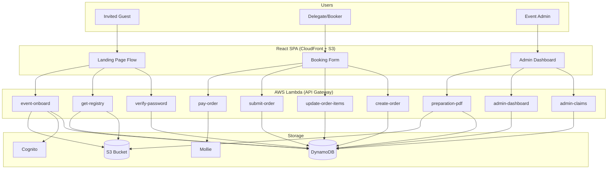
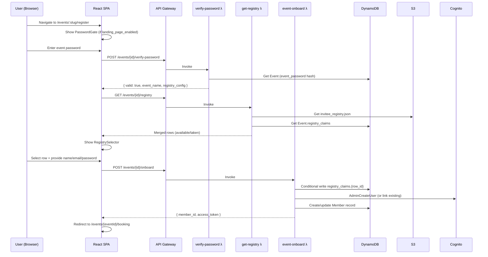
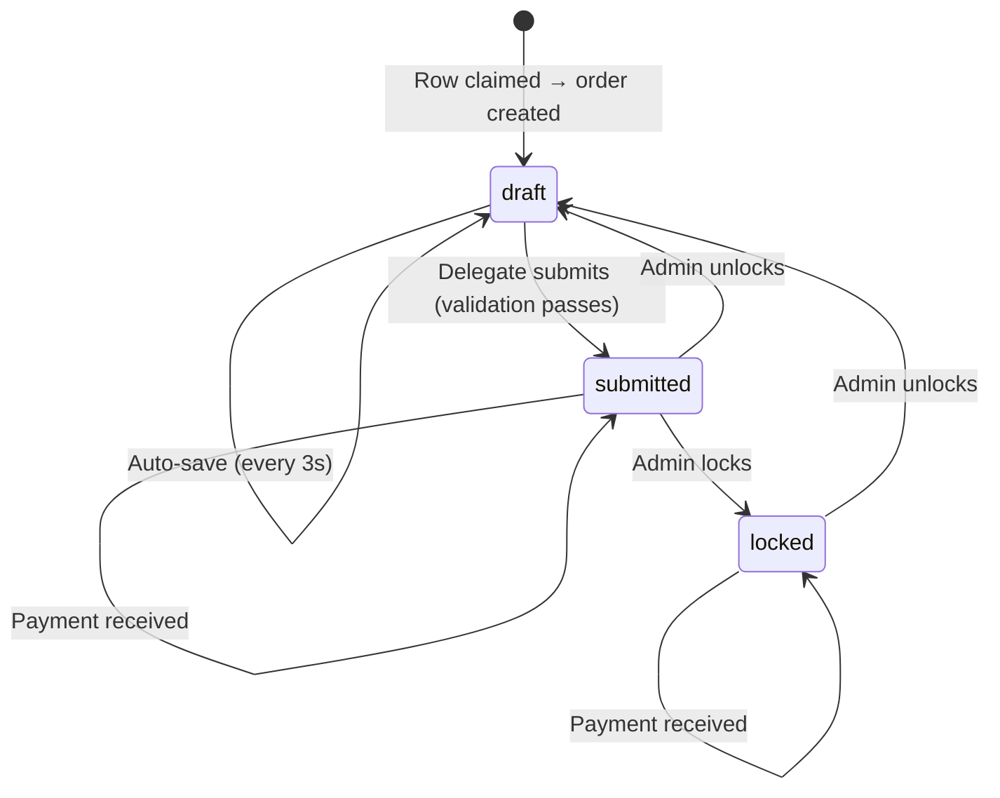

# Design Document: Closed Community Booking

## Overview

This design document specifies the technical architecture for the Closed Community Event Booking module — a generic, registry-driven booking system for invitation-only events. The module extends the existing H-DCN portal with a password-gated landing flow, an invitee registry with atomic row claims, account creation/linking, and a per-person booking form with dual quantity limits.

The system reuses existing infrastructure (Orders, Products, Payments, Cognito, DynamoDB) and follows established patterns (one Lambda per endpoint, shared auth layer, Chakra UI components, Formik validation). New functionality is additive — no breaking changes to existing tables or handlers.

**Key design decisions:**

- Registry data split: static rows in S3 (admin-uploaded), runtime claims in DynamoDB (on Event record)
- Atomic claims via DynamoDB conditional writes — no separate Claims table needed for ≤200 rows
- Onboard endpoint combines claim + Cognito user creation + Member record in a single atomic-ish operation with rollback
- Payment via Mollie (existing integration), decoupled from submission
- PDF generation client-side via jsPDF (existing pattern)

---

## Architecture

### System Context Diagram



### Landing Page Flow (Sequence)



### Order Lifecycle



---

## Components and Interfaces

### Backend Components (New Lambda Handlers)

#### 1. `verify_event_password` — POST /events/{event_id}/verify-password

**Public endpoint** (no auth required). Rate-limited at API Gateway level.

```python
# handler/verify_event_password/app.py

from typing import TypedDict, NotRequired
import bcrypt

class VerifyPasswordRequest(TypedDict):
    password: str

class VerifyPasswordResponse(TypedDict):
    valid: bool
    event_name: NotRequired[str]
    registry_config: NotRequired[dict]
    session_token: NotRequired[str]  # Short-lived token for onboard step

def lambda_handler(event, context):
    """
    1. Parse event_id from path, password from body
    2. Truncate password to 72 bytes (bcrypt limit)
    3. Get Event record from DynamoDB
    4. If event not found or no event_password → generic error (no info leak)
    5. bcrypt.checkpw(password, stored_hash)
    6. If valid: return event metadata + short-lived session_token (JWT, 15min TTL)
    7. If invalid: return { valid: false }
    """
```

**Rate limiting:** API Gateway usage plan — 10 requests/IP/minute via `x-forwarded-for` throttling.

**Session token:** A short-lived JWT (15min TTL) signed with a per-event secret, containing `{ event_id, verified_at }`. Used by the onboard endpoint to prevent direct API abuse.

---

#### 2. `get_event_registry` — GET /events/{event_id}/registry

**Public endpoint** (requires valid session token from verify step OR authenticated user with event access).

```python
# handler/get_event_registry/app.py

from typing import TypedDict

class RegistryRow(TypedDict):
    row_id: str
    label: str
    available: bool
    logo_url: str | None
    claimed_contact: str | None  # Masked email: "ha***@domain.de"
    allowed_emails: list[str]    # Only included in email_restricted mode

class RegistryResponse(TypedDict):
    rows: list[RegistryRow]
    row_label: str
    claim_mode: str

def lambda_handler(event, context):
    """
    1. Validate session token OR authenticated user access
    2. Get Event record → registry_config.s3_path + registry_claims
    3. Fetch S3 JSON (invitee_registry.json)
    4. Merge: for each row in S3, check if row_id exists in registry_claims
    5. Mask claimant emails (first 2 chars + *** + @domain)
    6. Sort rows alphabetically by label
    7. Return merged list
    """
```

**Email masking algorithm:**

```python
def mask_email(email: str) -> str:
    local, domain = email.split('@')
    return f"{local[:2]}***@{domain}"
```

---

#### 3. `event_onboard` — POST /events/{event_id}/onboard

**Requires valid session token** (from verify-password step).

```python
# handler/event_onboard/app.py

from typing import TypedDict, NotRequired

class OnboardRequest(TypedDict):
    row_id: str
    email: str
    name: str
    password: NotRequired[str]  # Only for new users
    session_token: str

class OnboardResponse(TypedDict):
    member_id: str
    message: str
    is_new_user: bool

def lambda_handler(event, context):
    """
    Atomic onboarding flow:
    1. Validate session_token (JWT, event_id match, not expired)
    2. Fetch Event record + registry_config
    3. If claim_mode == 'email_restricted':
       - Fetch S3 registry → get row's allowed_emails
       - Verify email (case-insensitive) is in allowed_emails
       - If not: return 403
    4. Check user doesn't already hold another claim for this event
       - Scan registry_claims for member with this email → if found: 409
    5. Atomic claim via conditional write:
       events_table.update_item(
           Key={'event_id': event_id},
           UpdateExpression='SET registry_claims.#row = :claim',
           ConditionExpression='attribute_not_exists(registry_claims.#row)',
           ExpressionAttributeNames={'#row': row_id},
           ExpressionAttributeValues={':claim': {
               'member_id': member_id,
               'email': email,
               'name': name,
               'claimed_at': iso_now
           }}
       )
       - If ConditionalCheckFailedException: return 409 with masked contact
    6. Create or link Cognito user:
       - Check if user exists (AdminGetUser by email)
       - If new: AdminCreateUser + AdminSetUserPassword (CONFIRMED state)
       - If exists: skip Cognito creation
    7. Create or update Member record:
       - If new: create with member_type=event_id, club_id=row_id,
         allowed_events=[event_id], email, name
       - If exists: append event_id to allowed_events (if not present)
    8. Add to event_participant Cognito group
    9. Check pending delegate invitations (orders with pending_secondary_email matching this email)
       - If found: link as secondary delegate
    10. Return success with member_id

    ROLLBACK on failure:
    - If Cognito creation succeeds but Member fails:
      → AdminDeleteUser → release claim → return 500
    - If claim succeeds but Cognito fails:
      → release claim → return 500
    """
```

---

#### 4. `admin_event_claims` — GET/DELETE/POST /admin/events/{event_id}/claims[/{row_id}]

**Requires admin role** (Products_CRUD or Regio_All).

```python
# handler/admin_event_claims/app.py

def lambda_handler(event, context):
    """
    Routes based on httpMethod + path:

    GET /admin/events/{id}/claims
      → Return all claims from registry_claims with full details
      → Merge with S3 registry for row labels
      → Paginate at 50 per page (query param: page)

    DELETE /admin/events/{id}/claims/{row_id}
      → Remove claim from registry_claims map
      → Does NOT delete associated order

    POST /admin/events/{id}/claims/{row_id}
      → Body: { email: str }
      → Verify row not already claimed (409 if so)
      → Look up member by email
      → Write claim to registry_claims
      → Create draft order for this row (call create_order logic)
    """
```

---

#### 5. `admin_event_dashboard` — GET /admin/events/{event_id}/dashboard

```python
# handler/admin_event_dashboard/app.py

from typing import TypedDict
from decimal import Decimal

class DashboardResponse(TypedDict):
    total_rows: int
    claimed_rows: int
    unclaimed_rows: int
    registration_pct: int  # 0-100
    orders_by_status: dict[str, int]  # {draft: N, submitted: N, locked: N}
    orders_by_payment: dict[str, int]  # {unpaid: N, partial: N, paid: N}
    revenue_collected: Decimal
    revenue_expected: Decimal
    product_capacity: list[dict]  # [{product_name, sold_count, max_per_event}]

def lambda_handler(event, context):
    """
    1. Auth check (admin)
    2. Get Event record → registry_claims (count claimed)
    3. Get S3 registry → total rows
    4. Scan Orders for this event_id → aggregate by status, payment_status
    5. Aggregate product sold counts across all orders
    6. Return dashboard data
    """
```

---

#### 6. `generate_preparation_pdf` — GET /admin/events/{event_id}/preparation-pdf

```python
# handler/generate_preparation_pdf/app.py

def lambda_handler(event, context):
    """
    Query params: mode=by_order|by_guest, product_filter=product_id (optional)

    1. Auth check (admin)
    2. Scan orders for event_id where status in ('submitted', 'locked')
    3. If no orders: return 200 with message (no PDF)
    4. Fetch S3 registry for logos/labels
    5. Build PDF pages:
       - by_order: one page per order (club), sorted alphabetically by club name
       - by_guest: one page per person, sorted by last word in name
    6. If product_filter: include only matching product lines
    7. Footer: event name, ISO date, page X of Y
    8. Return PDF as binary (Content-Type: application/pdf)
    """
```

---

#### 7. `get_product_sold_counts` — GET /products/sold-counts?event_id={id}

Extension to existing products infrastructure. Returns aggregate sold counts per product for effective limit calculation.

```python
# handler/get_product_sold_counts/app.py

def lambda_handler(event, context):
    """
    1. Auth check (event_participant or hdcnLeden or admin)
    2. Get event_id from query params
    3. Scan Orders for event_id (status != 'cancelled')
    4. Aggregate: for each product_id, count total items across all orders
    5. Return { product_id: sold_count } map
    """
```

---

### Backend Changes to Existing Handlers

| Handler              | Change                                                               | Purpose      |
| -------------------- | -------------------------------------------------------------------- | ------------ |
| `submit_order`       | Add `item_fields_data.name` validation, `max_per_event` check        | Req 9.2, 9.5 |
| `create_order`       | Validate `club_id` required for event orders                         | Req 18.3     |
| `update_order_items` | Accept `persons` array structure, sync `item_fields_data.name`       | Req 6.4      |
| `get_products`       | Add `sold_count_event` field in response when `event_id` is provided | Req 7.8      |

---

### Frontend Components

#### New Components

| Component            | Location                                             | Purpose                                  |
| -------------------- | ---------------------------------------------------- | ---------------------------------------- |
| `PasswordGate`       | `modules/presmeet/components/PasswordGate.tsx`       | Event password input + verification      |
| `RegistrySelector`   | `modules/presmeet/components/RegistrySelector.tsx`   | Row selection with availability display  |
| `RowCard`            | `modules/presmeet/components/RowCard.tsx`            | Individual registry row display          |
| `AccessDeniedScreen` | `modules/presmeet/components/AccessDeniedScreen.tsx` | No-access redirect to registration       |
| `ClaimAction`        | `modules/presmeet/components/ClaimAction.tsx`        | Onboard API call + account creation form |

#### Extended Components

| Component           | Changes                                                                |
| ------------------- | ---------------------------------------------------------------------- |
| `EventRegisterPage` | Add step machine: PasswordGate → Auth → RegistrySelector → ClaimAction |
| `EventBookingPage`  | Add access check → AccessDeniedScreen if no event access               |
| `BookingWizard`     | Add effective limit display per product (using sold counts)            |
| `PersonCard`        | Enforce max persons = highest max_per_club across products             |
| `EffectiveLimits`   | Fetch and display dual limits (per-order + per-event)                  |
| `SubmitPanel`       | Show per-person validation errors grouped by person                    |
| `DelegateManager`   | Add pending invitation state, email invite flow                        |
| `BookingSummaryPdf` | Add validation status, disclaimer footer                               |
| `ReadOnlyView`      | Handle submitted + locked states with disabled fields                  |

#### Frontend State Machine (Registration Flow)

```typescript
type RegistrationStep =
  | "password_gate" // Enter event password
  | "auth" // Sign up or sign in
  | "registry_select" // Choose a row
  | "claiming" // Onboard API in progress
  | "success"; // Redirect to booking

interface RegistrationState {
  step: RegistrationStep;
  eventId: string;
  sessionToken: string | null; // From verify-password
  registryConfig: RegistryConfig | null;
  selectedRow: string | null;
  error: string | null;
}
```

---

## Data Models

### Event Record (DynamoDB — Extended Fields)

```typescript
interface EventRecord {
  // Existing fields
  event_id: string;
  name: string;
  event_type: string;
  status: "draft" | "open" | "closed" | "archived";
  start_date: string;
  end_date: string;
  // ... other existing fields

  // New fields for closed community booking
  event_password: string | null; // bcrypt hash, null = no password gate
  landing_page_enabled: boolean; // Whether landing page flow is active
  slug: string; // URL-friendly identifier for routes
  registry_config: RegistryConfig; // Registry rules
  registry_claims: Record<string, Claim>; // Runtime claim state
}

interface RegistryConfig {
  s3_path: string; // S3 key for invitee_registry.json
  row_label: string; // "club", "team", "deelnemer"
  claim_mode: "first_come_first_served" | "email_restricted";
  max_delegates_per_row: number; // Typically 1-2
  allow_logo_upload: boolean;
}

interface Claim {
  member_id: string;
  email: string;
  name: string;
  claimed_at: string; // ISO 8601
}
```

### Invitee Registry (S3 JSON — Static)

```typescript
interface InviteeRegistry {
  version: string; // "1.0"
  updated_at: string; // ISO 8601
  rows: RegistryRow[];
}

interface RegistryRow {
  row_id: string; // Unique ID, used as club_id on orders
  label: string; // Display name
  allowed_emails: string[]; // If non-empty: email_restricted mode
  max_delegates: number; // Per-row override (fallback: registry_config)
  logo_url: string | null; // Optional logo
  metadata: Record<string, unknown>; // Flexible key-value
}
```

### Order Record (DynamoDB — Existing, No Schema Changes)

```typescript
interface OrderRecord {
  order_id: string;
  source_id: string; // = event_id
  event_id: string;
  club_id: string; // = row_id from registry
  member_id: string; // Primary delegate's member_id
  status: "draft" | "submitted" | "locked" | "cancelled";
  payment_status: "unpaid" | "partial" | "paid";
  total_amount: number; // Decimal stored as Number
  total_paid: number;
  items: OrderItem[];
  delegates: {
    primary: string; // Email
    secondary: string | null; // Email
    primary_member_id: string;
    secondary_member_id: string | null;
    pending_secondary_email: string | null;
  };
  version: number; // Optimistic locking
  created_at: string;
  updated_at: string;
  submitted_at: string | null;
}

interface OrderItem {
  product_id: string;
  variant_id: string | null;
  item_fields_data: Record<string, any>; // Always includes 'name' key
  unit_price: number;
  line_total: number;
}
```

### Member Record (DynamoDB — Existing Fields Used)

```typescript
interface MemberRecord {
  member_id: string;
  email: string;
  name: string;
  member_type: string; // event_id for event-only members, preserved for existing
  club_id: string; // = row_id from registry
  allowed_events: string[]; // List of event_ids this member can access
  // ... other existing fields preserved
}
```

### Product Record (DynamoDB — Existing, Relevant Fields)

```typescript
interface ProductRecord {
  product_id: string;
  name: string;
  event_id: string | null;
  event_type: string;
  price: number; // DynamoDB Number (Decimal)
  active: boolean;
  is_parent: boolean;
  order_item_fields: OrderItemField[];
  variant_schema: VariantAxis[] | null;
  purchase_rules: {
    max_per_club?: number; // Per-order limit
    max_per_event?: number; // Global event capacity
    min_per_club?: number;
  };
}
```

---

## Correctness Properties

_A property is a characteristic or behavior that should hold true across all valid executions of a system — essentially, a formal statement about what the system should do. Properties serve as the bridge between human-readable specifications and machine-verifiable correctness guarantees._

### Property 1: Password Verification Correctness

_For any_ password string and bcrypt hash pair, the verify function SHALL return true if and only if the password (truncated to 72 bytes) matches the hash. Furthermore, _for any_ two passwords that differ only after byte 72, verification against the same hash SHALL produce identical results. _For any_ failed verification (wrong password OR non-existent event), the error response structure SHALL be identical (no information leakage).

**Validates: Requirements 1.1, 1.2**

### Property 2: Registry Merge and Sort

_For any_ S3 invitee registry (list of rows) and _any_ DynamoDB registry_claims map, the merge function SHALL produce an output list that: (a) contains exactly one entry per row in the S3 registry, (b) marks each row as available or taken based on presence in registry_claims, (c) is sorted alphabetically case-insensitive by label, and (d) includes masked contact emails for claimed rows.

**Validates: Requirements 2.1, 2.3**

### Property 3: Email Masking

_For any_ valid email address (containing exactly one '@'), the mask function SHALL produce a string matching the pattern `XX***@domain` where XX are the first 2 characters of the local part and domain is the complete domain part. The output SHALL never expose the full local part.

**Validates: Requirements 2.3, 16.2**

### Property 4: Case-Insensitive Email Matching

_For any_ email address and _any_ list of allowed_emails, the matching function SHALL return true if and only if the email (compared case-insensitively) appears in the allowed_emails list. This applies to both email_restricted claim mode validation and pending delegate auto-linking.

**Validates: Requirements 2.5, 3.3, 3.4, 5.4**

### Property 5: Atomic Row Claim with Data Integrity

_For any_ event with registry_claims and _any_ unclaimed row_id, a claim attempt SHALL either: (a) succeed and store a complete claim object containing member_id, email, name, and claimed_at (ISO 8601) in registry_claims[row_id], or (b) fail with HTTP 409 if the row was concurrently claimed. _For any_ claimed row_id, a subsequent claim attempt SHALL always fail with 409 and include a masked contact email.

**Validates: Requirements 3.1, 3.2, 3.5, 16.3**

### Property 6: One Claim Per User Per Event

_For any_ event and _any_ user who already holds a claim on one row, attempting to claim a different row in the same event SHALL be rejected with HTTP 409. The existing claim SHALL remain unmodified.

**Validates: Requirements 3.6**

### Property 7: Member Record Creation on Onboard (New User)

_For any_ valid onboard request for a new user, the created Member record SHALL have: member_type equal to the event_id, club_id equal to the row_id, allowed_events containing exactly the event_id, email matching the input email, and name matching the input name.

**Validates: Requirements 4.2**

### Property 8: Existing Member Event Access Append

_For any_ existing member record with arbitrary field values, onboarding for a new event SHALL: (a) append the event_id to allowed_events if not already present, and (b) leave all other fields (member_type, club_id, name, email, and any other attributes) completely unchanged.

**Validates: Requirements 4.4**

### Property 9: Delegate Invitation Limit Enforcement

_For any_ order with a given number of current delegates (primary + secondary) and _any_ registry_config.max_delegates_per_row value, a delegate invitation SHALL be accepted if and only if the current delegate count is strictly less than max_delegates_per_row. Self-invitation (email equals primary delegate email) SHALL always be rejected regardless of limit.

**Validates: Requirements 5.1, 5.2**

### Property 10: Pending Delegate Email Normalization

_For any_ email address provided as a secondary delegate invitation, the stored pending_secondary_email SHALL equal the input lowercased. _For any_ pending_secondary_email on an order and _any_ onboarding email that matches case-insensitively, the auto-link SHALL trigger.

**Validates: Requirements 5.3, 5.4**

### Property 11: Optimistic Locking

_For any_ order with version V, a save request specifying version V SHALL succeed (and increment to V+1), while a save request specifying any version ≠ V SHALL be rejected with a version conflict error.

**Validates: Requirements 5.5, 5.6, 8.3**

### Property 12: Maximum Persons Derived from Products

_For any_ set of event-linked products with varying max_per_club values, the maximum number of persons allowed on an order SHALL equal the highest max_per_club value across all products, with a minimum of 1.

**Validates: Requirements 6.1**

### Property 13: Person Name Validation

_For any_ string, the person name validation function SHALL: accept strings with at least 1 non-whitespace character and at most 100 characters after trimming; reject the empty string, whitespace-only strings, and strings exceeding 100 trimmed characters.

**Validates: Requirements 6.2, 9.1**

### Property 14: Person Name Sync to Product Lines

_For any_ order with persons and product lines, when a person's name is updated to a new value, every product line associated with that person SHALL have its item_fields_data.name updated to the new value. Product lines for other persons SHALL remain unchanged.

**Validates: Requirements 6.4**

### Property 15: Person Removal Cascades to Product Lines

_For any_ order with N persons and their associated product lines, removing person at index I SHALL: (a) remove all product lines where the person index matches I, (b) leave all product lines for other persons intact, and (c) result in exactly (N-1) persons remaining.

**Validates: Requirements 6.5**

### Property 16: Effective Limit Calculation

_For any_ product with max_per_club, optional max_per_event, current order quantity, and sold count: the effective limit SHALL equal min(max_per_club - order_qty, max_per_event - sold_count) when max_per_event is defined, or (max_per_club - order_qty) when max_per_event is absent. The product selection control SHALL be disabled when effective_limit ≤ 0.

**Validates: Requirements 7.2, 7.3, 7.4, 7.5**

### Property 17: Draft Save Accepts Invalid Data

_For any_ order data (including missing names, empty fields, zero quantities, invalid variant selections), saving in draft status SHALL succeed without returning validation errors. The data SHALL be stored as-is.

**Validates: Requirements 8.2**

### Property 18: Submit Validation — Required Fields

_For any_ order with products that define required order_item_fields, submission SHALL be rejected if any product line is missing a required field value. The error response SHALL identify the specific person index, product_id, and field name for each violation.

**Validates: Requirements 9.2, 9.3, 9.8**

### Property 19: Submit Validation — Quantity Limits

_For any_ order, submission SHALL be rejected if: (a) the total quantity of any product across all persons exceeds that product's max_per_club, or (b) the total quantity plus the current sold_count exceeds max_per_event. The error SHALL identify the affected product and current remaining capacity.

**Validates: Requirements 9.4, 9.5, 9.9**

### Property 20: Submit Validation — Variant Validity

_For any_ order containing product lines with variant selections, submission SHALL be rejected if any variant_id does not exist in the corresponding product's variant list. The error SHALL identify the person and product with the invalid variant.

**Validates: Requirements 9.6**

### Property 21: Order Status Transition Guard

_For any_ order not in 'submitted' status, an admin lock action SHALL be rejected. _For any_ order in 'submitted' or 'locked' status, an admin unlock action SHALL transition it to 'draft'.

**Validates: Requirements 10.1, 10.3, 10.4**

### Property 22: PDF Output Completeness

_For any_ non-empty order (at least one person), the generated PDF SHALL contain: event name, row label, delegate name(s), all person names, all product names with variants and fields, order status, total amount, payment status, and a disclaimer string containing the generation date formatted as locale date-time.

**Validates: Requirements 12.2, 12.4**

### Property 23: Preparation PDF Sorting

_For any_ list of orders/persons, the preparation PDF pages SHALL be sorted: in by-order mode, case-insensitive alphabetical by club name with secondary sort by delegate name; in by-guest mode, case-insensitive alphabetical by last word of person name with secondary sort by first name.

**Validates: Requirements 15.5**

### Property 24: Event Access Control

_For any_ (member, order) pair and API request, access SHALL be granted if and only if: (a) the event_id is present in the member's allowed_events list, AND (b) the member is listed as either primary_member_id or secondary_member_id on the order. All other combinations SHALL receive HTTP 403.

**Validates: Requirements 16.5, 16.7**

### Property 25: Order Deduplication

_For any_ (club_id, event_id) pair, calling create_order SHALL: return the existing non-cancelled order with HTTP 200 if one exists, or create a new order with HTTP 201 if none exists. After any number of create_order calls for the same pair, exactly one non-cancelled order SHALL exist.

**Validates: Requirements 18.1, 18.2, 18.4**

---

## Error Handling

### Backend Error Strategy

| Scenario                     | HTTP Status | Response                                                         | Recovery                  |
| ---------------------------- | ----------- | ---------------------------------------------------------------- | ------------------------- |
| Invalid/wrong event password | 400         | `{ valid: false }`                                               | User retries              |
| Rate limit exceeded          | 429         | `{ error: "rate_limit_exceeded" }`                               | Wait and retry            |
| Row already claimed          | 409         | `{ error: "row_already_claimed", claimed_contact: "ha***@..." }` | Select another row        |
| User already has claim       | 409         | `{ error: "already_claimed_another_row" }`                       | Go to existing booking    |
| Email not authorized         | 403         | `{ error: "email_not_allowed" }`                                 | Contact admin             |
| Event access denied          | 403         | `{ error: "event_access_denied" }`                               | Register via landing page |
| Version conflict (save)      | 409         | `{ error: "version_conflict", current_version: N }`              | Reload and retry          |
| Submit validation failure    | 422         | `{ errors: [...] }`                                              | Fix errors and resubmit   |
| Per-event capacity exceeded  | 422         | `{ error: "capacity_exceeded", remaining: {...} }`               | Reduce quantities         |
| S3 registry unavailable      | 503         | `{ error: "registry_unavailable" }`                              | Retry                     |
| Onboard rollback failure     | 500         | `{ error: "onboard_failed" }`                                    | Retry entire flow         |
| Mollie payment error         | 502         | `{ error: "payment_initiation_failed" }`                         | Retry payment             |

### Rollback Strategy (Onboard Endpoint)

The onboard endpoint performs 3 operations that must be treated atomically:

1. Claim row (DynamoDB conditional write)
2. Create/link Cognito user
3. Create/update Member record

**Rollback sequence on failure:**

```
Success path: Claim → Cognito → Member → Return 201
Failure at Cognito: Release claim → Return 500
Failure at Member: Delete Cognito user → Release claim → Return 500
```

### Frontend Error Handling

| Component        | Error Type           | UX                                                         |
| ---------------- | -------------------- | ---------------------------------------------------------- |
| PasswordGate     | Wrong password       | Shake animation + localized error, clear input             |
| PasswordGate     | Rate limited         | Disable button + countdown timer                           |
| RegistrySelector | S3 unavailable       | Banner with retry button                                   |
| RegistrySelector | Claim 409            | Toast + refresh row list                                   |
| ClaimAction      | Email not authorized | Alert with explanation                                     |
| BookingForm      | Auto-save failure    | Yellow "save failed" indicator, retry on next edit         |
| BookingForm      | Version conflict     | Modal: "Order updated by another delegate" + reload button |
| SubmitPanel      | Validation errors    | Per-person error cards, scroll to first error              |
| PaymentPanel     | Mollie error         | Error banner, order preserved in current status            |

---

## Testing Strategy

### Dual Testing Approach

This feature uses both **unit tests** (specific examples and edge cases) and **property-based tests** (universal properties across random inputs). The combination provides comprehensive coverage: property tests catch edge cases that example-based tests miss, while example tests verify specific integration scenarios.

### Backend Testing (Python — Hypothesis)

**Property-based tests** (minimum 100 iterations each):

- `tests/unit/test_event_onboard_properties.py` — Properties 4, 5, 6, 7, 8
- `tests/unit/test_booking_validation_properties.py` — Properties 13, 16, 17, 18, 19, 20
- `tests/unit/test_registry_properties.py` — Properties 1, 2, 3
- `tests/unit/test_order_deduplication_properties.py` — Property 25

**Unit tests** (example-based):

- `tests/unit/test_verify_event_password.py` — Happy path, rate limiting config
- `tests/unit/test_event_onboard.py` — Full onboard flow, rollback scenarios
- `tests/unit/test_admin_event_claims.py` — CRUD operations
- `tests/unit/test_admin_event_dashboard.py` — Aggregation correctness

**Integration tests:**

- Payment flow (Mollie webhook mock)
- Cognito user creation/linking
- S3 registry loading

### Frontend Testing (TypeScript — fast-check)

**Property-based tests** (minimum 100 iterations each):

- `__tests__/effectiveLimits.property.test.ts` — Property 16
- `__tests__/personManagement.property.test.ts` — Properties 12, 14, 15
- `__tests__/registryMerge.property.test.ts` — Property 2
- `__tests__/optimisticLocking.property.test.ts` — Property 11
- `__tests__/pdfGeneration.property.test.ts` — Properties 22, 23
- `__tests__/accessControl.property.test.ts` — Property 24

**Unit tests** (example-based):

- Component rendering tests (PasswordGate, RegistrySelector, AccessDeniedScreen)
- State machine transitions (registration flow steps)
- Auto-save timing behavior
- Translation key completeness (smoke test)

### Property Test Configuration

- **Backend**: Hypothesis with `@settings(max_examples=100)` per test
- **Frontend**: fast-check with `fc.assert(property, { numRuns: 100 })` per test
- **Tag format**: `Feature: closed-community-booking, Property {N}: {title}`

### Test Commands

```bash
# Backend property tests
cd backend
pytest tests/unit/test_event_onboard_properties.py -v
pytest tests/unit/test_booking_validation_properties.py -v
pytest tests/unit/test_registry_properties.py -v

# Frontend property tests
cd frontend
npx react-scripts test --watchAll=false --testPathPattern="effectiveLimits.property"
npx react-scripts test --watchAll=false --testPathPattern="personManagement.property"
npx react-scripts test --watchAll=false --testPathPattern="registryMerge.property"
```

### Smoke Tests

- Translation completeness: script verifying all `eventBooking` keys exist in 8 locale files
- SAM template: verify rate limiting configured on verify-password endpoint
- Event Field Registry: verify new fields are registered
