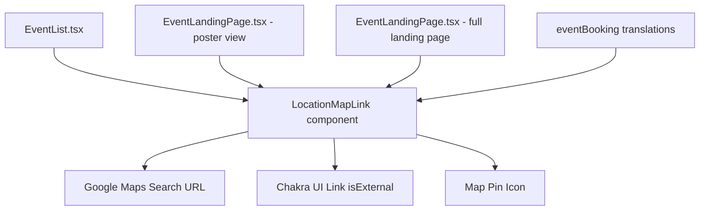

# Design Document: Event Location Maps Link

## Overview

This feature makes the event location text clickable across all views, opening a Google Maps search in a new browser tab. It is a purely frontend change that introduces a reusable `LocationMapLink` component wrapping Chakra UI's `Link` with `isExternal`. The component constructs a Google Maps search URL from the existing `location` string field, adds a map pin icon, and handles empty/whitespace-only values by rendering nothing.

No backend changes, no new dependencies, no API keys, and no database schema changes are required. The implementation follows the existing external link pattern established in `MyOrders.tsx` (Chakra `Link` + `isExternal`).

## Architecture

The design follows a simple component extraction pattern:



**Key architectural decisions:**

1. **Single reusable component** rather than inline link logic in each view — avoids duplication of URL construction, empty-value checks, and accessibility attributes.
2. **No utility function for URL building** — the URL construction is a single `encodeURIComponent` call, trivial enough to live inside the component.
3. **Event propagation stoppage** handled inside the component via `onClick={e => e.stopPropagation()}` — keeps consuming components clean.

## Components and Interfaces

### LocationMapLink

A new shared component at `frontend/src/modules/events/components/LocationMapLink.tsx`.

```typescript
interface LocationMapLinkProps {
  /** The raw location string from the event record */
  location: string | null | undefined;
  /** Text style props to pass through (fontSize, color, maxW, isTruncated, etc.) */
  fontSize?: string;
  color?: string;
  maxW?: string;
  isTruncated?: boolean;
}
```

**Behavior:**

- If `location` is null, undefined, empty string, or whitespace-only → renders `null`
- Otherwise → renders a Chakra `Link` with:
  - `href` = `https://www.google.com/maps/search/?api=1&query=${encodeURIComponent(location.trim())}`
  - `isExternal` (applies `target="_blank"` and `rel="noopener noreferrer"`)
  - `aria-label` from translation key `eventBooking:location.openInMaps` with interpolation of location value
  - `onClick={e => e.stopPropagation()}` to prevent parent click handlers (table row)
  - A map pin icon (`FiMapPin` from `react-icons/fi` is NOT used — instead we use Chakra's built-in `ExternalLinkIcon` replaced by a simple inline SVG or Chakra Icon) — actually, since no extra deps are allowed, we use `Icon` from Chakra with a custom path for a map pin, OR simpler: a small `📍` emoji or the existing `ExternalLinkIcon`.

**Revised icon approach** (no new dependencies): Use Chakra UI's `Icon` component with a custom SVG viewBox for a map pin. This avoids adding `react-icons` as a dependency.

```typescript
import { Icon } from '@chakra-ui/react';

const MapPinIcon = (props: any) => (
  <Icon viewBox="0 0 24 24" {...props}>
    <path
      fill="currentColor"
      d="M12 2C8.13 2 5 5.13 5 9c0 5.25 7 13 7 13s7-7.75 7-13c0-3.87-3.13-7-7-7zm0 9.5c-1.38 0-2.5-1.12-2.5-2.5s1.12-2.5 2.5-2.5 2.5 1.12 2.5 2.5-1.12 2.5-2.5 2.5z"
    />
  </Icon>
);
```

### Integration Points

| View                           | Current code                                                     | New code                                                                                                    |
| ------------------------------ | ---------------------------------------------------------------- | ----------------------------------------------------------------------------------------------------------- |
| EventList (table cell)         | `<Text isTruncated maxW="120px">{event.location \|\| ''}</Text>` | `<LocationMapLink location={event.location} isTruncated maxW="120px" fontSize="inherit" color="inherit" />` |
| EventLandingPage (poster view) | `<Text color="gray.300" fontSize="sm">{event.location}</Text>`   | `<LocationMapLink location={event.location} color="gray.300" fontSize="sm" />`                              |
| EventLandingPage (full hero)   | `<Text>{event.location}</Text>`                                  | `<LocationMapLink location={event.location} color="inherit" fontSize="inherit" />`                          |

### URL Construction

```typescript
const buildMapsUrl = (location: string): string =>
  `https://www.google.com/maps/search/?api=1&query=${encodeURIComponent(location.trim())}`;
```

This uses the official [Google Maps URLs API](https://developers.google.com/maps/documentation/urls/get-started#search-action) — no API key required for search URLs.

## Data Models

No data model changes. The feature reads the existing `location` field from the Event record (string, max 300 chars, group: core). The field is already nullable/optional — the component handles all falsy cases.

**Existing field definition** (from `eventFields/fields/coreFields.ts`):

```typescript
location: {
  key: 'location',
  dataType: 'string',
  inputType: 'text',
  group: 'core',
  validation: [{ type: 'max_length', value: 300 }],
}
```

## Correctness Properties

_A property is a characteristic or behavior that should hold true across all valid executions of a system — essentially, a formal statement about what the system should do. Properties serve as the bridge between human-readable specifications and machine-verifiable correctness guarantees._

### Property 1: Maps URL round-trip preserves location

_For any_ non-empty, non-whitespace-only string (up to 300 characters, including Unicode, special characters, and URL-unsafe characters), constructing the Maps search URL with `encodeURIComponent` and then extracting and decoding the `query` parameter with `decodeURIComponent` SHALL produce the original trimmed string, AND the full URL SHALL be parseable by `new URL(...)` without throwing.

**Validates: Requirements 1.1, 1.2, 2.1, 3.4**

### Property 2: Invalid locations produce no output

_For any_ value that is null, undefined, an empty string, or a string composed entirely of whitespace characters, the `buildMapsUrl` function SHALL not be called and the component SHALL render nothing (null).

**Validates: Requirements 1.4, 2.2**

### Property 3: Click events do not propagate

_For any_ valid non-empty location string rendered as a LocationMapLink, when a click event is dispatched on the link element, `event.stopPropagation()` SHALL be called, preventing the event from reaching parent handlers.

**Validates: Requirements 3.1**

### Property 4: Aria-label contains the location text

_For any_ valid non-empty, non-whitespace-only location string, the rendered link's `aria-label` attribute SHALL contain the original location string value.

**Validates: Requirements 5.2**

## Error Handling

This feature has minimal error surface since it's a pure frontend link with no API calls:

| Scenario                                               | Handling                                                                   |
| ------------------------------------------------------ | -------------------------------------------------------------------------- |
| `location` is null/undefined/empty/" "                 | Component renders nothing (returns `null`)                                 |
| `location` contains characters that break URL encoding | `encodeURIComponent` handles all valid Unicode — no error possible         |
| Google Maps is unreachable                             | User's browser shows standard network error — no app-level handling needed |
| Click on link in table row                             | `e.stopPropagation()` prevents row navigation                              |

No try/catch blocks are needed. The component is pure and deterministic.

## Testing Strategy

### Unit Tests (example-based)

- Render `LocationMapLink` with a valid location → verify `<a>` element with correct href, target, rel attributes
- Render with `null` / `undefined` / `""` / `"   "` → verify nothing renders
- Render with special characters (`Café 't Centrum`) → verify correct percent-encoding in href
- Click on link → verify `stopPropagation` was called
- Verify `aria-label` contains the location text and translated description
- Verify map pin icon is present

### Property-Based Tests (fast-check)

The feature is suitable for property-based testing because:

- URL construction is a pure function with a large input space (any string up to 300 chars, any Unicode)
- The round-trip property (encode/decode) is a classic PBT pattern
- Whitespace detection must hold for ALL whitespace strings, not just known examples

**Library:** fast-check (already available in the frontend test environment)
**Minimum iterations:** 100 per property
**Tag format:** `Feature: event-location-maps-link, Property N: {property_text}`

Test file: `frontend/src/modules/events/components/__tests__/LocationMapLink.property.test.ts`

### Integration considerations

- Visual regression is out of scope (manual verification of icon + link styling)
- No backend integration tests needed (frontend-only feature)
- i18n: verify translation keys exist in all 8 locale files (can be a unit test scanning JSON files)
