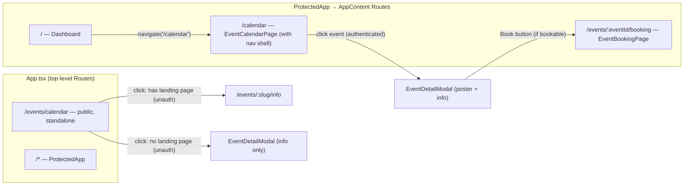

# Design Document: Events Calendar Card

## Overview

This feature consolidates the Dashboard's event display from N individual `EventBookingCard` components into a single static "Events / Calendar" `AppCard` that navigates to `/calendar`. The existing `EventCalendarPage` component is reused in both a public route (`/events/calendar`) and a protected route (`/calendar`). Clicking an event card opens a detail modal — for authenticated users with a "Book" CTA when the event is bookable; for unauthenticated users, events with a landing page go directly to the landing page instead.

**Scope**: Modifications to App.tsx (add protected route), Dashboard.tsx (card path), EventCalendarPage.tsx (click behavior + modal), plus a new `EventDetailModal` component.

## Architecture



### Key design decisions:

1. **Two routes, same component**: `/events/calendar` (public, standalone) and `/calendar` (inside `AppContent` with NavigationHeader). Same `EventCalendarPage` component rendered in both.

2. **Authenticated users always get the modal**: Clicking any event opens `EventDetailModal` with poster + event info. If the event has registration/deadline fields (`registration_open`, `registration_close`, or `payment_deadline`), the modal shows a "Book" CTA button. If the event only has core fields, it's informational — no CTA.

3. **Unauthenticated users get the landing page or info-only modal**:
   - **Event has landing page**: Opens the landing page at `/events/{slug}/info` in a new tab. The landing page has its own CTA (register button).
   - **Event has NO landing page** (poster-only): Opens `EventDetailModal` showing poster + event info (no CTA — they can't book without logging in).

## Components and Interfaces

### App.tsx — Changes

**Add** inside `AppContent` `<Routes>`:

```tsx
<Route path="/calendar" element={<EventCalendarPage />} />
```

The public `/events/calendar` route remains unchanged (standalone, no nav shell).

### Dashboard.tsx — Changes

**Change** the events calendar card navigation from `/events/calendar` to `/calendar`:

```tsx
onClick={() => navigate('/calendar')}
// path: '/calendar'
```

### EventCalendarPage.tsx — Changes

**Replace** the current `onClick` handler with branching logic:

```typescript
const [selectedEvent, setSelectedEvent] = useState<PublicEvent | null>(null);
const { isAuthenticated } = useAuth();

// Card onClick:
onClick={() => {
  if (!isAuthenticated && event.landing_page && Object.keys(event.landing_page).length > 0) {
    // Unauthenticated + event has a landing page — open it in new tab
    window.open(`/events/${event.slug}/info`, '_blank');
  } else {
    // Authenticated (always modal) OR unauthenticated poster-only (info modal)
    setSelectedEvent(event);
  }
}}

// Modal at bottom of component:
<EventDetailModal
  event={selectedEvent}
  isOpen={selectedEvent !== null}
  onClose={() => setSelectedEvent(null)}
/>
```

**Update `PublicEvent` interface** to include `landing_page` and registration fields:

```typescript
interface PublicEvent {
  event_id: string;
  name: string;
  slug: string;
  event_type: string;
  location: string;
  start_date: string;
  end_date: string;
  poster_url?: string;
  description?: string;
  linked_regio?: string;
  landing_page?: Record<string, any>;
  registration_open?: string;
  registration_close?: string;
  payment_deadline?: string;
}
```

### EventDetailModal.tsx — New Component

Location: `frontend/src/pages/EventDetailModal.tsx`

A Chakra UI `Modal` that displays event details for poster-only events (same style as EventLandingPage poster-view):

```typescript
interface EventDetailModalProps {
  event: PublicEvent | null;
  isOpen: boolean;
  onClose: () => void;
}
```

**Content:**

- Poster image (full-width within modal, `objectFit="contain"`)
- Event name (heading, orange)
- Description (if available, `whiteSpace="pre-wrap"`)
- Details grid: dates, location, type, region
- CTA button logic:
  - **Authenticated + bookable**: "Book" → `navigate('/events/${event.event_id}/booking')`
  - **Unauthenticated + bookable (no landing page)**: "Register" → `window.open('/events/${event.slug}/register', '_blank')`
  - **Not bookable** (no registration fields): No CTA shown

**Styling**: Dark theme modal (bg `gray.900`), orange accents, large size, centered.

### Backend: get_events_public — Changes

**Add** `registration_open`, `registration_close`, and `payment_deadline` to the `PUBLIC_FIELDS` whitelist in `backend/handler/get_events_public/app.py`. These are needed so the frontend can determine whether an event is bookable (has a booking flow) or informational only.

### No changes to:

- `AuthProvider.tsx`
- `AppCard.tsx`
- `EventLandingPage.tsx` (already has its own CTA logic)

## Data Models

**Backend change**: Add `registration_open`, `registration_close`, `payment_deadline` to `PUBLIC_FIELDS` in `get_events_public/app.py`.

**Updated `PublicEvent` interface** (frontend):

```typescript
interface PublicEvent {
  event_id: string;
  name: string;
  slug: string;
  event_type: string;
  location: string;
  start_date: string;
  end_date: string;
  poster_url?: string;
  description?: string;
  linked_regio?: string;
  landing_page?: Record<string, any>;
  registration_open?: string;
  registration_close?: string;
  payment_deadline?: string;
}
```

**Helper function** to determine if an event is bookable:

```typescript
function isBookable(event: PublicEvent): boolean {
  return !!(
    event.registration_open ||
    event.registration_close ||
    event.payment_deadline
  );
}
```

## Click Behavior Summary

| Event has...                  | User state      | Action                                                                                              |
| ----------------------------- | --------------- | --------------------------------------------------------------------------------------------------- |
| Any event                     | Authenticated   | Open `EventDetailModal` (poster + info). Show "Book" CTA → `/events/{event_id}/booking` if bookable |
| Landing page                  | Unauthenticated | `window.open('/events/{slug}/info', '_blank')` (landing page has its own CTA)                       |
| No landing page, bookable     | Unauthenticated | Open `EventDetailModal` (poster + info) + "Register" CTA → `/events/{slug}/register` (new tab)      |
| No landing page, not bookable | Unauthenticated | Open `EventDetailModal` (poster + info, no CTA)                                                     |

## Error Handling

| Scenario                              | Behavior                                               |
| ------------------------------------- | ------------------------------------------------------ |
| `/events-public` fetch fails          | Shows alert with error message + retry button          |
| Fetch timeout (>10s)                  | AbortController aborts, shows error + retry            |
| Modal opened for event without poster | Modal renders without image, shows text details only   |
| `useAuth()` outside AuthProvider      | Cannot happen — `AuthProvider` wraps entire `<Router>` |

## Testing Strategy

### Unit Tests

**EventCalendarPage.test.tsx**:

1. Authenticated: click any event opens modal (does not navigate away)
2. Unauthenticated + event has landing page: opens new tab to `/events/{slug}/info`
3. Unauthenticated + no landing page: opens modal
4. Modal shows poster, name, dates, location
5. Modal shows "Book" CTA when authenticated AND event is bookable
6. Modal shows "Register" CTA (new tab) when unauthenticated AND event is bookable (no landing page)
7. Modal has no CTA when event is not bookable (no registration fields)
8. "Book" button navigates to `/events/{event_id}/booking`
9. "Register" button opens `/events/{slug}/register` in new tab
10. Closing modal resets state
11. Fetch failure shows error + retry
12. Loading spinner shown while fetching

**Dashboard.test.tsx**:

1. Events calendar card navigates to `/calendar` (not `/events/calendar`)

### No property-based tests needed

Simple UI wiring — conditional branch + modal display. No data transformation.
