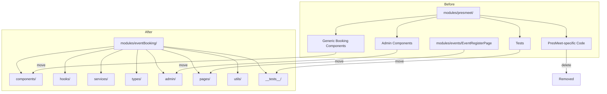

# Design Document: presmeet-to-event-booking-refactor

## Overview

This design covers a purely structural frontend refactor: extracting all generic event booking code from `modules/presmeet/` into a new `modules/eventBooking/` module, then deleting the entire presmeet module and its route. No behavior changes occur — the rendered output, API calls, and user flows remain identical.

The refactor is executed in 3 strict phases, each independently verifiable via `tsc --noEmit` and ESLint:

1. **Phase 1 — Isolate**: Create `eventBooking` module, move all generic files, update imports
2. **Phase 2 — Delete**: Remove entire `modules/presmeet/` directory
3. **Phase 3 — Disable routes**: Remove `/presmeet` route, update lazy imports to new paths

### Design Rationale

The presmeet module currently mixes PresMeet-specific code (the FH-DCE Presidents' Meeting domain types, legacy service endpoints, and the old `PresMeetPage`) with generic event booking infrastructure that applies to any closed-community event. Separating these gives:

- Clear ownership: `eventBooking` owns all reusable booking logic
- Dead code removal: PresMeet-specific types and legacy endpoints disappear
- Discoverability: new developers find booking code where they expect it
- Alignment with existing patterns (`members`, `products`, `webshop` modules)

## Architecture

The refactor does not introduce new architecture. It restructures existing files into a new module boundary while preserving all runtime behavior.



### Key Decisions

| Decision                                                    | Rationale                                                                                                                                 |
| ----------------------------------------------------------- | ----------------------------------------------------------------------------------------------------------------------------------------- |
| Use `smart_relocate` for moves                              | Auto-updates import paths across the codebase, reducing manual work                                                                       |
| Rename `presmeetApi.ts` → `eventBookingApi.ts`              | Remove all "presmeet" naming from the generic API client                                                                                  |
| Delete `presmeet.ts` types entirely                         | These are PresMeet-specific domain types (ProductType union, BookingFormData with delegates/guests/transfers, ClubRegistry) — not generic |
| Keep `presmeet.types.ts` content as `eventBooking.types.ts` | These are the v3 generic types (Order, Event, Product, Constraint, etc.)                                                                  |
| Move EventRegisterPage from `modules/events/`               | It's a booking flow page that imports PasswordGate, RegistrySelector, ClaimAction from the booking module                                 |
| Delete legacy `presmeetService` object                      | Uses old `/presmeet/*` endpoints superseded by unified `/booking` endpoints                                                               |
| Phase commits separately                                    | Enables per-phase review and rollback                                                                                                     |

## Components and Interfaces

### New Module Structure

```
frontend/src/modules/eventBooking/
├── components/
│   ├── AccessDeniedScreen.tsx
│   ├── BookingWizard.tsx
│   ├── BookingSummaryPdf.tsx
│   ├── ClaimAction.tsx
│   ├── ClubLogoUploader.tsx
│   ├── DelegateManager.tsx
│   ├── EffectiveLimits.tsx
│   ├── OnboardingFlow.tsx
│   ├── PasswordGate.tsx
│   ├── PaymentPanel.tsx
│   ├── PersonCard.tsx
│   ├── ProductConfigurator.tsx
│   ├── ReadOnlyView.tsx
│   ├── RegistrySelector.tsx
│   └── RowCard.tsx
├── hooks/
│   ├── useAutoSave.ts
│   └── useEffectiveLimits.ts
├── services/
│   └── eventBookingApi.ts
├── types/
│   └── eventBooking.types.ts
├── admin/
│   ├── AdminClaimsManagement.tsx
│   ├── AdminOrderLockUnlock.tsx
│   ├── AdminPaymentAndPdf.tsx
│   └── EventDashboard.tsx
├── pages/
│   ├── EventBookingPage.tsx
│   └── EventRegisterPage.tsx
├── utils/
│   ├── accessControl.ts
│   ├── cartBuilder.ts
│   ├── cartBuilder.test.ts
│   ├── orderTransformer.ts
│   ├── pdfGenerator.ts
│   ├── personManagement.ts
│   ├── priceCalculator.ts
│   ├── validation.ts
│   └── versionCheck.ts
└── __tests__/
    ├── accessControl.property.test.ts
    ├── bookingCalculations.property.test.ts
    ├── BookingWizard.test.tsx
    ├── cartBuilder.property.test.ts
    ├── clubSearch.property.test.ts
    ├── effectiveLimits.property.test.ts
    ├── OnboardingFlow.test.tsx
    ├── optimisticLocking.property.test.ts
    ├── orderTransformer.test.ts
    ├── pdfGeneration.property.test.ts
    ├── pdfGenerator.property.test.ts
    ├── personManagement.property.test.ts
    ├── priceCalculator.test.ts
    ├── validation.property.test.ts
    └── validation.test.ts
```

### Files Deleted (not moved)

These files are PresMeet-specific and have no consumers after EventBookingPage replaces PresMeetPage:

| File                                           | Reason for Deletion                                                                   |
| ---------------------------------------------- | ------------------------------------------------------------------------------------- |
| `PresMeetPage.tsx`                             | Superseded by EventBookingPage (URL-based event_id vs hardcoded)                      |
| `usePresMeetBooking.ts`                        | Legacy hook using old presmeet.ts types and presmeetService endpoints                 |
| `types/presmeet.ts`                            | PresMeet-specific domain types (ProductType, CartItem, BookingFormData, ClubRegistry) |
| `components/AdminDashboard.tsx`                | PresMeet-specific wrapper                                                             |
| `components/BookingForm.tsx`                   | Only used by PresMeetPage                                                             |
| `components/BookingOverview.tsx`               | Only used by PresMeetPage                                                             |
| `components/DelegateSection.tsx`               | PresMeet-specific UI wrapper                                                          |
| `components/EventInfoHeader.tsx`               | Only used by PresMeetPage                                                             |
| `components/GuestSection.tsx`                  | PresMeet-specific UI wrapper                                                          |
| `components/PaymentSection.tsx`                | Only used by PresMeetPage                                                             |
| `components/SaveStatusIndicator.tsx`           | Only used by PresMeetPage                                                             |
| `components/SubmitPanel.tsx`                   | Only used by PresMeetPage                                                             |
| `components/TransferSection.tsx`               | PresMeet-specific UI wrapper                                                          |
| `admin/AdminRouter.tsx`                        | Routing wrapper, replaced by WebshopManagementPage                                    |
| `admin/ReportView.tsx`                         | Only used via AdminRouter                                                             |
| `__tests__/AdminDashboard.test.tsx`            | Tests deleted component                                                               |
| `__tests__/BookingForm.test.tsx`               | Tests deleted component                                                               |
| `__tests__/BookingOverview.test.tsx`           | Tests deleted component                                                               |
| `__tests__/PresMeetPage.404.test.tsx`          | Tests deleted page                                                                    |
| `__tests__/PresMeetPage.preservation.test.tsx` | Tests deleted page                                                                    |
| `__tests__/PresMeetPage.test.tsx`              | Tests deleted page                                                                    |
| `components/__tests__/` (all 4 files)          | Move to `eventBooking/__tests__/` since they test moved components                    |

### Service Rename: `presmeetApi.ts` → `eventBookingApi.ts`

The renamed service retains:

- All v3 unified endpoint functions: `getOrder`, `saveOrder`, `submitOrder`, `pay`, `getEvent`, `getProducts`, `getReport`, `manageDelegates`, `resendDelegateInvitation`
- Error type guards: `isVersionConflict`, `isAuthorizationError`
- The Axios client with auth interceptor and structured error handling
- Export as `eventBookingApi` (renamed from `presmeetApi`)

The renamed service removes:

- The entire `presmeetService` legacy object (old `/presmeet/*` endpoints)
- Imports from `types/presmeet.ts` (the deleted PresMeet-specific types)

### Types Rename: `presmeet.types.ts` → `eventBooking.types.ts`

All types in `presmeet.types.ts` are generic booking types and move unchanged:

- `Order`, `OrderItem`, `Delegate`, `StatusHistoryEntry`
- `Event`, `Constraint`, `EventStatus`
- `Product`, `ProductVariant`, `OrderItemField`, `VariantAxis`, `PurchaseRules`
- `PaymentRecord`, `PaymentInitiationResponse`
- `SaveOrderRequest`, `SubmitOrderResponse`, `ValidationError`, `SubmitValidationErrorResponse`
- `ReportType`, `ReportFormat`, `ReportParams`, `ReportMetadata`, `ReportResponse`
- `VersionConflictError`, `AuthorizationError`, `PresMeetApiError` (rename to `EventBookingApiError`)
- Status types: `OrderStatus`, `PaymentStatus`, `CountingRule`, `PaymentProvider`, `MolliePaymentStatus`, `FieldType`

## Data Models

No data model changes. All TypeScript interfaces remain identical in shape — only their file location and import paths change. The `PresMeetApiError` type union will be renamed to `EventBookingApiError` for naming consistency.

DynamoDB tables, API endpoints, and backend handlers are completely untouched.

## Error Handling

No changes to error handling logic. The structured error parsing (`isVersionConflict`, `isAuthorizationError`, `parseApiError`) moves as-is to `eventBookingApi.ts`.

## Testing Strategy

### Why Property-Based Testing Does Not Apply

This refactor is a structural reorganization with zero logic changes. The acceptance criteria verify:

- File existence at new paths (smoke checks)
- Compilation passing (`tsc --noEmit`)
- Lint passing (`eslint`)
- No remaining `modules/presmeet/` references (grep check)
- Existing tests still pass (with updated import paths only)

None of these are functions with varying inputs — they are one-shot validation checks on the final state of the filesystem and compiler output. PBT requires universal properties over a meaningful input space, which does not exist for a file-move refactor.

### Verification Strategy

Each phase is verified with:

1. **Type check**: `npx tsc --noEmit` — must produce zero errors
2. **Lint check**: `npx eslint` on all modified files — zero errors
3. **Existing tests**: Run property tests and unit tests that were moved:
   ```bash
   npx react-scripts test --watchAll=false --testPathPattern="eventBooking"
   ```
4. **Dead reference check**: `grep -r "modules/presmeet" frontend/src/ --include="*.ts" --include="*.tsx"` — zero matches
5. **Import validation**: Verify no circular dependencies introduced

### Test File Handling

- **Moved tests** (property + unit tests for generic components): Only import paths change. Test assertions remain untouched.
- **Deleted tests** (PresMeetPage tests, AdminDashboard test, BookingForm test, BookingOverview test): These test deleted components — they are removed along with the components.
- **Component tests** under `components/__tests__/` (BookingSummaryPdf, ClubLogoUploader, DelegateManager, PaymentPanel): Moved to `eventBooking/__tests__/` with updated imports.

### Phase-Level Verification

| Phase             | Verification                                                                                               |
| ----------------- | ---------------------------------------------------------------------------------------------------------- |
| Phase 1 (Isolate) | `tsc --noEmit` passes, `eslint` passes, moved tests pass                                                   |
| Phase 2 (Delete)  | `tsc --noEmit` passes, `eslint` passes, no `modules/presmeet/` directory exists                            |
| Phase 3 (Routes)  | `tsc --noEmit` passes, `eslint` passes, `/presmeet` route removed, eventBooking routes reference new paths |
