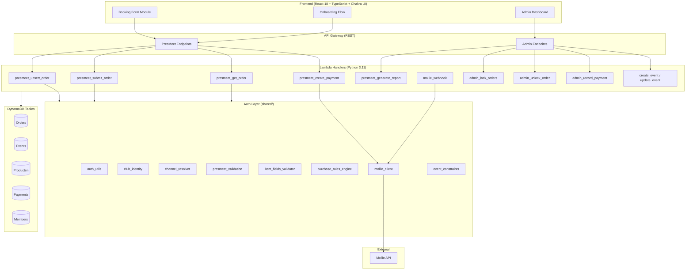
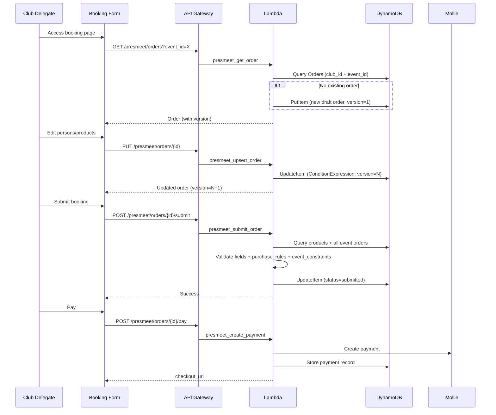
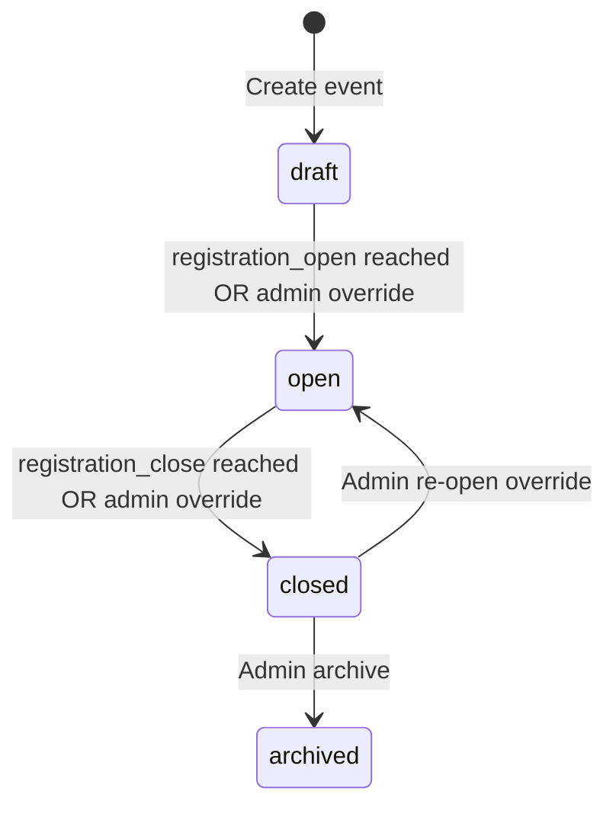
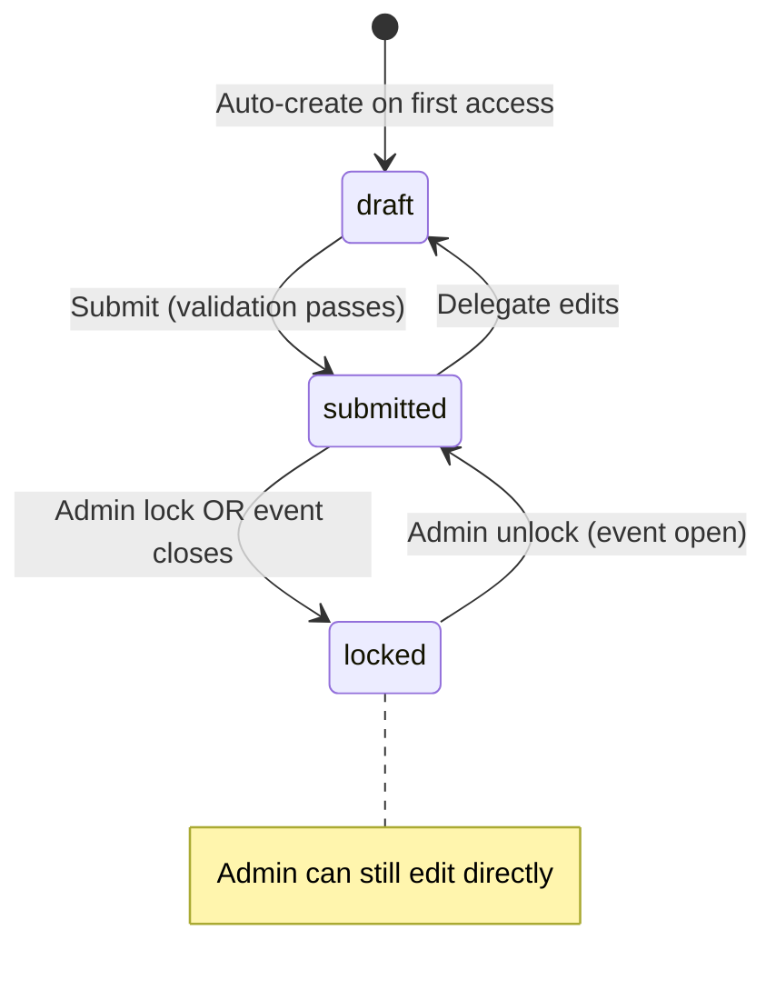

# Design Document: PresMeet v3 Redesign

## Overview

The PresMeet v3 Redesign replaces the dedicated PresMeet booking pipeline (6 legacy Lambda handlers) with a unified, event-driven architecture built on the existing webshop infrastructure. The system models events generically (PresMeet, Rally, Ledendag) via the existing Events and Producten DynamoDB tables, uses a direct order-only flow (no cart), and integrates Mollie for payment processing.

Key design decisions:

- **Order-only flow**: Eliminates the cart step — delegates work directly on a persistent draft order
- **Event-linked orders**: Orders reference an event_id + event_type, enabling the same infrastructure for any event type
- **Configurable constraints**: Event capacity limits are stored as JSON constraints on the Event record, not hardcoded
- **Optimistic locking**: Version field on orders prevents lost-update conflicts for dual-delegate scenarios
- **Channel renaming**: The `tenant` field becomes `channel` to free `tenant` for future multi-tenancy
- **Shared validation modules**: Reuses and extends `purchase_rules_engine`, `item_fields_validator`, and `mollie_client` from the auth layer

### Legacy Handlers to Remove

| Handler                    | Replacement                          |
| -------------------------- | ------------------------------------ |
| `save_presmeet_booking`    | `presmeet_upsert_order`              |
| `submit_presmeet_booking`  | `presmeet_submit_order`              |
| `validate_presmeet_cart`   | Validation built into submit handler |
| `create_presmeet_payment`  | `presmeet_create_payment`            |
| `lock_presmeet_orders`     | `admin_lock_orders` (extended)       |
| `unlock_presmeet_order`    | `admin_unlock_order` (extended)      |
| `generate_presmeet_report` | `presmeet_generate_report`           |
| `get_presmeet_booking`     | `presmeet_get_order`                 |
| `get_presmeet_config`      | Replaced by event + product queries  |
| `manual_presmeet_payment`  | `admin_record_payment` (extended)    |

## Architecture

### High-Level Architecture



### Request Flow: Order Lifecycle



### Event Status State Machine



### Order Status State Machine



## Components and Interfaces

### Backend API Endpoints (New/Modified)

| Method | Path                           | Handler                           | Auth            | Description                       |
| ------ | ------------------------------ | --------------------------------- | --------------- | --------------------------------- |
| GET    | `/presmeet/orders`             | `presmeet_get_order`              | Regio_Pressmeet | Get/create order for club + event |
| PUT    | `/presmeet/orders/{id}`        | `presmeet_upsert_order`           | Regio_Pressmeet | Save draft (no validation)        |
| POST   | `/presmeet/orders/{id}/submit` | `presmeet_submit_order`           | Regio_Pressmeet | Validate + submit                 |
| POST   | `/presmeet/orders/{id}/pay`    | `presmeet_create_payment`         | Regio_Pressmeet | Initiate Mollie payment           |
| GET    | `/presmeet/reports/{type}`     | `presmeet_generate_report`        | Admin           | Generate report                   |
| POST   | `/admin/events`                | `create_event` (existing)         | Events_CRUD     | Create event                      |
| PUT    | `/admin/events/{id}`           | `update_event` (existing)         | Events_CRUD     | Update event                      |
| POST   | `/admin/orders/{id}/lock`      | `admin_lock_orders` (extended)    | Admin           | Lock order                        |
| POST   | `/admin/orders/{id}/unlock`    | `admin_unlock_order` (extended)   | Admin           | Unlock order                      |
| POST   | `/admin/payments`              | `admin_record_payment` (extended) | Admin           | Record manual payment             |

**Admin** = Webshop_Management + (Regio_Pressmeet OR Regio_All)

### Backend Handler Structure

Each new handler follows the established pattern:

```
backend/handler/presmeet_upsert_order/
├── app.py              # Lambda entry point
└── requirements.txt    # (empty — dependencies via layer)

backend/handler/presmeet_submit_order/
├── app.py
└── requirements.txt

backend/handler/presmeet_get_order/
├── app.py
└── requirements.txt

backend/handler/presmeet_create_payment/
├── app.py
└── requirements.txt

backend/handler/presmeet_generate_report/
├── app.py
└── requirements.txt
```

### Shared Layer Extensions

New modules added to `backend/layers/auth-layer/python/shared/`:

| Module                   | Purpose                                                                |
| ------------------------ | ---------------------------------------------------------------------- |
| `channel_resolver.py`    | Renamed from `tenant_resolver.py` — same logic, new names              |
| `event_constraints.py`   | Event-level capacity validation (counting_rules)                       |
| `presmeet_validation.py` | Extended: field validation + purchase_rules + constraint orchestration |

### Frontend Module Structure

```
frontend/src/modules/presmeet/
├── PresMeetPage.tsx              # Route entry point
├── components/
│   ├── BookingWizard.tsx         # Main wizard container
│   ├── PersonCard.tsx            # Person (delegate/guest) card
│   ├── ProductConfigurator.tsx   # Per-person product config
│   ├── TransferForm.tsx          # Airport transfer entry
│   ├── OrderSummary.tsx          # Price summary panel
│   ├── SubmitPanel.tsx           # Submit + validation errors
│   ├── PaymentPanel.tsx          # Payment initiation
│   ├── OnboardingFlow.tsx        # Club selection
│   ├── DelegateManager.tsx       # Secondary delegate management
│   ├── ReadOnlyView.tsx          # Closed-event read-only display
│   └── BookingSummaryPdf.tsx     # PDF download button
├── hooks/
│   ├── usePresMeetOrder.ts       # Order CRUD operations
│   ├── usePresMeetEvent.ts       # Event data + status
│   ├── useCapacityCheck.ts       # Remaining capacity display
│   └── useAutoSave.ts            # Debounced auto-save
├── services/
│   └── presmeetApi.ts            # API client (Axios)
├── types/
│   └── presmeet.types.ts         # TypeScript interfaces
├── utils/
│   ├── orderTransformer.ts       # Person-centric ↔ order items
│   └── priceCalculator.ts        # Client-side total calculation
└── __tests__/
    ├── orderTransformer.test.ts
    ├── priceCalculator.test.ts
    └── BookingWizard.test.tsx
```

### Frontend Admin Module

```
frontend/src/modules/presmeet/admin/
├── EventDashboard.tsx            # Registration progress + payments
├── EventSelector.tsx             # Event dropdown
├── ConstraintProgress.tsx        # Capacity bars per constraint
├── PaymentSummary.tsx            # Financial overview
└── ReportNav.tsx                 # Report type navigation
```

## Data Models

### Order Record (Orders Table)

```json
{
  "order_id": "uuid-v4",
  "club_id": "club-123",
  "event_id": "uuid-v4",
  "event_type": "presmeet",
  "channel": "presmeet",
  "status": "draft | submitted | locked",
  "payment_status": "unpaid | partial | paid",
  "total_amount": 450.0,
  "total_paid": 0.0,
  "items": [
    {
      "product_id": "uuid-v4",
      "variant_id": "uuid-v4 | null",
      "item_fields_data": {
        "name": "Jan de Vries",
        "role": "President"
      },
      "unit_price": 50.0,
      "line_total": 50.0
    }
  ],
  "delegates": {
    "primary": "jan@club.nl",
    "secondary": "piet@club.nl"
  },
  "version": 3,
  "status_history": [
    {
      "from": "draft",
      "to": "submitted",
      "at": "2027-01-15T10:30:00Z",
      "by": "jan@club.nl",
      "source": "delegate"
    }
  ],
  "created_at": "2027-01-10T08:00:00Z",
  "updated_at": "2027-01-15T10:30:00Z",
  "submitted_at": "2027-01-15T10:30:00Z",
  "created_by": "jan@club.nl"
}
```

### Event Record (Events Table)

```json
{
  "event_id": "uuid-v4",
  "event_type": "presmeet",
  "name": "Presidents Meeting 2027",
  "location": "Hotel Amersfoort",
  "status": "open",
  "start_date": "2027-06-20",
  "end_date": "2027-06-22",
  "registration_open": "2027-01-01",
  "registration_close": "2027-05-01",
  "payment_deadline": "2027-05-15",
  "product_ids": ["prod-meeting", "prod-party", "prod-tshirt", "prod-transfer"],
  "constraints": [
    {
      "key": "max_meeting_attendees",
      "label": "Maximum vergaderdeelnemers",
      "max": 150,
      "counting_rule": "count_items_by_product",
      "product_id": "prod-meeting"
    },
    {
      "key": "max_party_guests",
      "label": "Maximum feestgangers",
      "max": 500,
      "counting_rule": "count_items_by_product",
      "product_id": "prod-party"
    }
  ],
  "created_at": "2026-12-01T08:00:00Z",
  "created_by": "admin@h-dcn.nl"
}
```

### Product Record (Producten Table) — Meeting Ticket Example

```json
{
  "product_id": "prod-meeting-2027",
  "name": "Meeting Ticket PM2027",
  "channel": "presmeet",
  "event_type": "presmeet",
  "price": 50.0,
  "order_item_fields": [
    { "id": "name", "label": "Naam", "type": "text", "required": true },
    { "id": "role", "label": "Functie", "type": "text", "required": true },
    {
      "id": "attend_party",
      "label": "Feest bijwonen",
      "type": "select",
      "required": true,
      "options": ["yes", "no"]
    }
  ],
  "purchase_rules": {
    "min_per_club": 1,
    "max_per_club": 3,
    "order_mode": "persistent"
  },
  "variant_schema": null
}
```

### Product Record — T-Shirt Example (with Variants)

```json
{
  "product_id": "prod-tshirt-2027",
  "name": "T-Shirt PM2027",
  "channel": "presmeet",
  "event_type": "presmeet",
  "price": 25.0,
  "order_item_fields": [
    {
      "id": "person_name",
      "label": "Naam persoon",
      "type": "text",
      "required": true
    }
  ],
  "variant_schema": [
    { "name": "Size", "values": ["S", "M", "L", "XL", "XXL", "3XL", "4XL"] },
    { "name": "Gender", "values": ["Male", "Female"] }
  ],
  "purchase_rules": {
    "max_per_club": 13,
    "order_mode": "persistent"
  }
}
```

### Payment Record (Payments Table)

```json
{
  "payment_id": "uuid-v4",
  "order_id": "uuid-v4",
  "club_id": "club-123",
  "amount": 450.0,
  "status": "paid",
  "provider": "mollie",
  "method": "ideal",
  "mollie_payment_id": "tr_xxxxx",
  "created_at": "2027-02-01T14:30:00Z"
}
```

### Constraint Counting Rules

| Rule                     | Logic                                                                                       |
| ------------------------ | ------------------------------------------------------------------------------------------- |
| `count_items_by_product` | Count items in submitted/locked orders where `product_id` matches constraint's `product_id` |
| `count_distinct_clubs`   | Count distinct `club_id` values across submitted/locked orders for the event                |
| `sum_field`              | Sum a numeric field (e.g., `persons` on transfer items) across submitted/locked orders      |

### GSI Requirements

The Orders table needs a GSI to support efficient queries:

| GSI Name           | PK             | SK            | Purpose                                         |
| ------------------ | -------------- | ------------- | ----------------------------------------------- |
| `event-club-index` | `event_id` (S) | `club_id` (S) | Find order by club+event, list all event orders |

This GSI replaces full table scans currently used by `save_presmeet_booking`.
