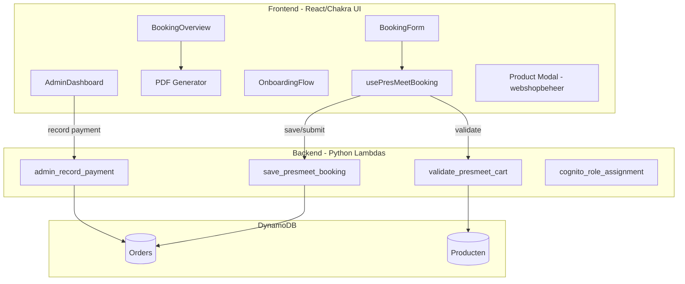

# Design Document: PresMeet v3 Immediate Fixes

## Overview

This design addresses 12 critical bugs, missing features, and UX improvements for the PresMeet booking system. These are targeted fixes to the existing architecture (not the full redesign outlined in `presmeet-findings.md`).

The fixes span three layers:

1. **Frontend presentation** — PDF generation, booking overview display, onboarding UX, admin contrast fixes
2. **Frontend logic** — Delegate party ticket calculation, transfer quantity handling, guest name validation, club search
3. **Backend** — Payment registration error handling, order calculation correctness, Cognito permissions

All changes respect the existing data model (`CartItem[]` with `attributes` map, `PresMeetBooking` with order statuses) and the current separation between frontend components and backend Lambda handlers.

## Architecture

The fixes are localized within the existing PresMeet module architecture:



**Key design decisions:**

- PDF generation stays client-side (jsPDF + jspdf-autotable) — no backend PDF service needed for this scale
- Club search is client-side filtering of the already-loaded registry (30-50 clubs, already fetched on mount)
- Logo animation uses CSS transitions (no JS animation library needed)
- Payment handler fix is defensive error handling, not an architectural change
- Permission changes are Cognito group configuration, not code changes

## Components and Interfaces

### 1. PDF Generator Utility (NEW)

**File:** `frontend/src/modules/presmeet/utils/pdfGenerator.ts`

```typescript
interface PdfBookingData {
  clubName: string;
  items: CartItem[];
  status: OrderStatus;
  paymentStatus: PaymentStatus;
  totalAmount: number;
  totalPaid: number;
  submittedAt: string | null;
}

interface PdfLineItem {
  label: string;
  unitPrice: number;
  quantity: number;
  lineTotal: number;
}

interface PdfGroupData {
  groupHeading: string;
  productType: ProductType;
  items: PdfLineItem[];
  groupTotal: number;
}

// Exported functions
export function preparePdfData(data: PdfBookingData): PdfGroupData[];
export function generateBookingPdf(data: PdfBookingData): void;
export function buildPdfFilename(clubId: string): string;
```

### 2. BookingOverview Enhancements (MODIFY)

**File:** `frontend/src/modules/presmeet/components/BookingOverview.tsx`

Changes:

- Add PDF download button that calls `generateBookingPdf`
- Ensure delegate party tickets appear as line items in the party_ticket group
- Display submission date when status is "submitted" or "locked"
- Display persons count for airport transfers with persons > 1
- Pass `clubName`, `paymentStatus`, and `submittedAt` as props

```typescript
export interface BookingOverviewProps {
  items: CartItem[];
  status: OrderStatus;
  paymentStatus: PaymentStatus;
  totalPaid?: number;
  clubName: string;
  clubId: string;
  submittedAt: string | null;
}
```

### 3. OnboardingFlow Enhancements (MODIFY)

**File:** `frontend/src/modules/presmeet/components/OnboardingFlow.tsx`

Changes:

- Add search input field above the club grid
- Add logo animation (large → small on scroll/timer)
- Add "no results" message when filter yields empty list

```typescript
// New internal state
const [searchText, setSearchText] = useState("");
const [logosSmall, setLogosSmall] = useState(false);

// Filter function
function filterClubs(
  clubs: ClubRegistryEntry[],
  search: string,
): ClubRegistryEntry[];
```

### 4. BookingForm Cart Item Generation Fix (MODIFY)

**File:** `frontend/src/modules/presmeet/hooks/usePresMeetBooking.ts` or `frontend/src/modules/presmeet/utils/cartBuilder.ts` (NEW)

Extract cart item building logic into a testable utility:

```typescript
export interface CartBuildResult {
  items: CartItem[];
  totalAmount: number;
  itemCount: number;
}

export function buildCartItems(
  formData: BookingFormData,
  config: PresMeetConfig,
): CartBuildResult;
```

This function must:

- Generate `party_ticket` items for delegates with `attend_party: true`
- Set `persons` attribute on airport_transfer items from form data
- Multiply transfer unit_price × persons for correct line totals

### 5. Validation Enhancement (MODIFY)

**File:** `frontend/src/modules/presmeet/utils/validation.ts`

Add party ticket name validation:

```typescript
export function validatePartyTicketName(item: CartItem): ValidationError | null;
export function validateBookingSubmission(items: CartItem[]): ValidationError[];
```

### 6. Admin Payment Handler Fix (MODIFY)

**File:** `backend/handler/admin_record_payment/app.py`

The handler already has good structure. The fix ensures:

- The generic `except Exception` at the bottom returns a structured JSON error (not just a string)
- Specific DynamoDB `ClientError` exceptions are caught and logged with context
- The error response includes an `error_code` field for frontend consumption

### 7. Admin Dashboard Contrast Fix (MODIFY)

**File:** `frontend/src/modules/presmeet/components/AdminDashboard.tsx`

Apply explicit color tokens that meet WCAG AA (4.5:1):

- Replace any `color="gray.400"` or similar low-contrast values with `color="gray.700"` or darker
- Ensure all data cells use `color="gray.800"` on white backgrounds

### 8. Product Modal Fix (MODIFY)

**File:** `frontend/src/modules/products/` (webshopbeheer product modal)

- Fix text contrast for variant schema and purchase rules sections
- Populate purchase rules dropdown from product config data instead of hardcoded empty

### 9. Cognito Permission Assignment (CONFIGURATION)

**Method:** Script or manual configuration update

- Add `Events_Read`, `Events_Export`, `Events_CRUD` to the webmaster Cognito group
- Can use `fix_webmaster_roles.py` pattern already in the project

## Data Models

No schema changes to DynamoDB tables. The existing `CartItem` and `PresMeetBooking` types are sufficient.

### CartItem (existing, no changes)

```typescript
interface CartItem {
  item_id: string;
  product_type: ProductType; // "meeting_ticket" | "party_ticket" | "tshirt" | "airport_transfer"
  attributes: Record<string, any>;
  unit_price: number;
}
```

**Key attribute contracts (to be enforced):**

| product_type     | Required attributes                             | Calculation          |
| ---------------- | ----------------------------------------------- | -------------------- |
| meeting_ticket   | name, role, attend_party                        | 1 × unit_price       |
| party_ticket     | name, person_type ("delegate"\|"guest")         | 1 × unit_price       |
| tshirt           | name, size, gender                              | 1 × unit_price       |
| airport_transfer | direction, airport, flight, date, time, persons | persons × unit_price |

### PDF Data Flow

```
BookingOverview props → preparePdfData() → PdfGroupData[] → jsPDF render → browser download
```

### Club Search Data Flow

```
ClubRegistry.clubs[] → filterClubs(clubs, searchText) → filtered ClubRegistryEntry[]
```

## Correctness Properties

_A property is a characteristic or behavior that should hold true across all valid executions of a system — essentially, a formal statement about what the system should do. Properties serve as the bridge between human-readable specifications and machine-verifiable correctness guarantees._

### Property 1: PDF data preparation produces correct grouped output

_For any_ valid set of cart items and club name, the `preparePdfData` function SHALL produce groups where each group contains exactly the items of that product type, with correct unit prices and line totals that sum to the grand total.

**Validates: Requirements 1.1, 1.4**

### Property 2: PDF includes payment instructions conditionally

_For any_ booking with payment_status "unpaid" or "partial", the PDF output SHALL include payment instruction content with the outstanding amount. For any booking with payment_status "paid", the PDF SHALL NOT include payment instructions.

**Validates: Requirements 1.2**

### Property 3: PDF filename matches expected pattern

_For any_ valid club_id string, `buildPdfFilename(clubId)` SHALL return a string matching the pattern `presmeet-booking-{clubId}.pdf`.

**Validates: Requirements 1.5**

### Property 4: Booking overview totals include all items correctly

_For any_ set of cart items, the grand total SHALL equal the sum of all group line totals, where each group line total correctly accounts for all items in that group (including delegate party tickets in the party_ticket group, and persons × unit_price for airport transfers).

**Validates: Requirements 2.2, 2.3, 3.2**

### Property 5: Remaining balance calculation

_For any_ grand total and total paid values (both ≥ 0), the remaining balance SHALL equal `max(0, grandTotal - totalPaid)`.

**Validates: Requirements 3.2**

### Property 6: Club search filter returns correct results

_For any_ club list and search string, the filter function SHALL return exactly those clubs whose name contains the search string (case-insensitive comparison). When the search string is empty, all clubs SHALL be returned.

**Validates: Requirements 4.1, 4.2**

### Property 7: Payment handler input validation

_For any_ request payload missing `order_id`, or with a non-numeric `amount`, or with `amount` outside [0.01, 999999.99], or missing `date`, or with an invalid date format, the handler SHALL return a 400 status with a descriptive error message and SHALL NOT modify any database records.

**Validates: Requirements 6.1**

### Property 8: Delegate party ticket cart item generation

_For any_ delegate with `attend_party` set to true, the `buildCartItems` function SHALL produce a party_ticket cart item with that delegate's name in the attributes, person_type "delegate", and the configured party_ticket unit price.

**Validates: Requirements 7.1, 2.1**

### Property 9: Order total includes delegate party tickets

_For any_ set of delegates where N delegates have `attend_party: true`, the total computed by `buildCartItems` SHALL include N × party_ticket_unit_price in addition to all other item costs.

**Validates: Requirements 7.2, 7.3**

### Property 10: Transfer quantity multiplication

_For any_ airport transfer cart item with a `persons` attribute value P (integer ≥ 1), the line total for that item SHALL equal P × unit_price.

**Validates: Requirements 8.1, 8.2, 8.3**

### Property 11: Party ticket name validation

_For any_ party_ticket cart item with an empty string, whitespace-only string, or missing `name` attribute, the validation function SHALL produce a validation error indicating that a name is required.

**Validates: Requirements 9.1, 9.2**

## Error Handling

### Frontend Error Handling

| Scenario                           | Handling                                                     |
| ---------------------------------- | ------------------------------------------------------------ |
| PDF generation fails (jsPDF error) | Toast notification with error message; no download triggered |
| Club registry fetch fails          | Alert component with retry option (existing behavior)        |
| Search yields no results           | Display translated "no results" message                      |
| Payment registration returns 400   | Display server error message in toast                        |
| Payment registration returns 500   | Display generic "server error, try again later" toast        |

### Backend Error Handling

| Scenario                | Handling                                                                                                    |
| ----------------------- | ----------------------------------------------------------------------------------------------------------- |
| Invalid payment payload | 400 with field-specific error message                                                                       |
| Order not found         | 404 with "Order not found" message                                                                          |
| DynamoDB ClientError    | 500 with structured `{ error: "Internal server error", error_code: "DYNAMO_ERROR" }`, full exception logged |
| JSON decode error       | 400 with "Invalid JSON in request body"                                                                     |
| Unexpected exception    | 500 with structured error, exception logged with stack trace                                                |

### Validation Error Flow

```
Frontend validation (party ticket name check)
  → Block submission with inline error message
  → If bypassed somehow, backend validate_presmeet_cart catches it
  → Returns 400 with validation_errors array
```

## Testing Strategy

### Unit Tests (Jest + React Testing Library)

**Frontend unit tests:**

- `pdfGenerator.test.ts` — Test `preparePdfData`, `buildPdfFilename`, conditional payment instructions
- `BookingOverview.test.tsx` — Test rendering with delegate party tickets, transfer persons display, submission date
- `OnboardingFlow.test.tsx` — Test search filtering, no-results state, logo animation trigger
- `cartBuilder.test.ts` — Test delegate party ticket generation, transfer persons handling
- `validation.test.ts` — Test party ticket name validation

**Backend unit tests (pytest + moto):**

- `test_admin_record_payment.py` — Test input validation (all invalid cases), DynamoDB error handling, successful payment recording
- `test_validate_presmeet_cart.py` — Test party ticket name rejection

### Property-Based Tests

**Library:** `fast-check` (frontend, TypeScript), `hypothesis` (backend, Python)

**Configuration:** Minimum 100 iterations per property test.

**Frontend property tests** (`frontend/src/modules/presmeet/__tests__/`):

- `pdfGenerator.property.test.ts` — Properties 1, 2, 3
- `bookingCalculations.property.test.ts` — Properties 4, 5, 10
- `clubSearch.property.test.ts` — Property 6
- `cartBuilder.property.test.ts` — Properties 8, 9
- `validation.property.test.ts` — Property 11

**Backend property tests** (`backend/tests/unit/`):

- `test_admin_record_payment_properties.py` — Property 7

Each property test is tagged with:

```
// Feature: presmeet-v3, Property {N}: {title}
```

### Integration Tests

- Admin payment flow: Submit payment → verify order status updated (mocked DynamoDB)
- Booking submission with party tickets: Save → validate → submit (end-to-end with mocked APIs)

### Manual Testing Checklist

- [ ] PDF download renders correctly in browser (visual check)
- [ ] Logo animation smooth on first page load
- [ ] Admin dashboard text readable (WCAG AA contrast)
- [ ] Product modal text readable
- [ ] Purchase rules dropdown populated
- [ ] Webmaster can access event administration
