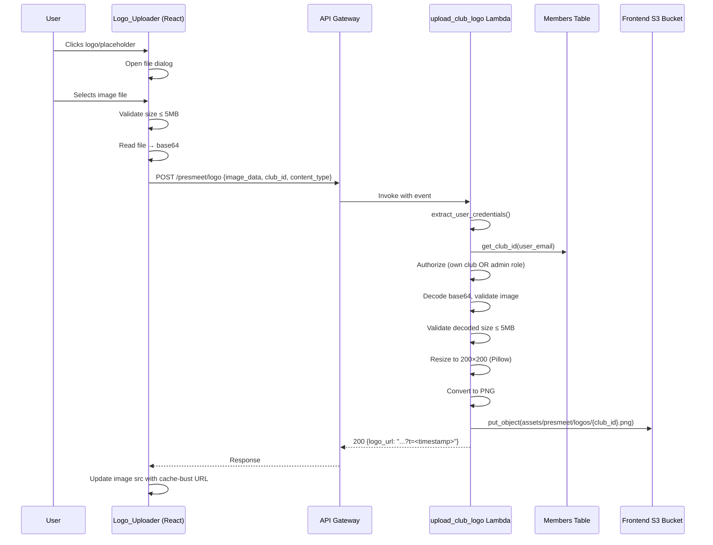

# Design Document: PresMeet Club Logo Upload

## Overview

This feature adds a clickable club logo next to the "Presidents' Meeting Booking" heading on the PresMeet booking page. The logo serves as both a visual identifier and an upload trigger — clicking it opens a file picker, and the selected image is sent (base64-encoded) to a new Lambda endpoint that resizes it to 200×200 pixels using Pillow and stores it as PNG in the frontend S3 bucket. A cache-busting timestamp ensures the browser immediately displays the new logo after upload.

**Key design decisions:**

- **Self-service upload** — no special role required; any authenticated member with a `club_id` can upload for their own club
- **Admin override** — `Products_CRUD` or `Webshop_Management` role holders can upload for any club
- **Server-side resize** — ensures consistent 200×200 output regardless of input dimensions/format
- **Frontend S3 bucket** — logos are served as static assets via CloudFront alongside the rest of the portal
- **Dedicated Lambda** — follows the project's one-function-per-endpoint convention rather than extending the generic `s3_file_manager`

## Architecture



## Components and Interfaces

### Backend: `upload_club_logo` Lambda

**Location:** `backend/handler/upload_club_logo/app.py`

**API endpoint:** `POST /presmeet/logo`

**Request body:**

```json
{
  "image_data": "<base64-encoded image bytes>",
  "club_id": "club-123",
  "content_type": "image/png"
}
```

**Success response (200):**

```json
{
  "message": "Logo uploaded successfully",
  "logo_url": "https://h-dcn-frontend-506221081911.s3.eu-west-1.amazonaws.com/assets/presmeet/logos/club-123.png?t=1706000000"
}
```

**Error responses:**
| Status | Condition |
|--------|-----------|
| 400 | Missing required fields, invalid image, resize failure |
| 401 | Missing/invalid auth token |
| 403 | No club_id assigned, or club_id mismatch (non-admin) |
| 413 | Decoded image exceeds 5MB |

**Dependencies:**

- `shared.auth_utils` (auth layer)
- `shared.club_identity` (club_id lookup)
- `Pillow` (image processing — added via `requirements.txt`)
- `boto3` (S3 upload)

**Environment variables:**

- `MEMBERS_TABLE_NAME` — for club_id lookup
- `FRONTEND_BUCKET_NAME` — target S3 bucket (`h-dcn-frontend-506221081911`)
- `COGNITO_USER_POOL_ID` — for auth layer

### Frontend: `ClubLogoUploader` Component

**Location:** `frontend/src/modules/presmeet/components/ClubLogoUploader.tsx`

**Props:**

```typescript
interface ClubLogoUploaderProps {
  clubId: string;
  isAdmin?: boolean;
}
```

**Behavior:**

- Renders a 48×48 rounded image (or placeholder icon)
- On click, triggers a hidden `<input type="file" accept="image/png,image/jpeg,image/webp,image/gif">`
- Validates file size ≤ 5MB client-side before upload
- Shows loading overlay during upload
- On success, updates image `src` with returned URL (including cache-bust param)
- On error, shows Chakra UI toast and reverts to previous image

### Frontend: API Extension

**Location:** `frontend/src/modules/presmeet/services/presmeetApi.ts`

```typescript
uploadClubLogo: (imageData: string, clubId: string, contentType: string): Promise<ApiResponse<{ logo_url: string }>>
```

### SAM Template Addition

New `UploadClubLogoFunction` resource in `backend/template.yaml`:

- Uses `PresMeetRole` (extended with S3 write to frontend bucket)
- Path: `/presmeet/logo`, Method: `POST`
- Pillow dependency via `requirements.txt` in handler folder

### IAM Policy Extension

The `PresMeetRole` needs an additional S3 policy statement:

```yaml
- PolicyName: PresMeetLogoUploadAccess
  PolicyDocument:
    Version: "2012-10-17"
    Statement:
      - Effect: Allow
        Action:
          - s3:PutObject
        Resource:
          - "arn:aws:s3:::h-dcn-frontend-506221081911/assets/presmeet/logos/*"
```

## Data Models

### Request Payload (Backend)

| Field          | Type   | Required | Constraints                                                  |
| -------------- | ------ | -------- | ------------------------------------------------------------ |
| `image_data`   | string | yes      | Base64-encoded image, decoded size ≤ 5MB                     |
| `club_id`      | string | yes      | Must match user's club_id or user must be admin              |
| `content_type` | string | yes      | One of: `image/png`, `image/jpeg`, `image/webp`, `image/gif` |

### S3 Object

| Property     | Value                                 |
| ------------ | ------------------------------------- |
| Bucket       | `h-dcn-frontend-506221081911`         |
| Key          | `assets/presmeet/logos/{club_id}.png` |
| ContentType  | `image/png`                           |
| CacheControl | `max-age=0, must-revalidate`          |

### Logo URL Pattern

```
https://h-dcn-frontend-506221081911.s3.eu-west-1.amazonaws.com/assets/presmeet/logos/{club_id}.png?t={unix_timestamp}
```

## Correctness Properties

_A property is a characteristic or behavior that should hold true across all valid executions of a system — essentially, a formal statement about what the system should do. Properties serve as the bridge between human-readable specifications and machine-verifiable correctness guarantees._

### Property 1: Client-side file size validation boundary

_For any_ file with size greater than 5MB (5,242,880 bytes), the client-side validation function SHALL reject it and return an error. _For any_ file with size less than or equal to 5MB, the validation function SHALL accept it.

**Validates: Requirements 2.3**

### Property 2: Base64 encoding round-trip

_For any_ valid byte sequence representing image data, encoding it to base64 and then decoding the result SHALL produce the original byte sequence.

**Validates: Requirements 3.1**

### Property 3: Image resize fits within 200×200 preserving aspect ratio

_For any_ valid image with arbitrary width and height, after applying the resize function, the output dimensions SHALL satisfy: `width ≤ 200 AND height ≤ 200 AND (width == 200 OR height == 200)` AND the output aspect ratio SHALL equal the input aspect ratio (within ±1 pixel rounding tolerance).

**Validates: Requirements 4.1**

### Property 4: Invalid image data produces 400 error without S3 side effects

_For any_ byte sequence that is not a valid image (random bytes, truncated headers, non-image files), the upload handler SHALL return a 400 status code and SHALL NOT invoke S3 put_object.

**Validates: Requirements 4.2, 4.7**

### Property 5: Output is always valid PNG

_For any_ valid image in any supported input format (PNG, JPEG, WebP, GIF), after processing through the resize function, the output bytes SHALL begin with the PNG magic bytes (`\x89PNG\r\n\x1a\n`) and be a parseable PNG file.

**Validates: Requirements 4.3**

### Property 6: S3 key construction matches pattern

_For any_ valid club_id string, the constructed S3 key SHALL equal `assets/presmeet/logos/{club_id}.png` exactly.

**Validates: Requirements 4.4**

### Property 7: Server-side payload size limit

_For any_ base64-encoded payload whose decoded size exceeds 5MB (5,242,880 bytes), the upload handler SHALL return a 413 status code.

**Validates: Requirements 4.8**

### Property 8: Authorization — club ownership or admin override

_For any_ combination of (user_club_id, request_club_id, user_roles): the upload SHALL succeed if and only if `request_club_id == user_club_id` OR `'Products_CRUD' in user_roles` OR `'Webshop_Management' in user_roles`. Otherwise it SHALL return 403.

**Validates: Requirements 5.5, 5.6**

### Property 9: Response URL contains cache-busting parameter

_For any_ successful upload with a given club_id, the returned `logo_url` SHALL contain the substring `assets/presmeet/logos/{club_id}.png?t=` followed by a numeric timestamp.

**Validates: Requirements 6.1**

## Error Handling

### Backend Error Handling

| Scenario                                                        | Status | Response                                                   |
| --------------------------------------------------------------- | ------ | ---------------------------------------------------------- |
| Missing `image_data`, `club_id`, or `content_type`              | 400    | `{"error": "Missing required field: <field>"}`             |
| Invalid base64 encoding                                         | 400    | `{"error": "Invalid base64 image data"}`                   |
| Decoded data is not a valid image (Pillow cannot open)          | 400    | `{"error": "Invalid image file: <detail>"}`                |
| Pillow resize/conversion fails (corrupt data, unsupported mode) | 400    | `{"error": "Image processing failed: <detail>"}`           |
| Decoded payload > 5MB                                           | 413    | `{"error": "Image too large. Maximum size is 5MB"}`        |
| No auth token                                                   | 401    | Standard auth layer response                               |
| User has no club_id                                             | 403    | `{"error": "No club assignment found"}`                    |
| club_id mismatch (non-admin)                                    | 403    | `{"error": "Not authorized to upload logo for this club"}` |
| S3 upload failure                                               | 500    | `{"error": "Failed to store logo: <detail>"}`              |

### Frontend Error Handling

| Scenario                    | Behavior                                                           |
| --------------------------- | ------------------------------------------------------------------ |
| File > 5MB selected         | Toast: "File too large. Maximum size is 5MB" — no API call         |
| Non-image file selected     | Prevented by `accept` attribute on file input                      |
| API returns error (4xx/5xx) | Toast with error message from response                             |
| Network failure             | Toast: "Upload failed. Please check your connection and try again" |
| Any error                   | Revert image to previous src, remove loading indicator             |

### Resilience Strategy

- **Resize failure is non-destructive**: if Pillow fails, the existing logo on S3 is untouched
- **Client validates before sending**: prevents unnecessary network calls for oversized files
- **S3 `CacheControl: max-age=0, must-revalidate`**: ensures CloudFront always validates freshness with S3

## Testing Strategy

### Property-Based Tests (Hypothesis — Python backend)

The project already uses Hypothesis (visible in `backend/.hypothesis/`). Each property test will run a minimum of 100 iterations.

| Property                     | Test Approach                                                                                         |
| ---------------------------- | ----------------------------------------------------------------------------------------------------- |
| P1: File size boundary       | Generate random integers around the 5MB boundary, verify accept/reject                                |
| P2: Base64 round-trip        | Generate random byte arrays, encode → decode, assert equality                                         |
| P3: Resize within bounds     | Generate random (width, height) pairs, create Pillow images, resize, verify dimensions                |
| P4: Invalid image → 400      | Generate random non-image byte sequences, invoke handler with mocked S3, verify 400 and no put_object |
| P5: Output is PNG            | Generate valid images in each format, process, verify PNG header magic bytes                          |
| P6: S3 key pattern           | Generate random club_id strings, verify key construction                                              |
| P7: Payload size > 5MB → 413 | Generate oversized base64 payloads, invoke handler, verify 413                                        |
| P8: Authorization            | Generate (user_club, request_club, roles) tuples, verify access decision                              |
| P9: Cache-bust URL           | Generate random club_ids, invoke successful upload (mocked S3), verify URL format                     |

**Library:** `hypothesis` (already in project)
**Config:** Minimum 100 examples per test (`@settings(max_examples=100)`)
**Tag format:** `# Feature: presmeet-club-logo-upload, Property {N}: {title}`

### Unit Tests (pytest — backend)

- Happy path: valid JPEG upload → resized PNG in S3, correct response
- Edge: exactly 5MB file (accepted)
- Edge: 5MB + 1 byte file (rejected with 413)
- Edge: club_id with special characters
- Integration of auth flow with mocked Cognito/DynamoDB

### Frontend Tests (Jest + React Testing Library)

- `ClubLogoUploader` renders placeholder when no logo exists
- `ClubLogoUploader` renders image with correct src when logo exists
- Click triggers file input
- File > 5MB shows error toast
- Successful upload updates image src
- Error response shows toast and reverts image
- Loading indicator visible during upload

### Integration Tests

- End-to-end: upload via API Gateway → Lambda → S3, verify object exists with correct metadata
- Auth: unauthenticated request returns 401
- Auth: user without club_id returns 403
