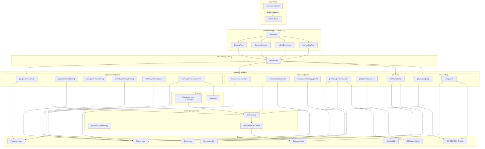
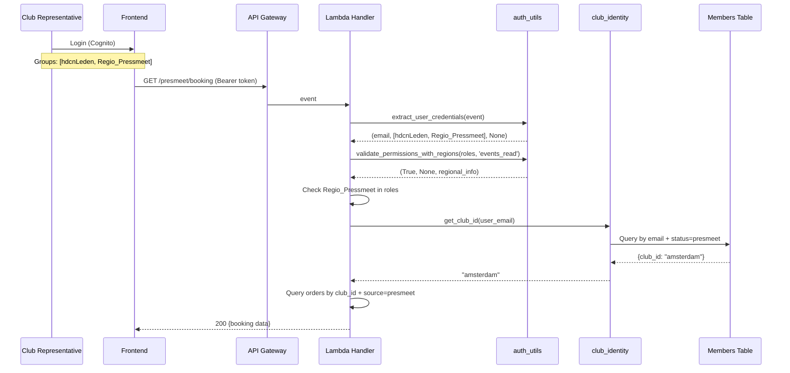
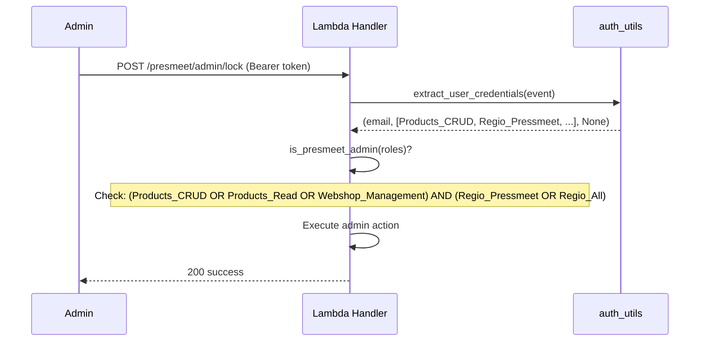

# Design Document: PresMeet v2

## Overview

PresMeet v2 is a redesign of the Presidents' Meeting booking module that realigns authentication, club identity, and product management with the established H-DCN patterns. The core booking logic (schema-driven validation, cart mapping, pricing, order lifecycle) is preserved from v1. The key architectural changes are:

1. **Auth alignment**: Replace custom `club_*` Cognito groups with `Regio_Pressmeet` region role + `hdcnLeden` base role
2. **Club identity on Member record**: Store `club_id` on the Member DynamoDB record instead of in Cognito groups
3. **Multi-tenancy via `tenant` field**: Add `tenant` field to all records for isolation, coexisting with the existing `source` field
4. **Product tenant separation**: Filter products by `tenant` field (`presmeet` vs `h-dcn`) in API and frontend
5. **Admin via existing roles**: Replace custom webmaster check with `Products_CRUD` / `Products_Read` + `Regio_Pressmeet` / `Regio_All`
6. **Club_Registry**: S3-stored JSON configuration for available clubs
7. **Entry point at presmeet.h-dcn.nl**: Redirect-based onboarding flow → `portal.h-dcn.nl`

The design reuses existing infrastructure (DynamoDB tables, Lambda handler pattern, shared auth layer, React/Chakra UI frontend, Mollie payment integration) and changes only the integration points listed above.

## Architecture

### High-Level System Diagram



### Key Architectural Decisions (v2 changes from v1)

| #   | Decision                                                                                         | Rationale                                                                                                                                                                                                        |
| --- | ------------------------------------------------------------------------------------------------ | ---------------------------------------------------------------------------------------------------------------------------------------------------------------------------------------------------------------- |
| 1   | **Club identity from Member record** instead of Cognito `club_*` groups                          | Cognito groups are not designed for domain data. Member record is the source of truth for member attributes. Simplifies user management.                                                                         |
| 2   | **New `club_identity.py` module** in shared layer                                                | Replaces `extract_club_id(user_roles)`. New function `get_club_id(member_id)` queries the Members table. Keeps the change isolated.                                                                              |
| 3   | **Admin check via `validate_permissions_with_regions`** with `Products_CRUD` + `Regio_Pressmeet` | Aligns with existing role structure. No custom permission model needed.                                                                                                                                          |
| 4   | **`tenant` field coexists with `source` field**                                                  | `source` discriminates record type within presmeet (e.g., `presmeet` for orders, `presmeet_config` for config records). `tenant` provides cross-module multi-tenancy isolation. Different concerns, both needed. |
| 5   | **Club_Registry in S3** (JSON file)                                                              | Simple, versioned, cheap. Admin updates via S3 console or a future admin endpoint. Bucket already exists and Lambda already has IAM access. Registry exceeds SSM 4KB limit with ~40 clubs.                       |
| 6   | **Two new Lambda handlers** for onboarding: `get_club_registry` + `assign_club`                  | Follows one-Lambda-per-endpoint pattern. Keeps onboarding logic separate from booking logic.                                                                                                                     |
| 7   | **Frontend gating via `Regio_Pressmeet`** in FunctionGuard                                       | Dashboard card visibility controlled by checking if user has `Regio_Pressmeet` or `Regio_All` in their groups.                                                                                                   |
| 8   | **Data migration script** adds `tenant=h-dcn` to existing records                                | One-time script (not Lambda). Runs before v2 goes live. Non-destructive — adds field, doesn't modify existing fields.                                                                                            |

### Auth Flow (v2)



### Admin Auth Flow (v2)



## Components and Interfaces

### Backend Lambda Handlers (v2)

All existing presmeet handlers are retained. Two new handlers are added for onboarding.

| Handler                    | Method | Path                                | Auth              | Description                             | v2 Change                                                          |
| -------------------------- | ------ | ----------------------------------- | ----------------- | --------------------------------------- | ------------------------------------------------------------------ |
| `get_presmeet_config`      | GET    | `/presmeet/config`                  | Club_User         | Get product type configs and event info | Add `tenant` filter                                                |
| `save_presmeet_booking`    | PUT    | `/presmeet/booking`                 | Club_User         | Save booking as draft (upsert)          | Replace `extract_club_id` → `get_club_id`; add `tenant` field      |
| `get_presmeet_booking`     | GET    | `/presmeet/booking`                 | Club_User         | Get current club's booking              | Replace `extract_club_id` → `get_club_id`; replace webmaster check |
| `submit_presmeet_booking`  | POST   | `/presmeet/booking/submit`          | Club_User         | Validate and submit booking             | Replace `extract_club_id` → `get_club_id`                          |
| `validate_presmeet_cart`   | POST   | `/presmeet/booking/validate`        | Club_User         | Validate cart items without submitting  | Replace `extract_club_id` → `get_club_id`                          |
| `create_presmeet_payment`  | POST   | `/presmeet/payment`                 | Club_User         | Initiate Mollie payment                 | Replace `extract_club_id` → `get_club_id`                          |
| `mollie_webhook`           | POST   | `/presmeet/webhook/mollie`          | None (Mollie sig) | Handle Mollie payment callbacks         | No change                                                          |
| `manual_presmeet_payment`  | POST   | `/presmeet/admin/payment`           | Admin             | Record manual payment                   | Replace admin check → `is_presmeet_admin`                          |
| `lock_presmeet_orders`     | POST   | `/presmeet/admin/lock`              | Admin             | Lock one or all submitted orders        | Replace admin check → `is_presmeet_admin`                          |
| `unlock_presmeet_order`    | POST   | `/presmeet/admin/unlock/{order_id}` | Admin             | Unlock a locked order                   | Replace admin check → `is_presmeet_admin`                          |
| `generate_presmeet_report` | POST   | `/presmeet/admin/report/generate`   | Admin             | Trigger report generation → S3          | Replace admin check → `is_presmeet_admin`; add `tenant` filter     |
| `get_presmeet_report`      | GET    | `/presmeet/admin/report`            | Admin             | Get latest report data from S3          | Replace admin check → `is_presmeet_admin`                          |
| **`get_club_registry`**    | GET    | `/presmeet/clubs`                   | Club_User         | **NEW** — Get available clubs list      | New handler                                                        |
| **`assign_club`**          | POST   | `/presmeet/clubs/assign`            | Club_User / Admin | **NEW** — Assign club to member         | New handler                                                        |

### New Shared Module: `club_identity.py`

```python
# backend/layers/auth-layer/python/shared/club_identity.py

"""
Club identity resolution for PresMeet v2.
Replaces the v1 pattern of extracting club_id from Cognito groups.
Club identity is now stored on the Member record.
"""

import os
import boto3
from boto3.dynamodb.conditions import Attr

dynamodb = boto3.resource('dynamodb')
members_table = dynamodb.Table(os.environ.get('MEMBERS_TABLE_NAME', 'Members'))


def get_club_id(user_email: str) -> str | None:
    """
    Look up club_id from the Member record matching the given email.
    Only returns club_id for members with status='presmeet'.

    Args:
        user_email: The authenticated user's email address.

    Returns:
        str | None: The club_id or None if not found / not a presmeet member.
    """
    response = members_table.scan(
        FilterExpression=(
            Attr('email').eq(user_email) &
            Attr('status').eq('presmeet')
        ),
        ProjectionExpression='club_id, member_id'
    )
    items = response.get('Items', [])
    if not items:
        return None
    return items[0].get('club_id')


def is_presmeet_admin(user_roles: list) -> bool:
    """
    Check if user has PresMeet admin access.
    Requires: (Products_CRUD OR Products_Read OR Webshop_Management)
              AND (Regio_Pressmeet OR Regio_All)

    Args:
        user_roles: List of Cognito group names.

    Returns:
        bool: True if user has PresMeet admin access.
    """
    has_management_role = any(
        role in ('Products_CRUD', 'Products_Read', 'Webshop_Management')
        for role in user_roles
    )
    has_region_role = any(
        role in ('Regio_Pressmeet', 'Regio_All')
        for role in user_roles
    )
    return has_management_role and has_region_role


def is_presmeet_admin_write(user_roles: list) -> bool:
    """
    Check if user has PresMeet admin WRITE access (lock, unlock, manual payment).
    Requires: Products_CRUD AND (Regio_Pressmeet OR Regio_All)

    Args:
        user_roles: List of Cognito group names.

    Returns:
        bool: True if user has full PresMeet admin access.
    """
    has_crud_role = 'Products_CRUD' in user_roles
    has_region_role = any(
        role in ('Regio_Pressmeet', 'Regio_All')
        for role in user_roles
    )
    return has_crud_role and has_region_role


def has_presmeet_access(user_roles: list) -> bool:
    """
    Check if user has access to PresMeet booking form.
    Requires: Regio_Pressmeet OR Regio_All in Cognito groups.

    Args:
        user_roles: List of Cognito group names.

    Returns:
        bool: True if user can access the booking form.
    """
    return any(
        role in ('Regio_Pressmeet', 'Regio_All')
        for role in user_roles
    )
```

### New Handler: `get_club_registry`

```python
# backend/handler/get_club_registry/app.py

"""
GET /presmeet/clubs — Return the Club_Registry list.
Reads from S3 (or SSM Parameter Store if < 4KB).
"""

import json
import os
import boto3

from shared.auth_utils import (
    extract_user_credentials, validate_permissions_with_regions,
    cors_headers, handle_options_request,
    create_error_response, create_success_response
)
from shared.club_identity import has_presmeet_access

s3 = boto3.client('s3')
BUCKET = os.environ.get('REPORTS_BUCKET_NAME', 'h-dcn-reports')
CLUB_REGISTRY_KEY = 'presmeet/club_registry.json'


def lambda_handler(event, context):
    if event.get('httpMethod') == 'OPTIONS':
        return handle_options_request()

    user_email, user_roles, auth_error = extract_user_credentials(event)
    if auth_error:
        return auth_error

    # Any authenticated user with Regio_Pressmeet can see the club list
    if not has_presmeet_access(user_roles):
        return create_error_response(403, 'PresMeet access required')

    try:
        obj = s3.get_object(Bucket=BUCKET, Key=CLUB_REGISTRY_KEY)
        registry = json.loads(obj['Body'].read().decode('utf-8'))
        return create_success_response(registry)
    except s3.exceptions.NoSuchKey:
        return create_error_response(404, 'Club registry not configured')
    except Exception as e:
        print(f"Error reading club registry: {e}")
        return create_error_response(500, 'Internal server error')
```

### New Handler: `assign_club`

```python
# backend/handler/assign_club/app.py

"""
POST /presmeet/clubs/assign — Assign a club to the authenticated member.
Updates both the Member record (club_id) and the Club_Registry (assigned_member_id).
Admin can reassign clubs for other members.
"""

import json
import os
from datetime import datetime, timezone
import boto3
from boto3.dynamodb.conditions import Attr

from shared.auth_utils import (
    extract_user_credentials, validate_permissions_with_regions,
    cors_headers, handle_options_request,
    create_error_response, create_success_response
)
from shared.club_identity import get_club_id, is_presmeet_admin, has_presmeet_access

s3 = boto3.client('s3')
dynamodb = boto3.resource('dynamodb')
members_table = dynamodb.Table(os.environ.get('MEMBERS_TABLE_NAME', 'Members'))
BUCKET = os.environ.get('REPORTS_BUCKET_NAME', 'h-dcn-reports')
CLUB_REGISTRY_KEY = 'presmeet/club_registry.json'


def lambda_handler(event, context):
    if event.get('httpMethod') == 'OPTIONS':
        return handle_options_request()

    user_email, user_roles, auth_error = extract_user_credentials(event)
    if auth_error:
        return auth_error

    if not has_presmeet_access(user_roles):
        return create_error_response(403, 'PresMeet access required')

    try:
        body = json.loads(event.get('body', '{}'))
    except json.JSONDecodeError:
        return create_error_response(400, 'Invalid JSON in request body')

    club_id = body.get('club_id')
    target_member_email = body.get('member_email')  # Only for admin reassignment

    if not club_id:
        return create_error_response(400, 'club_id is required')

    # Determine target member
    if target_member_email and is_presmeet_admin(user_roles):
        member_email = target_member_email
    else:
        member_email = user_email

    # Load Club_Registry from S3
    try:
        obj = s3.get_object(Bucket=BUCKET, Key=CLUB_REGISTRY_KEY)
        registry = json.loads(obj['Body'].read().decode('utf-8'))
    except Exception as e:
        print(f"Error reading club registry: {e}")
        return create_error_response(500, 'Failed to read club registry')

    # Find the requested club
    clubs = registry.get('clubs', [])
    club_entry = next((c for c in clubs if c['club_id'] == club_id), None)
    if not club_entry:
        return create_error_response(404, f"Club '{club_id}' not found in registry")

    # Check if club already assigned (unless admin reassigning)
    assigned = club_entry.get('assigned_member_id')
    if assigned and not is_presmeet_admin(user_roles):
        return create_error_response(
            409,
            'Club already assigned',
            {'assigned_contact': club_entry.get('assigned_contact', 'Contact admin')}
        )

    # Find member record
    response = members_table.scan(
        FilterExpression=Attr('email').eq(member_email) & Attr('status').eq('presmeet')
    )
    members = response.get('Items', [])
    if not members:
        return create_error_response(404, 'PresMeet member record not found')

    member = members[0]
    member_id = member['member_id']
    now = datetime.now(timezone.utc).isoformat()

    # If admin is reassigning, clear previous assignment
    if assigned and is_presmeet_admin(user_roles):
        # Clear club_id from previous member
        prev_response = members_table.scan(
            FilterExpression=Attr('club_id').eq(club_id) & Attr('status').eq('presmeet')
        )
        for prev_member in prev_response.get('Items', []):
            members_table.update_item(
                Key={'member_id': prev_member['member_id']},
                UpdateExpression='REMOVE club_id SET updated_at = :now',
                ExpressionAttributeValues={':now': now}
            )

    # Update Member record with club_id
    members_table.update_item(
        Key={'member_id': member_id},
        UpdateExpression='SET club_id = :cid, updated_at = :now',
        ExpressionAttributeValues={':cid': club_id, ':now': now}
    )

    # Update Club_Registry in S3
    club_entry['assigned_member_id'] = member_id
    club_entry['assigned_contact'] = member_email
    club_entry['assigned_at'] = now

    s3.put_object(
        Bucket=BUCKET,
        Key=CLUB_REGISTRY_KEY,
        Body=json.dumps(registry, indent=2),
        ContentType='application/json'
    )

    return create_success_response({
        'message': f"Club '{club_id}' assigned to {member_email}",
        'club_id': club_id,
        'member_id': member_id
    })
```

### Existing Handler Changes (Summary)

All existing presmeet handlers receive the same pattern change:

```python
# BEFORE (v1):
from shared.presmeet_validation import extract_club_id
club_id = extract_club_id(user_roles)

# AFTER (v2):
from shared.club_identity import get_club_id, has_presmeet_access, is_presmeet_admin

# Gate: check Regio_Pressmeet access
if not has_presmeet_access(user_roles):
    return create_error_response(403, 'PresMeet access required')

# Get club_id from Member record
club_id = get_club_id(user_email)

# Admin endpoints:
# BEFORE: is_admin = 'webmaster' in user_roles
# AFTER:  is_admin = is_presmeet_admin(user_roles)
```

### Frontend Changes

#### TypeScript Type Addition

```typescript
// frontend/src/types/user.ts — add to HDCNGroup type:
| "Regio_Pressmeet"           // Access to PresMeet booking module
```

#### Dashboard FunctionGuard

```typescript
// frontend/src/pages/Dashboard.tsx — Booking_Form card:
<FunctionGuard requiredRoles={['Regio_Pressmeet', 'Regio_All']}>
  <DashboardCard
    title="Presidents' Meeting"
    description="Booking form for your club delegation"
    link="/presmeet"
    icon={<CalendarIcon />}
  />
</FunctionGuard>
```

#### Onboarding Flow Component

```typescript
// frontend/src/modules/presmeet/components/OnboardingFlow.tsx
// New component: shown after first login if user has Regio_Pressmeet but no club_id

interface OnboardingFlowProps {
  onComplete: (clubId: string) => void;
}

// Steps:
// 1. Fetch /presmeet/clubs → display Club_Registry list
// 2. User selects club
// 3. POST /presmeet/clubs/assign → confirm assignment
// 4. Redirect to booking form
```

#### Updated API Service

```typescript
// frontend/src/modules/presmeet/services/presmeetApi.ts — add:
export const presmeetService = {
  // ... existing endpoints unchanged ...

  // New onboarding endpoints
  getClubRegistry: () => ApiService.get<ClubRegistry>("/presmeet/clubs"),
  assignClub: (clubId: string) =>
    ApiService.post<AssignClubResponse>("/presmeet/clubs/assign", {
      club_id: clubId,
    }),
  reassignClub: (clubId: string, memberEmail: string) =>
    ApiService.post<AssignClubResponse>("/presmeet/clubs/assign", {
      club_id: clubId,
      member_email: memberEmail,
    }),
};
```

### S3 Report Generation Pipeline (Retained from v1)

The reporting pattern is unchanged. The only modification is adding `tenant=presmeet` as a filter alongside `source=presmeet` in the `generate_presmeet_report` Lambda:

```python
# Add tenant filter to DynamoDB scans:
FilterExpression=Attr('source').eq('presmeet') & Attr('tenant').eq('presmeet')
```

S3 bucket structure remains:

```
s3://h-dcn-reports/presmeet/
├── club_registry.json       # NEW: Club_Registry data
├── overview.json            # Aggregated stats
├── orders.json              # All orders with items and payment summaries
├── export_submitted.csv     # CSV export of submitted orders
├── export_all.csv           # CSV export of all orders
└── metadata.json            # Generation timestamp
```

## Data Models

### Member Record (Members table) — v2 additions

```json
{
  "member_id": "uuid",
  "email": "rep@club.nl",
  "voornaam": "Jan",
  "achternaam": "de Vries",
  "lidmaatschap": "overig",
  "status": "presmeet",
  "tenant": "presmeet",
  "club_id": "amsterdam",
  "preferred_language": "en",
  "regio": "Pressmeet",
  "created_at": "2025-01-15T10:00:00Z",
  "updated_at": "2025-01-15T10:00:00Z"
}
```

### Club_Registry (S3: `presmeet/club_registry.json`)

```json
{
  "version": "1.0",
  "updated_at": "2025-06-01T10:00:00Z",
  "clubs": [
    {
      "club_id": "amsterdam",
      "club_name": "HD Club Amsterdam",
      "logo_url": "https://cdn.h-dcn.nl/clubs/amsterdam.png",
      "assigned_member_id": "uuid-of-rep",
      "assigned_contact": "rep@amsterdam-hd.nl",
      "assigned_at": "2025-01-10T08:00:00Z"
    },
    {
      "club_id": "rotterdam",
      "club_name": "HD Club Rotterdam",
      "logo_url": "https://cdn.h-dcn.nl/clubs/rotterdam.png",
      "assigned_member_id": null,
      "assigned_contact": null,
      "assigned_at": null
    }
  ]
}
```

### Order Record (Orders table) — v2 additions

```json
{
  "order_id": "uuid",
  "source": "presmeet",
  "tenant": "presmeet",
  "club_id": "amsterdam",
  "status": "draft",
  "payment_status": "unpaid",
  "items": [
    {
      "item_id": "uuid",
      "product_type": "meeting_ticket",
      "attributes": { "name": "Jan de Vries", "role": "President" },
      "unit_price": 50.0
    }
  ],
  "total_amount": 250.0,
  "created_at": "2025-01-15T10:00:00Z",
  "updated_at": "2025-01-15T12:00:00Z",
  "submitted_at": null,
  "created_by": "rep@club.nl"
}
```

### Product_Type_Config Record (Producten table) — unchanged

```json
{
  "product_id": "config_presmeet_meeting_ticket",
  "product_type": "meeting_ticket",
  "source": "presmeet_config",
  "tenant": "presmeet",
  "max_per_club": 3,
  "min_per_club": 1,
  "unit_price": 50.0,
  "required_attributes": {
    "name": {
      "type": "string",
      "required": true,
      "min_length": 1,
      "max_length": 100
    },
    "role": {
      "type": "string",
      "required": true,
      "min_length": 1,
      "max_length": 100
    }
  }
}
```

### Payment Record (Payments table) — v2 additions

```json
{
  "payment_id": "uuid",
  "source": "presmeet",
  "tenant": "presmeet",
  "order_id": "uuid",
  "club_id": "amsterdam",
  "amount": 250.0,
  "status": "pending",
  "provider": "mollie",
  "mollie_payment_id": "tr_xxx",
  "description": "PresMeet payment for HD Club Amsterdam",
  "created_at": "2025-01-15T14:00:00Z",
  "created_by": "rep@club.nl"
}
```

### Cart Record (Carts table) — v2 additions

```json
{
  "cart_id": "uuid",
  "source": "presmeet",
  "tenant": "presmeet",
  "club_id": "amsterdam",
  "items": [],
  "created_at": "2025-01-15T10:00:00Z",
  "updated_at": "2025-01-15T10:00:00Z"
}
```

### Product Record (Producten table) — tenant separation

```json
{
  "product_id": "presmeet_meeting_ticket_2025",
  "naam": "Presidents' Meeting Ticket 2025",
  "tenant": "presmeet",
  "source": "presmeet",
  "price": 50.0,
  "product_type": "meeting_ticket",
  "attributes": { "event_year": "2025" }
}
```

H-DCN webshop products:

```json
{
  "product_id": "hdcn_shirt_2025",
  "naam": "H-DCN T-Shirt 2025",
  "tenant": "h-dcn",
  "price": 29.95,
  "category": "merchandise"
}
```

### TypeScript Types (v2 additions)

```typescript
// frontend/src/modules/presmeet/types/presmeet.ts — additions

interface ClubRegistryEntry {
  club_id: string;
  club_name: string;
  logo_url: string | null;
  assigned_member_id: string | null;
  assigned_contact: string | null;
  assigned_at: string | null;
}

interface ClubRegistry {
  version: string;
  updated_at: string;
  clubs: ClubRegistryEntry[];
}

interface AssignClubResponse {
  message: string;
  club_id: string;
  member_id: string;
}

// Extended PresMeetBooking with tenant
interface PresMeetBooking {
  order_id: string;
  club_id: string;
  tenant: "presmeet";
  source: "presmeet";
  status: OrderStatus;
  payment_status: PaymentStatus;
  items: CartItem[];
  total_amount: number;
  created_at: string;
  updated_at: string;
  submitted_at: string | null;
}
```

### Data Migration Script

```python
# scripts/migrate_add_tenant_field.py
"""
One-time migration: add tenant='h-dcn' to all existing records
that do not yet have a tenant field.
Run BEFORE v2 deployment.
"""

import boto3
from boto3.dynamodb.conditions import Attr

dynamodb = boto3.resource('dynamodb', region_name='eu-west-1')
TABLES = ['Members', 'Producten', 'Orders', 'Carts', 'Payments']

def migrate_table(table_name: str):
    table = dynamodb.Table(table_name)
    scan_kwargs = {
        'FilterExpression': Attr('tenant').not_exists()
    }

    count = 0
    while True:
        response = table.scan(**scan_kwargs)
        items = response['Items']

        for item in items:
            key_name = list(item.keys())[0]  # Assumes single PK
            # Determine tenant: existing presmeet records keep presmeet, rest get h-dcn
            source = item.get('source', '')
            tenant = 'presmeet' if 'presmeet' in source else 'h-dcn'

            table.update_item(
                Key={get_key_name(table_name): item[get_key_name(table_name)]},
                UpdateExpression='SET tenant = :t',
                ExpressionAttributeValues={':t': tenant}
            )
            count += 1

        if 'LastEvaluatedKey' not in response:
            break
        scan_kwargs['ExclusiveStartKey'] = response['LastEvaluatedKey']

    print(f"Migrated {count} records in {table_name}")

def get_key_name(table_name: str) -> str:
    return {
        'Members': 'member_id',
        'Producten': 'product_id',
        'Orders': 'order_id',
        'Carts': 'cart_id',
        'Payments': 'payment_id',
    }[table_name]

if __name__ == '__main__':
    for table in TABLES:
        migrate_table(table)
```

## Correctness Properties

_A property is a characteristic or behavior that should hold true across all valid executions of a system — essentially, a formal statement about what the system should do. Properties serve as the bridge between human-readable specifications and machine-verifiable correctness guarantees._

### Property 1: PresMeet access gating

_For any_ list of Cognito group names, the `has_presmeet_access` function SHALL return `True` if and only if the list contains `Regio_Pressmeet` or `Regio_All`. For all other lists (including empty), it SHALL return `False`.

**Validates: Requirements 1.3, 1.4, 3.5**

### Property 2: PresMeet admin role check

_For any_ list of Cognito group names, the `is_presmeet_admin` function SHALL return `True` if and only if the list contains at least one of (`Products_CRUD`, `Products_Read`, `Webshop_Management`) AND at least one of (`Regio_Pressmeet`, `Regio_All`). All other combinations SHALL return `False`.

**Validates: Requirements 1.5, 5.1, 5.2, 5.3, 5.6**

### Property 3: PresMeet admin write vs read distinction

_For any_ list of Cognito group names, `is_presmeet_admin_write` SHALL return `True` if and only if the list contains `Products_CRUD` AND at least one of (`Regio_Pressmeet`, `Regio_All`). A list containing `Products_Read` + `Regio_Pressmeet` (without `Products_CRUD`) SHALL satisfy `is_presmeet_admin` but NOT `is_presmeet_admin_write`.

**Validates: Requirements 5.4, 5.5**

### Property 4: Tenant field isolation invariant

_For any_ record created through the PresMeet module (order, cart, payment, member, product config), the record SHALL contain a `tenant` field set to `"presmeet"` AND a `source` field. Both fields SHALL coexist — removing either is invalid.

**Validates: Requirements 6.1, 6.2, 6.4, 7.9, 11.7**

### Property 5: Tenant-based product filtering

_For any_ set of products with mixed `tenant` values (`"presmeet"` and `"h-dcn"`), applying a tenant filter with value `"presmeet"` SHALL return only products where `tenant == "presmeet"`, and applying a tenant filter with value `"h-dcn"` SHALL return only products where `tenant == "h-dcn"`. No products from the other tenant SHALL appear in results.

**Validates: Requirements 4.3, 9.7**

### Property 6: Schema validation accepts valid attributes

_For any_ product*type in (`meeting_ticket`, `party_ticket`, `tshirt`, `airport_transfer`) and \_for any* attributes object that satisfies all constraints defined in the product_type's schema (correct types, within enum lists, within length/range bounds, all required fields present), the `validate_attributes` function SHALL return an empty error list.

**Validates: Requirements 11.1, 4.5**

### Property 7: Schema validation rejects invalid attributes

_For any_ product*type and \_for any* attributes object that violates at least one schema constraint (wrong type, value not in enum, missing required field, out of range), the `validate_attributes` function SHALL return a non-empty error list where each error references the specific field and constraint that failed.

**Validates: Requirements 11.1, 4.5**

### Property 8: Cart total calculation

_For any_ list of cart items with valid product_types, the `calculate_cart_total` function SHALL return a value equal to the sum of: (count of meeting_ticket × €50.00) + (count of party_ticket × €99.50) + (count of tshirt × €25.00) + (sum of each airport_transfer's `persons` attribute × €5.00). The result SHALL always be non-negative.

**Validates: Requirements 7.6**

### Property 9: Outstanding balance calculation

_For any_ non-negative order total and _for any_ list of payment amounts (each positive), `calculate_outstanding_balance` SHALL return `max(0, order_total - sum(payments))`. The result SHALL never be negative.

**Validates: Requirements 7.6**

### Property 10: Order state machine transitions

_For any_ order, the following transition rules SHALL hold exhaustively:

- From `draft`: submit (with valid data) → `submitted`; lock → rejected; unlock → rejected
- From `submitted`: modify → `draft`; admin lock → `locked`; submit → rejected (already submitted)
- From `locked`: non-admin modify → rejected; admin unlock → `submitted`; lock → rejected (already locked)

No other status values SHALL be reachable.

**Validates: Requirements 8.2, 8.3, 8.4, 8.5, 8.6, 8.7, 11.2**

### Property 11: Lock ALL batch operation

_For any_ set of orders with mixed statuses (`draft`, `submitted`, `locked`), applying the "Lock ALL" operation SHALL transition all orders with status `submitted` to `locked` and SHALL leave all orders with status `draft` or `locked` unchanged. The total number of orders SHALL remain constant.

**Validates: Requirements 8.8**

### Property 12: Club identity resolution

_For any_ member record with `status="presmeet"` and a non-null `club_id` field, the `get_club_id(email)` function SHALL return that `club_id`. For any email not associated with a presmeet member, it SHALL return `None`.

**Validates: Requirements 2.1, 11.4**

### Property 13: Club assignment uniqueness

_For any_ club in the Club_Registry that already has an `assigned_member_id`, a non-admin assignment attempt for that club SHALL be rejected. An admin reassignment SHALL succeed regardless of current assignment status, and after reassignment the previous member's `club_id` SHALL be cleared.

**Validates: Requirements 2.4, 2.7**

### Property 14: Booking form to cart item mapping

_For any_ delegate with name N and role R, adding them SHALL produce a `meeting_ticket` item with attributes `{name: N, role: R}`. If party attendance is selected, it SHALL additionally produce a `party_ticket` with `{name: N, person_type: "delegate"}`. _For any_ guest with name G, it SHALL produce a `party_ticket` with `{name: G, person_type: "guest"}`. _For any_ t-shirt selection with name, gender, and size, it SHALL produce a `tshirt` item with those attributes. _For any_ transfer with direction, airport, flight, date, time, and persons, it SHALL produce an `airport_transfer` item with those attributes.

**Validates: Requirements 7.1, 7.2, 7.3, 7.4, 7.5**

### Property 15: Cascade delete on delegate removal

_For any_ booking containing items associated with delegate name N (meeting_ticket, party_ticket, tshirt), removing that delegate SHALL remove ALL items whose name attribute equals N. Items for other delegates SHALL remain unchanged. The total item count SHALL decrease by exactly the number of items associated with N.

**Validates: Requirements 7.8**

### Property 16: CSV export completeness

_For any_ set of orders matching the export filter criteria, the generated CSV SHALL contain exactly one row per cart item across all matching orders. Each row SHALL include club_name, order_status, product_type, unit_price, and all attribute values. No matching items SHALL be omitted and no extra items SHALL be included.

**Validates: Requirements 9.6**

## Error Handling

### Backend Error Responses

All errors follow the existing `create_error_response(status_code, message, details)` pattern from the shared auth layer:

| Scenario                                   | Status | Message                                                     |
| ------------------------------------------ | ------ | ----------------------------------------------------------- |
| No auth header                             | 401    | "Authorization header required"                             |
| Invalid JWT format                         | 401    | "Invalid JWT token format"                                  |
| No Regio_Pressmeet/Regio_All in groups     | 403    | "PresMeet access required"                                  |
| No club_id on Member record                | 403    | "Missing club assignment"                                   |
| Accessing another club's data              | 403    | "Access denied: club mismatch"                              |
| Non-admin accessing admin endpoint         | 403    | "Admin access required"                                     |
| Read-only admin attempting write operation | 403    | "Write access required (Products_CRUD)"                     |
| Booking not found                          | 404    | "Booking not found"                                         |
| Club not found in registry                 | 404    | "Club not found in registry"                                |
| Report not yet generated                   | 404    | "No report generated yet"                                   |
| Club registry not configured               | 404    | "Club registry not configured"                              |
| Attribute validation failure               | 400    | "Validation failed" + `errors[]`                            |
| Max per club exceeded                      | 400    | "Maximum {type} limit reached ({max})"                      |
| Min per club not met                       | 400    | "Minimum {min} {type} required"                             |
| Invalid status transition                  | 409    | "Cannot {action} order in {status} status"                  |
| Order locked                               | 409    | "Order is locked and cannot be modified"                    |
| Club already assigned (non-admin)          | 409    | "Club already assigned" + `assigned_contact`                |
| Payment for draft order                    | 400    | "Order must be submitted before payment"                    |
| Mollie API failure                         | 502    | "Payment provider error"                                    |
| S3 read/write failure                      | 502    | "Report generation failed" / "Failed to read club registry" |
| Invalid JSON body                          | 400    | "Invalid JSON in request body"                              |
| Internal error                             | 500    | "Internal server error"                                     |

### Frontend Error Handling

- **Validation errors**: Displayed inline next to relevant form fields (existing pattern retained)
- **Status transition errors**: Toast notification with current order status explanation
- **Network errors**: Retry-able error banner (existing pattern)
- **401 errors**: Redirect to Cognito login
- **403 "PresMeet access required"**: Show explanation that Regio_Pressmeet group is needed, contact admin
- **403 "Missing club assignment"**: Redirect to onboarding flow (club selection)
- **409 "Club already assigned"**: Show assigned contact info + escalation option

### Mollie Webhook Resilience (Retained from v1)

- Webhook handler is idempotent (re-processing same `mollie_payment_id` is safe)
- Failed webhook processing returns 200 to Mollie (prevents retry flooding) but logs the error
- Payment status only moves forward (`pending` → `paid` or `failed`; `paid` never reverts)

### Club Registry Consistency

- If S3 read fails on `get_club_registry`, return 500 with clear message
- If S3 write fails during `assign_club`, the Member record update is NOT rolled back (eventual consistency) — admin can manually fix via reassignment
- Club_Registry JSON is versioned (S3 versioning enabled on bucket)

## Testing Strategy

### Property-Based Tests (Hypothesis)

The project already uses Hypothesis (`.hypothesis/` directory exists in `backend/`). Property tests will be added to `backend/tests/unit/` using `hypothesis` with a minimum of 100 examples per property.

**Library**: `hypothesis` (already in use)

**Configuration**: Each test runs with `@settings(max_examples=100)` minimum.

**Tag format**: Each test includes a docstring: `Feature: presmeet-v2, Property {N}: {title}`

**Properties to implement**:

| Property                          | Target Module                                       | Test File                             |
| --------------------------------- | --------------------------------------------------- | ------------------------------------- |
| 1: PresMeet access gating         | `club_identity.has_presmeet_access`                 | `test_presmeet_v2_access.py`          |
| 2: Admin role check               | `club_identity.is_presmeet_admin`                   | `test_presmeet_v2_access.py`          |
| 3: Admin write vs read            | `club_identity.is_presmeet_admin_write`             | `test_presmeet_v2_access.py`          |
| 4: Tenant field invariant         | Handler output validation                           | `test_presmeet_v2_tenant.py`          |
| 5: Tenant-based product filtering | Filter function                                     | `test_presmeet_v2_tenant.py`          |
| 6: Schema validation accepts      | `presmeet_validation.validate_attributes`           | `test_presmeet_validation.py`         |
| 7: Schema validation rejects      | `presmeet_validation.validate_attributes`           | `test_presmeet_validation.py`         |
| 8: Cart total calculation         | `presmeet_validation.calculate_cart_total`          | `test_presmeet_validation.py`         |
| 9: Outstanding balance            | `presmeet_validation.calculate_outstanding_balance` | `test_presmeet_validation.py`         |
| 10: Order state machine           | State transition logic                              | `test_presmeet_v2_order_lifecycle.py` |
| 11: Lock ALL batch                | Batch lock logic                                    | `test_presmeet_v2_order_lifecycle.py` |
| 12: Club identity resolution      | `club_identity.get_club_id`                         | `test_presmeet_v2_club_identity.py`   |
| 13: Club assignment uniqueness    | Assignment logic                                    | `test_presmeet_v2_club_identity.py`   |
| 14: Booking form mapping          | Cart item creation logic                            | `test_presmeet_v2_booking_form.py`    |
| 15: Cascade delete                | Delete logic                                        | `test_presmeet_v2_booking_form.py`    |
| 16: CSV export completeness       | Report generation logic                             | `test_presmeet_v2_reporting.py`       |

### Unit Tests (pytest)

Example-based tests for specific scenarios and edge cases:

- Default `preferred_language` is `"en"` for new members (Req 3.6)
- Member creation sets `lidmaatschap=overig`, `status=presmeet` (Req 3.1)
- Product creation sets correct `tenant` field (Req 4.1, 4.2)
- Unauthenticated request returns 401 (auth layer)
- Empty club_id on Member record → `get_club_id` returns None
- Club_Registry JSON with no clubs → empty list returned
- Report not generated yet → 404 response
- `Regio_Pressmeet` added to HDCNGroup TypeScript type compiles (Req 11.6)

### Integration Tests

- **Onboarding flow**: Register → select club → verify Member record + Club_Registry updated
- **Booking flow end-to-end**: Create draft → save items → submit → verify status transition
- **Payment flow**: Submit → create Mollie payment → webhook callback → verify payment_status
- **Admin flow**: Lock order → verify locked → unlock → verify submitted
- **Data migration**: Run migration script against test data → verify all records have `tenant` field
- **Club reassignment**: Admin reassigns club → verify previous member cleared, new member assigned

### Frontend Tests (Jest + React Testing Library)

- **OnboardingFlow**: Renders club list, handles selection, shows error for assigned clubs
- **Dashboard**: FunctionGuard shows/hides PresMeet card based on `Regio_Pressmeet`
- **BookingForm**: Retains existing tests + verifies `tenant` field in API payloads
- **AdminDashboard**: Shows admin functions only for users with correct roles

### Test File Structure

```
backend/tests/unit/
├── test_presmeet_v2_access.py           # Properties 1-3: role/access checks
├── test_presmeet_v2_tenant.py           # Properties 4-5: tenant isolation
├── test_presmeet_validation.py          # Properties 6-9: validation + pricing (extends existing)
├── test_presmeet_v2_order_lifecycle.py  # Properties 10-11: state machine
├── test_presmeet_v2_club_identity.py   # Properties 12-13: club resolution + assignment
├── test_presmeet_v2_booking_form.py    # Properties 14-15: mapping + cascade
├── test_presmeet_v2_reporting.py       # Property 16: CSV export
└── test_presmeet_v2_examples.py        # Example-based unit tests

backend/tests/integration/
├── test_presmeet_v2_onboarding.py      # Onboarding flow integration
├── test_presmeet_v2_booking_flow.py    # End-to-end booking
└── test_presmeet_v2_migration.py       # Data migration verification

frontend/src/modules/presmeet/__tests__/
├── OnboardingFlow.test.tsx             # Onboarding component tests
├── PresMeetPage.test.tsx               # Page routing tests
└── AdminDashboard.test.tsx             # Admin role gating tests
```
