# Design Document: PresMeet

## Overview

PresMeet is an event registration and booking module for the FH-DCE Presidents' Meeting, integrated into the existing H-DCN member portal. It extends the existing webshop cart/order/payment pipeline with product-type-driven validation, club-based access control, and a booking-form UX that maps delegate/guest/transfer inputs to typed cart items.

The module introduces:

- A schema-driven product attribute validation system (Product_Type_Config)
- Club-based multi-tenancy via Cognito group mapping
- A 3-state order lifecycle (draft → submitted → locked)
- Mollie payment integration (replacing Stripe for this feature)
- An admin dashboard with S3-based reporting (admin-triggered data generation, reports served from S3)

The design reuses existing infrastructure (DynamoDB tables, Lambda handler pattern, shared auth layer, React/Chakra UI frontend) and extends it with new handlers and a new frontend module.

## Architecture

```mermaid
graph TB
    subgraph Frontend ["Frontend (React + Chakra UI)"]
        BF[BookingForm]
        BO[BookingOverview]
        AD[AdminDashboard]
    end

    subgraph API ["API Gateway (REST)"]
        PM_API["/presmeet/*"]
    end

    subgraph Lambda ["Lambda Handlers"]
        VL[validate_presmeet_cart]
        SC[save_presmeet_booking]
        SB[submit_presmeet_booking]
        GB[get_presmeet_booking]
        LO[lock_presmeet_orders]
        UO[unlock_presmeet_order]
        CP[create_presmeet_payment]
        WH[mollie_webhook]
        MP[manual_presmeet_payment]
        GR[generate_presmeet_report]
        GD[get_presmeet_report]
        CFG[get_presmeet_config]
    end

    subgraph Auth ["Auth Layer"]
        AU[auth_utils.py]
        CM[club_mapping]
    end

    subgraph Storage ["DynamoDB + S3"]
        OT[Orders table]
        CT[Carts table]
        PT[Producten table]
        PY[Payments table]
        EV[Events table]
        S3[S3 Report Bucket]
    end

    subgraph External ["External"]
        ML[Mollie API]
    end

    BF --> PM_API
    BO --> PM_API
    AD --> PM_API

    PM_API --> VL
    PM_API --> SC
    PM_API --> SB
    PM_API --> GB
    PM_API --> LO
    PM_API --> UO
    PM_API --> CP
    PM_API --> WH
    PM_API --> MP
    PM_API --> GR
    PM_API --> GD
    PM_API --> CFG

    VL --> AU
    SC --> AU
    SB --> AU
    GB --> AU
    LO --> AU
    UO --> AU
    CP --> AU
    MP --> AU
    GR --> AU
    GD --> AU
    CFG --> AU

    AU --> CM

    SC --> OT
    SC --> CT
    SB --> OT
    GB --> OT
    LO --> OT
    UO --> OT
    CP --> PY
    CP --> ML
    WH --> PY
    WH --> OT
    MP --> PY
    GR --> OT
    GR --> PY
    GR --> S3
    GD --> S3
    CFG --> PT
    VL --> PT
```



### Key Architectural Decisions

1. **Reuse existing tables**: Orders, Carts, Payments tables are reused. PresMeet records are distinguished by a `source: "presmeet"` field and `club_id` field on each record.

2. **One Lambda per endpoint**: Follows existing project convention. Each PresMeet endpoint gets its own handler under `backend/handler/`.

3. **Product_Type_Config stored in Producten table**: Configuration records use a well-known `product_id` prefix (`config_presmeet_<product_type>`) to store per-type rules alongside products.

4. **Club mapping via Cognito groups**: Each club has a Cognito group named `club_<club_id>`. The auth layer extracts `club_id` from the user's group membership.

5. **Mollie for payments**: This feature uses Mollie (not Stripe) for online payments. The Mollie API key is stored in environment variables.

6. **S3-based reporting**: Instead of computing aggregations on every admin page load, the admin triggers a "Generate Report" action. A Lambda scans DynamoDB, computes all aggregates and CSV data, and writes the results as JSON/CSV files to S3. The admin dashboard then reads from S3 — fast, cheap, and decoupled from DynamoDB read capacity.

7. **Frontend module**: New `frontend/src/modules/presmeet/` directory with booking form, overview, and admin components.

## Components and Interfaces

### Backend Lambda Handlers

| Handler                    | Method | Path                                | Auth                    | Description                                   |
| -------------------------- | ------ | ----------------------------------- | ----------------------- | --------------------------------------------- |
| `get_presmeet_config`      | GET    | `/presmeet/config`                  | Club_User               | Get product type configs and event info       |
| `save_presmeet_booking`    | PUT    | `/presmeet/booking`                 | Club_User               | Save booking as draft (upsert)                |
| `get_presmeet_booking`     | GET    | `/presmeet/booking`                 | Club_User               | Get current club's booking                    |
| `submit_presmeet_booking`  | POST   | `/presmeet/booking/submit`          | Club_User               | Validate and submit booking                   |
| `validate_presmeet_cart`   | POST   | `/presmeet/booking/validate`        | Club_User               | Validate cart items without submitting        |
| `create_presmeet_payment`  | POST   | `/presmeet/payment`                 | Club_User               | Initiate Mollie payment                       |
| `mollie_webhook`           | POST   | `/presmeet/webhook/mollie`          | None (Mollie signature) | Handle Mollie payment callbacks               |
| `manual_presmeet_payment`  | POST   | `/presmeet/admin/payment`           | Admin                   | Record manual payment                         |
| `lock_presmeet_orders`     | POST   | `/presmeet/admin/lock`              | Admin                   | Lock one or all submitted orders              |
| `unlock_presmeet_order`    | POST   | `/presmeet/admin/unlock/{order_id}` | Admin                   | Unlock a locked order                         |
| `generate_presmeet_report` | POST   | `/presmeet/admin/report/generate`   | Admin                   | Trigger report data generation → writes to S3 |
| `get_presmeet_report`      | GET    | `/presmeet/admin/report`            | Admin                   | Get latest report data from S3                |

### S3 Report Generation Pipeline

The admin dashboard uses a two-step pattern:

1. **Generate** (`POST /presmeet/admin/report/generate`): Admin clicks "Refresh Data". The Lambda scans all PresMeet orders and payments from DynamoDB, computes aggregates, and writes structured report files to S3.

2. **Read** (`GET /presmeet/admin/report`): Admin dashboard loads pre-computed report data from S3. Fast and cheap — no DynamoDB reads on page load.

#### S3 Bucket Structure

```
s3://h-dcn-reports/presmeet/
├── overview.json          # Aggregated stats (counts per product_type per status, payment totals)
├── orders.json            # All orders with items and payment summaries (for the order list view)
├── export_submitted.csv   # CSV export of submitted orders
├── export_all.csv         # CSV export of all orders (draft + submitted + locked)
└── metadata.json          # Generation timestamp, generated_by, order count
```

#### Report Data Model (overview.json)

```json
{
  "generated_at": "2025-09-10T14:30:00Z",
  "generated_by": "admin@h-dcn.nl",
  "summary": {
    "total_orders": 45,
    "by_status": { "draft": 10, "submitted": 25, "locked": 10 },
    "by_product_type": {
      "meeting_ticket": { "draft": 15, "submitted": 50, "locked": 20 },
      "party_ticket": { "draft": 20, "submitted": 80, "locked": 35 },
      "tshirt": { "draft": 8, "submitted": 40, "locked": 15 },
      "airport_transfer": { "draft": 5, "submitted": 30, "locked": 12 }
    }
  },
  "payments": {
    "total_charged": 15000.0,
    "total_paid": 12500.0,
    "total_outstanding": 2500.0
  }
}
```

#### Report Data Model (orders.json)

```json
{
  "generated_at": "2025-09-10T14:30:00Z",
  "orders": [
    {
      "order_id": "uuid",
      "club_id": "club_123",
      "club_name": "HD Club Amsterdam",
      "status": "submitted",
      "payment_status": "partial",
      "total_amount": 350.0,
      "total_paid": 200.0,
      "outstanding": 150.0,
      "item_counts": {
        "meeting_ticket": 2,
        "party_ticket": 4,
        "tshirt": 3,
        "airport_transfer": 1
      },
      "created_at": "2025-08-01T10:00:00Z",
      "updated_at": "2025-08-15T12:00:00Z",
      "submitted_at": "2025-08-15T12:00:00Z"
    }
  ]
}
```

#### Report Data Model (metadata.json)

```json
{
  "generated_at": "2025-09-10T14:30:00Z",
  "generated_by": "admin@h-dcn.nl",
  "total_orders": 45,
  "total_items": 330,
  "generation_duration_ms": 1250
}
```

#### generate_presmeet_report Lambda Logic

```python
# backend/handler/generate_presmeet_report/app.py

def lambda_handler(event, context):
    """
    1. Auth check (Admin only)
    2. Scan Orders table (source="presmeet")
    3. Scan Payments table (source="presmeet")
    4. Compute aggregates (counts per type per status, payment totals)
    5. Build order list with payment summaries
    6. Generate CSV exports (submitted-only and all)
    7. Write overview.json, orders.json, export_submitted.csv, export_all.csv, metadata.json to S3
    8. Return success with generation timestamp
    """
```

#### get_presmeet_report Lambda Logic

```python
# backend/handler/get_presmeet_report/app.py

def lambda_handler(event, context):
    """
    1. Auth check (Admin only)
    2. Read requested report file from S3 (default: overview.json)
    3. Query param ?type=overview|orders|export_submitted|export_all|metadata
    4. Return file contents (JSON or CSV with appropriate Content-Type)
    5. If no report exists yet, return 404 with message "No report generated yet"
    """
```

### Shared Validation Module

A shared Python module `presmeet_validation.py` placed in the auth layer provides:

```python
# backend/layers/auth-layer/python/shared/presmeet_validation.py

def validate_product_type(product_type: str) -> tuple[bool, str | None]:
    """Validate product_type is in allowed set."""

def validate_attributes(product_type: str, attributes: dict, config: dict) -> list[dict]:
    """Validate attributes against product_type schema. Returns list of errors."""

def calculate_cart_total(items: list[dict]) -> Decimal:
    """Calculate cart total from item list using pricing rules."""

def calculate_outstanding_balance(order_total: Decimal, payments: list[dict]) -> Decimal:
    """Calculate outstanding balance (min €0.00)."""

def validate_order_submission(order: dict, config: dict, event: dict) -> list[dict]:
    """Full submission validation: schema, min/max counts, date ranges."""

def extract_club_id(user_roles: list[str]) -> str | None:
    """Extract club_id from Cognito group list (first group matching 'club_*')."""
```

### Frontend Components

```
frontend/src/modules/presmeet/
├── PresMeetPage.tsx              # Main page with tab navigation
├── components/
│   ├── BookingForm.tsx           # Multi-step booking form
│   ├── DelegateSection.tsx       # Delegate input (name, role, party, tshirt)
│   ├── GuestSection.tsx          # Guest input (name, tshirt)
│   ├── TransferSection.tsx       # Airport transfer input
│   ├── BookingOverview.tsx       # Summary with itemized costs
│   ├── PaymentSection.tsx        # Payment status and initiation
│   └── AdminDashboard.tsx        # Admin overview, lock/unlock, manual payment
├── services/
│   └── presmeetApi.ts            # API service for PresMeet endpoints
├── hooks/
│   └── usePresMeetBooking.ts     # State management hook
├── types/
│   └── presmeet.ts               # TypeScript type definitions
└── utils/
    └── validation.ts             # Client-side validation helpers
```

### API Service Interface (Frontend)

```typescript
// frontend/src/modules/presmeet/services/presmeetApi.ts

export const presmeetService = {
  getConfig: () => ApiService.get<PresMeetConfig>("/presmeet/config"),
  getBooking: () => ApiService.get<PresMeetBooking>("/presmeet/booking"),
  saveBooking: (data: BookingFormData) =>
    ApiService.put<void>("/presmeet/booking", data),
  submitBooking: () => ApiService.post<void>("/presmeet/booking/submit"),
  validateBooking: (items: CartItem[]) =>
    ApiService.post<ValidationResult>("/presmeet/booking/validate", { items }),
  createPayment: (orderId: string) =>
    ApiService.post<PaymentSession>("/presmeet/payment", { order_id: orderId }),

  // Admin endpoints
  generateReport: () =>
    ApiService.post<ReportMetadata>("/presmeet/admin/report/generate"),
  getReport: (type: ReportType = "overview") =>
    ApiService.get<ReportData>("/presmeet/admin/report", { params: { type } }),
  getReportCsv: (type: "export_submitted" | "export_all") =>
    ApiService.get<string>("/presmeet/admin/report", {
      params: { type },
      responseType: "text",
    }),
  lockOrders: (orderIds?: string[]) =>
    ApiService.post<void>("/presmeet/admin/lock", { order_ids: orderIds }),
  unlockOrder: (orderId: string) =>
    ApiService.post<void>(`/presmeet/admin/unlock/${orderId}`),
  recordPayment: (data: ManualPayment) =>
    ApiService.post<void>("/presmeet/admin/payment", data),
};

type ReportType =
  | "overview"
  | "orders"
  | "export_submitted"
  | "export_all"
  | "metadata";
```

## Data Models

### Order Record (Orders table)

```json
{
  "order_id": "uuid",
  "source": "presmeet",
  "club_id": "club_123",
  "status": "draft | submitted | locked",
  "payment_status": "unpaid | partial | paid",
  "items": [
    {
      "item_id": "uuid",
      "product_type": "meeting_ticket",
      "attributes": { "name": "Jan de Vries", "role": "President" },
      "unit_price": 50.0
    }
  ],
  "total_amount": 250.0,
  "created_at": "2025-01-15T10:00:00Z",
  "updated_at": "2025-01-15T12:00:00Z",
  "submitted_at": null,
  "created_by": "user@club.nl"
}
```

### Product_Type_Config Record (Producten table)

```json
{
  "product_id": "config_presmeet_meeting_ticket",
  "product_type": "meeting_ticket",
  "source": "presmeet_config",
  "max_per_club": 3,
  "min_per_club": 1,
  "unit_price": 50.0,
  "required_attributes": {
    "name": {
      "type": "string",
      "required": true,
      "min_length": 1,
      "max_length": 100
    },
    "role": {
      "type": "string",
      "required": true,
      "min_length": 1,
      "max_length": 100
    }
  }
}
```

### Payment Record (Payments table)

```json
{
  "payment_id": "uuid",
  "source": "presmeet",
  "order_id": "uuid",
  "club_id": "club_123",
  "amount": 250.0,
  "status": "pending | paid | failed | cancelled | expired",
  "provider": "mollie | manual",
  "mollie_payment_id": "tr_xxx",
  "description": "PresMeet payment for Club ABC",
  "created_at": "2025-01-15T14:00:00Z",
  "created_by": "user@club.nl"
}
```

### Event Record (Events table) — existing, referenced

```json
{
  "event_id": "presmeet_2025",
  "title": "Presidents' Meeting 2025",
  "start_date": "2025-09-15",
  "end_date": "2025-09-18",
  "source": "presmeet"
}
```

### TypeScript Types (Frontend)

```typescript
// frontend/src/modules/presmeet/types/presmeet.ts

type ProductType =
  | "meeting_ticket"
  | "party_ticket"
  | "tshirt"
  | "airport_transfer";
type OrderStatus = "draft" | "submitted" | "locked";
type PaymentStatus = "unpaid" | "partial" | "paid";
type Gender = "male" | "female";
type TshirtSize = "S" | "M" | "L" | "XL" | "XXL" | "3XL" | "4XL";
type TransferDirection = "pickup" | "dropoff";
type Airport = "AMS" | "RTM" | "EIN";
type PersonType = "delegate" | "guest";

interface CartItem {
  item_id: string;
  product_type: ProductType;
  attributes: Record<string, any>;
  unit_price: number;
}

interface PresMeetBooking {
  order_id: string;
  club_id: string;
  status: OrderStatus;
  payment_status: PaymentStatus;
  items: CartItem[];
  total_amount: number;
  created_at: string;
  updated_at: string;
  submitted_at: string | null;
}

interface ProductTypeConfig {
  product_type: ProductType;
  max_per_club: number;
  min_per_club: number;
  unit_price: number;
  required_attributes: Record<string, AttributeSchema>;
}

interface AttributeSchema {
  type: "string" | "integer";
  required: boolean;
  enum?: string[];
  min_length?: number;
  max_length?: number;
  minimum?: number;
  maximum?: number;
}

interface PresMeetConfig {
  product_types: ProductTypeConfig[];
  event: { event_id: string; start_date: string; end_date: string };
}

interface ValidationError {
  item_id?: string;
  field: string;
  message: string;
  constraint: string;
}

interface ReportMetadata {
  generated_at: string;
  generated_by: string;
  total_orders: number;
  total_items: number;
  generation_duration_ms: number;
}

interface ReportOverview {
  generated_at: string;
  generated_by: string;
  summary: {
    total_orders: number;
    by_status: Record<OrderStatus, number>;
    by_product_type: Record<ProductType, Record<OrderStatus, number>>;
  };
  payments: {
    total_charged: number;
    total_paid: number;
    total_outstanding: number;
  };
}

interface ReportOrderEntry {
  order_id: string;
  club_id: string;
  club_name: string;
  status: OrderStatus;
  payment_status: PaymentStatus;
  total_amount: number;
  total_paid: number;
  outstanding: number;
  item_counts: Record<ProductType, number>;
  created_at: string;
  updated_at: string;
  submitted_at: string | null;
}

type ReportData =
  | ReportOverview
  | { generated_at: string; orders: ReportOrderEntry[] };
```

## Correctness Properties

_A property is a characteristic or behavior that should hold true across all valid executions of a system — essentially, a formal statement about what the system should do. Properties serve as the bridge between human-readable specifications and machine-verifiable correctness guarantees._

### Property 1: Schema validation accepts all valid attributes

_For any_ product*type and \_for any* attributes object that satisfies all constraints defined in the product_type's `required_attributes` schema (correct types, within enum lists, within length/range bounds, all required fields present), the `validate_attributes` function SHALL return an empty error list.

**Validates: Requirements 1.3, 1.4, 1.5, 1.6, 10.2**

### Property 2: Schema validation rejects invalid attributes with field-level errors

_For any_ product*type and \_for any* attributes object that violates at least one constraint in the schema (wrong type, value not in enum, missing required field, out of range), the `validate_attributes` function SHALL return a non-empty error list where each error references the specific field and constraint that failed.

**Validates: Requirements 1.7, 10.4, 10.5, 10.6**

### Property 3: Product type validation

_For any_ string value, the `validate_product_type` function SHALL return valid only if the value is one of `meeting_ticket`, `party_ticket`, `tshirt`, or `airport_transfer`. All other strings SHALL be rejected.

**Validates: Requirements 1.1, 1.8**

### Property 4: Cart total calculation

_For any_ list of cart items with valid product_types and attributes, the `calculate_cart_total` function SHALL return a value equal to: (count of meeting_ticket items × 50.00) + (count of party_ticket items × 99.50) + (count of tshirt items × 25.00) + (sum of each airport_transfer item's `persons` attribute × 5.00).

**Validates: Requirements 4.5, 9.1, 9.3**

### Property 5: Outstanding balance calculation

_For any_ order total (non-negative Decimal) and _for any_ list of payment amounts (each positive), the `calculate_outstanding_balance` function SHALL return `max(0, order_total - sum(payments))`. When the result is zero, the order qualifies as fully paid.

**Validates: Requirements 6.5, 6.6, 9.4**

### Property 6: Max-per-club enforcement

_For any_ club, _for any_ product*type with configured `max_per_club` value M, and \_for any* sequence of cart item additions, the system SHALL never allow the count of items of that product_type in the order to exceed M. Any addition that would cause the count to exceed M SHALL be rejected.

**Validates: Requirements 2.2, 2.3, 4.9**

### Property 7: Min-per-club enforcement on submission

_For any_ order and _for any_ product_type with configured `min_per_club` value N > 0, if the order contains fewer than N items of that product_type, submission SHALL be rejected with a validation error indicating the minimum required quantity.

**Validates: Requirements 2.5, 8.3**

### Property 8: Order state machine transitions

_For any_ order, the following state transition rules SHALL hold:

- From "draft": submit → "submitted" (succeeds); lock/unlock → rejected
- From "submitted": modify → "draft"; admin lock → "locked"; submit → rejected
- From "locked": Club_User modify → rejected; admin unlock → "submitted"; admin lock → rejected

**Validates: Requirements 5.2, 5.3, 5.4, 5.5, 5.6, 5.7, 5.8**

### Property 9: Lock ALL batch operation

_For any_ set of orders with mixed statuses, applying "Lock ALL" SHALL transition all orders with status "submitted" to "locked" and SHALL leave all orders with status "draft" or "locked" unchanged.

**Validates: Requirements 5.9**

### Property 10: Club-based access control

_For any_ authenticated user with `club_id` C and _for any_ order/cart record with `club_id` R, access SHALL be granted if and only if C equals R, OR the user has admin role. If C ≠ R and user is not admin, a 403 response SHALL be returned.

**Validates: Requirements 3.4, 3.6, 3.8**

### Property 11: Club ID extraction from Cognito groups

_For any_ list of Cognito group names containing exactly one group matching the pattern `club_<id>`, the `extract_club_id` function SHALL return that `<id>`. For lists with no matching group, it SHALL return None.

**Validates: Requirements 3.2**

### Property 12: Booking form to cart item mapping

_For any_ delegate with name N and role R, adding them via the booking form SHALL produce a meeting*ticket item with attributes `{name: N, role: R}`. If party attendance is selected, it SHALL additionally produce a party_ticket item with attributes `{name: N, person_type: "delegate"}`. \_For any* guest with name G, it SHALL produce a party_ticket with `{name: G, person_type: "guest"}`.

**Validates: Requirements 4.1, 4.2**

### Property 13: Cascade delete on delegate removal

_For any_ delegate with name N in a booking, removing that delegate SHALL remove all cart items (meeting_ticket, party_ticket, tshirt) whose `name` attribute equals N and that are associated with that delegate.

**Validates: Requirements 4.8**

### Property 14: Airport transfer date validation

_For any_ airport*transfer item with a `date` attribute and \_for any* event with `start_date` and `end_date`, the item SHALL be rejected on submission if `date < start_date` or `date > end_date`.

**Validates: Requirements 8.4**

### Property 15: JSON attribute round-trip preservation

_For any_ valid attributes object (containing strings and integers as values), serializing to JSON and deserializing back SHALL produce a structurally identical object with all keys and values preserved with their original types.

**Validates: Requirements 10.3**

### Property 16: Draft save allows incomplete attributes

_For any_ cart item with any subset of attributes (including empty), saving as draft SHALL succeed without validation errors. The same item MAY fail submission validation.

**Validates: Requirements 8.6, 4.6**

### Property 17: CSV export completeness

_For any_ set of orders matching the export filter, the generated CSV file in S3 SHALL contain one row per cart item with columns for club name, order status, product_type, quantity, unit price, and all attribute values. No matching items SHALL be omitted. The CSV content served via `GET /presmeet/admin/report?type=export_submitted` SHALL be byte-identical to the file written to S3 during generation.

**Validates: Requirements 7.4, 7.5**

### Property 18: Admin aggregation correctness

_For any_ set of orders at the time of report generation, the `overview.json` counts per product_type per status SHALL equal the actual count of items with that product_type in orders with that status. Payment aggregates (total charged, total paid, total outstanding) SHALL equal the sum of the respective values across all submitted and locked orders. The report reflects a consistent snapshot at generation time.

**Validates: Requirements 7.1, 7.6**

### Property 19: Payment status webhook handling

_For any_ Mollie webhook payload with status "paid", the system SHALL record the payment and set the order payment*status to "paid" (or "partial" if balance > 0). \_For any* webhook with status "failed", "cancelled", or "expired", the payment record status SHALL be updated but the order payment_status SHALL remain unchanged.

**Validates: Requirements 6.2, 6.3**

### Property 20: Payment guard on draft orders

_For any_ order with status "draft", initiating a payment SHALL be rejected with an error indicating the order must be submitted first.

**Validates: Requirements 6.7**

## Error Handling

### Backend Error Responses

All errors follow the existing `create_error_response(status_code, message, details)` pattern:

| Scenario                           | Status | Message                                    |
| ---------------------------------- | ------ | ------------------------------------------ |
| No auth header                     | 401    | "Authorization header required"            |
| No club group found                | 403    | "Missing club assignment"                  |
| Accessing another club's data      | 403    | "Access denied: club mismatch"             |
| Non-admin accessing admin endpoint | 403    | "Admin access required"                    |
| Order not found                    | 404    | "Booking not found"                        |
| Report not yet generated           | 404    | "No report generated yet"                  |
| Attribute validation failure       | 400    | "Validation failed" + `errors[]`           |
| Max per club exceeded              | 400    | "Maximum {type} limit reached ({max})"     |
| Min per club not met               | 400    | "Minimum {min} {type} required"            |
| Invalid status transition          | 409    | "Cannot {action} order in {status} status" |
| Order locked                       | 409    | "Order is locked and cannot be modified"   |
| Payment for draft order            | 400    | "Order must be submitted before payment"   |
| Mollie API failure                 | 502    | "Payment provider error"                   |
| S3 write failure                   | 502    | "Report generation failed"                 |
| Invalid JSON body                  | 400    | "Invalid JSON in request body"             |
| Internal error                     | 500    | "Internal server error"                    |

### Frontend Error Handling

- Validation errors are displayed inline next to the relevant form fields
- Status transition errors show a toast notification with the current status
- Network errors show a retry-able error banner
- 401 errors redirect to login
- 403 errors show an access denied page

### Mollie Webhook Resilience

- Webhook handler is idempotent (re-processing same payment ID is safe)
- Failed webhook processing returns 200 to Mollie (to prevent retries flooding logs) but logs the error
- Payment status is only updated forward (paid cannot revert to pending)

## Testing Strategy

### Property-Based Tests (Hypothesis)

The project already uses Hypothesis (`.hypothesis/` directory exists). Property tests will be added to `backend/tests/unit/` using `hypothesis` with a minimum of 100 examples per property.

**Library**: `hypothesis` (already in use in the project)

**Configuration**: Each test runs with `@settings(max_examples=100)` minimum.

**Tag format**: Each test includes a docstring comment: `Feature: presmeet, Property {N}: {title}`

Properties 1–20 from the Correctness Properties section will each be implemented as a single Hypothesis property test targeting the `presmeet_validation.py` shared module and the order state machine logic.

### Unit Tests (pytest)

Example-based tests for:

- Default Product_Type_Config values match specification (Req 2.4)
- Unauthenticated request returns 401 (Req 3.5)
- User with no club group returns 403 (Req 3.7)
- Admin dashboard returns 403 for non-admin (Req 7.7)
- Empty booking displays zero total (Req 9.6)
- Order status field only accepts draft/submitted/locked (Req 5.1)

### Integration Tests

- Mollie payment session creation with mocked Mollie API
- End-to-end booking flow: create → save → submit → pay → webhook
- Config update propagation to subsequent validations (Req 2.6)
- Cognito token validation through auth layer (Req 3.1)

### Frontend Tests (Jest + React Testing Library)

- BookingForm renders delegate/guest/transfer sections
- Validation errors display inline
- Cart total updates on item changes
- Admin dashboard renders aggregation data
- CSV export triggers download

### Test File Structure

```
backend/tests/unit/
├── test_presmeet_validation.py       # Property tests for validation module
├── test_presmeet_cart_total.py       # Property tests for pricing
├── test_presmeet_state_machine.py    # Property tests for order lifecycle
├── test_presmeet_access_control.py   # Property tests for club-based auth
├── test_presmeet_handlers.py         # Unit tests for Lambda handlers

frontend/src/modules/presmeet/
├── __tests__/
│   ├── BookingForm.test.tsx
│   ├── BookingOverview.test.tsx
│   ├── AdminDashboard.test.tsx
│   └── validation.test.ts
```
