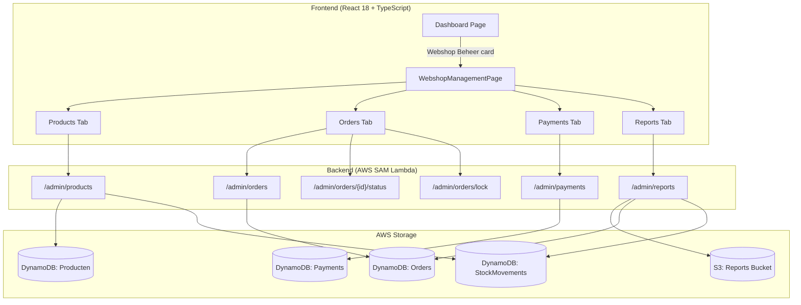
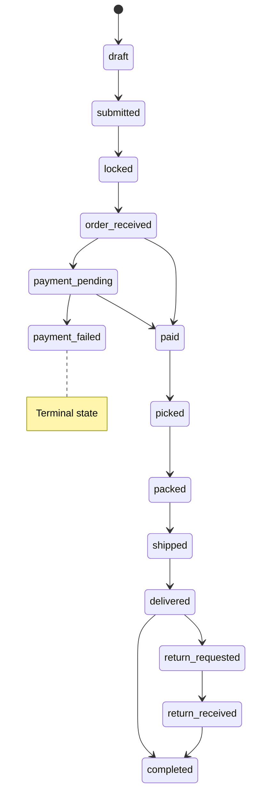

# Design Document: Admin Product Management

## Overview

This design restructures the existing PresMeet admin functionality into a unified webshop management section at `/webshop_management`, accessible from the main H-DCN dashboard. The section consolidates product management, order lifecycle tracking, payment reconciliation, and reporting into a single admin hub with multi-tenant support.

The architecture follows the existing H-DCN patterns: React 18 + TypeScript + Chakra UI v2 frontend with a new `webshop-management` module, AWS SAM backend with one Lambda per endpoint, DynamoDB for persistence, and S3 for report snapshots. The existing `FunctionGuard` component handles role-based UI gating, while the shared auth layer (`validate_permissions_with_regions`) protects backend endpoints.

Key design decisions:

- **Unified product records**: Merge current "config" and "catalog" records into a single DynamoDB item per product
- **Parent/child variant model**: Every product has at least one variant (Default_Variant for simple products). Stock is always at the variant level; parent products never store stock/sold_count
- **Per-variant allow_oversell**: Each variant has its own `allow_oversell` boolean flag (defaults to false), set independently — not inherited from the parent
- **Default_Variant auto-creation**: Creating a product automatically creates a Default_Variant with `variant_attributes: {}`; adding attribute-based variants removes the Default_Variant
- **Tenant as a data field**: Orders and products carry a `tenant` field (e.g., "presmeet", "h-dcn") enabling generic filtering without tenant-specific code paths
- **Generic admin endpoints**: New `/admin/*` endpoints accept `tenant` query parameter, delegating to existing PresMeet logic when `tenant=presmeet`
- **S3-backed reports**: Report snapshots stored in S3, read on page load, regenerated on-demand

## Architecture



### Routing Structure

```
/webshop_management          → WebshopManagementPage (tab container)
/webshop_management/products → Products tab (embeds existing ProductManagementPage)
/webshop_management/orders   → Orders tab
/webshop_management/payments → Payments tab
/webshop_management/reports  → Reports tab
```

The route is protected by `FunctionGuard` with `requiredRoles={['Products_CRUD', 'Products_Read', 'Products_Export']}`. Within the section, individual actions are further gated by specific roles.

## Components and Interfaces

### Frontend Components

```
frontend/src/modules/webshop-management/
├── WebshopManagementPage.tsx       # Tab container with role-based tab visibility
├── components/
│   ├── ProductsTab.tsx             # Wraps existing ProductManagementPage + tenant filter
│   ├── OrdersTab.tsx               # Order list with tenant filter, state transitions
│   ├── OrderDetailDrawer.tsx       # Order detail panel (line items, history, payments)
│   ├── PaymentsTab.tsx             # Payment stats + manual payment form
│   ├── ReportsTab.tsx              # Report display + export controls
│   ├── TenantFilter.tsx            # Shared tenant filter dropdown component
│   ├── StatusBadge.tsx             # Shared status badge with color mapping
│   ├── VariantSubTable.tsx         # Variant display within product detail
│   └── BulkVariantCreator.tsx      # Modal for generating variant combinations
├── hooks/
│   ├── useAdminOrders.ts           # Orders data fetching + filtering
│   ├── useAdminPayments.ts         # Payment stats + recording
│   ├── useAdminReports.ts          # Report loading + export
│   └── useTenantFilter.ts         # Shared tenant filter state
├── services/
│   └── adminApi.ts                 # API client for /admin/* endpoints
└── types/
    └── admin.types.ts              # TypeScript interfaces
```

### Backend Handlers (new)

| Handler                      | Method | Path                                            | Permission      |
| ---------------------------- | ------ | ----------------------------------------------- | --------------- |
| `admin_get_products`         | GET    | `/admin/products`                               | Products_Read   |
| `admin_create_product`       | POST   | `/admin/products`                               | Products_CRUD   |
| `admin_update_product`       | PUT    | `/admin/products/{id}`                          | Products_CRUD   |
| `admin_create_variant`       | POST   | `/admin/products/{id}/variants`                 | Products_CRUD   |
| `admin_update_variant`       | PUT    | `/admin/products/{id}/variants/{vid}`           | Products_CRUD   |
| `admin_bulk_create_variants` | POST   | `/admin/products/{id}/variants/bulk`            | Products_CRUD   |
| `admin_add_stock`            | POST   | `/admin/products/{id}/variants/{vid}/stock`     | Products_CRUD   |
| `admin_get_stock_movements`  | GET    | `/admin/products/{id}/variants/{vid}/movements` | Products_Read   |
| `admin_get_orders`           | GET    | `/admin/orders`                                 | Products_Read   |
| `admin_update_order_status`  | PUT    | `/admin/orders/{id}/status`                     | Products_CRUD   |
| `admin_lock_orders`          | POST   | `/admin/orders/lock`                            | Products_CRUD   |
| `admin_unlock_order`         | POST   | `/admin/orders/{id}/unlock`                     | Products_CRUD   |
| `admin_get_payments`         | GET    | `/admin/payments`                               | Products_Read   |
| `admin_record_payment`       | POST   | `/admin/payments`                               | Products_CRUD   |
| `admin_generate_report`      | POST   | `/admin/reports/generate`                       | Products_CRUD   |
| `admin_get_report`           | GET    | `/admin/reports`                                | Products_Read   |
| `admin_export_report`        | GET    | `/admin/reports/export`                         | Products_Export |

All endpoints accept `?tenant=presmeet|h-dcn` query parameter. When omitted, all tenants are returned.

### API Interfaces

```typescript
// GET /admin/orders?tenant=presmeet&status=submitted
interface AdminOrdersResponse {
  orders: AdminOrder[];
  total_count: number;
}

interface AdminOrder {
  order_id: string;
  tenant: string;
  customer_name: string;
  club_name?: string;
  status: OrderStatus;
  payment_status: "paid" | "partial" | "unpaid";
  total_amount: number;
  amount_paid: number;
  outstanding: number;
  created_at: string;
  submitted_at?: string;
  items: OrderLineItem[];
  status_history: StatusHistoryEntry[];
  payments: PaymentRecord[];
}

type OrderStatus =
  | "draft"
  | "submitted"
  | "locked"
  | "order_received"
  | "payment_pending"
  | "payment_failed"
  | "paid"
  | "picked"
  | "packed"
  | "shipped"
  | "delivered"
  | "return_requested"
  | "return_received"
  | "completed";

interface StatusHistoryEntry {
  from_status: OrderStatus;
  to_status: OrderStatus;
  timestamp: string;
  triggered_by: string; // user email
}

// PUT /admin/orders/{id}/status
interface UpdateOrderStatusRequest {
  target_status: OrderStatus;
}

// POST /admin/payments
interface RecordPaymentRequest {
  order_id: string;
  amount: number; // 0.01 - 999999.99
  date: string; // ISO 8601
  description?: string; // max 255 chars
}

// GET /admin/reports?tenant=presmeet
interface ReportResponse {
  generated_at: string;
  summary: {
    total_orders: number;
    total_revenue: number;
    total_paid: number;
    total_outstanding: number;
    by_product_type?: Record<string, Record<OrderStatus, number>>;
    by_product?: {
      product_name: string;
      items_sold: number;
      revenue: number;
    }[];
    purchase_cost?: {
      total_inbound_cost: number;
      by_variant?: {
        variant_id: string;
        product_name: string;
        weighted_avg_cost: number;
        selling_price: number;
        gross_margin: number;
      }[];
    };
  };
}

// GET /admin/reports/export?tenant=h-dcn&format=csv|json
// Returns file download

// --- Product & Variant Interfaces ---

interface AdminProduct {
  product_id: string;
  tenant: string;
  name: string;
  description?: string;
  price: number;
  active: boolean;
  product_type?: string;
  max_per_club?: number | null;
  min_per_club?: number | null;
  required_attributes?: object | null;
  is_parent: boolean;
  variants: AdminVariant[];
  // Note: parent product does NOT have stock, sold_count, or allow_oversell
}

interface AdminVariant {
  product_id: string;
  parent_id: string;
  variant_attributes: Record<string, string>; // {} for Default_Variant
  price?: number | null; // null = inherit parent price
  stock: number;
  sold_count: number;
  allow_oversell: boolean; // defaults to false, set independently per variant
  active: boolean;
}

// POST /admin/products/{id}/variants
interface CreateVariantRequest {
  variant_attributes: Record<string, string>;
  price?: number | null;
  stock?: number; // defaults to 0
  allow_oversell?: boolean; // defaults to false
}

// PUT /admin/products/{id}/variants/{variant_id}
interface UpdateVariantRequest {
  stock?: number;
  allow_oversell?: boolean;
  price?: number | null;
  active?: boolean;
}

// POST /admin/products (creates product + Default_Variant automatically)
interface CreateProductRequest {
  tenant: string;
  name: string;
  description?: string;
  price: number;
  product_type?: string;
  max_per_club?: number | null;
  min_per_club?: number | null;
  required_attributes?: object | null;
  // Default_Variant is auto-created; no stock fields on product itself
}

// --- Stock Movement Interfaces ---

// POST /admin/products/{id}/variants/{vid}/stock
interface AddStockRequest {
  quantity: number; // positive integer
  purchase_price_per_unit: number; // 0.01 - 999999.99
  supplier_name: string; // max 100 chars
  reference?: string; // max 255 chars
}

interface StockMovement {
  movement_id: string;
  variant_id: string;
  tenant: string;
  type: "inbound" | "sale";
  quantity: number; // positive for inbound, negative for sale
  purchase_price_per_unit?: number | null;
  total_cost?: number | null;
  supplier_name?: string | null;
  recorded_by: string;
  reference?: string | null;
  order_id?: string | null;
  created_at: string;
}

// GET /admin/products/{id}/variants/{vid}/movements
interface StockMovementsResponse {
  movements: StockMovement[];
  total_count: number;
}
```

## Data Models

### Producten Table (DynamoDB) — Unified Record

```json
{
  "product_id": "prod_abc123",
  "tenant": "presmeet",
  "name": "Meeting Ticket",
  "naam": "Meeting Ticket",
  "description": "Ticket for the Presidents' Meeting",
  "price": 150.0,
  "prijs": "150.00",
  "active": true,
  "product_type": "meeting_ticket",
  "groep": "presmeet",
  "subgroep": "tickets",

  "max_per_club": 5,
  "min_per_club": 1,
  "required_attributes": {
    "type": "object",
    "properties": {
      "gender": { "type": "string", "enum": ["male", "female"] },
      "size": {
        "type": "string",
        "enum": ["S", "M", "L", "XL", "XXL", "3XL", "4XL"]
      }
    }
  },

  "parent_id": null,
  "is_parent": true,
  "variant_attributes": null,

  "created_at": "2024-01-15T10:00:00Z",
  "updated_at": "2024-06-01T14:30:00Z"
}
```

Note: Parent product records do NOT store `stock`, `sold_count`, or `allow_oversell`. Stock is tracked exclusively at the variant level. Every product — including simple products like badges — has at least one variant (the Default_Variant). The `allow_oversell` flag is set independently per variant.

### Simple Product with Default_Variant (in Producten table)

A simple product (e.g., a badge or sticker) is a parent record with a single Default_Variant. The parent stores catalog data and configuration; the Default_Variant stores stock.

**Parent record:**

```json
{
  "product_id": "prod_badge001",
  "tenant": "h-dcn",
  "name": "H-DCN Pin Badge",
  "naam": "H-DCN Pin Badge",
  "description": "Official H-DCN pin badge",
  "price": 5.0,
  "prijs": "5.00",
  "active": true,
  "product_type": "merchandise",
  "groep": "h-dcn",
  "subgroep": "badges",

  "max_per_club": null,
  "min_per_club": null,
  "required_attributes": null,

  "parent_id": null,
  "is_parent": true,
  "variant_attributes": null,

  "created_at": "2024-03-01T09:00:00Z",
  "updated_at": "2024-06-10T11:00:00Z"
}
```

**Default_Variant record (auto-created with the product):**

```json
{
  "product_id": "var_badge001_default",
  "parent_id": "prod_badge001",
  "tenant": "h-dcn",
  "name": "H-DCN Pin Badge",
  "is_parent": false,
  "variant_attributes": {},
  "price": null,
  "stock": 100,
  "sold_count": 12,
  "allow_oversell": false,
  "active": true,
  "created_at": "2024-03-01T09:00:00Z",
  "updated_at": "2024-06-10T11:00:00Z"
}
```

The Default_Variant has empty `variant_attributes` (`{}`). When attribute-based variants are added to this product, the Default_Variant is removed. The cart always links to this variant record, never directly to the parent.

### Variant Record (child in Producten table)

```json
{
  "product_id": "var_xyz789",
  "parent_id": "prod_abc123",
  "tenant": "presmeet",
  "name": "Meeting Ticket - Male XL",
  "is_parent": false,
  "variant_attributes": {
    "gender": "male",
    "size": "XL"
  },
  "price": null,
  "stock": 25,
  "sold_count": 3,
  "allow_oversell": false,
  "active": true,
  "created_at": "2024-01-15T10:05:00Z",
  "updated_at": "2024-06-01T14:30:00Z"
}
```

Each variant record stores its own `allow_oversell` boolean flag (defaults to `false`). This flag is set independently per variant — it is NOT inherited from the parent product. The system evaluates the variant's own `allow_oversell` value when determining whether a cart addition is permitted.

### StockMovements Table (DynamoDB)

A dedicated DynamoDB table for tracking all stock movements (inbound purchases and outbound sales) per variant.

**Inbound movement example:**

```json
{
  "movement_id": "mov_abc123",
  "variant_id": "var_xyz789",
  "tenant": "presmeet",
  "type": "inbound",
  "quantity": 50,
  "purchase_price_per_unit": 8.5,
  "total_cost": 425.0,
  "supplier_name": "Textile BV",
  "recorded_by": "admin@h-dcn.nl",
  "reference": "PO-2024-003",
  "order_id": null,
  "created_at": "2024-06-10T09:00:00Z"
}
```

**Sale movement example (auto-created when order transitions to "paid"):**

```json
{
  "movement_id": "mov_def456",
  "variant_id": "var_xyz789",
  "tenant": "presmeet",
  "type": "sale",
  "quantity": -2,
  "purchase_price_per_unit": null,
  "total_cost": null,
  "supplier_name": null,
  "recorded_by": "system",
  "reference": null,
  "order_id": "ord_def456",
  "created_at": "2024-06-15T14:30:00Z"
}
```

**Key**: `movement_id` (S)

**GSIs**:

- `variant_id-index`: Partition key = `variant_id`, Sort key = `created_at` — for querying all movements per variant
- `tenant-index`: Partition key = `tenant`, Sort key = `created_at` — for tenant-filtered reporting

### Orders Table — Extended Schema

```json
{
  "order_id": "ord_def456",
  "tenant": "presmeet",
  "source": "presmeet",
  "user_email": "president@club.nl",
  "customer_name": "Jan de Vries",
  "club_name": "H-DCN Regio Noord",
  "club_id": "club_001",
  "status": "submitted",
  "payment_status": "unpaid",
  "total_amount": 750.0,
  "amount_paid": 0,
  "items": [
    {
      "product_id": "prod_abc123",
      "variant_id": "var_xyz789",
      "product_type": "meeting_ticket",
      "name": "Meeting Ticket - Male XL",
      "quantity": 2,
      "unit_price": 150.0,
      "attributes": { "gender": "male", "size": "XL" }
    }
  ],
  "status_history": [
    {
      "from_status": "draft",
      "to_status": "submitted",
      "timestamp": "2024-06-01T14:30:00Z",
      "triggered_by": "president@club.nl"
    }
  ],
  "created_at": "2024-05-28T09:00:00Z",
  "submitted_at": "2024-06-01T14:30:00Z"
}
```

### Order State Machine



State transitions allow forward skipping (e.g., `order_received` → `paid` directly) provided the target is reachable in the defined sequence. The `locked` → `submitted` unlock is the only backward transition allowed.

### Valid Transition Logic (Backend)

```python
ORDERED_STATES = [
    'draft', 'submitted', 'locked', 'order_received',
    'payment_pending', 'paid', 'picked', 'packed',
    'shipped', 'delivered', 'return_requested',
    'return_received', 'completed'
]

SPECIAL_TRANSITIONS = {
    'order_received': ['payment_pending', 'paid'],
    'payment_pending': ['paid', 'payment_failed'],
    'delivered': ['return_requested', 'completed'],
    'locked': ['submitted'],  # unlock
}

def is_valid_transition(current: str, target: str) -> bool:
    # Special case: unlock
    if current == 'locked' and target == 'submitted':
        return True
    # Terminal state
    if current == 'payment_failed':
        return False
    # Check if target is reachable forward
    if current in ORDERED_STATES and target in ORDERED_STATES:
        current_idx = ORDERED_STATES.index(current)
        target_idx = ORDERED_STATES.index(target)
        if target_idx > current_idx:
            return True
    # Special transitions
    if current in SPECIAL_TRANSITIONS:
        return target in SPECIAL_TRANSITIONS[current]
    return False


def reserve_stock(order_items: list, producten_table) -> None:
    """
    Decrement stock and increment sold_count when an order transitions to 'paid'.
    Stock is ALWAYS on variant records — including Default_Variants for simple products.
    Every cart item has a variant_id; there is no path that targets a parent product directly.
    Also creates sale movement records in the StockMovements table for each line item.
    """
    import uuid
    from datetime import datetime, timezone

    movements_table = boto3.resource('dynamodb').Table(os.environ['STOCK_MOVEMENTS_TABLE_NAME'])

    for item in order_items:
        variant_id = item['variant_id']
        quantity = item['quantity']
        order_id = item.get('order_id')
        tenant = item.get('tenant')

        # Decrement stock and increment sold_count on the variant
        producten_table.update_item(
            Key={'product_id': variant_id},
            UpdateExpression='SET stock = stock - :qty, sold_count = sold_count + :qty',
            ExpressionAttributeValues={':qty': quantity}
        )

        # Create sale movement record
        movements_table.put_item(Item={
            'movement_id': f'mov_{uuid.uuid4().hex[:12]}',
            'variant_id': variant_id,
            'tenant': tenant,
            'type': 'sale',
            'quantity': -quantity,
            'purchase_price_per_unit': None,
            'total_cost': None,
            'supplier_name': None,
            'recorded_by': 'system',
            'reference': None,
            'order_id': order_id,
            'created_at': datetime.now(timezone.utc).isoformat()
        })
```

## Correctness Properties

_A property is a characteristic or behavior that should hold true across all valid executions of a system — essentially, a formal statement about what the system should do. Properties serve as the bridge between human-readable specifications and machine-verifiable correctness guarantees._

### Property 1: Role-Based Access Control

_For any_ user and action within the webshop management section, access is granted if and only if the user possesses the minimum required role: `Products_Read` for viewing, `Products_CRUD` for mutations (create, update, delete, lock/unlock, record payment), and `Products_Export` for CSV downloads. Users with no qualifying Products\_\* role shall receive a 403 denial.

**Validates: Requirements 1.5, 7.1, 7.2, 7.3, 7.9**

### Property 2: Tenant Filter Correctness

_For any_ collection of records (products, orders, or payments) and any selected tenant filter value, the filtered result shall contain only records whose `tenant` field matches the filter value. When no tenant filter is specified (or "all" is selected), the result shall contain records from all tenants.

**Validates: Requirements 2.3, 4.4, 5.7, 8.3, 8.4**

### Property 3: Product Data Round-Trip

_For any_ valid product creation or update payload containing both catalog fields (name, price, description, active) and configuration fields (max_per_club, min_per_club, required_attributes, product_type), saving the product and then retrieving it shall return a single record containing all submitted fields with their original values.

**Validates: Requirements 2.1, 2.5, 2.6**

### Property 4: Product Validation Constraints

_For any_ product save attempt, the system shall reject the operation if: (a) `min_per_club` exceeds `max_per_club`, (b) `required_attributes` contains malformed JSON or conflicting constraints, or (c) a variant's attribute values do not conform to the parent's `required_attributes` enum definitions. Valid inputs shall be accepted.

**Validates: Requirements 2.7, 2.8, 3.5**

### Property 5: Parent-Child Variant Structure

_For any_ parent product with variants, each variant record shall have a `parent_id` equal to the parent's `product_id`, shall contain variant-specific attribute values (or `{}` for a Default_Variant), stock quantity, sold_count, and an `allow_oversell` boolean flag (defaulting to `false`). A variant's effective price shall equal its own price if set, otherwise the parent's price. The parent product record shall NOT store stock, sold_count, or allow_oversell.

**Validates: Requirements 3.1, 3.2, 3.3, 3.4, 3.13**

### Property 6: Variant Aggregation Correctness

_For any_ parent product with N variants, the displayed aggregated total stock shall equal the sum of `stock` across all N variants, and the aggregated total sold shall equal the sum of `sold_count` across all N variants.

**Validates: Requirements 3.8**

### Property 7: Bulk Variant Generation

_For any_ parent product whose `required_attributes` defines M enum fields with cardinalities C₁, C₂, ..., Cₘ, bulk variant creation shall generate exactly C₁ × C₂ × ... × Cₘ variant records, each with a unique combination of attribute values, all referencing the parent's `product_id`.

**Validates: Requirements 3.9**

### Property 8: Order State Transition Validity

_For any_ order in state S and any target state T, the transition shall succeed if and only if T is reachable from S according to the defined state sequence (forward skipping allowed) or T is `submitted` when S is `locked` (unlock). If the transition is invalid, the order status shall remain unchanged and an error shall be returned.

**Validates: Requirements 4.2, 4.14**

### Property 9: State Transition History

_For any_ successful state transition on an order, the order's `status_history` array shall gain exactly one new entry containing the previous status, the new status, a timestamp within acceptable clock drift, and the email of the user who triggered the transition.

**Validates: Requirements 4.13**

### Property 10: Stock Reservation on Payment

_For any_ order transitioning to "paid" status, each line item SHALL have stock decremented by exactly the line item's quantity on the variant record (via `variant_id`). Stock is always reserved at the variant level — including for simple products whose cart items point to the Default_Variant. The corresponding `sold_count` SHALL be incremented by the same quantity on that variant record.

**Validates: Requirements 4.15, 3.1, 3.8**

### Property 11: Bulk Lock Correctness

_For any_ set of orders matching the current tenant filter, executing "Lock ALL" shall transition exactly those orders in "submitted" status to "locked" status. Orders in any other status shall remain unchanged.

**Validates: Requirements 4.10**

### Property 12: Payment Aggregate Correctness

_For any_ set of orders and their associated payments filtered by the active tenant, the displayed `total_charged` shall equal the sum of all order `total_amount` values, `total_paid` shall equal the sum of all payment amounts, and `total_outstanding` shall equal `total_charged - total_paid`.

**Validates: Requirements 5.1**

### Property 13: Payment Recording Round-Trip

_For any_ valid manual payment submission (amount between €0.01 and €999,999.99, valid order_id, ISO date), the payment shall be persisted and the associated order's `amount_paid` shall increase by exactly the submitted amount, with `payment_status` correctly reflecting whether the order is now "paid", "partial", or remains "unpaid".

**Validates: Requirements 5.2, 5.3**

### Property 14: Report Export Tenant Filtering

_For any_ report snapshot and active tenant filter, CSV export shall produce rows containing only records matching the tenant filter with a flat structure (customer/club name, order status, product_type, quantity, unit price, attribute values). JSON export shall produce the full nested structure with only matching records included.

**Validates: Requirements 6.6**

### Property 15: Oversell Control

_For any_ cart addition attempt targeting a variant (including Default_Variants), if that variant's `allow_oversell` is `false` and the current stock minus the requested quantity would be zero or negative, the system SHALL reject the addition. If the variant's `allow_oversell` is `true`, the addition SHALL succeed regardless of current stock level. The `allow_oversell` flag is always read directly from the variant record itself, never inherited from the parent.

**Validates: Requirements 3.12, 3.13, 3.14, 3.15**

### Property 16: Default_Variant Auto-Creation and Removal

_For any_ newly created product, the system SHALL automatically create exactly one Default_Variant (with `variant_attributes: {}`, `stock: 0`, `sold_count: 0`, `allow_oversell: false`) referencing the product as its parent. When attribute-based variants are added to a product that currently has only a Default_Variant, the Default_Variant SHALL be removed, leaving only the attribute-based variants.

**Validates: Requirements 2.5, 3.1, 3.7**

### Property 17: Cart Always Links to Variant

_For any_ cart item in the system, the item SHALL reference a `variant_id` pointing to a variant record (either a Default_Variant or an attribute-based variant). No cart item shall directly reference a parent product record for stock operations.

**Validates: Requirements 3.8**

### Property 18: Inbound Stock Movement Consistency

_For any_ valid inbound stock movement recorded against a variant, the variant's `stock` field SHALL be incremented by exactly the submitted quantity. The stock movement record SHALL contain the variant_id, tenant (matching the variant's tenant), type "inbound", quantity, purchase_price_per_unit, total_cost (= quantity × purchase_price_per_unit), supplier_name, recorded_by (user email), and a timestamp.

**Validates: Requirements 9.3, 9.4**

### Property 19: Sale Movement Auto-Creation

_For any_ order transitioning to "paid" status, for each line item in the order, the system SHALL create exactly one stock movement record with type "sale", the line item's variant_id, the order's tenant, quantity as negative (= -1 × line_item_quantity), and order_id referencing the triggering order.

**Validates: Requirements 9.5**

### Property 20: Stock Movement Tenant Consistency

_For any_ stock movement record, its `tenant` field SHALL equal the `tenant` field of the variant it references. Stock movement queries filtered by tenant SHALL return only movements whose `tenant` field matches the filter.

**Validates: Requirements 9.3, 9.8**

## Error Handling

### Frontend Error Handling

| Scenario                                   | Handling                                                   |
| ------------------------------------------ | ---------------------------------------------------------- |
| API returns 401 (session expired)          | Redirect to login page                                     |
| API returns 403 (insufficient permissions) | Display 403 forbidden message, disable actions             |
| API returns 4xx validation error           | Display error toast with server-provided message           |
| API returns 5xx server error               | Display generic error toast, preserve form state           |
| Network timeout                            | Display retry prompt toast                                 |
| Lock/unlock operation fails                | Error toast with reason, order status unchanged            |
| Payment recording fails                    | Error toast with reason, form inputs preserved             |
| Report generation fails                    | Error toast with reason, existing snapshot remains visible |

### Backend Error Handling

| Scenario                   | Response                                                                           |
| -------------------------- | ---------------------------------------------------------------------------------- |
| Invalid state transition   | 409 Conflict with `{ error: "Invalid transition", current_status, target_status }` |
| Product validation failure | 400 Bad Request with `{ error: "Validation failed", details: [...] }`              |
| Order not found            | 404 Not Found                                                                      |
| Concurrent modification    | 409 Conflict with `{ error: "Order modified by another user" }`                    |
| DynamoDB throttling        | 503 Service Unavailable with retry-after                                           |
| S3 write failure           | 500 Internal Server Error, log for CloudWatch alarm                                |
| Invalid payment amount     | 400 Bad Request with `{ error: "Amount must be between 0.01 and 999999.99" }`      |

### Optimistic Locking

Orders use a `version` field for optimistic locking. The `admin_update_order_status` handler reads the current version, validates the transition, and uses a DynamoDB conditional write (`ConditionExpression: version = :expected_version`) to prevent race conditions when multiple admins operate simultaneously.

## Testing Strategy

### Property-Based Tests (Hypothesis — Python backend)

Property-based testing is appropriate for this feature because:

- The order state machine has complex transition logic with many input combinations
- Tenant filtering is universal across multiple data sets
- Variant generation involves combinatorial input spaces
- Payment calculations are pure arithmetic over varying inputs

**Library**: [Hypothesis](https://hypothesis.readthedocs.io/) (already present in `backend/.hypothesis/`)
**Configuration**: Minimum 100 iterations per property test
**Tag format**: `# Feature: admin-product-management, Property {N}: {title}`

Tests will be located at `backend/tests/unit/test_admin_properties.py` and cover:

- State transition validity (Property 8)
- Tenant filter correctness (Property 2)
- Bulk variant generation (Property 7)
- Payment aggregate correctness (Property 12)
- Variant aggregation (Property 6)
- Product validation constraints (Property 4)
- Stock reservation always targets variant records (Property 10)
- Oversell control per variant (Property 15)
- Default_Variant auto-creation and removal (Property 16)
- Cart always links to variant (Property 17)
- Inbound stock movement consistency (Property 18)
- Sale movement auto-creation (Property 19)
- Stock movement tenant consistency (Property 20)

### Property-Based Tests (fast-check — TypeScript frontend)

For frontend logic that can be unit-tested:

- Role → action permission mapping (Property 1)
- Status badge color mapping (derived from Property 8)
- Payment status computation (Property 13)

**Library**: fast-check
**Location**: `frontend/src/modules/webshop-management/__tests__/`

### Unit Tests (Example-Based)

- Dashboard card rendering with various role sets
- Tab navigation and route rendering
- Order detail drawer data display
- Payment form validation (specific edge cases)
- CSV column headers and structure
- Lock/Unlock button visibility per order status

### Integration Tests

- End-to-end order state transition via API
- S3 report generation and retrieval
- Product CRUD with DynamoDB (using moto)
- Auth layer integration (token validation → permission check → handler response)

### Test File Structure

```
backend/tests/
├── unit/
│   ├── test_admin_properties.py        # Property-based tests (Hypothesis)
│   ├── test_order_state_machine.py     # Unit tests for state transition logic
│   ├── test_product_validation.py      # Unit tests for validation rules
│   └── test_payment_calculations.py    # Unit tests for payment math
├── integration/
│   └── test_admin_endpoints.py         # API integration tests (moto)

frontend/src/modules/webshop-management/__tests__/
├── admin.properties.test.ts            # Property-based tests (fast-check)
├── WebshopManagementPage.test.tsx      # Component rendering tests
├── OrdersTab.test.tsx                  # Order management tests
└── adminApi.test.ts                    # API client tests
```
