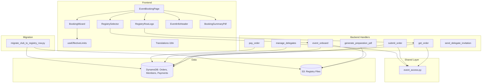

# Design Document: Generic Registry Row Refactor

## Overview

This refactor replaces all `club_*` naming throughout the event booking system with generic `registry_row_*` names. The registry concept already exists — an S3-based table with rows containing an ID, label, and optional logo — but the codebase hardcodes "club" everywhere. After this refactor, the same system can serve clubs, teams, schools, families, or any registration unit.

**Scope:**

- Backend: 8+ Lambda handlers, shared layer, migration script, PDF generation
- Frontend: TypeScript interfaces, 5+ components, hooks, translations (8 languages)
- Data: DynamoDB records (Orders, Members, Payments, Products)

**Key design decisions:**

1. Migration-first strategy — data is fully migrated before code deploy; handlers use only new field names
2. Migration script is idempotent with --dry-run support
3. `PurchaseRules` renames to `max_per_order` / `min_per_order` (semantic: "per order" is clearer than "per row")
4. `CountingRule` value: `count_distinct_rows`
5. `order_scope` field removed from events — scope is derived from presence of `registry_config`
6. TypedDict + validate functions per steering rules (no Pydantic)
7. Translations use `{{rowLabel}}` interpolation resolved from `event.registry_config.row_label`

---

## Architecture



### Rollout Strategy

The refactor uses a migration-first approach — data is fully converted before new code is deployed:

1. **Run migration** with `--dry-run` to verify changes
2. **Run migration** actual execution
3. **Validate** with `--validate` flag (all records have new fields, no old fields remain)
4. **Deploy backend** (uses only new field names — no fallback code)
5. **Deploy frontend** with new interfaces and components
6. **Remove old fields** with `--remove-old-fields` (cleanup pass for any residual old fields)

---

## Components and Interfaces

### Backend — Shared Layer Changes

**`backend/layers/auth-layer/python/shared/event_access.py`**

```python
def get_registry_row_id(user_email: str) -> str | None:
    """
    Look up a member's registry_row_id by email address.
    Replaces get_club_id(). Returns None if member not found or field absent.
    """
    ...
```

### Backend — Handler Changes

#### `get_order/app.py`

```python
def _resolve_order_scope(event_record: dict) -> str:
    """
    Derive order scope from event config.
    If registry_config exists → row-scoped (one order per registry row).
    Otherwise → member-scoped (one order per member).
    """
    if event_record.get('registry_config'):
        return 'registry_row'
    return 'member'


def _resolve_registry_row_data(event_record: dict, registry_row_id: str) -> tuple[str | None, str | None]:
    """
    Resolve label and logo_url from S3 registry file for a given row_id.
    Returns (label, logo_url). Label may be None if row not found.
    """
    ...


def _create_draft_order(
    source_id: str,
    member_id: str,
    registry_row_id: str | None = None,
    registry_row_label: str | None = None,
    registry_row_logo_url: str | None = None,
    is_row_scope: bool = False,
) -> dict:
    """Create a new draft order with registry row data resolved from S3."""
    order = {
        'order_id': str(uuid.uuid4()),
        'source_id': source_id,
        'member_id': member_id,
        'status': 'draft',
        'items': [],
        'version': 1,
        'created_at': now,
        'updated_at': now,
    }
    if is_row_scope and registry_row_id:
        order['registry_row_id'] = registry_row_id
        order['registry_row_label'] = registry_row_label
        order['registry_row_logo_url'] = registry_row_logo_url
        order['delegates'] = {'primary_member_id': member_id}
    return order
```

#### `submit_order/app.py`

- `_calculate_sold_counts()`: filter by `order.get('registry_row_id')`
- `_validate_event_persons()`: read `max_per_order` from `purchase_rules`
- Constraint validation: read `counting_rule` from event constraints (after migration, only `count_distinct_rows` exists)

#### `event_onboard/app.py`

- Store only `registry_row_id` on member record (just the ID — for delegate validation)
- Resolve `registry_row_label` and `registry_row_logo_url` from S3 registry file only when needed (at order creation, not on the member)

#### `manage_delegates/app.py`

- Verify target member's `registry_row_id` matches order's `registry_row_id`

#### `pay_order/app.py`

- Payment record uses `registry_row_id` instead of `club_id`

#### `admin_event_claims/app.py`

- `_find_order_for_row()`: filter by `registry_row_id` instead of `club_id`
- `_create_draft_order_for_claim()`: store `registry_row_id`, `registry_row_label`, `registry_row_logo_url` (resolved from S3) instead of `club_id: row_id`

#### `upload_club_logo/app.py` → rename to `upload_registry_logo/app.py`

- Rename handler directory and function name
- Endpoint changes from `/presmeet/logo` to `/events/{event_id}/registry-logo`
- Accepts `event_id` and `row_id` as parameters
- SAM template: rename function resource accordingly

#### `generate_preparation_pdf/app.py`

- Rename `_sort_key_club_name` → `_sort_key_row_label`
- CSS class `club-name` → `row-name`, `club-logo` → `row-logo`
- Header format: `"{row_label}: {name}"` where `row_label` comes from `event.registry_config.row_label` (fallback: "row")
- All local variables: `club_name` → `row_label`, `club_id` → `row_id`

#### `send_delegate_invitation/app.py`

- Template context: `ROW_LABEL` + `ROW_NAME` instead of `CLUB_NAME`
- Resolution: from order `registry_row_label`, fallback to `registry_claims[row_id].label`
- Final fallback: `ROW_LABEL` = "group", `ROW_NAME` = `registry_row_id`

### Frontend — Type Changes

**`eventBooking.types.ts`**

```typescript
export interface Order {
  order_id: string;
  source_id: string;
  member_id: string;
  registry_row_id?: string; // was: club_id
  registry_row_label?: string; // NEW
  registry_row_logo_url?: string; // NEW
  // ... rest unchanged
}

export interface PurchaseRules {
  min_per_order?: number; // was: min_per_club
  max_per_order?: number; // was: max_per_club
  max_per_event?: number; // unchanged
  order_mode?: "persistent";
}

export type CountingRule =
  | "count_items_by_product"
  | "count_distinct_rows"
  | "sum_field";

export interface PaymentRecord {
  payment_id: string;
  order_id: string;
  registry_row_id: string; // was: club_id
  amount: number;
  // ... rest unchanged
}
```

### Frontend — Component Changes

| Old                    | New               | Change                                                                                                                   |
| ---------------------- | ----------------- | ------------------------------------------------------------------------------------------------------------------------ |
| `ClubLogoUploader`     | `RegistryRowLogo` | Rename, show logo from `order.registry_row_logo_url`                                                                     |
| `OnboardingFlow`       | Remove            | Replace with `RegistrySelector` in EventBookingPage                                                                      |
| `EventBookingPage`     | Update            | Use `order.registry_row_id`, show `RegistrySelector` if missing                                                          |
| `BookingSummaryPdf`    | Update            | Filename uses `registry_row_label`, header uses label, logo displayed from `registry_row_logo_url`                       |
| `EventInfoHeader`      | Update            | Compact layout with capacity info                                                                                        |
| `useEffectiveLimits`   | Update            | Read `max_per_order` directly                                                                                            |
| `AdminOrderLockUnlock` | Update            | `OrderSummary.club_id` → `registry_row_id`, `club_name` → `registry_row_label`, display column uses `registry_row_label` |

### Frontend — `useEffectiveLimits` Hook

```typescript
// After migration, products only have max_per_order
const maxPerOrder = product.purchase_rules?.max_per_order;
```

### Frontend — `RegistryRowLogo` Component

```typescript
interface RegistryRowLogoProps {
  logoUrl: string | null | undefined;
  label?: string;
  isAdmin?: boolean;
  onUpload?: (file: File) => void;
}
```

Displays a 48×48 rounded image if `logoUrl` is non-empty, otherwise shows a camera icon placeholder.

### Frontend — `authHeaders.ts`

Add `event_participant` to the valid roles whitelist in `filterValidRoles()`.

---

## Data Models

### DynamoDB Field Changes

#### Orders Table

| Old Field | New Field               | Type           | Notes                                |
| --------- | ----------------------- | -------------- | ------------------------------------ |
| `club_id` | `registry_row_id`       | String         | Required for row-scoped orders       |
| —         | `registry_row_label`    | String         | Copied from member at order creation |
| —         | `registry_row_logo_url` | String \| null | Copied from member, null if absent   |

#### Members Table

| Old Field | New Field         | Type   | Notes                                               |
| --------- | ----------------- | ------ | --------------------------------------------------- |
| `club_id` | `registry_row_id` | String | Set during onboarding; used for delegate validation |

Only `registry_row_id` is stored on the Member. Label and logo are resolved from S3 at order creation time and stored on the Order (the read model). This avoids stale copies if the registry is updated.

#### Payments Table

| Old Field | New Field         | Type   | Notes                                 |
| --------- | ----------------- | ------ | ------------------------------------- |
| `club_id` | `registry_row_id` | String | Copied from order at payment creation |

#### Producten Table (purchase_rules sub-field)

| Old Field                      | New Field                      | Notes                          |
| ------------------------------ | ------------------------------ | ------------------------------ |
| `purchase_rules.max_per_club`  | `purchase_rules.max_per_order` | Migration renames              |
| `purchase_rules.min_per_club`  | `purchase_rules.min_per_order` | Migration renames              |
| `purchase_rules.max_per_event` | _(unchanged)_                  | Overall cap — no rename needed |
| `purchase_rules.order_mode`    | _(unchanged)_                  | e.g. `'persistent'`            |

#### Events Table

| Change                     | Notes                                                |
| -------------------------- | ---------------------------------------------------- |
| Remove `order_scope` field | Scope is now derived from `registry_config` presence |

No `order_scope` needed — `_resolve_order_scope()` checks if `registry_config` exists on the event.

### Migration Strategy

After migration, all records and config values use only new names. No backward compatibility code needed in handlers.

---

## Correctness Properties

_A property is a characteristic or behavior that should hold true across all valid executions of a system — essentially, a formal statement about what the system should do. Properties serve as the bridge between human-readable specifications and machine-verifiable correctness guarantees._

### Property 1: Order creation resolves registry row data from S3

_For any_ member record containing `registry_row_id`, when `_create_draft_order` is invoked with `is_row_scope=True`, the handler SHALL resolve `registry_row_label` and `registry_row_logo_url` from the S3 registry file (not from the Member record), and the resulting order SHALL contain all three fields.

**Validates: Requirements 1.1**

### Property 2: Scope derivation from registry_config

_For any_ event record, `_resolve_order_scope` SHALL return `'registry_row'` if `registry_config` is present (non-empty), and `'member'` if `registry_config` is absent or empty.

**Validates: Requirements 1.4**

### Property 3: get_registry_row_id resolves correctly

_For any_ member record in the Members table with a given email and `registry_row_id` field, calling `get_registry_row_id(email)` SHALL return that member's `registry_row_id` value. If the member has no `registry_row_id`, it SHALL return `None`.

**Validates: Requirements 2.3**

### Property 4: Delegate assignment validates registry_row_id match

_For any_ order with `registry_row_id = X` and a target member with `registry_row_id = Y`, the delegate assignment SHALL be accepted if and only if `X == Y`. When `X != Y`, the system SHALL reject with an error.

**Validates: Requirements 2.5**

### Property 5: PDF filename sanitization

_For any_ `registry_row_label` and `event_name` strings, the generated PDF filename SHALL match the pattern `booking-{sanitized_label}-{sanitized_name}.pdf` where sanitized means: lowercased, non-alphanumeric characters replaced with hyphens, consecutive hyphens collapsed, leading/trailing hyphens removed. When `registry_row_label` is absent/empty, fallback to "unknown".

**Validates: Requirements 3.5**

### Property 6: Purchase rules resolution

_For any_ product record, the effective `max_per_order` value SHALL be read from `purchase_rules.max_per_order` (absent means unlimited). The same applies for `min_per_order`. For any event constraint with `counting_rule`, after migration only `'count_distinct_rows'` exists as a value.

**Validates: Requirements 5.5**

### Property 7: PDF header labeling format

_For any_ event with `registry_config.row_label` and a registry row with a name, the PDF page header SHALL display the format `"{row_label}: {name}"` with the row logo (if available) rendered as a 50×50 image preceding the label. When `row_label` is absent or empty, the fallback `"row"` SHALL be used as prefix. When logo_url is absent, no image is rendered.

**Validates: Requirements 6.2, 6.3, 6.4**

### Property 8: Delegate email template context resolution

_For any_ order with `registry_row_label` set, the email template context SHALL contain `ROW_LABEL` = the label type (e.g. "club", "team") from `event.registry_config.row_label` and `ROW_NAME` = `order.registry_row_label`. When both are absent, SHALL fall back to `ROW_LABEL` = "group" and `ROW_NAME` = `registry_row_id`.

**Validates: Requirements 7.1, 7.2, 7.4**

### Property 9: Migration idempotency

_For any_ DynamoDB record, running the migration function twice SHALL produce the same result as running it once. Specifically: a record that already contains `registry_row_id` SHALL not be modified on subsequent runs. A record with `club_id` (and no `registry_row_id`) that exists in the S3 registry SHALL be converted exactly once.

**Validates: Requirements 11.1, 11.3, 11.5**

### Property 10: Migration validation correctness

_For any_ set of records across Orders, Members, and Payments tables, the `--validate` function SHALL report "pass" if and only if every record contains `registry_row_id` and no record contains `club_id`. Otherwise it SHALL report "fail" with the exact list of non-compliant record IDs.

**Validates: Requirements 11.7**

---

## Error Handling

Backend handlers return a machine-readable `error_code`. The frontend MUST use `t()` with the error code as translation key — never hardcode error messages.

**IMPORTANT — Never hardcode error messages in the frontend.** The frontend MUST use `t(`errors.${error_code}`, { rowLabel })` to display errors. The backend returns only the `error_code`; the human-readable text lives exclusively in the translation files.

| Scenario                                             | Handler            | HTTP | error_code              | Description (internal, not shown to user)         |
| ---------------------------------------------------- | ------------------ | ---- | ----------------------- | ------------------------------------------------- |
| Member has no `registry_row_id` for row-scoped event | `get_order`        | 403  | `REGISTRY_ROW_REQUIRED` | User must first select a registry row             |
| `row_id` not found in S3 registry                    | `event_onboard`    | 400  | `ROW_NOT_FOUND`         | Selected row does not exist in registry           |
| Delegate `registry_row_id` mismatch                  | `manage_delegates` | 403  | `DELEGATE_ROW_MISMATCH` | Target member belongs to a different registry row |
| Migration: `club_id` not in S3 registry              | migration script   | —    | —                       | Skip record, log warning, increment "skipped"     |
| `registry_row_logo_url` absent                       | `get_order`        | —    | —                       | Store `null` on order (field present but null)    |
| Unknown `order_scope` value                          | `get_order`        | 400  | `INVALID_ORDER_SCOPE`   | Unrecognized order_scope value                    |

**Backend response format:**

```json
{
  "error_code": "REGISTRY_ROW_REQUIRED"
}
```

The backend does NOT include a human-readable `message` field for user-facing errors. Only `error_code`.

**Frontend error display pattern (MUST follow this, no hardcoded strings for new errors):**

```typescript
// In the catch block where API errors are handled:
const errorCode = err?.response?.data?.error_code;
if (errorCode) {
  // New pattern (this refactor): error_code present → translate via i18n
  setError(t(`errors.${errorCode}`, { rowLabel }));
} else {
  // Legacy pattern (rest of the system): no error_code → use message string or generic fallback
  const msg = err?.response?.data?.message || err?.response?.data?.error;
  setError(msg || t("page.error_loading"));
}
```

The `error_code` field is the discriminator: if present, use `t()` for translation. If absent, fall back to the existing behavior (display `message` string or generic error). This ensures the new registry row errors are translated while existing handlers throughout the system continue working unchanged.

**Translation keys** (in `eventBooking` namespace, MUST exist in all 8 locale files):

| Key                            | Purpose                | Example NL value                                     |
| ------------------------------ | ---------------------- | ---------------------------------------------------- |
| `errors.REGISTRY_ROW_REQUIRED` | No row selected        | `"Selecteer eerst een {{rowLabel}} om door te gaan"` |
| `errors.ROW_NOT_FOUND`         | Row not in registry    | `"De geselecteerde {{rowLabel}} bestaat niet meer"`  |
| `errors.DELEGATE_ROW_MISMATCH` | Wrong row for delegate | `"Dit lid hoort bij een andere {{rowLabel}}"`        |
| `errors.INVALID_ORDER_SCOPE`   | Bad event config       | `"Ongeldige evenement configuratie"`                 |

All error keys use `{{rowLabel}}` interpolation where relevant, provided via the event's `registry_config.row_label`.

---

## Testing Strategy

### Property-Based Tests (Hypothesis — backend, fast-check — frontend)

Each correctness property above maps to one property-based test with minimum 100 iterations.

**Backend (Hypothesis):**

- `tests/unit/test_registry_row_refactor_properties.py`
- Properties 1–4, 6–10 (pure logic functions extracted into testable units)
- Tag format: `# Feature: generic-registry-row-refactor, Property {N}: {title}`

**Frontend (fast-check):**

- `src/modules/eventBooking/__tests__/registryRow.property.test.ts`
- Property 5 (filename sanitization), Property 6 (purchase rules resolution)
- Tag format: `// Feature: generic-registry-row-refactor, Property {N}: {title}`

**Configuration:**

- Hypothesis: `@settings(max_examples=100)`
- fast-check: `fc.assert(property, { numRuns: 100 })`

### Unit Tests (Example-Based)

| Area                     | Test file                          | Focus                                     |
| ------------------------ | ---------------------------------- | ----------------------------------------- |
| get_order handler        | `test_get_order.py`                | Row-scope creation, scope resolution      |
| submit_order handler     | `test_submit_order.py`             | Constraint validation with new names      |
| event_onboard handler    | `test_event_onboard.py`            | Member record fields, S3 resolution       |
| generate_preparation_pdf | `test_generate_preparation_pdf.py` | HTML output, CSS classes, sorting         |
| send_delegate_invitation | `test_send_delegate_invitation.py` | Template context                          |
| migration script         | `test_migration.py`                | Dry-run, idempotency, skip logic          |
| RegistryRowLogo          | `RegistryRowLogo.test.tsx`         | Logo display, placeholder fallback        |
| useEffectiveLimits       | `useEffectiveLimits.test.ts`       | max_per_order reading, absent = unlimited |

### Smoke Tests

- `npx tsc --noEmit` — zero type errors after interface changes
- `grep` for `/presmeet/clubs` in frontend — zero matches
- `grep` for `OnboardingFlow` imports in production code — zero matches
- `grep` for hardcoded "club" in translation files — zero matches (except `row_label_default`)

### Integration Tests

- Logo upload via `/events/{event_id}/registry-logo` endpoint
- `event_participant` role accepted without console warnings
- Migration script on test stage with `--dry-run` then actual run

---

## Migration Script Design

**Location:** `scripts/migrate_club_to_registry_row.py`

### CLI Interface

```
python scripts/migrate_club_to_registry_row.py \
  --stage test|prod \
  [--dry-run] \
  [--profile nonprofit-deploy] \
  [--validate] \
  [--remove-old-fields]
```

### Algorithm

```python
def migrate_table(table_name: str, s3_registry: dict, dry_run: bool) -> MigrationStats:
    """
    Scan table, for each record:
    1. If registry_row_id already present → skip (idempotent)
    2. If club_id present → resolve label+logo from registry
       a. If club_id not in registry → skip, log warning
       b. If found → write registry_row_id + label + logo_url
    3. Handle pagination (LastEvaluatedKey)
    4. Return stats: {scanned, converted, skipped, errored}
    """
```

### Idempotency

- Records with `registry_row_id` already set are never modified
- `club_id` is NOT removed during migration (only during `--remove-old-fields` after validation)
- The script can be safely re-run at any time

### Tables Affected

1. **Orders** — `club_id` → `registry_row_id` + add `registry_row_label`, `registry_row_logo_url` (resolved from S3)
2. **Members** — `club_id` → `registry_row_id` (only the ID; no label/logo needed)
3. **Payments** — `club_id` → `registry_row_id`
4. **Producten** — `purchase_rules.max_per_club` → `purchase_rules.max_per_order`, `min_per_club` → `min_per_order`
5. **Events** — Remove `order_scope` field (scope derived from `registry_config` presence), and `constraints[].counting_rule: 'count_distinct_clubs'` → `'count_distinct_rows'`
