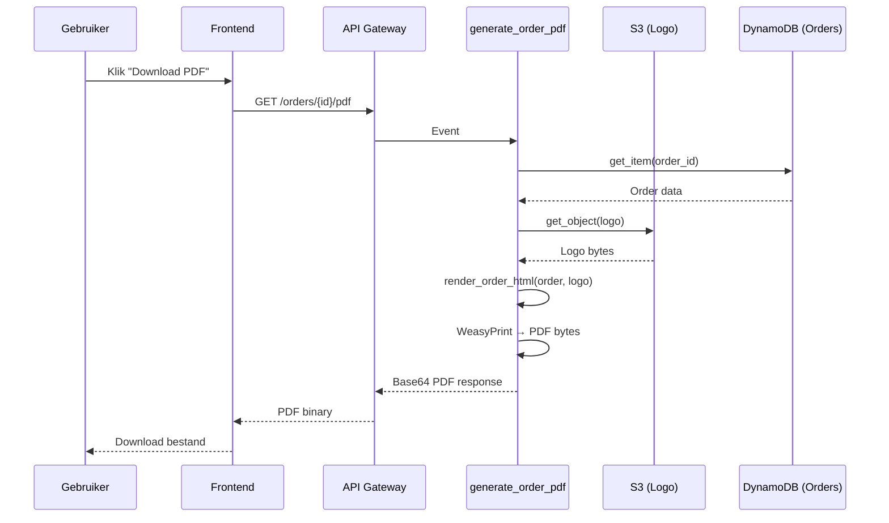

# Design Document: Order Confirmation PDF

## Overzicht

De backend-gegenereerde PDF (via WeasyPrint) heeft momenteel een compleet andere HTML-template en styling dan wat gebruikers zien in de frontend (`OrderConfirmation.tsx`). Dit design beschrijft de aanpassing van de `render_order_html()` functie in `backend/handler/generate_order_pdf/app.py` zodat de PDF-output visueel overeenkomt met de frontend layout, met behoud van WeasyPrint-compatibiliteit.

## Hoofdalgoritme/Workflow



## Core Interfaces/Types

```python
from typing import Optional, TypedDict, List


class CustomerInfo(TypedDict, total=False):
    name: str
    voornaam: str
    achternaam: str
    straat: str
    postcode: str
    woonplaats: str
    email: str
    phone: str


class ShippingAddress(TypedDict, total=False):
    name: str
    straat: str
    postcode: str
    woonplaats: str


class DeliveryOption(TypedDict, total=False):
    label: str


class OrderItem(TypedDict, total=False):
    name: str
    naam: str
    selectedOption: str
    quantity: int
    price: float


class Order(TypedDict, total=False):
    order_id: str
    timestamp: str
    customer_info: CustomerInfo
    shipping_address: ShippingAddress
    delivery_option: DeliveryOption
    delivery_cost: str
    items: List[OrderItem]
    subtotal_amount: str
    total_amount: str
    user_email: str
```

## Key Functions met Formele Specificaties

### Functie 1: render_order_html()

```python
def render_order_html(order: dict, logo_data_uri: Optional[str] = None) -> str:
    """Render order data naar HTML die visueel overeenkomt met de frontend layout."""
```

**Precondities:**

- `order` is een dict met minimaal `order_id` en `items` keys
- `logo_data_uri` is None of een geldige `data:image/...;base64,...` string

**Postcondities:**

- Retourneert een geldige HTML5-string met `<!DOCTYPE html>` prefix
- HTML bevat oranje branding (#FF6B35) voor de H-DCN titel
- HTML bevat twee-kolom layout voor Factuuradres en Verzendadres naast elkaar
- Producttabel heeft lichtgrijze header (#F9FAFB) in plaats van donkerblauw
- Numerieke kolommen (Aantal, Prijs, Totaal) zijn rechts uitgelijnd
- Totaal sectie toont "Totaal betaald:" als groot bold eindtotaal
- Leveringssectie staat boven de producttabel (indien aanwezig)
- Geen donkerblauw (#2c3e50) kleurenschema meer aanwezig in output
- CSS is WeasyPrint-compatibel (geen flexbox waar niet ondersteund)

### Functie 2: build_header_html()

```python
def build_header_html(logo_data_uri: Optional[str], order_id: str, formatted_date: str, customer_name: str) -> str:
    """Bouw de header sectie met logo, titel en ordergegevens."""
```

**Precondities:**

- `order_id` is een niet-lege string
- `formatted_date` is een geformateerde datumstring

**Postcondities:**

- Retourneert HTML met logo (indien beschikbaar) naast "H-DCN Webshop" titel
- Titel is in kleur #FF6B35
- Bevat ordernummer, datum, klant en status "Betaald" (groen)

### Functie 3: build_addresses_html()

```python
def build_addresses_html(customer_info: dict, shipping_address: Optional[dict]) -> str:
    """Bouw twee-kolom adres layout met factuuradres en verzendadres."""
```

**Precondities:**

- `customer_info` is een dict (mag leeg zijn)
- `shipping_address` is None of een dict

**Postcondities:**

- Retourneert HTML met twee kolommen naast elkaar (via `float` of `table` layout)
- Linkerkolom: "Factuuradres" met klantgegevens
- Rechterkolom: "Verzendadres" met verzendadres (fallback naar klantgegevens)
- Bij afwezigheid van data: "Geen adresgegevens beschikbaar"

### Functie 4: build_products_table_html()

```python
def build_products_table_html(items: list, delivery_option: Optional[dict], delivery_cost: Optional[str]) -> str:
    """Bouw de producttabel met optionele leveringssectie erboven."""
```

**Precondities:**

- `items` is een lijst van dicts met tenminste `quantity` key
- Elk item heeft `name` of `naam` key

**Postcondities:**

- Leveringssectie (indien aanwezig) staat BOVEN de tabel
- Tabel header is lichtgrijs (#F9FAFB) met normale tekst (niet uppercase, niet wit)
- Kolommen: Product, Optie, Aantal (rechts), Prijs (rechts), Totaal (rechts)
- Elke rij heeft subtiele border-bottom (#E5E7EB)

### Functie 5: build_totals_html()

```python
def build_totals_html(subtotal_amount: str, delivery_cost: Optional[str], total_amount: str) -> str:
    """Bouw de totalen sectie met subtotaal, verzendkosten en eindtotaal."""
```

**Precondities:**

- `subtotal_amount` en `total_amount` zijn strings die numerieke waarden bevatten
- `delivery_cost` is None of een string met numerieke waarde

**Postcondities:**

- Subtotaal regel met label links en bedrag rechts
- Verzendkosten regel (indien aanwezig) met label links en bedrag rechts
- Scheidingslijn (#E5E7EB) voor het eindtotaal
- "Totaal betaald:" als grote bold tekst (18px) met bedrag

## Algoritmisch Pseudocode

### HTML Rendering Algoritme

```python
def render_order_html(order: dict, logo_data_uri: Optional[str] = None) -> str:
    # Stap 1: Extraheer data uit order dict
    order_id = order.get('order_id', '')
    timestamp = order.get('timestamp', '')
    formatted_date = format_dutch_date(timestamp)
    customer_info = order.get('customer_info', {})
    shipping_address = order.get('shipping_address')
    items = order.get('items', [])
    delivery_option = order.get('delivery_option')
    delivery_cost = order.get('delivery_cost')
    subtotal_amount = order.get('subtotal_amount', '0.00')
    total_amount = order.get('total_amount', '0.00')

    customer_name = (
        customer_info.get('name') or
        f"{customer_info.get('voornaam', '')} {customer_info.get('achternaam', '')}".strip() or
        'Niet beschikbaar'
    )

    # Stap 2: Bouw HTML secties
    header_html = build_header_html(logo_data_uri, order_id, formatted_date, customer_name)
    addresses_html = build_addresses_html(customer_info, shipping_address)
    products_html = build_products_table_html(items, delivery_option, delivery_cost)
    totals_html = build_totals_html(subtotal_amount, delivery_cost, total_amount)

    # Stap 3: Assembleer volledige HTML met CSS
    css = build_css()

    html = f"""<!DOCTYPE html>
<html lang="nl">
<head>
    <meta charset="UTF-8" />
    <title>Orderbevestiging {order_id}</title>
    <style>{css}</style>
</head>
<body>
    {header_html}
    {addresses_html}
    {products_html}
    {totals_html}
</body>
</html>"""

    return html
```

## Correctness Properties

### Property 1: HTML structuur validiteit

_Voor elke_ geldige order dict, de output van `render_order_html()` begint met `<!DOCTYPE html>` en bevat een gesloten `</html>` tag.

**Validates: Requirements 2.2**

### Property 2: Oranje branding en afwezigheid oud kleurenschema

_Voor elke_ geldige order dict, de output HTML bevat de kleurcode `#FF6B35` en bevat NIET de oude kleurcode `#2c3e50`.

**Validates: Requirements 1.1, 1.2**

### Property 3: Twee-kolom adres layout

_Voor elke_ order met `customer_info`, de output HTML bevat zowel de tekst "Factuuradres" als "Verzendadres".

**Validates: Requirements 3.1**

### Property 4: Tabel header styling en uitlijning

_Voor elke_ order met tenminste één item, de output HTML bevat `#F9FAFB` als tabelheader achtergrond en de kolommen Aantal, Prijs en Totaal hebben `text-align: right` styling.

**Validates: Requirements 4.1, 4.3**

### Property 5: Totaal betaald presentatie

_Voor elke_ order, de output HTML bevat de tekst "Totaal betaald" met een font-size van 18px en font-weight bold.

**Validates: Requirements 5.1**

### Property 6: Leveringssectie positie

_Voor elke_ order met een `delivery_option`, de leveringssectie HTML verschijnt VOOR de producttabel HTML in de output string.

**Validates: Requirements 6.1**

### Property 7: Bedragen correct geformateerd

_Voor elk_ bedrag in de order (subtotaal, verzendkosten, totaal, item prijzen), het bedrag wordt weergegeven met euroteken en twee decimalen (€X.XX formaat).

**Validates: Requirements 5.2**

### Property 8: Klantnaam resolutie

_Voor elke_ order met customer_info die een `name` veld bevat, verschijnt die naam in de output. Voor orders zonder `name` maar met `voornaam` en `achternaam`, verschijnt de gecombineerde naam in de output.

**Validates: Requirements 8.1, 8.2**

### Property 9: WeasyPrint CSS compatibiliteit

_Voor elke_ gegenereerde HTML, de output bevat geen `display: flex` voor layout-structuren en bevat wel een `@page` directive met A4 formaat.

**Validates: Requirements 7.1, 7.3**
