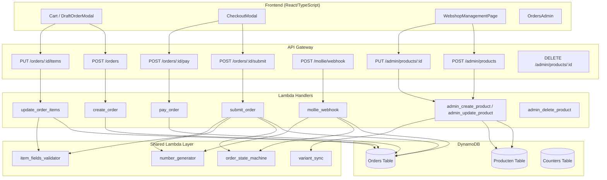
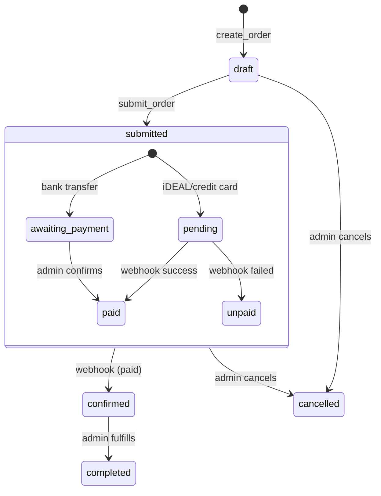
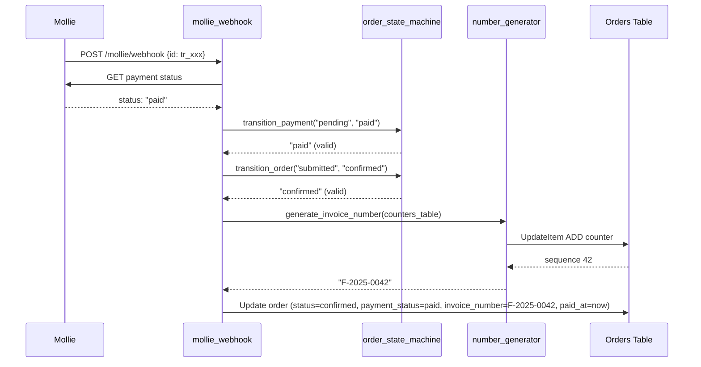

# Design Document: Order Pipeline Improvements

## Overview

This design addresses six areas of the H-DCN webshop order pipeline: explicit state machines for order/payment status, human-readable order numbers, gapless invoice numbers, bidirectional variant schema sync, per-item data collection validation, and product soft delete. The design builds on the existing Lambda-per-endpoint architecture with DynamoDB as the persistence layer and Mollie as the payment provider.

**Key design decisions:**

1. Two orthogonal state machines (order_status, payment_status) stored as separate DynamoDB attributes with validated transitions
2. DynamoDB atomic counters for both order numbers (`H-YYMMDD-NNN`) and invoice numbers (`F-YYYY-NNNN`)
3. Invoice number assigned at the moment `payment_status` transitions to `paid` — regardless of trigger (Mollie webhook for online payments, admin confirmation for bank transfers, or mock payment for testing). Never at submit time.
4. Bidirectional sync between `variant_schema` (parent) and variant records via a shared `variant_sync` module
5. Per-item field validation moved to a shared module used by both `submit_order` (strict) and `update_order_items` (lenient)
6. Soft delete via `active: false` with hard-delete guard checking order references

## Architecture



### Order Lifecycle Flow



## Components and Interfaces

### 1. Order State Machine Module (`shared/order_state_machine.py`)

A pure function module enforcing valid transitions for both `status` and `payment_status`.

```python
# Allowed order status transitions
ORDER_TRANSITIONS = {
    'draft': ['submitted', 'cancelled'],
    'submitted': ['confirmed', 'cancelled'],
    'confirmed': ['completed'],
    'completed': [],
    'cancelled': [],
}

# Allowed payment status transitions
PAYMENT_TRANSITIONS = {
    'unpaid': ['pending', 'awaiting_payment'],
    'pending': ['paid', 'unpaid'],        # unpaid = failed payment retry
    'awaiting_payment': ['paid'],
    'paid': [],                            # terminal
}

def validate_order_transition(current: str, target: str) -> bool:
    """Return True if order status transition is valid."""

def validate_payment_transition(current: str, target: str) -> bool:
    """Return True if payment status transition is valid."""

def transition_order(current_status: str, target_status: str) -> str:
    """Return target if valid, raise InvalidTransitionError otherwise."""

def transition_payment(current_status: str, target_status: str) -> str:
    """Return target if valid, raise InvalidTransitionError otherwise."""
```

**Coupling rule:** The `status` transition from `submitted` → `confirmed` ONLY happens when `payment_status` transitions to `paid`. This coupling is enforced in the webhook handler, not in the state machine module itself.

### 2. Number Generator Module (`shared/number_generator.py`)

Encapsulates DynamoDB atomic counter logic for order numbers and invoice numbers.

```python
def generate_order_number(counters_table, today: date = None) -> str:
    """
    Generate H-YYMMDD-NNN order number using atomic counter.
    Counter key: 'order_counter#YYMMDD'
    Uses UpdateItem ADD 1 to get unique sequence.
    """

def generate_invoice_number(counters_table, year: int = None) -> str:
    """
    Generate F-YYYY-NNNN invoice number using atomic counter.
    Counter key: 'invoice_counter#YYYY'
    Uses UpdateItem ADD 1 to get unique sequence.
    """
```

### 3. Variant Sync Module (`shared/variant_sync.py`)

Bidirectional synchronization between `variant_schema` and variant records.

```python
def sync_schema_to_variants(
    producten_table, parent_id: str, new_schema: dict, parent_price: Decimal
) -> SyncResult:
    """
    Top-down sync: variant_schema changed → regenerate variants.
    - Computes desired set of variant_attributes combinations
    - Keeps existing variants whose attributes still match (preserves stock/price)
    - Creates new variants for added combinations
    - Deactivates variants whose combinations were removed
    Returns SyncResult with created, preserved, deactivated counts.
    """

def sync_variant_to_schema(
    producten_table, parent_id: str, variant_attributes: dict
) -> dict:
    """
    Bottom-up sync: variant added/removed → update parent variant_schema.
    - Queries all active variants for parent_id
    - Derives variant_schema from union of all variant_attributes values
    - Updates parent record's variant_schema
    Returns updated variant_schema.
    """
```

### 4. Updated Handler Responsibilities

| Handler                 | Changes                                                                                                                                                    |
| ----------------------- | ---------------------------------------------------------------------------------------------------------------------------------------------------------- |
| `create_order`          | Sets `status='draft'`, `payment_status='unpaid'` (already does this)                                                                                       |
| `submit_order`          | Validates transition `draft→submitted`, generates `order_number`, validates item_fields, validates purchase_rules server-side                              |
| `pay_order`             | Sets `payment_status` to `pending` (online) or `awaiting_payment` (bank transfer), uses `order_number` as transfer reference                               |
| `mollie_webhook`        | On `paid`: transitions `payment_status→paid`, transitions `status→confirmed`, generates `invoice_number`. On `failed`: transitions `payment_status→unpaid` |
| `admin_confirm_payment` | Admin confirms bank transfer receipt: transitions `payment_status→paid`, transitions `status→confirmed`, generates `invoice_number`                        |
| `admin_create_product`  | Calls `variant_sync.sync_schema_to_variants` after product creation, stores `active: true`                                                                 |
| `admin_update_product`  | Calls variant sync on schema changes (top-down), calls schema sync on variant changes (bottom-up)                                                          |
| `admin_delete_product`  | Guards hard-delete against order references, supports `active: false` soft-delete                                                                          |

### 5. Frontend Changes

| Component               | Changes                                                                                          |
| ----------------------- | ------------------------------------------------------------------------------------------------ |
| `CheckoutModal`         | Displays `order_number` after submission, uses it in transfer reference                          |
| `OrdersAdmin`           | Shows `order_number` column, shows `invoice_number` badge when present, filter by payment status |
| Order Confirmation PDF  | Includes `order_number` prominently                                                              |
| Invoice PDF (new)       | Separate document with `invoice_number`, BTW details, only available after `payment_status=paid` |
| `WebshopManagementPage` | Active/inactive filter toggle, soft-delete button, hard-delete with guard                        |
| Variant Schema Editor   | Top-down editing triggers sync; individual variant add/remove triggers schema update             |

## Data Models

### Orders Table — Updated Schema

```
PK: order_id (UUID string)
GSI: event-club-index (event_id + club_id)

Attributes:
  order_id: str (UUID)                    # Primary key
  order_number: str                       # "H-YYMMDD-NNN" — assigned at submit
  invoice_number: str | None              # "F-YYYY-NNNN" — assigned at payment confirmation
  status: str                             # draft | submitted | confirmed | completed | cancelled
  payment_status: str                     # unpaid | pending | awaiting_payment | paid
  member_id: str
  user_email: str
  club_id: str
  event_id: str | None
  items: List[OrderItem]
  total_amount: Decimal
  total_paid: Decimal
  version: int                            # Optimistic locking
  stock_reserved: bool
  mollie_payment_id: str | None
  status_history: List[StatusHistoryEntry]
  created_at: str (ISO 8601)
  submitted_at: str (ISO 8601) | None
  paid_at: str (ISO 8601) | None
  updated_at: str (ISO 8601)
```

### Counters Table — New Table

```
PK: counter_id (string)

Items:
  counter_id: "order_counter#YYMMDD"    → current_value: int (daily sequence)
  counter_id: "invoice_counter#YYYY"    → current_value: int (yearly sequence)
```

**Atomic counter pattern:**

```python
response = counters_table.update_item(
    Key={'counter_id': f'order_counter#{today_str}'},
    UpdateExpression='ADD current_value :inc',
    ExpressionAttributeValues={':inc': 1},
    ReturnValues='UPDATED_NEW',
)
sequence = int(response['Attributes']['current_value'])
# order_number = f"H-{today_str}-{sequence:03d}"
```

The ADD operation is atomic — concurrent Lambda invocations never get the same sequence value. The counter auto-creates on first use (ADD to a non-existent attribute initializes to 0 + increment).

### Producten Table — Product Record (parent)

```
PK: product_id (string, format: "prod_XXXXXXXXXXXX")

Attributes:
  product_id: str
  name: str
  description: str
  category: str
  is_parent: true
  active: bool                           # true = visible in webshop, false = soft-deleted
  price: Decimal                         # Base price (numeric)
  prijs: Decimal | None                  # Legacy field (fallback)
  variant_schema: Record<str, str[]>     # {"Maat": ["S","M","L"]}
  order_item_fields: List[OrderItemField]
  purchase_rules: PurchaseRules
  event_id: str | None
  images: List[str]
  groep: str | None
  subgroep: str | None
  created_by: str
  created_at: str
  updated_at: str
```

### Producten Table — Variant Record (child)

```
PK: product_id (string, format: "var_PARENT_ID_value1_value2")

Attributes:
  product_id: str
  parent_id: str                         # References parent product_id
  name: str                              # Display name "T-shirt - S / Male"
  is_parent: false
  active: bool
  variant_attributes: Record<str, str>   # {"Maat": "S", "Gender": "Male"}
  price: Decimal                         # Override or inherited from parent
  stock: int
  sold_count: int
  allow_oversell: bool
  created_at: str
  updated_at: str
```

### Variant Schema ↔ Variant Records Sync

**Top-down (schema edit):**

1. Admin edits `variant_schema` on parent (e.g., adds "XL" to Maat axis)
2. `sync_schema_to_variants` computes all combinations from new schema
3. For each combination: if variant record exists with matching `variant_attributes` → preserve; if new → create with default stock=0; if removed from schema → set `active: false`
4. Write updated parent `variant_schema` + batch write new/updated variants

**Bottom-up (single variant add/remove):**

1. Admin adds variant with `variant_attributes: {"Maat": "XXL", "Gender": "Male"}`
2. `sync_variant_to_schema` queries all active variants for parent
3. Derives schema by collecting all unique values per axis from variant_attributes
4. Updates parent's `variant_schema` to include "XXL" in the "Maat" values array

### Order Item Fields Flow

```
Product (Producten) has order_item_fields: [
  {id: "naam", label: "Naam deelnemer", type: "text", required: true},
  {id: "email", label: "E-mail", type: "email", required: true}
]

Cart item (frontend) collects:
  item_fields_data: [
    {field_values: {"naam": "Jan", "email": "jan@test.nl"}},  // item 1
    {field_values: {"naam": "Piet", "email": "piet@test.nl"}} // item 2
  ]

submit_order validates:
  - item_fields_data.length == quantity
  - Each required field in each entry has a non-empty value
  - Type-specific validation (email pattern, min/max for numbers)

Stored on order item in Orders table:
  items[i].item_fields_data = [...]
```

### Invoice Number Assignment Trigger



## Correctness Properties

_A property is a characteristic or behavior that should hold true across all valid executions of a system — essentially, a formal statement about what the system should do. Properties serve as the bridge between human-readable specifications and machine-verifiable correctness guarantees._

### Property 1: Order state machine accepts all valid transitions

_For any_ order status `current` and target status `target` where `target` is in the allowed transitions set for `current` (i.e., `draft→submitted`, `draft→cancelled`, `submitted→confirmed`, `submitted→cancelled`, `confirmed→completed`), the `validate_order_transition(current, target)` function SHALL return `True`.

**Validates: Requirements 1.2, 1.3, 1.4, 1.5, 1.6**

### Property 2: Order state machine rejects all invalid transitions

_For any_ order status `current` and target status `target` where `target` is NOT in the allowed transitions set for `current`, the `validate_order_transition(current, target)` function SHALL return `False`.

**Validates: Requirements 1.7**

### Property 3: Payment state machine accepts all valid transitions

_For any_ payment status `current` and target status `target` where `target` is in the allowed transitions set for `current` (i.e., `unpaid→pending`, `unpaid→awaiting_payment`, `pending→paid`, `pending→unpaid`, `awaiting_payment→paid`), the `validate_payment_transition(current, target)` function SHALL return `True`.

**Validates: Requirements 2.1, 2.2, 2.3, 2.4**

### Property 4: Payment state machine rejects all invalid transitions

_For any_ payment status `current` and target status `target` where `target` is NOT in the allowed transitions set for `current`, the `validate_payment_transition(current, target)` function SHALL return `False`.

**Validates: Requirements 2.5**

### Property 5: Payment confirmation triggers order confirmation

_For any_ order with `status='submitted'` and `payment_status` in `['pending', 'awaiting_payment']`, when `payment_status` transitions to `paid`, the `status` SHALL also transition to `confirmed`.

**Validates: Requirements 1.3, 1.4**

### Property 6: Order number format validity

_For any_ date and sequence value, the generated order number SHALL match the regex pattern `^H-\d{6}-\d{3}$` where the first 6 digits correspond to YYMMDD of the generation date and the last 3 digits are a zero-padded sequence ≥ 001.

**Validates: Requirements 3.1**

### Property 7: Invoice number format validity

_For any_ year and sequence value, the generated invoice number SHALL match the regex pattern `^F-\d{4}-\d{4}$` where the first 4 digits correspond to the calendar year and the last 4 digits are a zero-padded sequence ≥ 0001.

**Validates: Requirements 7.1**

### Property 8: Bank transfer reference equals order number

_For any_ order that has an `order_number` assigned and initiates a bank transfer payment, the `transfer_instructions.reference` field SHALL equal the `order_number`.

**Validates: Requirements 3.7**

### Property 9: Variant generation produces correct count and structure

_For any_ valid `variant_schema` (record of axis names to value arrays), the number of generated variant records SHALL equal the cartesian product of all axis value counts. Each variant SHALL have `parent_id` set to the parent product_id, `variant_attributes` representing a unique combination, `stock=0`, and `allow_oversell` defaulting to the configured value.

**Validates: Requirements 4.1, 4.6, 4.7**

### Property 10: Top-down schema sync preserves unchanged variant data

_For any_ existing set of variants and a new `variant_schema`, variants whose `variant_attributes` exist as a valid combination in BOTH the old and new schema SHALL retain their `stock` and `price` values unchanged after sync.

**Validates: Requirements 4.2**

### Property 11: Bottom-up schema derivation reflects active variants

_For any_ set of active variant records belonging to a parent product, the derived `variant_schema` SHALL equal the union of all unique values per axis from the `variant_attributes` of those active variants. Adding or removing a variant updates the schema accordingly.

**Validates: Requirements 4.3, 4.4**

### Property 12: Purchase rules enforcement

_For any_ product with `purchase_rules` and any (existing_count, new_quantity) pair, if `existing_count + new_quantity > max_per_order` (or `max_per_member`, or `max_per_club`), the validation function SHALL reject the purchase. If `existing_count + new_quantity <= limit`, it SHALL accept.

**Validates: Requirements 5.1, 5.2, 5.3, 5.5**

### Property 13: Required item fields validation

_For any_ product with `order_item_fields` containing required fields, and any `item_fields_data` submission, if any required field has an empty or missing value for any item unit, the validator SHALL return an error identifying the `item_index`, `field_id`, and a descriptive message. If all required fields have non-empty values, validation SHALL pass.

**Validates: Requirements 6.3, 6.4**

### Property 14: No invoice number on unpaid orders

_For any_ order with `payment_status` other than `paid`, the `invoice_number` attribute SHALL be absent or None. Invoice numbers are only assigned when payment_status transitions to `paid`.

**Validates: Requirements 7.4**

### Property 15: Customer-facing listing excludes inactive products

_For any_ query to the customer-facing product listing, the result set SHALL contain only products where `active=true`. No product with `active=false` SHALL appear.

**Validates: Requirements 8.1**

### Property 16: Hard-delete guard prevents deletion of sold products

_For any_ product that is referenced by at least one order with `status` other than `cancelled`, the hard-delete operation SHALL be rejected. Hard-delete SHALL succeed only when zero non-cancelled orders reference the product.

**Validates: Requirements 8.2, 8.6**

## Error Handling

### State Machine Errors

| Error                         | HTTP Status | Trigger                                        | Response                                                                                            |
| ----------------------------- | ----------- | ---------------------------------------------- | --------------------------------------------------------------------------------------------------- |
| `InvalidTransitionError`      | 400         | Invalid status transition attempted            | `{"error": "Invalid transition", "details": {"current": "...", "target": "...", "allowed": [...]}}` |
| `ConcurrentModificationError` | 409         | Optimistic locking conflict (version mismatch) | `{"error": "Version conflict", "current_version": N}`                                               |

### Number Generation Errors

| Error               | HTTP Status | Trigger                               | Response                                        |
| ------------------- | ----------- | ------------------------------------- | ----------------------------------------------- |
| `CounterWriteError` | 500         | DynamoDB UpdateItem fails for counter | Internal retry (3 attempts), then 500 to caller |

DynamoDB ADD operations are idempotent per-request and don't have race conditions, but transient failures (throttling) should be retried with exponential backoff.

### Variant Sync Errors

| Error                     | HTTP Status | Trigger                            | Response                                                             |
| ------------------------- | ----------- | ---------------------------------- | -------------------------------------------------------------------- |
| `SchemaValidationError`   | 400         | Invalid variant_schema format      | `{"error": "Validation failed", "errors": [...]}`                    |
| `SyncConflictError`       | 409         | Concurrent variant modification    | `{"error": "Variant sync conflict, please retry"}`                   |
| `MaxCombinationsExceeded` | 400         | Schema produces > 100 combinations | `{"error": "Too many variant combinations", "count": N, "max": 100}` |

### Purchase Rules Errors

| Error                   | HTTP Status | Trigger                                           | Response                                                                                 |
| ----------------------- | ----------- | ------------------------------------------------- | ---------------------------------------------------------------------------------------- |
| `PurchaseRuleViolation` | 400         | Quantity exceeds max_per_order/member/club        | `{"error": "Purchase rule violated", "rule": "max_per_order", "limit": N, "current": M}` |
| `MembershipRequired`    | 403         | Non-member purchasing membership-required product | `{"error": "Active membership required"}`                                                |

### Item Fields Validation Errors

| Error                     | HTTP Status | Trigger                            | Response                                                                                                                             |
| ------------------------- | ----------- | ---------------------------------- | ------------------------------------------------------------------------------------------------------------------------------------ |
| `ItemFieldsCountMismatch` | 400         | item_fields_data length ≠ quantity | `{"error": "Validation failed", "errors": [{"item_index": I, "field": "item_fields_data", "message": "Expected N entries, got M"}]}` |
| `RequiredFieldMissing`    | 400         | Required field empty/absent        | `{"error": "Validation failed", "errors": [{"item_index": I, "field": "field_id", "message": "..."}]}`                               |

### Product Deletion Errors

| Error                    | HTTP Status | Trigger                                          | Response                                                                  |
| ------------------------ | ----------- | ------------------------------------------------ | ------------------------------------------------------------------------- |
| `ProductHasOrderHistory` | 400         | Hard-delete on product with non-cancelled orders | `{"error": "Cannot delete product with order history", "order_count": N}` |

### Payment Errors

| Error                  | HTTP Status | Trigger                             | Response                                                                                  |
| ---------------------- | ----------- | ----------------------------------- | ----------------------------------------------------------------------------------------- |
| `MollieApiError`       | 502         | Mollie API failure                  | `{"error": "Payment provider error", "details": {"provider": "mollie", "reason": "..."}}` |
| `NoOutstandingBalance` | 400         | Payment attempt on fully paid order | `{"error": "No outstanding balance"}`                                                     |

### Webhook Error Handling

The Mollie webhook handler ALWAYS returns HTTP 200 (Mollie requirement). Errors are logged but never surfaced in the response:

- Unknown `mollie_payment_id` → 200 with `{"status": "ignored", "reason": "order not found"}`
- Mollie API error fetching payment details → 200 with `{"status": "error"}`
- Forward-only: if order is already `paid`, a subsequent `failed` webhook is silently ignored

## Testing Strategy

### Unit Tests (pytest + moto)

Unit tests focus on specific examples, edge cases, and integration points:

- **State machine module**: Example transitions (happy paths and rejection cases)
- **Number generator**: Format validation, sequential generation, boundary cases (midnight rollover, year boundary)
- **Variant sync**: Specific sync scenarios (add axis value, remove axis value, no-op sync)
- **Item fields validator**: Specific field type validations (email pattern, number min/max)
- **Purchase rules**: Specific boundary cases (exactly at limit, one over)
- **Mock payment mode**: Bank transfer not marked as paid
- **Webhook idempotency**: Duplicate webhook doesn't double-reserve stock

### Property-Based Tests (Hypothesis)

Property tests verify universal properties across randomized inputs. Using the `hypothesis` library (already present in the project).

**Configuration**: Each property test runs minimum 100 iterations.

**Tag format**: `# Feature: order-pipeline-improvements, Property N: {description}`

Properties to implement:

1. Order state machine valid/invalid transitions (Properties 1-2)
2. Payment state machine valid/invalid transitions (Properties 3-4)
3. Coupled transition (Property 5)
4. Order number format (Property 6)
5. Invoice number format (Property 7)
6. Transfer reference = order_number (Property 8)
7. Variant generation correctness (Property 9)
8. Top-down sync preservation (Property 10)
9. Bottom-up schema derivation (Property 11)
10. Purchase rules enforcement (Property 12)
11. Required item fields validation (Property 13)
12. No invoice on unpaid orders (Property 14)
13. Active filter exclusion (Property 15)
14. Hard-delete guard (Property 16)

### Integration Tests

- **DynamoDB atomic counters**: Verify sequential numbering with concurrent Lambda simulations (using moto)
- **Mollie webhook end-to-end**: Full flow from webhook receipt to order status update + invoice number assignment
- **Variant sync with DynamoDB**: Top-down and bottom-up sync with actual table operations (mocked)
- **Submit order pipeline**: Full validation chain including purchase rules + item fields

### Frontend Tests (Jest + React Testing Library)

- **OrdersAdmin**: Renders order_number and invoice_number columns
- **CheckoutModal**: Displays order_number after submit, shows transfer reference
- **Invoice PDF**: Generates correct document with invoice_number and BTW details
- **WebshopManagementPage**: Active/inactive filter toggle, soft-delete flow
- **Variant Schema Editor**: Both editing directions trigger correct API calls

### Test File Organization

```
backend/tests/
├── unit/
│   ├── test_order_state_machine.py          # Unit + Property tests for state machine
│   ├── test_number_generator.py             # Unit + Property tests for number generation
│   ├── test_variant_sync.py                 # Unit + Property tests for variant sync
│   ├── test_purchase_rules_validation.py    # Unit + Property tests for purchase rules
│   ├── test_item_fields_validation.py       # Unit + Property tests for item fields
│   ├── test_product_soft_delete.py          # Unit + Property tests for delete guard
│   └── test_mollie_webhook.py              # Existing tests + new invoice flow
├── integration/
│   ├── test_submit_order_flow.py            # Full submit pipeline
│   └── test_payment_confirmation_flow.py    # Webhook → confirmed → invoice
```
