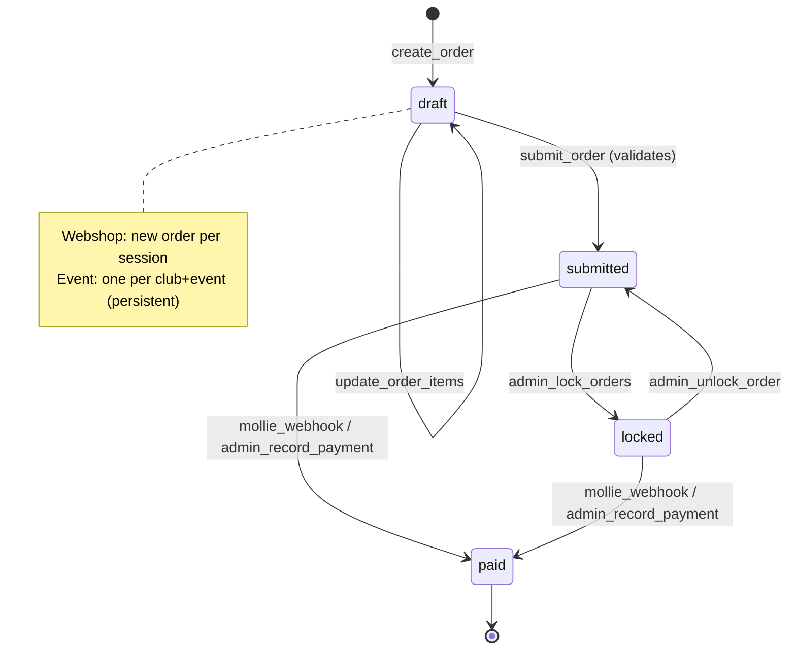

# Design Document: Product Model Unification

## Overview

This design describes the technical migration from the legacy H-DCN product model (with `opties`, `channel`, `id`-keyed records) to a unified model where all products—both webshop and event-linked—share one data structure, one order pipeline, and one admin interface. The migration eliminates the Cart table, consolidates duplicate handlers, and replaces the `channel`/`tenant` concept with simple `event_id` linkage.

**Key changes:**

- Legacy `opties` (comma-separated string) → `variant_schema` (Record<string, string[]>) + generated Variant_Records
- Legacy `id` primary key → UUID `product_id` primary key (with `legacy_id` audit field)
- `channel`/`tenant` field → `event_id` (null = webshop, set = event-linked)
- Cart table + cart handlers → Draft orders (status: "draft") with optimistic locking
- Separate webshop/presmeet handlers → One set of universal product/order/payment handlers
- Legacy `ProductCardModal` (opties.split) → `VariantSelector` component for all variant selection

## Architecture

The system adopts a single-pipeline architecture where product type (webshop vs event) is determined solely by the presence of `event_id` on a product or order record.

```mermaid
graph TB
    subgraph Frontend
        WP[WebshopPage] --> VS[VariantSelector]
        WP --> DOM[DraftOrderModal]
        BW[BookingWizard] --> VS
        BW --> DOM
        AM[Admin Management] --> VSE[VariantSchemaEditor]
        AM --> EF[EventFilter]
        AM --> RT[ReportsTab]
    end

    subgraph "API Gateway"
        PE[/admin/products/*\n/products/*\n/scan-product/]
        OE[/orders/*\n/orders/:id/items\n/orders/:id/submit]
        PAY[/orders/:id/pay\n/mollie-webhook]
    end

    subgraph "Lambda Handlers"
        ACP[admin_create_product]
        AUP[admin_update_product]
        AGP[admin_get_products]
        DP[delete_product]
        GP[get_product_byid]
        SP[scan_product]
        GV[get_variants]
        CO[create_order]
        UO[update_order_items]
        SO[submit_order]
        PO[pay_order]
        MW[mollie_webhook]
    end

    subgraph "DynamoDB"
        PT[(Producten\nproduct_id PK)]
        OT[(Orders\norder_id PK)]
        PMT[(Payments\nPayment_id PK)]
        ET[(Events\nevent_id PK)]
    end

    WP --> PE
    BW --> OE
    AM --> PE
    AM --> OE

    PE --> ACP & AUP & AGP & DP & GP & SP & GV
    OE --> CO & UO & SO
    PAY --> PO & MW

    ACP & AUP & AGP & DP & GP & SP & GV --> PT
    CO & UO & SO --> OT
    CO & UO --> PT
    PO & MW --> PMT
    PO & MW --> OT
```

### Order Lifecycle (Unified)



## Components and Interfaces

### Backend Components

#### Migration Script (`scripts/migrate_products.py`)

Idempotent Python script that transforms legacy product records to the unified model.

**Responsibilities:**

- Scan Producten table for legacy records (has `opties`, no `legacy_opties`, no existing variants)
- For each legacy product: generate UUID, create slug, parse opties → variant_schema, generate variant records
- Replace `channel`/`tenant` with `event_id` on all product records
- Delete all Order, Cart, and Payment records (test data — these tables only contain test data, so channel→event_id transformation on orders is unnecessary)
- Skip already-migrated products (idempotency)
- Log errors per-product and continue processing

**Interface:**

```python
def migrate_products(dry_run: bool = False) -> MigrationSummary:
    """Execute the full migration. Returns summary of actions taken."""

@dataclass
class MigrationSummary:
    total_scanned: int
    products_migrated: int
    variants_created: int
    products_skipped: int
    orders_deleted: int
    carts_deleted: int
    payments_deleted: int
    errors: list[dict]  # [{product_id, error}]
```

#### Unified Order Handlers

| Handler               | Method | Path                  | Purpose                               |
| --------------------- | ------ | --------------------- | ------------------------------------- |
| `create_order`        | POST   | `/orders`             | Create draft order (webshop or event) |
| `update_order_items`  | PUT    | `/orders/{id}/items`  | Update items on a draft order         |
| `submit_order`        | POST   | `/orders/{id}/submit` | Validate and submit order             |
| `pay_order`           | POST   | `/orders/{id}/pay`    | Initiate payment (Mollie)             |
| `get_customer_orders` | GET    | `/orders/my`          | Get authenticated user's orders       |

The `create_order` handler determines flow based on the request:

- If `event_id` is provided → event order (one per club per event, persistent mode)
- If `event_id` is null/absent → webshop order (new draft each time)

#### Product Handlers (Consolidated)

| Handler                | Method | Path                      | Key Pattern                   |
| ---------------------- | ------ | ------------------------- | ----------------------------- |
| `admin_create_product` | POST   | `/admin/products`         | `product_id` (generated UUID) |
| `admin_update_product` | PUT    | `/admin/products/{id}`    | `Key: {'product_id': id}`     |
| `admin_get_products`   | GET    | `/admin/products`         | Scan with filters             |
| `get_product_byid`     | GET    | `/get-product-byid/{id}`  | `Key: {'product_id': id}`     |
| `delete_product`       | DELETE | `/delete-product/{id}`    | `Key: {'product_id': id}`     |
| `scan_product`         | GET    | `/scan-product/`          | Scan (excludes variants)      |
| `get_variants`         | GET    | `/products/{id}/variants` | Query by `parent_id`          |

**Retired handlers** (removed from SAM template):

- `update_product` (replaced by `admin_update_product`)
- `create_cart`, `update_cart_items`, `get_cart`, `clear_cart`
- `save_presmeet_booking`, `validate_presmeet_cart`
- `presmeet_get_order`, `presmeet_upsert_order`, `presmeet_submit_order` (consolidated into universal order handlers)

#### Shared Layer Changes

**Removed:** `shared/channel_resolver.py` (resolve_channels, validate_channel_access, GROUP_CHANNEL_MAP)

**Unchanged:** `shared/auth_utils.py`, `shared/item_fields_validator.py`, `shared/mollie_client.py`, `shared/purchase_rules_validator.py`, `shared/stock_reservation.py`

#### Codebase-Wide Legacy Removal

The following legacy concepts must be removed from the **entire** codebase — not just the files listed above. This is a full sweep across all handlers, components, types, services, and tests.

**1. Channel/Tenant removal:**

- Remove any logic that reads, filters, routes, or stores `channel` or `tenant` fields
- Replace `?channel=` query parameters with `?event_id=`
- Remove `resolve_channels()` and `validate_channel_access()` calls from all handlers
- Remove `CHANNEL` / `TENANT` environment variables from SAM template
- Remove `Channel` and `Tenant` type exports and all usages in frontend

**2. Cart elimination:**

- Remove cart handlers (`create_cart`, `update_cart_items`, `get_cart`, `clear_cart`) from SAM template and delete their handler directories
- Remove all frontend code referencing Cart API endpoints (`/create-cart`, `/update-cart-items`, `/get-cart`, `/clear-cart`)
- Remove `cartService` and any cart-related hooks, context, or state management
- Replace cart flows with draft order flows in all components that previously used carts

**3. Legacy product model removal:**

- Remove all references to `opties` field (reading, writing, splitting, validating) across backend and frontend
- Remove `opties.split(',')` patterns and the `ProductCardModal` component
- Remove any code using `Key: {'id': ...}` for Producten table access — all must use `Key: {'product_id': ...}`
- Remove legacy field names (`naam`, `prijs`) from write paths (read paths may keep them as fallbacks during transition)
- Remove `selectedOption` field usage from order item construction

**4. PresMeet-specific logic consolidation:**

- Remove presmeet-specific handlers that are replaced by universal handlers: `save_presmeet_booking`, `validate_presmeet_cart`, `presmeet_get_order`, `presmeet_upsert_order`, `presmeet_submit_order`
- Remove presmeet-specific admin pages/tabs — all products managed in the unified webshop management interface
- Remove presmeet-specific report logic that string-matches on `product_id` — use `product_type` field instead
- **KEEP**: The PresMeet booking wizard frontend (BookingWizard, ProductConfigurator, BookingOverview) and its dedicated UX — this is the only event-specific frontend that remains

**5. Tests:**

- Update all test fixtures using `channel`, `tenant`, `opties`, cart APIs, or legacy key patterns
- Remove test files for retired handlers (cart, legacy update_product, presmeet-specific order handlers)

**Verification (post-migration grep checks):**

- `grep -r "channel\|tenant" backend/handler/` → zero hits
- `grep -r "channel\|tenant" frontend/src/` → zero hits (excluding unrelated uses)
- `grep -r "opties" backend/ frontend/` → zero hits
- `grep -r "create_cart\|update_cart\|get_cart\|clear_cart" backend/ frontend/` → zero hits
- `grep -r "'id'" backend/handler/` for Producten table access → zero hits (all use `product_id`)
- `grep -r "ProductCardModal" frontend/src/` → zero hits
- `grep -r "selectedOption" frontend/src/` → zero hits

### Frontend Components

#### Type Changes (`types/index.ts`)

```typescript
export interface Product {
  product_id: string;
  id?: string; // backward compat (legacy references)
  name: string;
  naam?: string; // backward compat
  price: number;
  prijs?: string | number; // backward compat
  category?: string;
  groep?: string;
  subgroep?: string;
  variant_schema?: VariantSchema;
  is_parent?: boolean;
  event_id?: string | null;
  active?: boolean;
  // NO opties field
}
```

#### Type Changes (`modules/webshop/types/unifiedProduct.types.ts`)

```typescript
export interface UnifiedProduct extends Product {
  product_id: string;
  event_id?: string | null; // replaces channel
  description?: string;
  active: boolean;
  is_parent: boolean;
  images?: string[];
  variant_schema?: VariantSchema;
  order_item_fields?: OrderItemField[];
  purchase_rules?: PurchaseRules;
  legacy_opties?: string;
  created_by?: string;
  created_at?: string;
  updated_at?: string;
  // REMOVED: channel, tenant
}

export interface VariantRecord {
  product_id: string;
  parent_id: string;
  name: string;
  variant_attributes: Record<string, string>;
  price: number;
  stock: number;
  sold_count: number;
  allow_oversell: boolean;
  active: boolean;
  // REMOVED: channel
}

// REMOVED: Channel type, Tenant type
```

#### Component Changes

| Component                 | Action       | Detail                                                                    |
| ------------------------- | ------------ | ------------------------------------------------------------------------- |
| `ProductCardModal.tsx`    | **DELETE**   | Replaced by VariantSelector integration in WebshopPage                    |
| `CartModal.tsx`           | **REFACTOR** | Becomes DraftOrderModal — uses order API instead of cart API              |
| `CheckoutModal.tsx`       | **REFACTOR** | Triggers submit+pay on draft order                                        |
| `TenantFilter.tsx`        | **REFACTOR** | Becomes EventFilter — shows "Alle", "Webshop", and event names            |
| `ProductCard.tsx` (admin) | **MODIFY**   | Remove opties field, add event_id selector, use VariantSchemaEditor       |
| `WebshopPage.tsx`         | **MODIFY**   | Use VariantSelector for all variant products, auto-select default variant |

#### API Client Changes (`modules/webshop/services/api.ts`)

```typescript
export const productService = {
  scanProducts: () => ApiService.get("/scan-product/"),
  getProducts: (eventId?: string | null) =>
    ApiService.get(
      eventId ? `/products?event_id=${eventId}` : "/products?event_id=null",
    ),
  getVariants: (productId: string) =>
    ApiService.get<VariantRecord[]>(`/products/${productId}/variants`),
  getProductById: (productId: string) =>
    ApiService.get(`/get-product-byid/${productId}`),
  updateProduct: (productId: string, data: Partial<UnifiedProduct>) =>
    ApiService.put(`/admin/products/${productId}`, data),
  deleteProduct: (productId: string) =>
    ApiService.delete(`/delete-product/${productId}`),
};

export const orderService = {
  createDraft: (data: CreateDraftRequest) => ApiService.post("/orders", data),
  updateItems: (orderId: string, data: UpdateItemsRequest) =>
    ApiService.put(`/orders/${orderId}/items`, data),
  submitOrder: (orderId: string) =>
    ApiService.post(`/orders/${orderId}/submit`, {}),
  payOrder: (orderId: string, data: PayOrderRequest) =>
    ApiService.post(`/orders/${orderId}/pay`, data),
  getMyOrders: () => ApiService.get("/orders/my"),
};

// REMOVED: cartService (createCart, getCart, updateCartItems, clearCart)
```

## Data Models

### Producten Table — Parent Product Record

| Field               | Type              | Description                                    |
| ------------------- | ----------------- | ---------------------------------------------- |
| `product_id`        | String (UUID v4)  | **Partition key**                              |
| `is_parent`         | Boolean           | Always `true` for parent records               |
| `name`              | String            | Product display name                           |
| `price`             | Number            | Base price in EUR                              |
| `event_id`          | String \| null    | Null = webshop product, set = event-linked     |
| `active`            | Boolean           | Whether product is visible                     |
| `variant_schema`    | Map               | `Record<string, string[]>` — axes and values   |
| `order_item_fields` | List              | Per-item fields collected at checkout          |
| `purchase_rules`    | Map               | Business constraints (max_per_order, etc.)     |
| `description`       | String            | Product description                            |
| `images`            | List              | S3 image URLs                                  |
| `slug`              | String            | Human-readable identifier (e.g., "G5-t-shirt") |
| `legacy_id`         | String            | Original `id` value (audit)                    |
| `legacy_opties`     | String            | Original `opties` value (audit)                |
| `created_at`        | String (ISO 8601) | Creation timestamp                             |
| `updated_at`        | String (ISO 8601) | Last update timestamp                          |

### Producten Table — Variant Record

| Field                | Type             | Description                                      |
| -------------------- | ---------------- | ------------------------------------------------ |
| `product_id`         | String (UUID v4) | **Partition key** (variant's own ID)             |
| `is_parent`          | Boolean          | Always `false` for variant records               |
| `parent_id`          | String (UUID v4) | Reference to parent product                      |
| `variant_attributes` | Map              | `Record<string, string>` — axis → selected value |
| `name`               | String           | Display name (e.g., "Club T-shirt - L")          |
| `price`              | Number           | Price override (or inherited from parent)        |
| `stock`              | Number           | Available stock count                            |
| `sold_count`         | Number           | Total units sold                                 |
| `allow_oversell`     | Boolean          | Accept orders when stock = 0                     |
| `active`             | Boolean          | Whether variant is purchasable                   |

### Orders Table — Unified Order Record

| Field            | Type              | Description                          |
| ---------------- | ----------------- | ------------------------------------ |
| `order_id`       | String (UUID v4)  | **Partition key**                    |
| `event_id`       | String \| null    | Null = webshop, set = event order    |
| `status`         | String            | draft \| submitted \| locked \| paid |
| `payment_status` | String            | unpaid \| partial \| paid            |
| `member_id`      | String            | Purchasing member                    |
| `club_id`        | String \| null    | Club identifier (for event orders)   |
| `items`          | List              | Order line items                     |
| `total_amount`   | Number            | Calculated total                     |
| `total_paid`     | Number            | Amount paid so far                   |
| `version`        | Number            | Optimistic locking version           |
| `created_at`     | String (ISO 8601) | Creation timestamp                   |
| `updated_at`     | String (ISO 8601) | Last modification                    |
| `submitted_at`   | String \| null    | When order was submitted             |

### Order Line Item (nested in order)

| Field                | Type          | Description                                     |
| -------------------- | ------------- | ----------------------------------------------- |
| `product_id`         | String (UUID) | Parent product reference                        |
| `variant_id`         | String (UUID) | Specific variant purchased                      |
| `product_type`       | String        | Category for reporting (e.g., "meeting_ticket") |
| `name`               | String        | Product name at time of order                   |
| `variant_attributes` | Map           | Axis selections for this item                   |
| `quantity`           | Number        | Units ordered                                   |
| `unit_price`         | Number        | Price per unit (from Producten table)           |
| `line_total`         | Number        | quantity × unit_price                           |
| `item_fields_data`   | List          | Per-item registration data                      |

### Migration Transformation Rules

```
Legacy Record                    →  Unified Parent + Variants
─────────────────────────────────────────────────────────────
id: "G5"                         →  product_id: <uuid>, legacy_id: "G5"
naam: "T-shirt"                  →  name: "T-shirt", slug: "G5-t-shirt"
prijs: 25                        →  price: 25
opties: "S,M,L,XL"              →  variant_schema: {"Maat": ["S","M","L","XL"]}
                                     + 4 Variant_Records
opties: "One Size" / null / ""   →  1 Default_Variant (variant_attributes: {})
channel: "h-dcn"                 →  event_id: null
channel: "presmeet"              →  event_id: <linked event's event_id>
```

## Correctness Properties

_A property is a characteristic or behavior that should hold true across all valid executions of a system—essentially, a formal statement about what the system should do. Properties serve as the bridge between human-readable specifications and machine-verifiable correctness guarantees._

### Property 1: Migration transformation produces correct unified records

_For any_ legacy product record with an `opties` field (comma-separated string or "One Size"/empty), the migration transformation SHALL produce a parent record with: a valid UUID v4 as `product_id`, the original `id` preserved in `legacy_id`, a `slug` formed from the original id and name, the `opties` field removed and its value stored in `legacy_opties`, `is_parent: true`, `active: true`, and either a correct `variant_schema` with generated variant records (one per value) or a single default variant when opties is "One Size"/empty.

**Validates: Requirements 1.2, 1.3, 1.4, 1.5, 1.6**

### Property 2: Migration identification correctly selects legacy products

_For any_ set of product records in the Producten table, the migration identification logic SHALL select only records that have an `opties` field AND do not have a `legacy_opties` field AND do not have existing variant records (records where `parent_id` equals the product's `product_id`), excluding all other records.

**Validates: Requirements 1.1, 1.10, 1.11**

### Property 3: Migration is idempotent

_For any_ initial state of the Producten table, running the migration script twice SHALL produce the same end state as running it once — no duplicate records created, no fields modified on already-migrated products.

**Validates: Requirements 1.12**

### Property 4: Channel-to-event_id transformation is correct

_For any_ product record with a `channel` field, the migration SHALL remove the `channel` and `tenant` fields and set `event_id` to the linked event's `event_id` when `channel` is "presmeet", or set `event_id` to `null` when `channel` is "h-dcn" or absent. The same transformation SHALL apply to order records.

**Validates: Requirements 1.16, 1.17, 10.12**

### Property 5: VariantSelector resolves correct variant

_For any_ variant schema with N axes and a set of variant records, when all N axes have selections made, the VariantSelector SHALL resolve the unique variant record whose `variant_attributes` match all selections exactly, or resolve to null if no matching variant exists.

**Validates: Requirements 4.5, 4.6**

### Property 6: scan_product response normalization

_For any_ product record in the Producten table (where `is_parent` is true or absent), the scan_product response SHALL include `product_id`, `name`, `price`, `variant_schema`, `is_parent`, `event_id`, and `active` — using `naam` as fallback for `name` and `prijs` as fallback for `price` when the canonical field names are not present.

**Validates: Requirements 5.4, 9.1, 9.2**

### Property 7: scan_product excludes variant and migration records

_For any_ state of the Producten table, the scan_product handler SHALL return only records where `is_parent` is `true` or the `is_parent` attribute does not exist, AND `source` is not equal to "migration" — all variant records (`is_parent: false`) and migration-source records SHALL be excluded.

**Validates: Requirements 5.5**

### Property 8: Order prices fetched from Producten table

_For any_ order creation or update request, the unit price for each line item SHALL be read from the Producten table (parent product's `price` field or the variant's price override) at request time — the resulting order item's `unit_price` SHALL equal the current product/variant price in the database.

**Validates: Requirements 7.6, 7.7**

### Property 9: Null or empty price rejects order item

_For any_ product record in the Producten table with a null, empty, or zero `price` field, attempting to add that product to an order SHALL result in a rejection error indicating the product has no configured price.

**Validates: Requirements 7.8**

### Property 10: Optimistic locking rejects stale versions

_For any_ draft order with version N, an update request providing a version value not equal to N SHALL be rejected with a 409 Conflict response. An update request with the correct version N SHALL succeed and increment the version to N+1.

**Validates: Requirements 7.9**

### Property 11: Draft orders accept incomplete item data

_For any_ draft order update (not submit), the request SHALL succeed regardless of missing required fields, partial `item_fields_data`, or incomplete variant selections — validation is only enforced at submit time.

**Validates: Requirements 7.10**

### Property 12: One order per club per event

_For any_ event order (where `event_id` is set), there SHALL be at most one order per club_id per event_id combination. Creating a second order for the same club+event SHALL return the existing order instead of creating a duplicate.

**Validates: Requirements 7.16**

### Property 13: Order validation pipeline works for all product types

_For any_ order submission (both webshop and event orders), the validation pipeline SHALL verify that each item's `variant_id` resolves to a variant record whose `parent_id` matches the item's `product_id`. Items with mismatched parent references SHALL be rejected.

**Validates: Requirements 10.8, 10.9**

### Property 14: CSV export formats variant_schema correctly

_For any_ product with a `variant_schema` containing axes and values, the CSV export SHALL format variant information as "AxisName: Value1, Value2, ..." for each axis. Products without `variant_schema` SHALL export "Standaard" in the variant column.

**Validates: Requirements 8.2, 8.3**

## Error Handling

### Migration Script Errors

| Error                                       | Handling                                         | Recovery                             |
| ------------------------------------------- | ------------------------------------------------ | ------------------------------------ |
| Single product fails to migrate             | Log product_id + error, skip, continue with next | Re-run script (idempotent)           |
| DynamoDB throttling                         | Exponential backoff with jitter                  | Automatic retry                      |
| UUID collision                              | Extremely unlikely (UUID v4), log and skip       | Manual intervention                  |
| Missing linked event for channel="presmeet" | Log warning, set event_id=null                   | Admin manually links after migration |

### Order Handler Errors

| Error                       | HTTP Code | Response                                              |
| --------------------------- | --------- | ----------------------------------------------------- |
| Product not found           | 404       | `{"error": "Product not found", "product_id": "..."}` |
| Variant not found           | 404       | `{"error": "Variant not found", "variant_id": "..."}` |
| Variant parent mismatch     | 400       | `{"error": "Variant does not belong to product"}`     |
| No price configured         | 400       | `{"error": "Product has no configured price"}`        |
| Version conflict            | 409       | `{"error": "Version conflict", "current_version": N}` |
| Out of stock                | 400       | `{"error": "Insufficient stock", "available": N}`     |
| Validation errors at submit | 400       | `{"errors": [{item_index, field, message}]}`          |
| Unauthorized                | 403       | `{"error": "Access denied"}`                          |

### Frontend Error Handling

- Variant fetch failure → Disable add-to-cart, show "Varianten konden niet worden geladen"
- Order save failure (409) → Prompt user to refresh and retry
- Payment initiation failure → Show error toast, allow retry
- Product without price → Skip product in webshop display, log warning

## Testing Strategy

### Unit Tests (pytest + Jest)

**Backend (pytest + moto):**

- Migration transformation logic (opties parsing, UUID generation, slug creation)
- Channel → event_id mapping for various inputs
- Order handler validation pipeline (purchase rules, item fields, stock)
- Variant parent_id verification logic
- Price fetching and null price rejection
- Optimistic locking version check
- scan_product filtering and field normalization

**Frontend (Jest + React Testing Library):**

- VariantSelector: renders axes, resolves variants, shows stock/errors
- VariantSchemaEditor: validation (duplicate names, max combinations)
- EventFilter: displays correct options, triggers filter changes
- DraftOrderModal: creates/updates draft orders via correct API
- WebshopPage: auto-selects default variant, shows VariantSelector for multi-variant products
- CSV export: formats variant_schema correctly

### Property-Based Tests (Hypothesis for Python, fast-check for TypeScript)

**Library:** `hypothesis` (Python backend), `fast-check` (TypeScript frontend)

**Configuration:** Minimum 100 iterations per property test.

**Backend properties (Python/Hypothesis):**

- Property 1: Migration transformation (generate random legacy products → verify output)
- Property 2: Migration identification (generate mixed table state → verify selection)
- Property 3: Migration idempotency (migrate → migrate again → compare)
- Property 4: Channel→event_id transformation (generate records with various channels)
- Property 6: scan_product normalization (generate products with mixed field names)
- Property 7: scan_product filtering (generate table with parents + variants)
- Property 8: Price from product table (generate products/orders → verify prices)
- Property 9: Null price rejection (generate products with null/empty prices)
- Property 10: Optimistic locking (generate orders → attempt updates with wrong versions)
- Property 11: Draft accepts incomplete data (generate partial items → verify save succeeds)
- Property 12: One per club per event (generate duplicate create requests → verify dedup)
- Property 13: Variant parent_id validation (generate matching/mismatching refs → verify)

**Frontend properties (TypeScript/fast-check):**

- Property 5: Variant resolution (generate schemas + records + selections → verify)
- Property 14: CSV variant formatting (generate schemas → verify string output)

**Tag format:** Each test tagged with: `Feature: product-model-unification, Property {N}: {title}`

### Integration Tests

- End-to-end order flow: create draft → update items → submit → pay → verify stock reserved
- Migration script execution on test data in DynamoDB Local
- Admin product CRUD with variant regeneration
- Event order: one per club per event, update after partial payment
- Webshop order: create multiple orders, verify independence

### Smoke Tests

- TypeScript compilation produces zero errors (`npm run type-check`)
- SAM template does not contain retired handlers (cart, legacy update_product)
- No frontend imports of `ProductCardModal`
- No references to `channel` or `tenant` in handler code (post-migration)
- `channel_resolver.py` does not exist in shared layer
