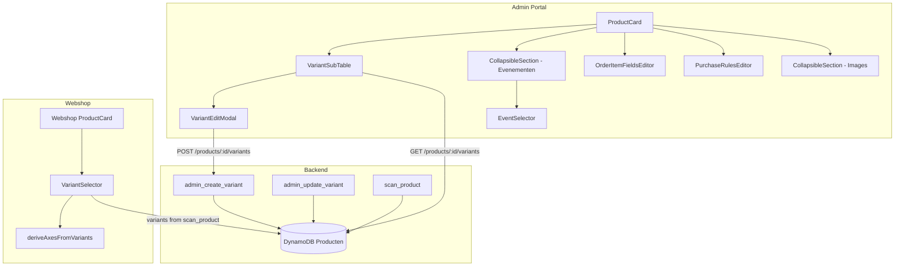

# Design Document: Product Variant Simplification

## Overview

This design removes the VariantSchemaEditor and `variant_schema` field from the product management system, replacing it with a direct table-based approach. The core idea is simple: variant records are the source of truth, and everything else (admin UI, webshop display) derives axis information directly from those records.

**Key changes:**

1. Delete `VariantSchemaEditor.tsx` and all `variant_schema` sync machinery
2. Modify `VariantEditModal` to handle both create and edit modes, including zero-axes and existing-axes states (axis discovery from variant records)
3. Modify webshop `VariantSelector` to derive axes from variant records instead of `variant_schema`
4. Remove `variant_schema` from the field registry, backend handlers, and API responses
5. Wrap images in a CollapsibleSection, fix ProductCard layout (full-width, no nav arrows)
6. Add searchable Event_Selector dropdown wrapped in a CollapsibleSection ("Evenementen")

**What stays the same:**

- `VariantSubTable` continues as the primary variant display component
- `VariantEditModal` handles both creating and editing individual variants (two modes)
- Backend `admin_create_variant` handler still creates variant records (with simplified validation)
- `OrderItemFieldsEditor` and `PurchaseRulesEditor` remain unchanged

## Architecture



### Data flow (simplified)

1. Admin opens ProductCard → fetches variants for parent product → displayed in VariantSubTable
2. **Create:** Admin clicks "Add variant" (empty row) → `VariantEditModal` opens in create mode → user picks axis name/value → backend creates Variant_Record with those `variant_attributes` and default values (prijs inherited from parent, stock=0, active=true, allow_oversell=false)
3. **Edit:** Admin clicks an existing variant row → `VariantEditModal` opens in edit mode (pre-filled) → user modifies prijs, stock, active, allow_oversell → backend updates Variant_Record
4. Webshop loads product → `deriveAxesFromVariants()` builds axis→values map from active variant records
5. Customer selects axes → `resolveVariant()` finds matching variant (unchanged logic)

## Components and Interfaces

### Frontend Components (Modified)

#### ProductCard.tsx (Modified)

- **Remove:** `VariantSchemaEditor` import and rendering, `updateVariantSchema` import, `variant_schema` from Formik initialValues, `variantSchemaHasErrors` state, navigation arrows (`onNavigate`, `ChevronLeftIcon`, `ChevronRightIcon`)
- **Add:** Always-visible `VariantSubTable` (fetch variants unconditionally for parent products), images `CollapsibleSection`, `EventSelector` wrapped in a `CollapsibleSection` titled "Evenementen" (collapsed state shows selected events as tags/badges; expanded state reveals the searchable dropdown)
- **Change:** Category selector uses full modal width, remove `width="50%"` constraint

#### VariantEditModal.tsx (Modified — Create + Edit)

The VariantEditModal now operates in two modes:

- **Edit mode** (`variant` prop is populated): Pre-fills form with existing variant data for editing.
- **Create mode** (`variant` prop is `null`): Shows axis name/value inputs with the three-state logic based on existing axes.

**Create mode state machine:**

| State          | Condition                   | Axis Name Input                          | Value Input |
| -------------- | --------------------------- | ---------------------------------------- | ----------- |
| Zero axes      | No variant records exist    | Free text                                | Free text   |
| Under MAX_AXES | 1 to MAX_AXES-1 axes exist  | Dropdown of existing + free text option  | Free text   |
| At MAX_AXES    | MAX_AXES axes already exist | Dropdown of existing only (no free text) | Free text   |

Props:

```typescript
interface VariantEditModalProps {
  productId: string;
  variant: AdminVariant | null; // null = create mode, populated = edit mode
  existingVariants: AdminVariant[]; // used to derive axes in create mode
  isOpen: boolean;
  onClose: () => void;
  onSuccess: () => void;
  isDisabled?: boolean;
}
```

The modal derives existing axes from `existingVariants` (in create mode):

```typescript
const existingAxes = useMemo(() => {
  const axisMap: Record<string, Set<string>> = {};
  for (const v of existingVariants) {
    for (const [axis, value] of Object.entries(v.variant_attributes)) {
      if (!axisMap[axis]) axisMap[axis] = new Set();
      axisMap[axis].add(value);
    }
  }
  return axisMap;
}, [existingVariants]);
```

#### EventSelector.tsx (New)

Searchable dropdown with checkboxes for event selection, wrapped in a `CollapsibleSection` titled "Evenementen".

**CollapsibleSection wrapper pattern:**

- **Collapsed state:** Displays currently selected events as tags/badges in the header area. If no events are selected, shows placeholder text (e.g., "Geen evenementen geselecteerd").
- **Expanded state:** Reveals the full searchable dropdown with checkboxes.
- Behaves identically to the OrderItemFieldsEditor and PurchaseRulesEditor collapsible sections (same expand/collapse animation and styling).

```typescript
interface EventSelectorProps {
  events: HDCNEvent[];
  selectedIds: string[];
  onChange: (ids: string[]) => void;
  isLoading?: boolean;
  isDisabled?: boolean;
}
```

- Uses Chakra UI `Input` for search filter
- Renders checkbox list filtered by search text (case-insensitive)
- Always includes "Webshop (algemeen)" as first option with id `evt-webshop`

#### VariantSelector.tsx (Modified — Webshop)

- **Remove:** `variantSchema` prop dependency
- **Add:** `deriveAxesFromVariants` utility function
- New prop signature:

```typescript
interface VariantSelectorProps {
  variants: VariantRecord[];
  onVariantSelect: (variant: VariantRecord | null) => void;
  isDisabled?: boolean;
}
```

The `deriveAxesFromVariants` function (pure, extracted to utility):

```typescript
export function deriveAxesFromVariants(
  variants: VariantRecord[],
): VariantSchema {
  const axisMap: Record<string, Set<string>> = {};
  for (const variant of variants) {
    if (!variant.active) continue;
    for (const [axis, value] of Object.entries(variant.variant_attributes)) {
      if (!axisMap[axis]) axisMap[axis] = new Set();
      axisMap[axis].add(value);
    }
  }
  const result: VariantSchema = {};
  for (const [axis, values] of Object.entries(axisMap)) {
    result[axis] = Array.from(values);
  }
  return result;
}
```

### Frontend Components (Deleted)

- `VariantSchemaEditor.tsx` — entire file
- `__tests__/VariantSchemaEditor.test.tsx` — entire file
- `AddVariantForm.tsx` — merged into VariantEditModal (create mode)

### Frontend API (Modified)

#### productApi.ts

- **Remove:** `updateVariantSchema`, `addVariantToProduct`, `removeVariantFromProduct`
- All other functions remain unchanged

### Backend Handlers (Modified)

#### admin_create_variant/app.py

- **Remove:** Validation of `variant_attributes` against `variant_schema` (lines checking `if attr_name not in variant_schema`)
- **Keep:** Duplicate check (scan existing variants, compare `variant_attributes`)
- **Keep:** 409 response for duplicates

#### admin_update_product handler

- **Remove:** acceptance of `variant_schema` in request body
- **Remove:** any code that stores `variant_schema` on the parent product

#### scan_product/app.py

- **Remove:** `variant_schema` from response mapping (line: `'variant_schema': item.get('variant_schema')`)

### Backend Modules (Deleted)

#### variant_sync.py

- `sync_schema_to_variants` — removed
- `sync_variant_to_schema` — removed
- Entire file deleted (or functions removed if other helpers are still used)

### Constants

```typescript
// frontend/src/config/constants.ts (or inline in VariantEditModal)
export const MAX_AXES = 2;
```

```python
# backend shared layer or handler-level
MAX_AXES = 2
```

## Data Models

### Producten Table — Parent Product (After)

| Field              | Type         | Notes                  |
| ------------------ | ------------ | ---------------------- |
| product_id         | String (PK)  | UUID                   |
| naam               | String       | Product name           |
| artikelcode        | String       | Short code             |
| prijs              | String       | Price as string "3.50" |
| groep              | String       | Category               |
| subgroep           | String       | Subcategory            |
| images             | List<String> | S3 URLs                |
| event_ids          | List<String> | Associated events      |
| order_item_fields  | List<Map>    | Checkout fields        |
| purchase_rules     | Map          | Purchase constraints   |
| is_parent          | Boolean      | Always true            |
| active             | Boolean      | Visibility             |
| ~~variant_schema~~ | ~~Map~~      | **REMOVED**            |

### Producten Table — Variant Record (Unchanged)

| Field              | Type                | Notes                         |
| ------------------ | ------------------- | ----------------------------- |
| product_id         | String (PK)         | `var_` prefix UUID            |
| parent_id          | String              | References parent             |
| variant_attributes | Map<String, String> | e.g. `{"Maat": "S"}`          |
| prijs              | String              | Price (inherited or override) |
| stock              | Number              | Current stock                 |
| sold_count         | Number              | Units sold                    |
| allow_oversell     | Boolean             | Sell when stock=0             |
| active             | Boolean             | Variant visibility            |

### Field Registry Change

Remove `variant_schema` entry from `frontend/src/config/productFields/fields.ts`:

```typescript
// DELETE this entire block from parentFields:
variant_schema: {
  key: 'variant_schema',
  ...
}
```

## Correctness Properties

_A property is a characteristic or behavior that should hold true across all valid executions of a system — essentially, a formal statement about what the system should do. Properties serve as the bridge between human-readable specifications and machine-verifiable correctness guarantees._

### Property 1: Variant creation preserves submitted attributes

_For any_ non-empty axis name and non-empty value string, when the VariantEditModal submits a variant creation request, the resulting Variant_Record's `variant_attributes` SHALL contain exactly the submitted axis-value pair(s).

**Validates: Requirements 3.2, 4.5**

### Property 2: Empty axis name or value is rejected

_For any_ string composed entirely of whitespace (or empty string) used as an axis name or value, the VariantEditModal SHALL prevent form submission and not create a Variant_Record.

**Validates: Requirements 3.3**

### Property 3: Form mode determined by axis count

_For any_ set of variant records, if the number of distinct axis names across all `variant_attributes` is less than MAX_AXES, then the VariantEditModal (create mode) SHALL allow free-text input for a new axis name; if the number of distinct axes equals MAX_AXES, then the VariantEditModal SHALL restrict axis selection to existing axes only.

**Validates: Requirements 4.1, 4.2**

### Property 4: Axis derivation from active variant records

_For any_ array of VariantRecord objects, `deriveAxesFromVariants` SHALL return a map where each key is an axis name that appears in at least one active variant's `variant_attributes`, and each key's value array contains exactly the set of values for that axis across all active variants (no duplicates, no values from inactive variants).

**Validates: Requirements 5.1, 5.3**

### Property 5: Event search filter correctness

_For any_ list of events and any search string, the EventSelector's filter function SHALL return exactly those events whose name contains the search string as a case-insensitive substring.

**Validates: Requirements 6.6**

### Property 6: Collapsed event display matches selection

_For any_ list of selected event IDs and a corresponding events list, the collapsed CollapsibleSection SHALL display exactly one tag/badge per selected event, with each tag's label matching the event name.

**Validates: Requirements 6.2, 6.3**

### Property 7: CollapsibleSection default state follows data

_For any_ product, the images CollapsibleSection SHALL default to expanded (open) if and only if the product's images array is non-empty; it SHALL default to collapsed if the images array is empty or absent.

**Validates: Requirements 10.2**

### Property 8: Duplicate variant attributes rejected

_For any_ existing set of variant records for a parent product and any new variant creation request whose `variant_attributes` exactly match an existing variant's `variant_attributes`, the backend SHALL return a 409 status code.

**Validates: Requirements 12.1**

## Error Handling

| Scenario                         | Component        | Behavior                                                        |
| -------------------------------- | ---------------- | --------------------------------------------------------------- |
| Variant creation fails (network) | VariantEditModal | Toast with error message, form stays open with values preserved |
| Duplicate variant (409)          | VariantEditModal | Toast "Variant bestaat al" with backend message                 |
| Variant fetch fails              | ProductCard      | Retains previously displayed data, shows error toast            |
| Empty axis/value submission      | VariantEditModal | Toast "Velden verplicht", prevents submission                   |
| Event fetch fails                | EventSelector    | Shows empty list, logs error to console                         |
| Image upload fails               | ProductCard      | Alert with error message, upload state reset                    |
| Backend auth failure             | All API calls    | Redirects to login (handled by ApiService/auth layer)           |

### Backend Error Responses

| Endpoint                     | Status | Condition                                        |
| ---------------------------- | ------ | ------------------------------------------------ |
| POST /products/{id}/variants | 400    | Missing product_id or empty variant_attributes   |
| POST /products/{id}/variants | 404    | Parent product not found                         |
| POST /products/{id}/variants | 409    | Duplicate variant_attributes                     |
| PUT /admin/products/{id}     | 400    | Request contains variant_schema field (rejected) |

## Testing Strategy

### Property-Based Tests (fast-check — Frontend)

Property tests target the pure logic functions extracted from components. Each test runs minimum 100 iterations.

| Property            | Test File                                           | Target Function            |
| ------------------- | --------------------------------------------------- | -------------------------- |
| P4: Axis derivation | `__tests__/deriveAxesFromVariants.property.test.ts` | `deriveAxesFromVariants()` |
| P5: Event filter    | `__tests__/EventSelector.property.test.ts`          | `filterEvents()`           |
| P6: Collapsed tags  | `__tests__/EventSelector.property.test.ts`          | `getSelectedEventTags()`   |
| P3: Form mode       | `__tests__/VariantEditModal.property.test.ts`       | `determineFormMode()`      |
| P2: Validation      | `__tests__/VariantEditModal.property.test.ts`       | `validateAxisInput()`      |
| P7: Collapse state  | `__tests__/CollapsibleSection.property.test.ts`     | `shouldDefaultOpen()`      |

**Library:** fast-check (already used in the project)

**Tag format:** `// Feature: product-variant-simplification, Property {N}: {description}`

### Property-Based Tests (hypothesis — Backend)

| Property                   | Test File                                            | Target Function  |
| -------------------------- | ---------------------------------------------------- | ---------------- |
| P1: Attribute preservation | `tests/unit/test_admin_create_variant_properties.py` | `lambda_handler` |
| P8: Duplicate rejection    | `tests/unit/test_admin_create_variant_properties.py` | `lambda_handler` |

**Library:** hypothesis (already used in the project)

### Unit Tests (Example-Based)

| Test                                                   | File                                      | What's verified |
| ------------------------------------------------------ | ----------------------------------------- | --------------- |
| ProductCard renders VariantSubTable                    | `__tests__/ProductCard.test.tsx`          | Req 2.1         |
| ProductCard does NOT render VariantSchemaEditor        | `__tests__/ProductCard.test.tsx`          | Req 1.1         |
| ProductCard has no navigation arrows                   | `__tests__/ProductCard.test.tsx`          | Req 11.2        |
| VariantEditModal create mode zero-axes shows free text | `__tests__/VariantEditModal.test.tsx`     | Req 3.1         |
| VariantEditModal create mode shows error on 409        | `__tests__/VariantEditModal.test.tsx`     | Req 12.2        |
| EventSelector renders checkboxes                       | `__tests__/EventSelector.test.tsx`        | Req 6.5, 6.7    |
| EventSelector collapsed shows selected event tags      | `__tests__/EventSelector.test.tsx`        | Req 6.2         |
| EventSelector collapsed shows placeholder when empty   | `__tests__/EventSelector.test.tsx`        | Req 6.3         |
| Images wrapped in CollapsibleSection                   | `__tests__/ProductCard.test.tsx`          | Req 10.1        |
| scan_product response has no variant_schema            | `tests/unit/test_scan_product.py`         | Req 1.9, 5.4    |
| admin_create_variant ignores variant_schema validation | `tests/unit/test_admin_create_variant.py` | Req 1.7         |

### Integration Tests

| Test                                             | What's verified                  |
| ------------------------------------------------ | -------------------------------- |
| Create variant → fetch variants → verify in list | End-to-end variant creation flow |
| Deactivate variant → webshop no longer shows it  | Req 5.3                          |
| Full ProductCard save without variant_schema     | Req 1.6, 1.8                     |

### Smoke Tests

| Check                                    | Verification                          |
| ---------------------------------------- | ------------------------------------- |
| VariantSchemaEditor.tsx deleted          | File doesn't exist                    |
| variant_sync.py functions removed        | Functions not importable              |
| No variant_schema references in codebase | grep returns 0 (excluding migrations) |
| MAX_AXES constant exists and equals 2    | Import check                          |
