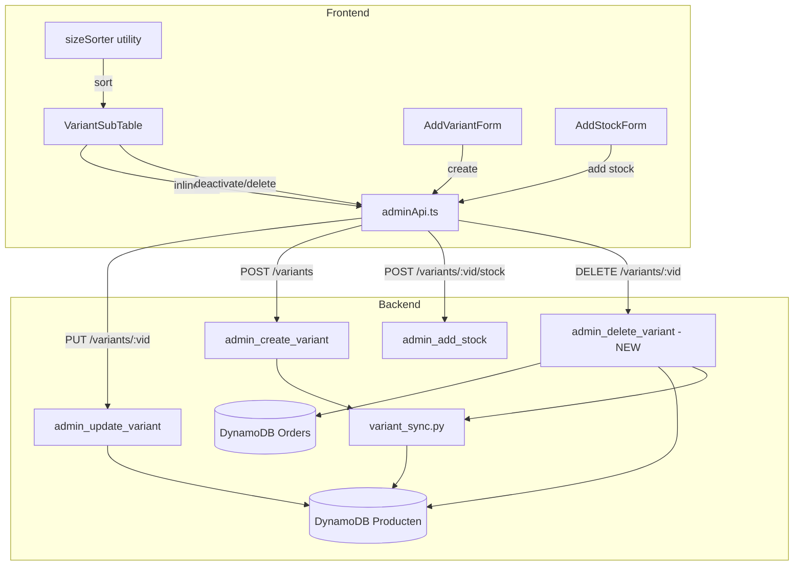

# Design Document: Product Variant Stock Management

## Overview

This feature fixes broken inline editing, adds missing variant lifecycle actions (deactivation, deletion, individual creation), and introduces size sorting for the variant management UI. The system already has most backend infrastructure in place — the work is primarily about fixing field name mismatches, adding a delete handler with order-reference checks, building a simple add-variant form, and implementing a pure frontend size sorting utility.

### Root Cause Analysis

The inline price editing and oversell toggle are broken due to a **field name mismatch** between the API layers. Per the [Dutch Field Names decision](../../../docs/decisions/dutch-field-names.md), all DynamoDB attributes must use Dutch names. However, variant records were created during an earlier "normalize to English" phase and use `price` instead of `prijs`:

| Layer                                   | Price field (current) | Price field (correct) |
| --------------------------------------- | --------------------- | --------------------- |
| DynamoDB (parent)                       | `prijs`               | `prijs` ✓             |
| DynamoDB (variant)                      | `price` ❌            | `prijs`               |
| `variant_sync.py` creates variants with | `price` ❌            | `prijs`               |
| `admin_update_variant` UPDATABLE_FIELDS | `price` ❌            | `prijs`               |
| Frontend `AdminVariant` type            | `price`               | `prijs`               |
| Frontend `updateVariant()` sends        | `{ price: N }`        | `{ prijs: N }`        |

**Decision**: Migrate variant records from `price` → `prijs` to comply with the Dutch field name convention. This eliminates the inconsistency between parent and variant records and aligns with the field registry (`fields.ts` already defines `prijs` for `recordType: 'both'`).

**Migration scope:**

1. Update `admin_update_variant` handler: `UPDATABLE_VARIANT_FIELDS` changes `'price'` → `'prijs'`
2. Update `variant_sync.py`: new variant creation uses `prijs` instead of `price`
3. Update frontend `AdminVariant` type and `updateVariant()` calls: use `prijs`
4. Write a one-time data migration script to rename `price` → `prijs` on existing variant records
5. Verify HTTP method in `adminApi.ts` matches the SAM template route configuration

## Architecture



### Key Architectural Decisions

1. **Dutch field names for variants** — Per `docs/decisions/dutch-field-names.md`, variant records will use `prijs` (not `price`). Existing records will be migrated. This aligns variants with parent products and the field registry.
2. **Soft delete first** — Deactivation (set `active=false`) is the primary action. Hard delete is only available when no orders reference the variant.
3. **Order reference check via scan** — The Orders table stores `variant_id` in line items. The delete handler will scan Orders for references before allowing deletion.
4. **Size sorting is pure frontend** — No backend involvement; sorting happens client-side before rendering.
5. **Bottom-up sync on create** — `admin_create_variant` already calls `sync_variant_to_schema`. The frontend just needs a form that calls the existing endpoint.

## Components and Interfaces

### Frontend Components

#### 1. VariantSubTable (existing — fix + extend)

**Fixes needed:**

- Update `updateVariant()` API call to send `prijs` instead of `price` (Dutch field name convention)
- Update `AdminVariant` type to use `prijs` instead of `price`
- Verify HTTP method in `adminApi.ts` matches SAM template route
- Add deactivate/delete action buttons per row
- Integrate size sorting before rendering
- Add "show inactive" toggle
- Call `onUpdate()` after all mutations

**New props:** None — existing `onUpdate` callback handles refresh.

#### 2. AddVariantForm (new component)

```typescript
interface AddVariantFormProps {
  productId: string;
  variantSchema: Record<string, string[]>; // e.g. {"Maat": ["S","M","L"]}
  onSuccess: () => void;
  isDisabled?: boolean;
}
```

A modal form with:

- One Chakra `CreatableSelect` (or `Input` with datalist) per axis from `variant_schema`
- Existing values shown as dropdown options
- Admin can type a new value (e.g. "XS" for Maat)
- Submit calls `createVariant(productId, { variant_attributes: {...} })`

#### 3. sizeSorter (new utility)

```typescript
// frontend/src/modules/webshop-management/utils/sizeSorter.ts

export function sortSizeValues(values: string[]): string[];
export function sortVariants(
  variants: AdminVariant[],
  variantSchema: Record<string, string[]>,
): AdminVariant[];
```

Pure function, no side effects. Uses a fixed priority map for clothing sizes.

### Backend Components

#### 4. admin_delete_variant (new handler)

```
DELETE /admin/products/{id}/variants/{vid}
```

**Logic:**

1. Authenticate + require `Products_CRUD`
2. Verify variant exists and belongs to product
3. Scan Orders table for any `line_items[].variant_id === vid`
4. If orders exist → return 409 Conflict with message
5. If no orders → delete variant record from Producten table
6. Call `sync_variant_to_schema(table, parent_id, {})` to rebuild parent schema from remaining active variants
7. Return 200 success

#### 5. admin_update_variant (existing — fix field names)

The handler currently uses `UPDATABLE_VARIANT_FIELDS = ['stock', 'allow_oversell', 'price', 'name', 'active']`. This must be updated to `['stock', 'allow_oversell', 'prijs', 'naam', 'active']` to align with the Dutch field name convention.

### API Contract Changes

| Endpoint                                    | Method | Status   | Change                  |
| ------------------------------------------- | ------ | -------- | ----------------------- |
| `/admin/products/{id}/variants/{vid}`       | PUT    | Existing | Verify works end-to-end |
| `/admin/products/{id}/variants/{vid}`       | DELETE | **New**  | Delete with order check |
| `/admin/products/{id}/variants`             | POST   | Existing | Used by AddVariantForm  |
| `/admin/products/{id}/variants/{vid}/stock` | POST   | Existing | No changes              |

### Frontend API Service Changes

```typescript
// adminApi.ts — add:
export const deleteVariant = async (
  productId: string,
  variantId: string,
): Promise<void> => {
  await adminClient.delete(
    `/admin/products/${encodeURIComponent(productId)}/variants/${encodeURIComponent(variantId)}`,
  );
};
```

## Data Models

### Variant Record (DynamoDB — Producten table)

| Field                | Type    | Source of Truth | Notes                                          |
| -------------------- | ------- | --------------- | ---------------------------------------------- |
| `product_id`         | String  | Variant         | Primary key, format `var_{parent_id}_{values}` |
| `parent_id`          | String  | Variant         | FK to parent product                           |
| `is_parent`          | Boolean | Variant         | Always `false`                                 |
| `variant_attributes` | Map     | Variant         | e.g. `{"Maat": "M", "Gender": "Male"}`         |
| `prijs`              | String  | Variant         | Variant-specific price, null = inherit parent  |
| `stock`              | Number  | Variant         | Current stock count                            |
| `sold_count`         | Number  | Variant         | Total sold                                     |
| `allow_oversell`     | Boolean | Variant         | Allow sale when stock=0                        |
| `active`             | Boolean | Variant         | false = deactivated (hidden from webshop)      |
| `created_at`         | String  | Variant         | ISO timestamp                                  |
| `updated_at`         | String  | Variant         | ISO timestamp                                  |

### Order Line Item (reference check)

```python
# Orders table item structure (relevant fields):
{
  "order_id": "...",
  "line_items": [
    {
      "product_id": "...",      # parent product
      "variant_id": "var_...",  # variant product_id
      "quantity": 2,
      "unit_price": 15.00
    }
  ]
}
```

### Size Sort Priority Map

```typescript
const SIZE_ORDER: Record<string, number> = {
  xxs: 1,
  xs: 2,
  s: 3,
  m: 4,
  l: 5,
  xl: 6,
  xxl: 7,
  "3xl": 8,
  "4xl": 9,
  "5xl": 10,
};
```

## Correctness Properties

_A property is a characteristic or behavior that should hold true across all valid executions of a system — essentially, a formal statement about what the system should do. Properties serve as the bridge between human-readable specifications and machine-verifiable correctness guarantees._

### Property 1: Size sort preserves set membership

_For any_ list of size strings, sorting with `sortSizeValues` SHALL return a list containing exactly the same elements (same length, same multiset of values) — only the order changes.

**Validates: Requirements 5.1, 5.3, 5.5, 5.6**

### Property 2: Recognized sizes are in standard order and precede unrecognized values

_For any_ list containing a mix of recognized clothing sizes and unrecognized values, after sorting: (a) all recognized sizes SHALL appear before all unrecognized values, (b) recognized sizes SHALL be ordered XXS < XS < S < M < L < XL < XXL < 3XL < 4XL < 5XL, and (c) unrecognized non-numeric values SHALL be in case-insensitive alphabetical order.

**Validates: Requirements 5.1, 5.3, 5.6**

### Property 3: Numeric values sort numerically

_For any_ list of numeric string values (e.g. "38", "40", "42"), sorting SHALL place them in ascending numeric order, not lexicographic order (so "9" < "10" < "100").

**Validates: Requirements 5.5**

### Property 4: Sort is idempotent

_For any_ list of size values, applying `sortSizeValues` twice SHALL produce the same result as applying it once: `sort(sort(xs)) === sort(xs)`.

**Validates: Requirements 5.1, 5.2, 5.3, 5.5, 5.6**

### Property 5: Variant deactivation preserves record integrity

_For any_ variant record, setting `active = false` via the update API SHALL preserve all other fields (stock, sold_count, variant_attributes, price) unchanged.

**Validates: Requirements 3.2**

### Property 6: Delete correctness depends on order references

_For any_ variant, the delete API SHALL succeed (remove record, update parent schema) if and only if no orders reference that variant's `product_id`. If orders DO reference it, the API SHALL return 409 and the record SHALL remain unchanged.

**Validates: Requirements 3.3, 3.4, 3.5**

### Property 7: Stock addition is additive

_For any_ variant with current stock S and any valid quantity Q (1 ≤ Q ≤ 10000), adding stock via the add-stock API SHALL result in a new stock value of exactly S + Q.

**Validates: Requirements 6.4**

### Property 8: Duplicate variant creation is rejected

_For any_ parent product and variant_attributes combination that already exists (active or inactive), attempting to create a variant with identical attributes SHALL return an error and leave the existing variant unchanged.

**Validates: Requirements 4.4**

## Error Handling

### Frontend Error Strategy

| Scenario                     | Behavior                                                    |
| ---------------------------- | ----------------------------------------------------------- |
| Price edit fails (API error) | Toast error, revert to previous value                       |
| Oversell toggle fails        | Toast error, revert switch state                            |
| Delete rejected (has orders) | Toast error with "Deactiveer i.p.v. verwijderen" suggestion |
| Delete fails (server error)  | Toast error, variant stays visible                          |
| Create variant duplicate     | Toast error, form stays open with values preserved          |
| Add stock fails              | Toast error, modal stays open                               |
| Data refresh fails           | Toast error, retain last known data                         |

### Backend Error Strategy

| Scenario                     | HTTP Status | Response                                                                                  |
| ---------------------------- | ----------- | ----------------------------------------------------------------------------------------- |
| Missing/invalid path params  | 400         | `{ message: "Product ID and Variant ID are required" }`                                   |
| Variant not found            | 404         | `{ message: "Variant not found" }`                                                        |
| Variant not owned by product | 400         | `{ message: "Variant does not belong to the specified product" }`                         |
| Delete blocked by orders     | 409         | `{ message: "Variant cannot be deleted: referenced by N order(s). Deactivate instead." }` |
| Duplicate variant_attributes | 409         | `{ message: "A variant with these attributes already exists" }`                           |
| Permission denied            | 403         | Standard auth layer response                                                              |
| Internal error               | 500         | `{ message: "Internal server error" }`                                                    |

### Optimistic UI Revert

The oversell toggle uses optimistic updates — the switch changes immediately but reverts if the API call fails. Price editing does NOT use optimistic updates — it waits for confirmation before updating the display.

## Testing Strategy

### Property-Based Tests (Hypothesis — Python backend + fast-check/jest — frontend)

The size sorting utility is a pure function with a large input space, making it ideal for property-based testing. Backend variant operations (stock addition, delete with order check) also have clear invariants.

**Frontend (jest + fast-check):**

- Properties 1–4: Size sorting utility
- Minimum 100 iterations per property
- Tag format: `Feature: product-variant-stock-management, Property N: {text}`

**Backend (pytest + hypothesis):**

- Properties 5–8: Variant CRUD operations with moto mocks
- Minimum 100 iterations per property
- Uses `@given()` decorator with custom strategies for variant data

### Unit Tests (example-based)

- Price edit: confirm `{ prijs: "12.50" }` sent to API, success toast shown
- Price edit: empty value sends `{ prijs: null }`
- Oversell toggle: sends `{ allow_oversell: true/false }`
- Deactivate: sends `{ active: false }` via updateVariant
- Delete: calls DELETE endpoint, handles 409 gracefully
- AddVariantForm: validates required axes filled, submits to createVariant
- Data refresh: `onUpdate()` called after each successful mutation

### Integration Tests

- End-to-end variant update (price + oversell) via admin_update_variant handler with moto
- End-to-end delete flow with order reference check
- End-to-end create variant with sync_variant_to_schema verification

### Test Configuration

- **Frontend**: `npx react-scripts test -- --watchAll=false`
- **Backend**: `pytest tests/unit/ -k variant`
- **Property tests**: minimum 100 iterations, tagged with property reference
