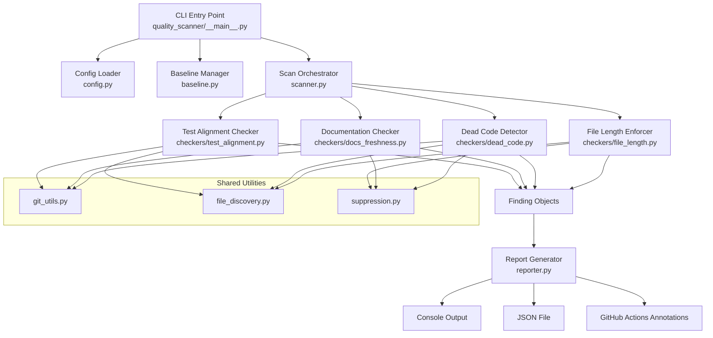
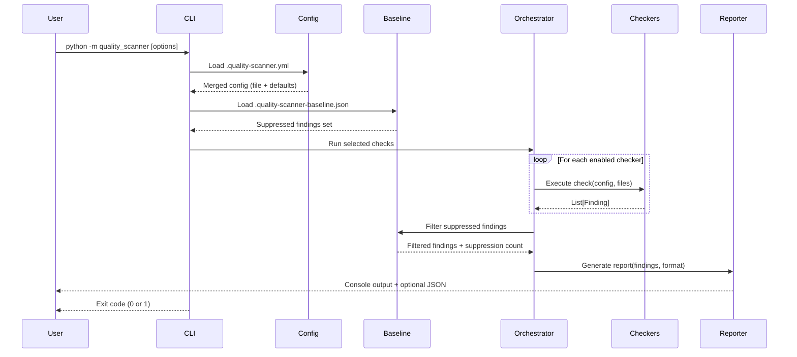

# Design Document: Code Quality Maintenance

## Overview

The Quality Scanner is a Python CLI tool that performs automated code quality checks across the H-DCN monorepo. It runs four independent checker modules—File Length Enforcer, Dead Code Detector, Documentation Freshness Checker, and Test Alignment Checker—and produces unified reports in both human-readable (console) and machine-readable (JSON) formats.

The tool is designed to:

- Execute locally from the project root via a single command
- Integrate into existing GitHub Actions workflows as a pre-deploy quality gate
- Be configurable via a YAML file with sensible defaults
- Support baseline-driven false positive suppression

### Design Decisions

1. **Python CLI over shell scripts**: Python enables AST-based analysis (critical for dead code detection), cross-platform execution, and reuse of the existing pytest infrastructure for testing the scanner itself.
2. **Single package, multiple modules**: Each checker is an independent module with a shared interface, enabling selective execution and parallel development.
3. **Git-based analysis**: Documentation freshness and test alignment both rely on `git log` for timestamp comparison, avoiding external dependency on coverage tools.
4. **No external linting tools dependency**: The scanner uses Python's `ast` module and TypeScript-aware regex parsing rather than requiring `pylint`, `vulture`, or `eslint` as runtime dependencies. This keeps the tool lightweight and avoids version conflicts.

## Architecture



### Execution Flow



## Components and Interfaces

### Package Structure

```
quality_scanner/
├── __init__.py
├── __main__.py          # CLI entry point (argparse)
├── scanner.py           # Orchestrator: runs checkers, collects findings
├── config.py            # YAML config loader + defaults + validation
├── baseline.py          # Baseline file load/save/match logic
├── reporter.py          # Console, JSON, and GitHub Actions output
├── models.py            # Data classes (Finding, ScanResult, Config)
├── suppression.py       # Inline comment suppression detection
├── git_utils.py         # Git log/diff utilities
├── file_discovery.py    # Glob-based file enumeration with exclusions
├── checkers/
│   ├── __init__.py
│   ├── base.py          # Abstract base class for checkers
│   ├── file_length.py   # File Length Enforcer
│   ├── dead_code.py     # Dead Code Detector (Python AST + TS regex)
│   ├── docs_freshness.py # Documentation Freshness Checker
│   └── test_alignment.py # Test Alignment Checker
└── tests/
    ├── __init__.py
    ├── conftest.py
    ├── test_config.py
    ├── test_baseline.py
    ├── test_file_length.py
    ├── test_dead_code.py
    ├── test_docs_freshness.py
    ├── test_test_alignment.py
    ├── test_reporter.py
    └── test_properties.py  # Property-based tests
```

### Core Interfaces

```python
# models.py
from dataclasses import dataclass, field
from enum import Enum
from typing import Optional

class Severity(Enum):
    ERROR = "error"
    WARNING = "warning"
    INFO = "info"

class Category(Enum):
    FILE_LENGTH = "file-length"
    DEAD_CODE = "dead-code"
    DOCS_FRESHNESS = "docs-freshness"
    TEST_ALIGNMENT = "test-alignment"

@dataclass
class Finding:
    file_path: str
    line_number: Optional[int]
    category: Category
    severity: Severity
    description: str
    symbol_name: Optional[str] = None
    suggestion: Optional[str] = None

@dataclass
class ScanResult:
    findings: list[Finding] = field(default_factory=list)
    suppressed_count: int = 0
    stale_baseline_entries: list[dict] = field(default_factory=list)

@dataclass
class ScanConfig:
    file_length: "FileLengthConfig"
    dead_code: "DeadCodeConfig"
    docs_freshness: "DocsFreshnessConfig"
    test_alignment: "TestAlignmentConfig"
    exclusions: list[str]
    changed_files_only: bool = False
```

```python
# checkers/base.py
from abc import ABC, abstractmethod
from quality_scanner.models import Finding, ScanConfig

class BaseChecker(ABC):
    """Abstract base for all quality checkers."""

    @abstractmethod
    def check(self, config: ScanConfig, files: list[str]) -> list[Finding]:
        """Run the check on the provided file list and return findings."""
        ...

    @property
    @abstractmethod
    def category(self) -> str:
        """Return the checker category identifier."""
        ...
```

### File Length Enforcer

```python
# checkers/file_length.py
class FileLengthChecker(BaseChecker):
    """
    Counts total lines (including blank + comments) in each source file.
    - > target (default 500): WARNING
    - > maximum (default 1000): ERROR with split suggestions
    """

    def check(self, config: ScanConfig, files: list[str]) -> list[Finding]:
        # 1. Filter files to .py in backend/handler/ and backend/layers/
        #    and .ts/.tsx (excluding .d.ts) in frontend/src/
        # 2. Apply exclusion patterns (test files, generated, config files)
        # 3. Count lines per file
        # 4. Produce WARNING for > target, ERROR for > maximum
        # 5. Attach splitting suggestions for ERROR-level findings
        ...
```

**Line counting logic**: Simple `len(file.readlines())` — the requirement explicitly states "including blank lines and comments", so no parsing needed.

**Split suggestions** (for files > 1000 lines):

- Python: "Extract helper functions to a separate module", "Use a service layer pattern", "Split into sub-modules"
- TypeScript/TSX: "Extract custom hooks to separate files", "Split component into sub-components", "Move utility functions to utils/"

### Dead Code Detector

```python
# checkers/dead_code.py
class DeadCodeChecker(BaseChecker):
    """
    Detects unused symbols via static analysis.

    Python: Uses ast module to build a symbol table and reference graph.
    TypeScript: Uses regex-based export/import analysis.
    """

    def check(self, config: ScanConfig, files: list[str]) -> list[Finding]:
        # 1. Parse SAM template.yaml to get handler entry points
        # 2. Build symbol definition table (function defs, class defs, imports)
        # 3. Build reference table (all name usages across all files)
        # 4. Exclude: lambda_handler functions, React default exports,
        #    __all__ members, SAM-referenced handlers
        # 5. Any defined symbol not in reference table = unused
        # 6. Mark dynamic import/reflection references as "uncertain"
        ...
```

**Python analysis approach**:

1. Parse each `.py` file with `ast.parse()`
2. Walk AST to collect `FunctionDef`, `ClassDef`, `Import`, `ImportFrom` nodes → symbol definitions
3. Walk AST to collect all `Name` and `Attribute` nodes → references
4. Cross-reference: a symbol is unused if defined but never referenced in any other file within scope
5. Special handling for `__all__` lists (mark all listed names as referenced)

**TypeScript analysis approach**:

1. Regex-based extraction of `export function`, `export const`, `export class`, `export default`
2. Scan all `.ts`/`.tsx` files for `import { X }` and `import X from` statements
3. Cross-reference exported symbols against import statements
4. Default exports in component files are excluded (React convention)

**SAM template parsing**:

- Parse `backend/template.yaml` as YAML
- Find all resources of type `AWS::Serverless::Function`
- Extract `CodeUri` + `Handler` properties (e.g., `handler/create_member` + `app.lambda_handler`)
- Mark `lambda_handler` in those specific `app.py` files as referenced

### Documentation Freshness Checker

```python
# checkers/docs_freshness.py
class DocsFreshnessChecker(BaseChecker):
    """
    Detects documentation that has become stale relative to code changes.
    Uses git log to compare modification timestamps.
    """

    def check(self, config: ScanConfig, files: list[str]) -> list[Finding]:
        # 1. Load source-to-docs mapping from config
        # 2. For each mapped source file, get last commit date
        # 3. For each mapped doc file, get last commit date
        # 4. If source_date - doc_date > staleness_threshold: flag as stale
        # 5. Only flag if source change affects public interfaces
        #    (detected via AST diff of function signatures, class declarations)
        ...
```

**Public interface detection** (to avoid flagging internal changes):

- Python: Compare function signatures (`def name(params) -> return_type`), class declarations, and `__all__` exports between the two most recent commits using `ast.parse()` on both versions
- TypeScript: Compare exported symbol names and their type signatures via regex on `export` statements

**Git timestamp retrieval**:

```python
def get_last_modified_date(file_path: str) -> datetime:
    """Get the date of the most recent commit touching this file."""
    result = subprocess.run(
        ["git", "log", "-1", "--format=%aI", "--", file_path],
        capture_output=True, text=True
    )
    return datetime.fromisoformat(result.stdout.strip())
```

### Test Alignment Checker

```python
# checkers/test_alignment.py
class TestAlignmentChecker(BaseChecker):
    """
    Checks that test files exist and are up-to-date relative to source files.
    Uses naming conventions + git timestamps.
    """

    def check(self, config: ScanConfig, files: list[str]) -> list[Finding]:
        # 1. For each source file, resolve expected test file path(s)
        # 2. If no test file exists: report as "untested" (ERROR)
        # 3. If test file exists but source is newer: "test potentially outdated" (WARNING)
        # 4. If multiple test files match: use most recently modified
        ...
```

**Naming convention mapping**:
| Source Pattern | Test Pattern |
|---|---|
| `backend/handler/<name>/app.py` | `backend/tests/unit/test_<name>.py` or `backend/tests/integration/test_<name>.py` |
| `frontend/src/modules/**/<Component>.tsx` | `frontend/src/__tests__/<Component>.test.tsx` or co-located `<Component>.test.tsx` |
| `frontend/src/components/**/<Component>.tsx` | `frontend/src/__tests__/<Component>.test.tsx` or co-located `<Component>.test.tsx` |
| `frontend/src/services/**/<service>.ts` | `frontend/src/__tests__/<service>.test.ts` or co-located `<service>.test.ts` |

### Configuration Loader

```python
# config.py
import yaml
from pathlib import Path
from quality_scanner.models import ScanConfig

DEFAULTS = {
    "file_length": {"target": 500, "maximum": 1000},
    "exclusions": [".venv/", "node_modules/", "build/", "*.generated.*"],
    "docs_freshness": {"staleness_threshold_days": 7, "mapping": []},
    "test_alignment": {
        "backend_pattern": "test_{handler_name}.py",
        "frontend_pattern": "{Component}.test.tsx"
    },
    "dead_code": {"sam_template": "backend/template.yaml"}
}

def load_config(config_path: Path = None) -> ScanConfig:
    """
    Load config from .quality-scanner.yml, merge with defaults.
    Raises ConfigError for invalid YAML or unrecognized keys.
    """
    ...
```

**Validation rules**:

- File length thresholds must be positive integers ≥ 50
- Unrecognized top-level keys → `ConfigError` with location info
- Invalid YAML syntax → `ConfigError` with line/column
- Partial config → deep-merge with defaults (provided values override defaults)

### Report Generator

```python
# reporter.py
class Reporter:
    """Generates output in multiple formats."""

    def console_report(self, result: ScanResult) -> str:
        """Human-readable grouped output with color coding."""
        ...

    def json_report(self, result: ScanResult) -> dict:
        """Machine-readable JSON with all findings and summary."""
        ...

    def github_annotations(self, result: ScanResult) -> list[str]:
        """GitHub Actions workflow commands for inline annotations."""
        # ::error file={path},line={line}::{message}
        # ::warning file={path},line={line}::{message}
        ...
```

**JSON report structure**:

```json
{
  "summary": {
    "total": 12,
    "by_category": {
      "file-length": 3,
      "dead-code": 5,
      "docs-freshness": 2,
      "test-alignment": 2
    },
    "by_severity": { "error": 2, "warning": 7, "info": 3 },
    "suppressed": 4,
    "stale_baseline": 1
  },
  "findings": [
    {
      "file_path": "backend/handler/get_members/app.py",
      "line_number": null,
      "category": "file-length",
      "severity": "warning",
      "description": "File has 623 lines (target: 500)",
      "symbol_name": null,
      "suggestion": "Extract helper functions to a separate module"
    }
  ]
}
```

### Baseline Manager

```python
# baseline.py
class BaselineManager:
    """Manages .quality-scanner-baseline.json for false positive suppression."""

    def load(self, path: Path) -> set[tuple]:
        """Load baseline entries as a set of (file_path, line, category, symbol) tuples."""
        ...

    def matches(self, finding: Finding) -> bool:
        """Check if a finding matches a baseline entry."""
        ...

    def generate(self, findings: list[Finding]) -> dict:
        """Generate baseline JSON from current findings."""
        ...

    def find_stale(self, baseline_entries: set, current_findings: list[Finding]) -> list[dict]:
        """Identify baseline entries that no longer match any finding."""
        ...
```

### CLI Interface

```
usage: python -m quality_scanner [OPTIONS]

options:
  --check {file-length,dead-code,docs-freshness,test-alignment}
                        Run specific check(s) only (repeatable)
  --changed-only        Scan only files changed since last commit
  --format {console,json,both}
                        Output format (default: console)
  --output PATH         JSON output file path (default: quality-report.json)
  --no-baseline         Ignore baseline file, report all findings
  --update-baseline     Update baseline with current findings
  --filter-category CAT Filter output by category
  --filter-severity SEV Filter output by severity
  --filter-path PATH    Filter output by file path prefix
  --ci                  Enable CI mode (GitHub Actions annotations)
  --config PATH         Custom config file path
```

## Data Models

### Configuration File Schema (`.quality-scanner.yml`)

```yaml
# .quality-scanner.yml
file_length:
  target: 500 # Warning threshold (lines)
  maximum: 1000 # Error threshold (lines)
  paths:
    - backend/handler/
    - backend/layers/
    - frontend/src/

dead_code:
  sam_template: backend/template.yaml
  paths:
    - backend/handler/
    - backend/layers/
    - frontend/src/

docs_freshness:
  staleness_threshold_days: 7
  mapping:
    - source: backend/handler/create_member/
      docs:
        - docs/architecture/members.md
        - docs/README.md
    - source: frontend/src/modules/webshop/
      docs:
        - docs/webshop/README.md

test_alignment:
  backend_pattern: "test_{handler_name}.py"
  frontend_pattern: "{Component}.test.tsx"

exclusions:
  - ".venv/"
  - "node_modules/"
  - "build/"
  - "*.generated.*"
  - "__pycache__/"
  - ".aws-sam/"
```

### Baseline File Schema (`.quality-scanner-baseline.json`)

```json
{
  "version": 1,
  "generated_at": "2025-01-18T14:30:00Z",
  "entries": [
    {
      "file_path": "backend/handler/hdcn_cognito_admin/app.py",
      "line_number": null,
      "category": "file-length",
      "symbol_name": null,
      "description": "File has 850 lines (target: 500)"
    },
    {
      "file_path": "frontend/src/modules/members/MemberList.tsx",
      "line_number": 42,
      "category": "dead-code",
      "symbol_name": "formatLegacyDate",
      "description": "Unused function: formatLegacyDate"
    }
  ]
}
```

### Finding Match Key

Baseline matching uses a composite key: `(file_path, category, symbol_name)`. Line numbers are excluded from matching because they shift as files are edited — the file path + category + symbol name combination is stable enough to identify the same suppressed finding across edits.

### Exit Code Logic

| Condition                             | Exit Code |
| ------------------------------------- | --------- |
| No error-severity findings            | 0         |
| One or more error-severity findings   | 1         |
| Configuration error or system failure | 2         |

## Correctness Properties

_A property is a characteristic or behavior that should hold true across all valid executions of a system—essentially, a formal statement about what the system should do. Properties serve as the bridge between human-readable specifications and machine-verifiable correctness guarantees._

### Property 1: Severity assignment by line count

_For any_ source file with a known line count and configured thresholds (target, maximum), the File Length Enforcer SHALL assign severity "error" when line count > maximum, "warning" when target < line count ≤ maximum, and produce no finding when line count ≤ target.

**Validates: Requirements 1.1, 1.2**

### Property 2: File exclusion filtering

_For any_ file path and set of exclusion patterns (glob syntax), a file matching any exclusion pattern SHALL never appear in findings, and a file matching no exclusion pattern SHALL be included in the scan.

**Validates: Requirements 1.3, 8.3**

### Property 3: Summary sort order

_For any_ set of file length findings, the summary output SHALL list findings sorted by line count in descending order.

**Validates: Requirements 1.7**

### Property 4: Exit code determined by error severity

_For any_ scan result, the exit code SHALL be 0 if and only if zero findings have severity "error", and SHALL be 1 if one or more findings have severity "error".

**Validates: Requirements 1.8, 1.9, 5.7, 6.6, 7.3, 7.4**

### Property 5: Unused symbol detection

_For any_ symbol (function, class, variable, import, component) defined in a source file within the analysis scope, the Dead Code Detector SHALL report it as unused if and only if no other symbol in scope references it (excluding self-references within the symbol's own definition).

**Validates: Requirements 2.1, 2.2, 2.3, 2.4, 2.9**

### Property 6: Symbol exclusion from dead code analysis

_For any_ symbol that is a `lambda_handler` function in a SAM-referenced handler, a member of a Python `__all__` list, or a React component default export, the Dead Code Detector SHALL never report it as unused regardless of its reference count.

**Validates: Requirements 2.5, 2.6, 2.11, 2.13**

### Property 7: Test imports count as references

_For any_ production symbol imported by a test file, the Dead Code Detector SHALL count that import as a valid reference and SHALL NOT report the symbol as unused.

**Validates: Requirements 2.10**

### Property 8: Inline suppression skips findings

_For any_ source file containing an inline suppression comment (`# quality-ignore: <check-type>` or `// quality-ignore: <check-type>`) on the line immediately preceding a symbol definition, the specified checker SHALL skip that symbol and produce no finding for it.

**Validates: Requirements 2.14, 3.10, 9.4, 9.5**

### Property 9: Documentation staleness threshold

_For any_ source-documentation pair where the source file's most recent commit date minus the documentation file's most recent commit date exceeds the configured staleness threshold (in days), the Documentation Checker SHALL flag the documentation as stale.

**Validates: Requirements 3.3, 3.5**

### Property 10: Public interface change detection

_For any_ source file modification, the Documentation Checker SHALL only flag related documentation as stale when the change alters public interfaces (function signatures, exported symbols, API route definitions, class/method declarations) and SHALL NOT flag when only internal implementation changes.

**Validates: Requirements 3.9**

### Property 11: Test file path derivation

_For any_ source file name and configured naming convention template, the Test Alignment Checker SHALL derive the correct expected test file path by substituting the source name into the template pattern.

**Validates: Requirements 4.4, 8.5**

### Property 12: Test staleness detection

_For any_ source-test file pair where the source file's most recent git commit is newer than the test file's most recent git commit, the Test Alignment Checker SHALL report the pair as "test potentially outdated".

**Validates: Requirements 4.3, 4.6**

### Property 13: Report summary count accuracy

_For any_ set of findings, the summary section's total count SHALL equal the sum of per-category counts, and SHALL also equal the sum of per-severity counts.

**Validates: Requirements 5.4**

### Property 14: Report filtering with AND logic

_For any_ combination of filters (category, severity, file path), the filtered report SHALL contain only findings that match ALL specified filter criteria simultaneously.

**Validates: Requirements 5.5**

### Property 15: GitHub Actions annotation format

_For any_ finding with severity "error" or "warning", the CI output SHALL produce a correctly formatted GitHub Actions annotation command (`::error file={path},line={line}::{message}` or `::warning file={path},line={line}::{message}`).

**Validates: Requirements 7.5**

### Property 16: Configuration threshold validation

_For any_ configured file length threshold value, the config loader SHALL reject values less than 50 and accept values greater than or equal to 50.

**Validates: Requirements 8.2**

### Property 17: Configuration merge with defaults

_For any_ partial configuration file specifying a subset of settings, the config loader SHALL produce a complete configuration where specified values override defaults and unspecified values retain their default values.

**Validates: Requirements 8.8**

### Property 18: Baseline matching and suppression

_For any_ finding that matches a baseline entry (by file path, category, and symbol name), the finding SHALL be excluded from the report output and exit code calculation, and the suppressed count SHALL accurately reflect the number of excluded findings.

**Validates: Requirements 9.2, 9.6**

### Property 19: Stale baseline detection

_For any_ baseline entry that does not match any finding in the current scan, the scanner SHALL report that entry as "stale baseline" in the summary.

**Validates: Requirements 9.8**

## Error Handling

### Configuration Errors

- **Invalid YAML syntax**: Report parse error with line/column location, exit with code 2
- **Unrecognized keys**: Report the unrecognized key name and refuse to proceed (exit code 2)
- **Invalid threshold values**: Report which value is invalid and why (below minimum of 50), exit code 2
- **Missing config file**: Use defaults silently (this is expected behavior, not an error)

### File System Errors

- **Permission denied on file read**: Log warning, skip file, continue scan
- **File not found during scan**: Log warning, skip file, continue scan (file may have been deleted between discovery and analysis)
- **Binary file encountered**: Detect via null-byte check, skip silently

### Git Errors

- **Not a git repository**: Disable git-dependent checkers (docs freshness, test alignment), log warning, run remaining checkers
- **Git command failure**: Log the specific git command that failed, skip the affected check, continue with other checks
- **No git history for file**: Treat as "unknown modification date", skip staleness comparison for that file

### AST Parse Errors

- **Python syntax error in source file**: Log warning with file path, skip that file for dead code analysis, continue
- **TypeScript parse failure**: Log warning, skip file, continue

### Baseline Errors

- **Missing baseline file**: Treat as empty baseline (no suppressions), proceed normally
- **Invalid baseline JSON**: Log warning, treat as empty baseline, proceed
- **Corrupted baseline entry**: Skip that entry, process remaining entries

## Testing Strategy

### Property-Based Testing (Hypothesis)

The scanner's core logic is highly amenable to property-based testing because it operates on pure functions with clear input/output relationships. The **Hypothesis** library (already present in the project's backend test infrastructure) will be used.

**Configuration**: Each property test runs a minimum of 100 iterations.
**Tag format**: `# Feature: code-quality-maintenance, Property {N}: {title}`

Property tests will cover:

- Severity classification logic (Property 1)
- Glob pattern matching for exclusions (Property 2)
- Sort order invariant (Property 3)
- Exit code determination (Property 4)
- Symbol reference graph analysis (Property 5)
- Suppression comment detection (Property 8)
- Timestamp comparison logic (Properties 9, 12)
- Naming convention template expansion (Property 11)
- Summary count arithmetic (Property 13)
- Filter AND-logic (Property 14)
- Config validation and merging (Properties 16, 17)
- Baseline matching (Properties 18, 19)

### Unit Tests (pytest)

Unit tests cover specific examples, integration points, and edge cases:

- SAM template parsing (extracting handler references from YAML)
- Public interface diff detection (AST comparison of function signatures)
- GitHub Actions annotation format correctness
- Config file loading from disk (YAML parsing)
- Baseline file generation and serialization
- CLI argument parsing
- Error handling paths (invalid files, permission issues, git failures)
- Dynamic import / reflection detection ("uncertain" classification)
- Empty result reporting (zero findings confirmation message)

### Integration Tests

- End-to-end scan of a fixture project directory with known issues
- CI mode output verification (annotation format)
- Changed-files-only mode with a prepared git repository
- Performance benchmarking (60-second full scan target)

### Test Location

All tests live in `quality_scanner/tests/`:

- `test_properties.py` — all property-based tests (Hypothesis)
- `test_file_length.py` — unit tests for file length checker
- `test_dead_code.py` — unit tests for dead code detector
- `test_docs_freshness.py` — unit tests for documentation checker
- `test_test_alignment.py` — unit tests for test alignment checker
- `test_config.py` — config loading and validation
- `test_baseline.py` — baseline management
- `test_reporter.py` — report generation formats
- `conftest.py` — shared fixtures (temp directories, mock git repos)

### CI/CD Integration Approach

The Quality Scanner integrates into the existing GitHub Actions workflows by adding a `quality-check` job that runs before the deploy job:

```yaml
# Added to both deploy-backend.yml and deploy-frontend.yml
jobs:
  quality-check:
    name: Quality Scanner
    runs-on: ubuntu-latest
    steps:
      - uses: actions/checkout@v4
        with:
          fetch-depth: 0 # Full history needed for git log
      - uses: actions/setup-python@v5
        with:
          python-version: "3.11"
      - name: Install Quality Scanner
        run: pip install -e quality_scanner/
      - name: Run Quality Scanner
        run: python -m quality_scanner --ci --format both
      - name: Upload report artifact
        if: always()
        uses: actions/upload-artifact@v4
        with:
          name: quality-report
          path: quality-report.json

  build-and-deploy:
    needs: quality-check
    # ... existing deploy steps
```

The `--ci` flag enables GitHub Actions annotation output. The `needs: quality-check` dependency ensures deploy is blocked when errors are found.
