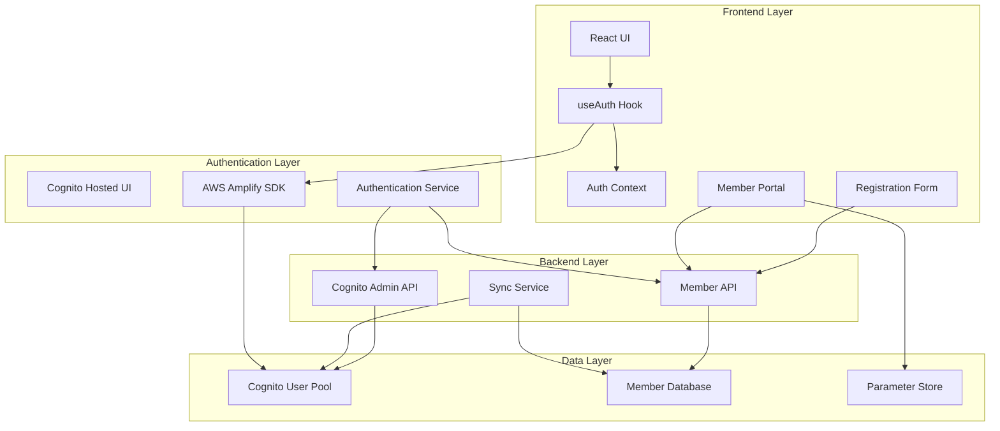
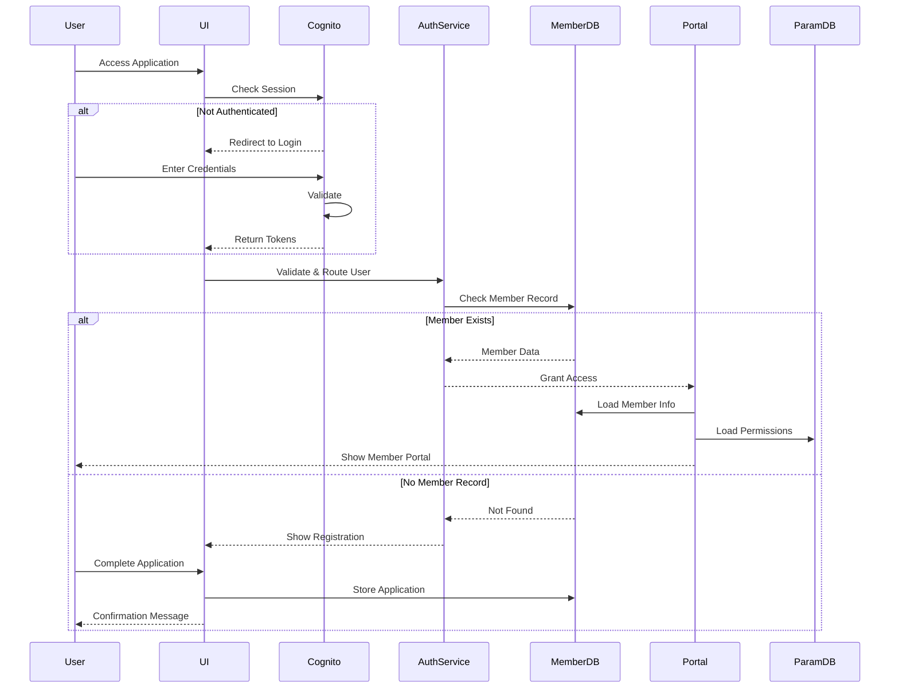

# Design Document: Cognito Authentication Integration

## Overview

This design document specifies the architecture and implementation approach for integrating AWS Cognito authentication with the H-DCN member management system. The solution builds upon the existing Cognito admin infrastructure while adding user-facing authentication flows, member portal access, and intelligent routing based on membership status.

The design addresses three primary user journeys:

1. **Existing Members**: 1000+ members migrated from the member database who need secure account activation
2. **New Applicants**: Potential members who self-register and apply for membership
3. **Authenticated Members**: Active members accessing their portal, webshop, and parameter-controlled modules

## Architecture

### High-Level Architecture



### Authentication Flow Architecture



## Components and Interfaces

### 1. Authentication Hook (useAuth)

**Purpose**: Central authentication state management and Cognito integration

**Interface**:

```typescript
interface UseAuthReturn {
  user: CognitoUser | null;
  memberData: Member | null;
  loading: boolean;
  isAuthenticated: boolean;
  isMember: boolean;
  login: (email: string, password: string) => Promise<void>;
  logout: () => Promise<void>;
  signUp: (email: string, password: string) => Promise<void>;
  confirmSignUp: (email: string, code: string) => Promise<void>;
  forgotPassword: (email: string) => Promise<void>;
  resetPassword: (
    email: string,
    code: string,
    newPassword: string
  ) => Promise<void>;
  hasRole: (role: string) => boolean;
  hasPermission: (permission: string) => boolean;
}
```

**Responsibilities**:

- Manage Cognito authentication state using AWS Amplify
- Handle login, logout, signup, and password reset flows
- Fetch and cache member data after authentication
- Provide role and permission checking utilities
- Maintain session persistence and token refresh

### 2. Authentication Service (Backend)

**Purpose**: Server-side authentication logic and user routing

**Interface**:

```python
class AuthenticationService:
    def validate_and_route_user(self, cognito_username: str) -> UserRoute
    def check_member_exists(self, email: str) -> Optional[Member]
    def create_member_application(self, member_data: dict) -> str
    def sync_cognito_with_member_db(self) -> SyncReport
    def handle_password_reset_request(self, email: str) -> bool
```

**Responsibilities**:

- Validate Cognito tokens and extract user information
- Check member database for existing records
- Route users to appropriate UI based on membership status
- Handle application submissions for new members by creating Member records with 'new_applicant' status
- Coordinate synchronization between systems

### 3. Migration Service

**Purpose**: Bulk migration of existing members to Cognito

**Interface**:

```python
class MigrationService:
    def migrate_members_to_cognito(self, batch_size: int = 100) -> MigrationReport
    def create_cognito_account_without_password(self, member: Member) -> str
    def send_activation_emails(self, member_emails: List[str]) -> EmailReport
    def handle_duplicate_emails(self, duplicates: List[Member]) -> ConflictReport
    def generate_migration_report(self) -> MigrationReport
```

**Responsibilities**:

- Read member data from DynamoDB
- Create Cognito accounts without passwords
- Set accounts to "force password reset" state
- Send welcome/activation emails
- Handle conflicts and generate reports

### 4. Member Portal Component

**Purpose**: Authenticated member dashboard and information management

**Interface**:

```typescript
interface MemberPortalProps {
  user: CognitoUser;
  memberData: Member;
}

interface MemberPortalState {
  editMode: boolean;
  availableModules: Module[];
  membershipInfo: MembershipInfo;
  loading: boolean;
}
```

**Responsibilities**:

- Display member information (editable and read-only fields)
- Provide access to webshop module
- Show/hide modules based on parameter evaluation
- Handle member information updates
- Display membership status and history

### 5. Registration Form Component

**Purpose**: New member application interface

**Interface**:

```typescript
interface RegistrationFormProps {
  cognitoUser: CognitoUser;
  onSubmit: (memberData: Partial<Member>) => Promise<void>;
}

interface NewMemberData {
  email: string;
  firstName: string;
  lastName: string;
  phone: string;
  address: Address;
  membershipType: "individual" | "family" | "corporate";
  region: string;
  additionalInfo?: string;
}
```

**Responsibilities**:

- Collect new member application data
- Validate form inputs
- Submit member data to create record with 'new_applicant' status
- Display confirmation message
- Handle validation errors

### 6. Parameter Access Control Service

**Purpose**: Evaluate member permissions and module visibility

**Interface**:

```typescript
interface ParameterService {
  evaluateModuleAccess(memberId: string, moduleId: string): Promise<boolean>;
  getAvailableModules(memberId: string): Promise<Module[]>;
  checkPermission(memberId: string, permission: string): Promise<boolean>;
  getMemberParameters(memberId: string): Promise<MemberParameters>;
}
```

**Responsibilities**:

- Load member-specific parameters from Parameter Store
- Evaluate access rules for each module
- Cache parameter evaluations for performance
- Handle parameter updates and cache invalidation

## Data Models

### Cognito User Model

```typescript
interface CognitoUser {
  username: string; // Email address
  email: string;
  emailVerified: boolean;
  groups: string[]; // hdcnAdmins, hdcnLeden, hdcnRegio_*
  attributes: {
    sub: string; // Cognito user ID
    email: string;
    given_name?: string;
    family_name?: string;
    phone_number?: string;
  };
  mfaEnabled: boolean;
  userStatus: "CONFIRMED" | "FORCE_CHANGE_PASSWORD" | "RESET_REQUIRED";
}
```

### Member Database Model

```typescript
interface Member {
  id: string; // Primary key
  email: string; // Must match Cognito username
  firstName: string;
  lastName: string;
  phone: string;
  address: Address;
  membershipNumber?: string; // Generated after approval
  membershipType: "individual" | "family" | "corporate";
  membershipStatus:
    | "new_applicant"
    | "active"
    | "inactive"
    | "suspended"
    | "ended"
    | "sponsor";
  region: string; // Regional affiliation
  joinDate?: string; // Set after approval
  renewalDate?: string; // Set after approval
  paymentStatus?: "current" | "overdue" | "exempt"; // Set after approval
  parameters?: MemberParameters; // Set after approval
  applicationDate: string; // When application was submitted
  approvalDate?: string; // When application was approved
  approvedBy?: string; // Admin who approved
  notes?: string; // Admin notes
  createdAt: string;
  updatedAt: string;
}
```

### Member Parameters Model

```typescript
interface MemberParameters {
  memberId: string;
  moduleAccess: {
    webshop: boolean; // Always true for active members
    events: boolean;
    products: boolean;
    admin: boolean;
    regional: boolean;
  };
  permissions: string[]; // Custom permission flags
  restrictions: string[]; // Access restrictions
  customFlags: Record<string, boolean>;
}
```

### User Route Model

```typescript
type UserRoute =
  | { type: "member_portal"; memberData: Member }
  | { type: "registration_form"; cognitoUser: CognitoUser }
  | { type: "activation_required"; message: string }
  | { type: "error"; error: string };
```

## Correctness Properties

_A property is a characteristic or behavior that should hold true across all valid executions of a system-essentially, a formal statement about what the system should do. Properties serve as the bridge between human-readable specifications and machine-verifiable correctness guarantees._

### Property 1: Account Registration Round Trip

_For any_ valid email and password combination, creating a Cognito account should result in an account that can be verified and used for authentication
**Validates: Requirements 1.1, 1.2, 1.3**

### Property 2: Password Complexity Enforcement

_For any_ password input during registration or reset, only passwords meeting complexity requirements should be accepted, and weak passwords should be rejected with appropriate error messages
**Validates: Requirements 1.4, 3.2**

### Property 3: Authentication Routing Consistency

_For any_ authenticated Cognito user, the routing decision (member portal vs registration form) should be consistent with their presence in the Member_Database
**Validates: Requirements 2.1, 5.1, 5.2**

### Property 4: Authentication Error Handling

_For any_ invalid credentials or account state issues, the system should provide appropriate error messages and prevent unauthorized access
**Validates: Requirements 2.2, 2.3, 1.5**

### Property 5: Password Reset Flow Completeness

_For any_ member requiring password reset, the complete flow from reset request to successful login should work correctly, including migrated accounts
**Validates: Requirements 3.1, 3.2, 3.3, 3.4, 3.5**

### Property 6: Migration Account Creation

_For any_ member in the Member_Database, the migration process should create a corresponding Cognito account without password in the correct state
**Validates: Requirements 4.1, 4.2, 4.3**

### Property 7: Migration Conflict Resolution

_For any_ duplicate email addresses during migration, the system should handle conflicts gracefully and generate appropriate reports
**Validates: Requirements 4.5**

### Property 8: Member Application Processing

_For any_ valid application data submitted by a Cognito user without member record, the application should be stored and appropriate notifications sent
**Validates: Requirements 6.1, 6.2, 6.4**

### Property 9: Application Validation

_For any_ invalid or incomplete application data, the system should prevent submission and display specific error messages
**Validates: Requirements 6.5**

### Property 10: Member Portal Data Display

_For any_ authenticated member with valid Member_Database record, the portal should display complete membership information with correct field access controls
**Validates: Requirements 7.1, 7.2, 7.5**

### Property 11: Member Information Updates

_For any_ editable field update by an authenticated member, the changes should be validated, saved, and confirmed appropriately
**Validates: Requirements 7.3**

### Property 12: Webshop Access Control

_For any_ authenticated member with active membership status, webshop access should be granted immediately
**Validates: Requirements 7.4**

### Property 13: Parameter-Based Module Access

_For any_ member and module combination, access should be granted or denied based on parameter evaluation, with appropriate UI visibility
**Validates: Requirements 8.1, 8.2, 8.3, 8.4**

### Property 14: Parameter Change Propagation

_For any_ parameter changes in Member_Database, module visibility should be updated correctly on next session
**Validates: Requirements 8.5**

### Property 15: Data Synchronization Consistency

_For any_ changes to member data (email, status), the corresponding Cognito account should be updated to maintain consistency, with administrator-triggered verification available on demand
**Validates: Requirements 9.1, 9.2, 9.4**

### Property 16: Synchronization Error Handling

_For any_ synchronization failures or data inconsistencies, the system should detect, log, report, and retry appropriately
**Validates: Requirements 9.3, 9.5**

### Property 17: MFA Policy Enforcement

_For any_ user in administrative groups, MFA should be mandatory, while regular members should have optional MFA capability
**Validates: Requirements 10.1, 10.2**

### Property 18: Security Event Logging

_For any_ authentication attempt, security event, or authorization decision, appropriate logs should be created with required information
**Validates: Requirements 10.3, 5.4**

### Property 19: Security Protection Measures

_For any_ suspicious activity or security threats, the system should implement appropriate protection measures and notifications
**Validates: Requirements 10.4**

### Property 20: Administrative Status Control

_For any_ membership status change request, only users in the hdcnAdmins group should be able to modify membershipStatus fields, with all attempts logged
**Validates: Requirements 11.1, 11.2, 11.3**

## Error Handling

### Authentication Errors

```typescript
enum AuthErrorCode {
  INVALID_CREDENTIALS = "INVALID_CREDENTIALS",
  USER_NOT_FOUND = "USER_NOT_FOUND",
  PASSWORD_RESET_REQUIRED = "PASSWORD_RESET_REQUIRED",
  ACCOUNT_DISABLED = "ACCOUNT_DISABLED",
  MFA_REQUIRED = "MFA_REQUIRED",
  SESSION_EXPIRED = "SESSION_EXPIRED",
  NETWORK_ERROR = "NETWORK_ERROR",
}

interface AuthError {
  code: AuthErrorCode;
  message: string;
  userMessage: string; // User-friendly message
  action?: "retry" | "reset_password" | "contact_admin";
}
```

**Error Handling Strategy**:

- Display user-friendly error messages
- Log detailed errors for debugging
- Provide actionable guidance (e.g., "Use Forgot Password")
- Implement retry logic for transient failures
- Escalate to administrators for critical errors

### Migration Errors

```typescript
interface MigrationError {
  memberId: string;
  email: string;
  errorType: "duplicate_email" | "invalid_email" | "cognito_error" | "unknown";
  errorMessage: string;
  resolution: string;
}

interface MigrationReport {
  totalMembers: number;
  successfulMigrations: number;
  failedMigrations: number;
  errors: MigrationError[];
  duplicateEmails: string[];
  timestamp: string;
}
```

**Migration Error Handling**:

- Continue processing on individual failures
- Collect all errors for batch reporting
- Generate detailed migration reports
- Flag duplicate emails for manual resolution
- Provide rollback capability if needed

### Synchronization Errors

```typescript
interface SyncError {
  type:
    | "email_mismatch"
    | "missing_cognito"
    | "missing_member"
    | "status_conflict";
  cognitoUsername?: string;
  memberId?: string;
  details: string;
  severity: "low" | "medium" | "high";
}

interface SyncReport {
  syncedRecords: number;
  errors: SyncError[];
  timestamp: string;
  nextSyncScheduled: string;
}
```

**Synchronization Error Handling**:

- Implement exponential backoff for retries
- Alert administrators for high-severity errors
- Maintain sync error log for auditing
- Provide manual reconciliation tools

## Testing Strategy

### Unit Testing

**Authentication Hook Tests**:

- Test login success and failure scenarios
- Test token refresh and session management
- Test logout and state cleanup
- Test role and permission checking
- Mock Cognito SDK responses

**Service Layer Tests**:

- Test user routing logic with various member states
- Test migration service with sample data
- Test synchronization logic
- Test parameter evaluation
- Mock database and Cognito API calls

**Component Tests**:

- Test member portal rendering with different data
- Test registration form validation
- Test error message display
- Test module visibility based on parameters

### Integration Testing

**Authentication Flow Tests**:

- Test complete login flow from UI to backend
- Test password reset flow end-to-end
- Test new user registration and application submission
- Test member portal access after authentication

**Migration Tests**:

- Test bulk migration with sample member data
- Test duplicate email handling
- Test activation email sending
- Test migration report generation

**Synchronization Tests**:

- Test daily sync process
- Test conflict resolution
- Test error handling and retry logic

### Property-Based Testing

Property-based tests will be defined after completing the prework analysis in the next section.

## Implementation Notes

### Email Service Integration (Google Workspace for Nonprofits)

**Service Configuration**:

```typescript
interface EmailService {
  sendWelcomeEmail(memberEmail: string, resetLink: string): Promise<void>;
  sendApplicationNotification(
    adminEmails: string[],
    applicantData: Member
  ): Promise<void>;
  sendApprovalNotification(
    memberEmail: string,
    membershipDetails: Member
  ): Promise<void>;
  sendRejectionNotification(
    memberEmail: string,
    reason?: string
  ): Promise<void>;
}
```

**Implementation Options**:

1. **Gmail API** (Recommended): Direct integration with Google Workspace Gmail API
2. **SMTP**: Use Google Workspace SMTP servers (smtp.gmail.com:587)
3. **AWS SES + Google**: Route through AWS SES using Google domain

**Gmail API Implementation**:

```python
from google.oauth2.service_account import Credentials
from googleapiclient.discovery import build
import base64
from email.mime.text import MIMEText

class GoogleEmailService:
    def __init__(self, service_account_path: str, admin_email: str):
        credentials = Credentials.from_service_account_file(
            service_account_path,
            scopes=['https://www.googleapis.com/auth/gmail.send']
        )
        self.service = build('gmail', 'v1', credentials=credentials)
        self.admin_email = admin_email

    def send_application_notification(self, applicant: Member):
        subject = f"New H-DCN Membership Application: {applicant.firstName} {applicant.lastName}"
        body = self.create_admin_notification_template(applicant)
        self.send_email(self.admin_email, subject, body)
```

**Email Templates**:

- **Migration Welcome**: "Set Your H-DCN Password" with reset link
- **Application Notification**: Admin alert with applicant details and review link
- **Approval Email**: "Welcome to H-DCN" with membership details
- **Rejection Email**: Polite rejection with reapplication guidance

### AWS Amplify Integration

Use AWS Amplify for frontend Cognito integration:

```typescript
import { Amplify, Auth } from "aws-amplify";

Amplify.configure({
  Auth: {
    region: "eu-west-1",
    userPoolId: "eu-west-1_VtKQHhXGN",
    userPoolWebClientId: process.env.REACT_APP_COGNITO_CLIENT_ID,
    mandatorySignIn: true,
    authenticationFlowType: "USER_SRP_AUTH",
  },
});
```

### Backend Lambda Configuration

**Environment Variables**:

```yaml
Environment:
  Variables:
    COGNITO_USER_POOL_ID: eu-west-1_VtKQHhXGN
    MEMBER_TABLE_NAME: !Ref MemberTable
    GOOGLE_SERVICE_ACCOUNT_PATH: /opt/google-credentials.json
    ADMIN_EMAIL: admin@hdcn.nl
    SMTP_HOST: smtp.gmail.com
    SMTP_PORT: 587
```

**IAM Permissions**:

- Cognito: AdminCreateUser, AdminUpdateUserAttributes, ListUsers
- DynamoDB: GetItem, PutItem, UpdateItem, Query, Scan
- Secrets Manager: GetSecretValue (for Google credentials)
- Lambda Layer: Google API client libraries

### Password Reset Flow

Leverage Cognito's built-in password reset:

```typescript
// Request password reset
await Auth.forgotPassword(email);

// Complete password reset with code
await Auth.forgotPasswordSubmit(email, code, newPassword);
```

### MFA Configuration

Configure MFA per group using Cognito Lambda triggers:

```python
def pre_authentication_trigger(event, context):
    user_groups = event['request']['userAttributes'].get('cognito:groups', [])

    if 'hdcnAdmins' in user_groups:
        # Force MFA for admins
        event['response']['challengeName'] = 'SOFTWARE_TOKEN_MFA'

    return event
```

### Session Management

Implement secure session handling:

- Use HTTP-only cookies for refresh tokens
- Store access tokens in memory (not localStorage)
- Implement automatic token refresh
- Clear all tokens on logout
- Set appropriate session timeouts

### Performance Optimization

- Cache member data and parameters after authentication
- Implement lazy loading for module components
- Use React.memo for expensive components
- Debounce parameter evaluation calls
- Implement pagination for large member lists

### Security Considerations

- Never log passwords or tokens
- Validate all user inputs
- Implement rate limiting on authentication endpoints
- Use HTTPS for all communications
- Implement CSRF protection
- Sanitize all user-generated content
- Follow OWASP security guidelines
