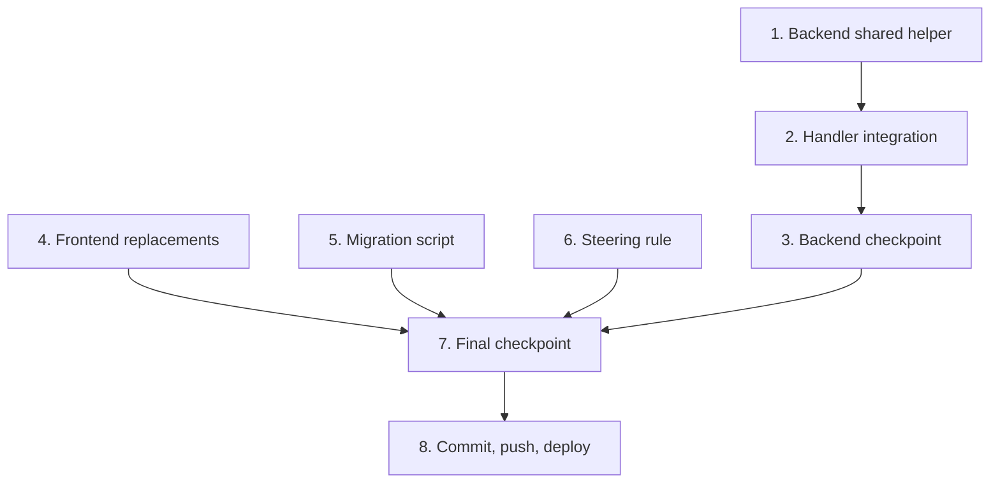

# Implementation Plan: Financial Field Standardization

## Overview

Complete the price field standardization across H-DCN by: creating a shared backend validation helper with property tests, integrating it into all price-writing handlers, replacing remaining frontend inline patterns with safe helpers, writing a DynamoDB migration script, and adding the steering rule.

Tasks are independent where possible — frontend, migration, and steering tasks can run in parallel. Only Task 2 (handler integration) depends on Task 1 (shared helper).

## Tasks

- [ ] 1. Backend shared helper: validate_price_field
  - [ ] 1.1 Create `backend/handler/shared/price_validation.py` with `validate_price_field` function
    - Accept int, float, Decimal, numeric string → return (Decimal, None)
    - Reject non-numeric strings, empty strings, booleans, lists, dicts → return (None, error_message)
    - None input → return (None, None)
    - Never return NaN or Infinity
    - _Requirements: 2.1, 2.2, 2.3, 2.4, 2.5_
  - [ ] 1.2 Write property test: Numeric inputs produce equivalent Decimal
    - **Property 1: Numeric inputs produce equivalent Decimal**
    - Use hypothesis to generate ints, floats, Decimals, numeric strings
    - Verify returned Decimal equals input value
    - Minimum 100 examples
    - **Validates: Requirements 2.1, 6.1**
  - [ ] 1.3 Write property test: Non-numeric inputs are always rejected
    - **Property 2: Non-numeric inputs are always rejected**
    - Use hypothesis to generate non-numeric strings, booleans, lists, dicts
    - Verify all return (None, error_message)
    - Minimum 100 examples
    - **Validates: Requirements 2.2, 6.2**
  - [ ] 1.4 Write property test: String-Decimal round-trip consistency
    - **Property 3: String-Decimal round-trip consistency**
    - For valid numeric x: validate_price_field(str(Decimal(str(x)))) == validate_price_field(x)
    - Minimum 100 examples
    - **Validates: Requirements 2.4, 6.3**
  - [ ] 1.5 Write property test: Successful validation never returns NaN or Infinity
    - **Property 4: Successful validation never returns NaN or Infinity**
    - For any input where result[0] is not None, verify result[0].is_finite()
    - Minimum 100 examples
    - **Validates: Requirements 2.5**

- [ ] 2. Backend handler integration
  - [ ] 2.1 Add validation to `admin_update_product/app.py`
    - Import validate_price_field from shared module
    - Validate `prijs` field before building update expression
    - Return 400 with error message if validation fails
    - Store validated Decimal value
    - _Requirements: 3.1, 3.5_
  - [ ] 2.2 Add validation to `admin_create_variant/app.py`
    - Validate `prijs` field if provided in request body
    - Return 400 with error message if validation fails
    - _Requirements: 3.2, 3.5_
  - [ ] 2.3 Add validation to `admin_create_product/app.py`
    - Validate price field before storing
    - Return 400 with error message if validation fails
    - _Requirements: 3.3, 3.5_
  - [~] 2.4 Add validation to `create_order/app.py`
    - Validate price fields in line items
    - Return 400 with error message if any line item has non-numeric price
    - _Requirements: 3.4, 3.5_
  - [~] 2.5 Write unit tests for handler validation (all 4 handlers)
    - Test each handler returns 400 for non-numeric price ("abc", "", True)
    - Test each handler stores valid price as Decimal
    - Use moto mock_aws and importlib loading pattern
    - Place in `backend/tests/unit/test_price_validation_handlers.py`
    - _Requirements: 7.1, 7.2, 7.3, 7.4, 7.5_

- [~] 3. Checkpoint - Backend verification
  - Ensure all property tests pass: `pytest tests/unit/test_price_validation_properties.py`
  - Ensure handler unit tests pass: `pytest tests/unit/test_price_validation_handlers.py`
  - Ask the user if questions arise.

- [ ] 4. Frontend inline pattern replacements
  - [~] 4.1 Replace inline pattern in `webshop/WebshopPage.tsx`
    - Replace `Number(item.price || 0).toFixed(2)` with `formatPrice(item.price)`
    - Add import for `formatPrice` from `../../utils/formatPrice`
    - _Requirements: 1.1, 1.5_
  - [~] 4.2 Replace inline pattern in `webshop/CheckoutModal.tsx`
    - Replace `(Number(item.price || 0) * item.quantity).toFixed(2)` with `formatPrice(toPrice(item.price) * item.quantity)`
    - Add imports for `formatPrice` and `toPrice`
    - _Requirements: 1.2, 1.5_
  - [~] 4.3 Replace inline pattern in `webshop/OrderConfirmation.tsx`
    - Replace `Number(item.price || 0).toFixed(2)` with `formatPrice(item.price)`
    - Add import for `formatPrice`
    - _Requirements: 1.3, 1.5_
  - [~] 4.4 Replace inline pattern in `advanced-exports/AdvancedExportsPage.tsx`
    - Replace `productStats.gemiddeldePrijs.toFixed(2)` with `formatPrice(productStats.gemiddeldePrijs)`
    - Add import for `formatPrice`
    - _Requirements: 1.4, 1.5_

- [ ] 5. Migration script
  - [~] 5.1 Create `scripts/migrate_price_fields_to_number.py`
    - Support `--dry-run` flag (log without writing)
    - Support `--profile` flag (default: `nonprofit-deploy`)
    - Scan Producten table: find records where `prijs` is stored as string, convert to Number
    - Scan Orders table: find records where `items[].price` or `items[].unit_price` is string, convert to Number
    - Handle DynamoDB pagination via LastEvaluatedKey
    - Skip non-parseable strings (log as error)
    - Log summary counts: scanned, converted, skipped, errors
    - _Requirements: 4.1, 4.2, 4.3, 4.4, 4.5, 4.6, 4.7_

- [ ] 6. Steering rule update
  - [~] 6.1 Add section 6 to `.kiro/steering/schema-driven.md`
    - Title: "Financial fields must be stored as DynamoDB Number type"
    - List fields: prijs, price, unit_price, line_total, total_amount, total_paid, purchase_price_per_unit
    - Specify: coerce string prices to Decimal before writing
    - Specify: reject non-numeric values with 400 error
    - Specify: never store prices as bare strings
    - _Requirements: 5.1, 5.2, 5.3, 5.4_

- [~] 7. Final checkpoint
  - Verify type check passes: `npx tsc --noEmit` (frontend)
  - Verify ESLint passes on all modified frontend files
  - Ensure all backend tests pass for changed handlers
  - Verify no dead code: grep for removed symbols, check no unused imports
  - Ask the user if questions arise.

- [ ] 8. Commit, push, and deploy
  - [~] 8.1 Commit all changes on current feature branch
    - Use conventional commit: `feat: standardize financial field types across frontend and backend`
    - Commit with `--no-verify` (Kiro hook handles secret scanning)
    - Never create a new branch
  - [~] 8.2 Push and trigger deploy workflows (after user approval)
    - Ask user for approval before pushing
    - `git push origin feature/generic-event-booking`
    - `gh workflow run deploy-backend.yml --ref feature/generic-event-booking -f stage=test`
    - `gh workflow run deploy-frontend.yml --ref feature/generic-event-booking -f stage=test`

## Task Dependency Graph



```json
{
  "waves": [
    { "tasks": [1, 4, 5, 6] },
    { "tasks": [2] },
    { "tasks": [3] },
    { "tasks": [7] },
    { "tasks": [8] }
  ]
}
```

## Notes

- Tasks marked with `*` are optional and can be skipped for faster MVP
- Task 1 (shared helper) must be completed before Task 2 (handler integration)
- Tasks 4, 5, and 6 are independent of each other and of Tasks 1-2
- Property tests use hypothesis (Python) with minimum 100 examples per property
- Handler unit tests use pytest + moto, load handlers via importlib pattern
- Frontend verification: `npx tsc --noEmit` for type check, `npx eslint` for lint
- Backend verification: `pytest tests/unit/test_<specific_file>.py` (never full suite)
