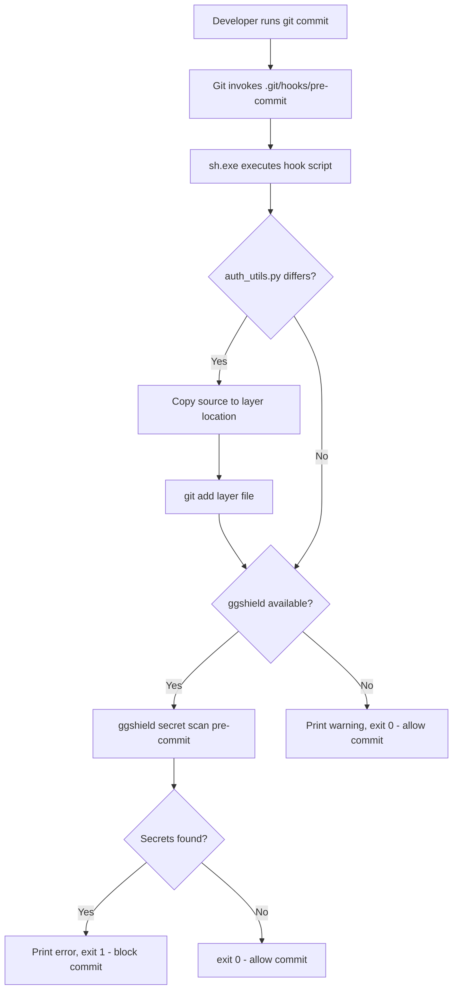
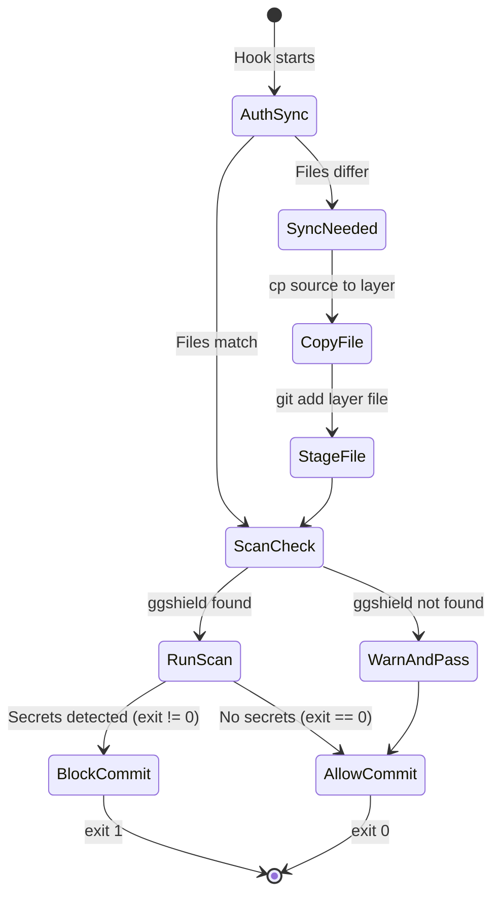

# Design Document: GitGuardian Pre-Commit Hook

## Overview

This design addresses the deployment of a reliable GitGuardian (`ggshield`) pre-commit hook for the H-DCN project that works correctly on Windows developer machines using Git for Windows. The solution consists of two artifacts:

1. **Pre-commit hook script** (`.git/hooks/pre-commit`) — A POSIX-compliant shell script that performs auth layer synchronization and secret scanning
2. **GitGuardian configuration** (`.gitguardian.yaml`) — Updated exclusion rules for large files, lock files, virtual environments, and test files

The hook runs in the Git for Windows `sh.exe` environment, which provides a minimal POSIX shell without bash extensions or WSL dependencies.

## Architecture



### Execution Environment

- **Shell**: Git for Windows `sh.exe` (MSYS2-based POSIX shell)
- **Available utilities**: `cmp`, `cp`, `git`, `command`, `echo`, `exit`, standard POSIX builtins
- **NOT available**: bash arrays, `[[` test syntax, process substitution, WSL paths, PowerShell cmdlets

## Components and Interfaces

### Component 1: Pre-Commit Hook Script

**Location**: `.git/hooks/pre-commit`

**Responsibilities**:

- Auth layer file synchronization (diff check + copy + stage)
- GGShield availability detection
- Secret scan execution with exit code propagation
- User-friendly status messages

**Interface**:

- **Input**: None (triggered by Git)
- **Output**: Exit code 0 (allow commit) or 1 (block commit)
- **Side effects**: May copy files and stage them via `git add`

**POSIX Compliance Rules**:
| Allowed | Forbidden |
|---------|-----------|
| `#!/bin/sh` | `#!/bin/bash` |
| `[ ... ]` test | `[[ ... ]]` extended test |
| `$(command)` | Bash arrays `arr=()` |
| `cmp -s` for file comparison | `diff --brief` (less portable) |
| `command -v` for tool detection | `which` (not POSIX) |
| Variable assignment `VAR="value"` | `local` keyword (bash extension) |
| `if/then/elif/else/fi` | Bash-specific `;&` or `;;&` |

### Component 2: GitGuardian Configuration

**Location**: `.gitguardian.yaml` (project root)

**Responsibilities**:

- Define file exclusion patterns for secret scanning
- Apply to both `pre-commit` and `commit-range` scan modes
- Exclude generated files, dependencies, and test files

**Interface**:

- **Consumed by**: `ggshield` CLI during any scan operation
- **Format**: YAML v2 schema as defined by GitGuardian

## Data Models

### Pre-Commit Hook State Machine



### GitGuardian Configuration Schema

```yaml
version: 2
secret:
  show_secrets: false
  ignore_known_secrets: true
  ignored_paths:
    - "<glob patterns for excluded files>"
exit_zero: false
```

**Exclusion categories**:
| Category | Patterns |
|----------|----------|
| Lock files | `**/package-lock.json`, `**/yarn.lock`, `**/pnpm-lock.yaml` |
| Virtual environments | `.venv/**`, `**/.venv/**` |
| Node modules | `**/node_modules/**` |
| Test files (existing) | `test_*.py`, `test_*.html`, `**/tests/**`, `**/__tests__/**` |
| Utility scripts (existing) | `decode_*.py`, `trigger_*.py` |

## Error Handling

### Pre-Commit Hook Error Scenarios

| Scenario                                 | Behavior                                         | Exit Code |
| ---------------------------------------- | ------------------------------------------------ | --------- |
| `auth_utils.py` source file missing      | Skip sync silently                               | Continue  |
| Layer target directory missing           | Skip sync silently (both files must exist)       | Continue  |
| `cmp` command fails                      | Skip sync (stderr suppressed with `2>/dev/null`) | Continue  |
| `cp` command fails                       | Error message printed, hook continues to scan    | Continue  |
| `ggshield` not on PATH                   | Print warning, allow commit                      | 0         |
| `ggshield` finds secrets                 | Print error message, block commit                | 1         |
| `ggshield` exits with error (non-secret) | Propagate exit code, block commit                | Non-zero  |
| `ggshield` scan passes                   | Allow commit                                     | 0         |

### Design Decisions

1. **Graceful degradation for missing ggshield**: The hook warns but does not block commits when ggshield is unavailable. This prevents blocking developers who haven't installed the tool yet while still encouraging adoption.

2. **Silent skip for missing auth files**: If either the source or target auth file doesn't exist, the sync step is skipped without error. This handles fresh clones where the layer structure may not yet be built.

3. **Stderr suppression on `cmp`**: The `2>/dev/null` on `cmp` prevents confusing error messages when files don't exist or have permission issues, while the `-s` flag ensures silent comparison.

4. **Exit code propagation from ggshield**: The hook captures and propagates the exact exit code from ggshield rather than always using exit 1. This preserves ggshield's distinction between "secrets found" and "scan error".

## Correctness Properties

### Property 1: POSIX Compliance

The pre-commit hook script contains no bash-specific syntax. Verified by `shellcheck --shell=sh` passing with zero errors or warnings. The script uses only POSIX builtins and utilities available in Git for Windows sh.exe.

**Validates: Requirements 1.1, 1.2, 1.3, 1.4**

### Property 2: Auth Sync Idempotency

Running the hook multiple times when `backend/shared/auth_utils.py` and `backend/layers/auth-layer/python/shared/auth_utils.py` are already identical produces no file changes and no git staging operations.

**Validates: Requirements 3.3**

### Property 3: Exclusion Completeness

Every pattern listed in `.gitguardian.yaml` `ignored_paths` is respected by both `pre-commit` and `commit-range` scan modes. Files matching exclusion patterns are never scanned for secrets.

**Validates: Requirements 2.1, 2.2, 2.3, 2.4, 5.1, 5.2, 5.3, 5.4, 5.5**

### Property 4: Exit Code Integrity

The hook's exit code is always 0 when no secrets are found (or ggshield is missing), and non-zero only when ggshield detects secrets or encounters a scan error. The ggshield exit code is propagated without modification.

**Validates: Requirements 4.1, 4.2, 4.3, 4.4, 4.5**

### Property 5: Source File Immutability

The hook never modifies `backend/shared/auth_utils.py` (the source of truth). It only copies from source to the layer target location. The copy direction is always source → layer, never reversed.

**Validates: Requirements 3.1, 3.2**

## Testing Strategy

### Why Property-Based Testing Does Not Apply

This feature consists of:

- A POSIX shell script (imperative, side-effect-driven)
- A YAML configuration file (declarative)

Neither artifact has pure function behavior with meaningful input variation. The shell script's correctness depends on file system state and external tool availability, not on a range of inputs. The YAML config is static configuration validated by ggshield itself.

### Testing Approach

**Manual verification tests** (shell script):

1. **Windows compatibility test**: Execute the hook on Git for Windows and verify no shell interpreter errors occur
2. **Auth sync test**: Create a diff between source and layer files, run the hook, verify the layer file is updated and staged
3. **Auth sync skip test**: Ensure matching files result in no copy operation
4. **ggshield blocking test**: Stage a file containing a known test secret, verify the commit is blocked
5. **ggshield missing test**: Temporarily rename ggshield, verify warning is printed and commit proceeds
6. **POSIX lint**: Run `shellcheck --shell=sh` on the hook script to verify no bash-isms

**Configuration validation tests** (GitGuardian config):

1. **Syntax validation**: Run `ggshield secret scan --dry-run` to verify config is parseable
2. **Exclusion verification**: Stage `frontend/package-lock.json` changes and verify it's skipped during scan
3. **Existing exclusion preservation**: Verify test file patterns still exclude `test_*.py` files

**CI integration**:

- The existing GitHub Actions workflow uses ggshield for `commit-range` scanning
- The updated `.gitguardian.yaml` exclusions apply to both local pre-commit and CI scans
- No changes needed to `.github/workflows/` files — they already reference the config file

### ShellCheck Validation

The pre-commit hook script MUST pass `shellcheck --shell=sh` with no errors or warnings. This provides automated verification of POSIX compliance and catches common shell scripting bugs.
