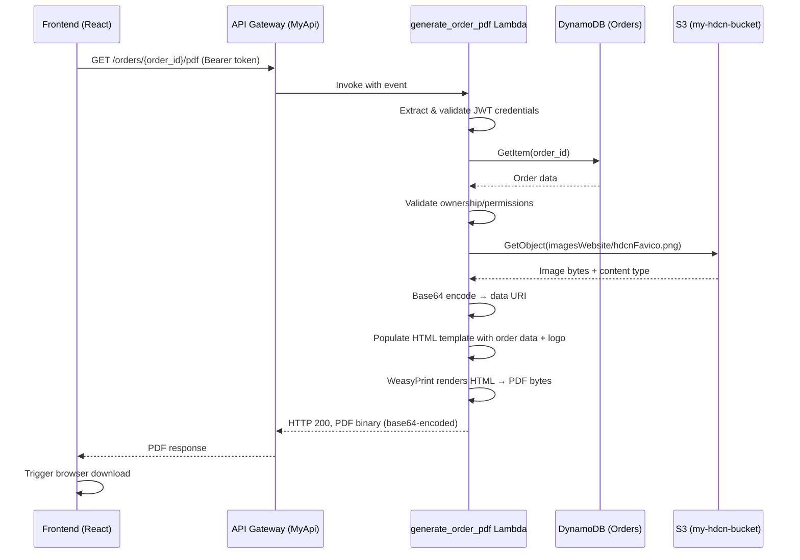

# Design Document: Order Confirmation PDF

## Overview

This design moves order confirmation PDF generation from the client-side (jsPDF in the browser) to a server-side AWS Lambda function using WeasyPrint. The new Lambda handler follows the established project pattern: it fetches the H-DCN logo from S3, base64-encodes it as a data URI, injects it into an HTML template populated with order data from DynamoDB, and renders the result to PDF using WeasyPrint.

The frontend replaces the current jsPDF/HTML-download workaround with a single API call to `GET /orders/{order_id}/pdf`, receiving a binary PDF response that triggers a browser download.

### Key Design Decisions

1. **WeasyPrint over jsPDF**: WeasyPrint produces high-quality PDFs with full CSS support, consistent rendering across environments, and proper font/image handling. The existing myadmin project has proven this pattern works well.

2. **Data URI for logo**: Following the proven S3-images-in-PDF pattern, the logo is fetched from S3, base64-encoded, and embedded as a data URI. This avoids authentication issues during WeasyPrint rendering.

3. **Dedicated IAM Role**: The PDF Lambda needs both DynamoDB read access (for orders) and S3 read access (for the logo). A new IAM role combines these permissions rather than extending the existing `DynamoDBRole`.

4. **Graceful logo degradation**: If the S3 logo fetch fails, the PDF is still generated without the logo rather than failing the entire request.

5. **Docker-based Lambda deployment**: WeasyPrint depends on native system libraries (cairo, pango, gdk-pixbuf, gobject-introspection, libffi) that are not available in the standard Lambda runtime. A container image built from the official AWS Lambda Python 3.11 base image (`public.ecr.aws/lambda/python:3.11`) includes these dependencies. This means Lambda Layers cannot be used — the shared auth layer code is copied directly into the container image instead.

## Architecture



### Deployment Architecture

```mermaid
graph TD
    subgraph "AWS SAM Stack"
        APIGW[API Gateway - MyApi]
        LAMBDA[generate_order_pdf Lambda<br/>Docker image / 512MB / 30s timeout / python3.11]
        AUTH[Auth layer code<br/>copied into container]
        ROLE[PdfGeneratorRole<br/>DynamoDB + S3 read]
    end

    subgraph "Data Stores"
        DDB[(DynamoDB - Orders)]
        S3[(S3 - my-hdcn-bucket<br/>imagesWebsite/hdcnFavico.png)]
    end

    APIGW -->|GET /orders/{order_id}/pdf| LAMBDA
    LAMBDA --> AUTH
    LAMBDA --> ROLE
    ROLE -->|dynamodb:GetItem, Query| DDB
    ROLE -->|s3:GetObject| S3
```

## Components and Interfaces

### Backend Components

#### 1. `backend/handler/generate_order_pdf/app.py` — Lambda Handler

The main entry point following the established handler pattern:

```python
def lambda_handler(event, context):
    # 1. Handle OPTIONS (CORS preflight)
    # 2. Extract user credentials via shared auth layer
    # 3. Validate order_id from path parameters
    # 4. Fetch order from DynamoDB
    # 5. Validate ownership or admin permissions
    # 6. Fetch logo from S3 → base64 data URI
    # 7. Render HTML template with order data + logo
    # 8. Generate PDF with WeasyPrint
    # 9. Return base64-encoded PDF with appropriate headers
```

**Input**: API Gateway event with `pathParameters.order_id` and `Authorization` header  
**Output**: HTTP response with base64-encoded PDF body, `Content-Type: application/pdf`, `Content-Disposition: attachment`

#### 2. HTML Template (inline in handler or separate file)

An HTML/CSS template matching the current order confirmation layout:

- Header with logo and "H-DCN Webshop / Orderbevestiging" title
- Order metadata (ordernummer, datum, status)
- Customer address section (factuuradres + verzendadres)
- Delivery option section (if applicable)
- Product table (product, optie, aantal, prijs, totaal)
- Totals section (subtotaal, verzendkosten, totaal betaald)
- Footer with thank-you message

#### 3. Logo Resolver (inline utility function)

```python
def fetch_logo_as_data_uri(bucket: str, key: str, timeout: int = 5) -> Optional[str]:
    """Fetch S3 image and return as base64 data URI, or None on failure."""
```

### Frontend Components

#### 4. PDF Download Service

A new function in the webshop module that:

- Calls `GET /orders/{order_id}/pdf` with auth headers
- Handles the binary response (base64 → Blob → download)
- Manages loading state and error display

#### 5. Updated OrderConfirmation Component

Replace the current `downloadHTML()` / `openInNewWindow()` approach with a "Download PDF" button that calls the backend API.

### API Interface

| Method | Path                     | Auth       | Response                                                                                                                                                                                                   |
| ------ | ------------------------ | ---------- | ---------------------------------------------------------------------------------------------------------------------------------------------------------------------------------------------------------- |
| GET    | `/orders/{order_id}/pdf` | Bearer JWT | `200`: PDF binary (base64)<br>`400`: Invalid order_id<br>`401`: Missing/invalid auth<br>`403`: Not owner & not admin<br>`404`: Order not found<br>`500`: Rendering error<br>`503`: Auth system unavailable |

**Response Headers (200)**:

```
Content-Type: application/pdf
Content-Disposition: attachment; filename="orderbevestiging-{order_id}.pdf"
```

**Note**: API Gateway returns binary content as base64-encoded string. The Lambda response must set `isBase64Encoded: true`.

## Data Models

### Order Record (DynamoDB — existing)

The Lambda reads from the existing `Orders` table. Relevant fields:

```typescript
interface OrderRecord {
  order_id: string; // Partition key
  user_email: string; // Owner's email (for authorization check)
  timestamp: string; // ISO 8601 creation date
  customer_info?: {
    name: string;
    voornaam?: string;
    achternaam?: string;
    straat: string;
    postcode: string;
    woonplaats: string;
    email?: string;
    phone?: string;
  };
  shipping_address?: {
    name?: string;
    straat?: string;
    postcode?: string;
    woonplaats?: string;
  };
  delivery_option?: {
    label: string;
  };
  delivery_cost?: string; // e.g. "5.95"
  items: Array<{
    name?: string;
    naam?: string;
    selectedOption?: string;
    quantity: number;
    price?: number;
  }>;
  subtotal_amount: string; // e.g. "24.95"
  total_amount: string; // e.g. "30.90"
}
```

### Lambda Response Model

```python
# Success response (PDF)
{
    "statusCode": 200,
    "headers": {
        "Content-Type": "application/pdf",
        "Content-Disposition": f'attachment; filename="orderbevestiging-{order_id}.pdf"',
        "Access-Control-Allow-Origin": "*",
        ...cors_headers
    },
    "body": "<base64-encoded-pdf-bytes>",
    "isBase64Encoded": True
}

# Error response
{
    "statusCode": 4xx/5xx,
    "headers": cors_headers(),
    "body": json.dumps({"error": "message"})
}
```

### SAM Template Addition

```yaml
GenerateOrderPdfFunction:
  Type: AWS::Serverless::Function
  Metadata:
    DockerTag: generate-order-pdf
    DockerContext: .
    Dockerfile: handler/generate_order_pdf/Dockerfile
  Properties:
    PackageType: Image
    Timeout: 30
    MemorySize: 512
    Role: !GetAtt PdfGeneratorRole.Arn
    Environment:
      Variables:
        ORDERS_TABLE: !Ref OrdersTable
        S3_BUCKET: "my-hdcn-bucket"
        LOGO_S3_KEY: "imagesWebsite/hdcnFavico.png"
    Events:
      GenerateOrderPdf:
        Type: Api
        Properties:
          RestApiId: !Ref MyApi
          Path: /orders/{order_id}/pdf
          Method: get
```

**Note**: `PackageType: Image` replaces `CodeUri`, `Handler`, `Runtime`, and `Layers`. The auth layer is included directly in the Docker image rather than as a Lambda Layer (Layers are not supported with container images).

#### Dockerfile (`backend/handler/generate_order_pdf/Dockerfile`)

```dockerfile
FROM public.ecr.aws/lambda/python:3.11

# Install system dependencies required by WeasyPrint
RUN dnf install -y \
    pango \
    pango-devel \
    gdk-pixbuf2 \
    cairo \
    cairo-gobject \
    gobject-introspection \
    libffi-devel \
    && dnf clean all

# Copy shared auth layer into the image
COPY layers/auth-layer/python/ ${LAMBDA_TASK_ROOT}/

# Install Python dependencies
COPY handler/generate_order_pdf/requirements.txt ${LAMBDA_TASK_ROOT}/
RUN pip install --no-cache-dir -r ${LAMBDA_TASK_ROOT}/requirements.txt

# Copy handler code
COPY handler/generate_order_pdf/app.py ${LAMBDA_TASK_ROOT}/
COPY handler/generate_order_pdf/__init__.py ${LAMBDA_TASK_ROOT}/

CMD ["app.lambda_handler"]
```

The Docker context is set to the `backend/` root directory (via `DockerContext: .` in the SAM Metadata) so that both the handler code and the auth layer can be referenced with relative paths.

```yaml
PdfGeneratorRole:
  Type: AWS::IAM::Role
  Properties:
    AssumeRolePolicyDocument:
      Version: "2012-10-17"
      Statement:
        - Effect: Allow
          Principal:
            Service: lambda.amazonaws.com
          Action: sts:AssumeRole
    ManagedPolicyArns:
      - arn:aws:iam::aws:policy/service-role/AWSLambdaBasicExecutionRole
      - arn:aws:iam::aws:policy/AWSXRayDaemonWriteAccess
    Policies:
      - PolicyName: DynamoDBOrdersRead
        PolicyDocument:
          Version: "2012-10-17"
          Statement:
            - Effect: Allow
              Action:
                - dynamodb:GetItem
                - dynamodb:Query
              Resource:
                - !Sub "arn:aws:dynamodb:${AWS::Region}:${AWS::AccountId}:table/${OrdersTable}"
                - !Sub "arn:aws:dynamodb:${AWS::Region}:${AWS::AccountId}:table/${OrdersTable}/index/*"
      - PolicyName: S3LogoRead
        PolicyDocument:
          Version: "2012-10-17"
          Statement:
            - Effect: Allow
              Action:
                - s3:GetObject
              Resource:
                - "arn:aws:s3:::my-hdcn-bucket/imagesWebsite/*"
```

## Correctness Properties

_A property is a characteristic or behavior that should hold true across all valid executions of a system — essentially, a formal statement about what the system should do. Properties serve as the bridge between human-readable specifications and machine-verifiable correctness guarantees._

### Property 1: Authorization grants access if and only if user is owner or admin

_For any_ order record with an associated `user_email`, and _for any_ authenticated user with an email and set of roles: the PDF generation request SHALL be authorized if and only if the user's email matches the order's `user_email` (case-insensitive) OR the user has the `products_create` permission (via `Products_CRUD`, `Webshop_Management`, or `System_CRUD` roles).

**Validates: Requirements 2.2, 2.3, 2.4**

### Property 2: S3 image to data URI round-trip

_For any_ byte sequence and _for any_ valid MIME content type string, encoding the bytes to a data URI and then decoding the base64 portion of that URI SHALL produce the original byte sequence, and the URI SHALL match the format `data:{content_type};base64,{encoded_data}`.

**Validates: Requirements 3.2**

### Property 3: Template data completeness

_For any_ valid order record, the rendered HTML template SHALL contain:

- The order_id
- The formatted order date
- All customer_info fields that are present (name, straat, postcode, woonplaats, and conditionally email and phone)
- Each item's name (or naam), quantity, and price
- The subtotal_amount and total_amount
- The delivery option label and cost (if delivery_option is present)
- The logo data URI as an img src attribute (if logo was successfully fetched)

**Validates: Requirements 3.3, 4.1, 4.2, 4.3, 4.4, 4.5, 4.6, 4.7**

### Property 4: Monetary value formatting

_For any_ numeric string representing a monetary amount, the formatted output SHALL be prefixed with the euro symbol (€) and display exactly two decimal places (e.g., "€12.50", "€0.00", "€1234.56").

**Validates: Requirements 4.8**

### Property 5: Dutch locale date formatting

_For any_ valid ISO 8601 timestamp, the formatted date string SHALL contain a Dutch month name (januari, februari, ..., december) and include day, year, hours, and minutes.

**Validates: Requirements 4.9**

### Property 6: Valid PDF generation for any order

_For any_ valid order record (with order_id, timestamp, items, subtotal_amount, total_amount), the Lambda SHALL produce a response with HTTP 200, `Content-Type: application/pdf`, a `Content-Disposition` header containing `orderbevestiging-{order_id}.pdf`, and a body that when base64-decoded starts with the `%PDF` magic bytes and has non-zero length.

**Validates: Requirements 1.2, 1.3, 5.2**

### Property 7: Invalid order_id rejection

_For any_ string that is empty or consists entirely of whitespace, the Lambda SHALL return HTTP 400 and SHALL NOT attempt to query DynamoDB.

**Validates: Requirements 1.5**

## Error Handling

| Scenario                                      | HTTP Status | Error Message                                                | Action                                 |
| --------------------------------------------- | ----------- | ------------------------------------------------------------ | -------------------------------------- |
| Missing/invalid Authorization header          | 401         | "Authorization header required" / "Invalid JWT token format" | Handled by shared auth layer           |
| Valid auth but no ownership and no admin role | 403         | "Access denied: You can only access your own orders"         | Log access denial                      |
| Empty/whitespace order_id                     | 400         | "Invalid order_id format"                                    | Return immediately, no DB call         |
| Order not found in DynamoDB                   | 404         | "Order not found"                                            | Return after DB lookup                 |
| S3 logo fetch fails (any reason)              | —           | (no error to user)                                           | Log warning, generate PDF without logo |
| WeasyPrint rendering error                    | 500         | "PDF rendering failed"                                       | Log exception details                  |
| Auth system internal error                    | 503         | "Service Temporarily Unavailable"                            | Handled by shared auth layer fallback  |
| Lambda timeout (>30s)                         | 504         | (API Gateway timeout)                                        | AWS platform handles                   |

### Error Handling Design Principles

1. **Fail fast on validation**: Check order_id format before any I/O operations
2. **Graceful degradation for non-critical failures**: Logo fetch failure doesn't block PDF generation
3. **Consistent error format**: All errors use `create_error_response()` from the shared auth layer
4. **Structured logging**: All errors are logged with context (order_id, user_email, error type) for debugging
5. **No sensitive data in error responses**: Error messages don't expose internal details to the client

## Testing Strategy

### Property-Based Tests (pytest + Hypothesis)

Property-based testing is appropriate for this feature because:

- The template rendering is a pure function (order data in → HTML string out)
- The formatting functions are pure (value in → formatted string out)
- The authorization logic is deterministic (user + order → allow/deny)
- Input variation reveals edge cases (special characters in names, large item lists, missing optional fields)

**Library**: [Hypothesis](https://hypothesis.readthedocs.io/) for Python (backend)  
**Configuration**: Minimum 100 examples per property test  
**Tag format**: `# Feature: order-confirmation-pdf, Property {N}: {title}`

Each correctness property (1-7) maps to a single property-based test function.

### Unit Tests (pytest)

Example-based tests for specific scenarios:

- Order not found → 404
- S3 logo fetch failure → PDF generated without logo
- WeasyPrint rendering error → 500
- Auth system error → 503
- Frontend error handling (401, 403, 404, 500 responses)
- Loading state management during PDF download

### Integration Tests

- End-to-end test with mocked AWS services (DynamoDB, S3) verifying the full handler flow
- SAM template validation (correct resource configuration)

### Frontend Tests (Jest/React Testing Library)

- Download button triggers API call with correct parameters
- Binary response is converted to blob and triggers download
- Error messages displayed for each error status code
- Loading indicator shown during request

### Test File Structure

```
backend/handler/generate_order_pdf/
├── app.py                    # Lambda handler
├── __init__.py
└── tests/
    ├── __init__.py
    ├── test_properties.py    # Property-based tests (Hypothesis)
    ├── test_handler.py       # Unit tests for handler logic
    └── conftest.py           # Shared fixtures (mock order data, S3, DynamoDB)

frontend/src/modules/webshop/
├── services/
│   └── pdfDownloadService.ts
└── __tests__/
    └── pdfDownload.test.ts
```
