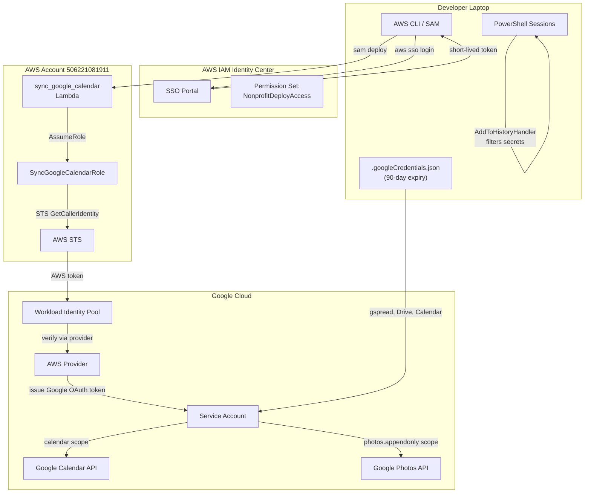

# Design Document: Risk Management — Credential Security

## Overview

This design addresses four credential security risks on the H-DCN developer laptop. The mitigations replace long-lived static credentials with short-lived or automatically-expiring alternatives, and prevent credential leakage through shell history.

**Scope:** Developer workstation security. No changes to production application behavior, frontend code, or CI/CD pipelines.

**Key principle:** Defense in depth — each mitigation is independent. If one fails or is deferred, the others still provide value.

### Components at a Glance

| #   | Risk                        | Mitigation                               | Credential Lifetime    |
| --- | --------------------------- | ---------------------------------------- | ---------------------- |
| 1   | Static AWS keys stolen      | AWS SSO (IAM Identity Center)            | 1–12 hours             |
| 2   | Google SA key in SSM stolen | Workload Identity Federation             | ~1 hour (auto-refresh) |
| 2b  | Local Google SA key stale   | 90-day org policy expiry + consolidation | 90 days max            |
| 3   | Secrets in shell history    | PSReadLine AddToHistoryHandler           | N/A (prevention)       |

## Architecture



## Components and Interfaces

### Component 1: AWS SSO Profile Configuration

**Purpose:** Replace static `~/.aws/credentials` entry for `nonprofit-deploy` with IAM Identity Center SSO session.

**Configuration files affected:**

- `~/.aws/config` — add `[sso-session h-dcn]` section and update `[profile nonprofit-deploy]`
- `~/.aws/credentials` — remove `[nonprofit-deploy]` section (after verification)

**Target `~/.aws/config` structure:**

```ini
[sso-session h-dcn]
sso_start_url = https://d-XXXXXXXXXX.awsapps.com/start
sso_region = eu-west-1
sso_registration_scopes = sso:account:access

[profile nonprofit-deploy]
sso_session = h-dcn
sso_account_id = 506221081911
sso_role_name = NonprofitDeployAccess
region = eu-west-1
output = json
```

**Interfaces:**

- `aws sso login --profile nonprofit-deploy` — initiates browser-based auth, caches token
- `aws sts get-caller-identity --profile nonprofit-deploy` — verification command
- `sam deploy --profile nonprofit-deploy` — unchanged command syntax
- Token cache: `~/.aws/sso/cache/` (auto-managed by AWS CLI)

**Design decisions:**

- Use the "SSO token provider" configuration (with `sso-session` block) rather than legacy SSO config, for automatic token refresh support
- Permission set name `NonprofitDeployAccess` mirrors current `NonprofitDeployRole` permissions
- Session duration configured in IAM Identity Center (admin setting), not in local config
- GitHub Actions workflows are unaffected — they use `aws-actions/configure-aws-credentials` with OIDC role assumption

### Component 2: Google Workload Identity Federation (Lambda)

**Purpose:** Eliminate the static service account key stored in SSM parameter `/h-dcn/google-credentials` by using Workload Identity Federation for the `sync_google_calendar` Lambda.

**Google Cloud resources to create:**

1. **Workload Identity Pool:** `h-dcn-aws-pool`
   - Project: (H-DCN Google Cloud project)
   - Description: "AWS Lambda access to Google APIs"

2. **Pool Provider:** `aws-lambda-provider`
   - Provider type: AWS
   - AWS Account ID: `506221081911`
   - Attribute mapping:
     - `google.subject` = `assertion.arn`
     - `attribute.aws_role` = `assertion.arn`
   - Attribute condition: `assertion.arn.startsWith("arn:aws:sts::506221081911:assumed-role/h-dcn-SyncGoogleCalendarRole")`

3. **Service Account binding:**
   - Grant `roles/iam.workloadIdentityUser` to:
     `principalSet://iam.googleapis.com/projects/{PROJECT_NUMBER}/locations/global/workloadIdentityPools/h-dcn-aws-pool/attribute.aws_role/arn:aws:sts::506221081911:assumed-role/h-dcn-SyncGoogleCalendarRole*`
   - Service account needs: `roles/calendar.editor` (Calendar API) and `photoslibrary.appendonly` (Photos — if WIF supports user-data scopes)

**Lambda code changes (`sync_google_calendar/app.py`):**

Replace `_get_google_credentials_json()` and `_build_calendar_service()` with WIF-based authentication:

```python
from google.auth import identity_pool

def _build_wif_credentials():
    """Build Google credentials via Workload Identity Federation."""
    credentials = identity_pool.Credentials(
        audience="//iam.googleapis.com/projects/{PROJECT_NUMBER}/locations/global/workloadIdentityPools/h-dcn-aws-pool/providers/aws-lambda-provider",
        subject_token_type="urn:ietf:params:aws:token-type:aws4_request",
        token_url="https://sts.googleapis.com/v1/token",
        credential_source={
            "environment_id": "aws1",
            "region_url": "http://169.254.169.254/latest/meta-data/placement/availability-zone",
            "url": "http://169.254.169.254/latest/meta-data/iam/security-credentials",
            "regional_cred_verification_url": "https://sts.{region}.amazonaws.com?Action=GetCallerIdentity&Version=2011-06-15",
        },
        scopes=["https://www.googleapis.com/auth/calendar"],
        service_account_impersonation_url="https://iamcredentials.googleapis.com/v1/projects/-/serviceAccounts/{SA_EMAIL}:generateAccessToken",
    )
    return credentials
```

**SAM template changes:**

- Remove SSM `GetParameter` policy for `/h-dcn/google-credentials` from `SyncGoogleCalendarRole`
- Remove `GOOGLE_CREDENTIALS_PARAMETER` environment variable
- Add `sts:GetCallerIdentity` permission (needed for WIF token exchange — usually already available via Lambda basic execution role)

**Google Photos consideration:**

- Google Photos Library API requires OAuth 2.0 user consent for personal library access (`photoslibrary.appendonly` is a user-authorized scope, not a service account scope)
- WIF produces service account impersonation tokens — these cannot access a personal Google Photos library
- **Decision:** Keep the OAuth refresh token in `/h-dcn/google-photos-oauth` for Photos uploads. Only the Calendar service account key (`/h-dcn/google-credentials`) is replaced by WIF
- The Photos OAuth token is a separate, smaller risk (user-scoped, not project-admin)

### Component 3: Google Service Account Consolidation (Local Dev)

**Purpose:** Reduce attack surface of local `.googleCredentials.json` by ensuring only one service account exists with minimal permissions, and keys auto-expire after 90 days.

**Actions:**

1. **Audit:** List all service accounts in the Google Cloud project, identify unused/duplicate ones
2. **Consolidate:** Keep one service account (e.g., `h-dcn-local-dev@{project}.iam.gserviceaccount.com`) with scopes:
   - `https://www.googleapis.com/auth/spreadsheets.readonly`
   - `https://www.googleapis.com/auth/drive.readonly`
   - `https://www.googleapis.com/auth/drive.file`
   - `https://www.googleapis.com/auth/calendar`
   - `https://www.googleapis.com/auth/calendar.readonly`
3. **Org policy:** Set `constraints/iam.serviceAccountKeyExpiryHours` = `2160` (90 days)
4. **Delete:** Remove all other service accounts and their keys
5. **Generate:** Create a fresh key for the consolidated account → save as `.googleCredentials.json`
6. **Document:** Inventory of the single service account (email, project, roles, scopes)

**Rotation reminder:**

- Create a recurring Google Calendar event (every 83 days = 7 days before expiry) titled "Rotate .googleCredentials.json key"
- Include rotation steps in the event description

**Verification checklist (run during rotation):**

- `gspread`: read one row from target spreadsheet
- Calendar API: list upcoming events
- Drive API: list files in poster folder
- Drive upload: create + delete a test file

### Component 4: PowerShell History Secret Prevention

**Purpose:** Prevent credential material from being written to the PSReadLine history file.

**Implementation: `$PROFILE` addition**

```powershell
# --- Secret History Prevention (H-DCN Risk Management) ---
Set-PSReadLineOption -AddToHistoryHandler {
    param([string]$line)

    # Patterns that indicate a secret value in the command
    $secretPatterns = @(
        'AKIA[0-9A-Z]{16}'                  # AWS Access Key ID
        'BEGIN\s+(RSA|DSA|EC|OPENSSH)?\s*PRIVATE\s+KEY'  # Private keys
        'sk_live_[0-9a-zA-Z]+'              # Stripe secret key
        'pk_live_[0-9a-zA-Z]+'              # Stripe publishable key (live)
        '(live|test)_[0-9a-zA-Z]{20,}'      # Mollie API keys
        'ghp_[0-9a-zA-Z]{36,}'             # GitHub PAT
        'glpat-[0-9a-zA-Z\-]{20,}'         # GitLab PAT
        'AIza[0-9A-Za-z\-_]{35}'           # Google API key
        'xox[bpors]-[0-9a-zA-Z\-]+'        # Slack tokens
        'Bearer\s+[A-Za-z0-9\-._~+/]+=*'   # Bearer tokens (hardcoded)
    )

    $pattern = ($secretPatterns -join '|')

    if ($line -match $pattern) {
        return [Microsoft.PowerShell.AddToHistoryOption]::SkipAdding
    }

    return [Microsoft.PowerShell.AddToHistoryOption]::MemoryAndFile
}
```

**Behavior:**

- Returns `SkipAdding` for lines matching secret patterns → command executes normally, stays in memory history, but is NOT written to disk
- Returns `MemoryAndFile` for all other lines → normal behavior
- Regex runs on a single string (the command line) — no file I/O, no network calls
- Registered in `$PROFILE` (typically `~\Documents\PowerShell\Microsoft.PowerShell_profile.ps1`) → applies to all sessions

**One-time cleanup script:**

```powershell
# Backup existing history
$histPath = (Get-PSReadLineOption).HistorySavePath
$backupPath = "$histPath.backup.$(Get-Date -Format 'yyyyMMdd-HHmmss')"
Copy-Item $histPath $backupPath

# Remove lines matching secret patterns
$patterns = 'AKIA[0-9A-Z]{16}|BEGIN\s+.*PRIVATE\s+KEY|sk_live_|pk_live_|(live|test)_[0-9a-zA-Z]{20,}|ghp_[0-9a-zA-Z]{36,}|glpat-[0-9a-zA-Z\-]{20,}|AIza[0-9A-Za-z\-_]{35}|xox[bpors]-|Bearer\s+[A-Za-z0-9\-._~+/]+=*'
$lines = Get-Content $histPath
$clean = $lines | Where-Object { $_ -notmatch $patterns }
$clean | Set-Content $histPath

Write-Host "Backup: $backupPath"
Write-Host "Removed $($lines.Count - $clean.Count) lines containing secrets"
```

## Data Models

No persistent data models are introduced by this feature. The changes affect:

- **Configuration files** (AWS config, PowerShell profile) — local filesystem only
- **Google Cloud IAM** — service accounts, workload identity pool (managed via gcloud CLI / console)
- **AWS IAM Identity Center** — permission set (managed via AWS console / CLI)
- **SSM Parameters** — deletion of `/h-dcn/google-credentials` after WIF migration

The Lambda handler's `SyncRequest` / `EventData` TypedDicts remain unchanged — only the authentication mechanism changes.

## Correctness Properties

_A property is a characteristic or behavior that should hold true across all valid executions of a system — essentially, a formal statement about what the system should do. Properties serve as the bridge between human-readable specifications and machine-verifiable correctness guarantees._

**Applicability note:** Requirements 1, 2, and 2b are infrastructure/configuration changes (AWS SSO, Google WIF, org policies). These have no pure-function logic suitable for property-based testing — they are verified through smoke tests and integration tests. Requirement 3 (Shell History Secret Prevention) contains regex-based pattern matching logic that is well-suited for PBT.

### Property 1: Secret pattern detection

_For any_ command string that contains at least one of the defined secret patterns (AWS access key, private key header, Stripe key, Mollie key, GitHub/GitLab PAT, Google API key, Slack token, or Bearer token), the history filter function SHALL identify the string as containing a secret.

**Validates: Requirements 3.1, 3.2, 3.5**

### Property 2: Non-secret passthrough

_For any_ command string that does NOT contain any of the defined secret patterns, the history filter function SHALL NOT identify the string as containing a secret, allowing it to be written to the history file.

**Validates: Requirements 3.1, 3.4, 3.5**

## Error Handling

### AWS SSO (Requirement 1)

| Scenario                               | Behavior                                                                                      |
| -------------------------------------- | --------------------------------------------------------------------------------------------- |
| SSO session expired                    | AWS CLI returns `ExpiredTokenException` with message indicating re-auth needed                |
| SSO portal unreachable                 | `aws sso login` fails with network error — developer retries manually                         |
| Permission set misconfigured           | SAM deploy returns `AccessDeniedException` — verify permission set in Identity Center console |
| Identity Center not enabled on account | `aws sso login` returns configuration error — requires org admin to enable                    |

**No code-level error handling needed** — these are CLI-level errors the developer handles manually.

### Google WIF (Requirement 2)

| Scenario                         | Behavior                                                                                           |
| -------------------------------- | -------------------------------------------------------------------------------------------------- |
| WIF token exchange fails         | Lambda logs error, returns HTTP 500 with `{"message": "Google authentication failed: <detail>"}`   |
| Attribute condition rejects role | Google STS returns permission denied — Lambda returns 500, no fallback                             |
| WIF pool/provider misconfigured  | Same as above — clear error message, no silent fallback                                            |
| Google API quota exceeded        | Calendar/Photos API returns 429 — logged, calendar event sync returns existing `gcal_id` unchanged |

**Critical design rule:** The Lambda MUST NOT fall back to reading SSM credentials if WIF fails. This ensures the static key can be safely deleted.

### Shell History Handler (Requirement 3)

| Scenario                              | Behavior                                                                                                                                  |
| ------------------------------------- | ----------------------------------------------------------------------------------------------------------------------------------------- |
| Regex match error (malformed pattern) | Should not occur (patterns are static). If PSReadLine throws, it falls back to default behavior (write to history) — acceptable trade-off |
| $PROFILE load error                   | PowerShell reports profile error on startup — user must fix syntax                                                                        |
| Cleanup script: history file locked   | Script retries once after 1s delay, then reports error without modifying file                                                             |
| Cleanup script: empty history file    | Script completes successfully (no lines to filter), reports "0 lines removed"                                                             |

### Google Service Account Rotation (Requirement 2b)

| Scenario                                 | Behavior                                                                                                      |
| ---------------------------------------- | ------------------------------------------------------------------------------------------------------------- |
| Key expired before rotation              | All local Google integrations fail immediately — developer generates new key using documented steps           |
| Connectivity check fails during rotation | Keep both old and new key active until issue is resolved — never delete old key before verification passes    |
| Org policy not propagated                | New keys may not expire — verify via `gcloud iam service-accounts keys list` showing `valid_before` timestamp |

## Testing Strategy

### Property-Based Tests (Requirement 3 only)

**Library:** Hypothesis (Python) — already in use in the project (`.hypothesis/` directory exists)

**Configuration:**

- Minimum 100 iterations per property
- Tests in `backend/tests/unit/test_secret_filter_properties.py`
- Tag format: `# Feature: risk-management, Property {N}: {title}`

**Properties to implement:**

1. Generate strings with embedded secret patterns → verify detection
2. Generate random alphanumeric/command-like strings that don't match patterns → verify passthrough

**Generators needed:**

- `secret_commands()`: Generates command strings containing at least one secret pattern (randomly chosen pattern type, random position within command, random surrounding text)
- `safe_commands()`: Generates plausible PowerShell commands that don't accidentally match secret patterns (e.g., `Get-Process`, `ls -la`, `git status`)

### Unit Tests

| Component               | Test                                                                        | Type      |
| ----------------------- | --------------------------------------------------------------------------- | --------- |
| Secret filter regex     | Each pattern family matches a known example                                 | Example   |
| Secret filter regex     | Edge cases: partial matches, lookalikes that should NOT match               | Edge case |
| WIF credentials builder | Mocked AWS environment → verify correct audience/subject_token_type         | Example   |
| WIF failure handling    | Mock `identity_pool.Credentials` failure → verify 500 response, no fallback | Example   |
| Cleanup script logic    | File with known secrets → verify removal and line count                     | Example   |
| Cleanup script logic    | Backup file creation before modification                                    | Example   |

### Integration Tests (Manual / CI verification)

| Component       | Verification                                                                          |
| --------------- | ------------------------------------------------------------------------------------- |
| AWS SSO         | `aws sts get-caller-identity --profile nonprofit-deploy` returns account 506221081911 |
| AWS SSO         | `sam deploy --profile nonprofit-deploy` succeeds                                      |
| AWS SSO         | GitHub Actions deploy workflow unaffected                                             |
| Google WIF      | Lambda invocation successfully syncs a test event to Google Calendar                  |
| Google WIF      | SSM parameter `/h-dcn/google-credentials` deleted                                     |
| Service account | Single SA exists with correct scopes, key has 90-day expiry                           |
| History handler | `$PROFILE` contains AddToHistoryHandler, secret commands don't appear in history file |

### Smoke Tests (One-time verification)

- `~/.aws/credentials` no longer contains `[nonprofit-deploy]` section
- `gcloud org-policies describe` shows key expiry constraint active
- Google Calendar recurring reminder event exists for key rotation
- Cleanup script backup file created successfully

### What is NOT property-tested (and why)

- **AWS SSO configuration** — declarative config, not a function. Verified by smoke tests.
- **Google WIF setup** — infrastructure wiring between AWS and Google. Verified by integration test.
- **Service account consolidation** — operational/manual process. Verified by audit commands.
- **Google Photos OAuth** — kept as-is (not migrated to WIF due to user-consent scope requirement).
